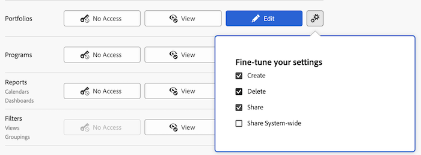

# Bevilja åtkomst till portföljer

Som Adobe Workfront-administratör kan du använda en åtkomstnivå för att definiera en användares åtkomst till portföljer, vilket förklaras i [Översikt över åtkomstnivåer](../../../administration-and-setup/add-users/access-levels-and-object-permissions/access-levels-overview.md).

## Åtkomstkrav

Du måste ha följande åtkomst för att kunna utföra stegen i den här artikeln:

<table style="table-layout:auto"> 
 <col> 
 <col> 
 <tbody> 
  <tr> 
   <td role="rowheader">Adobe Workfront</td> 
   <td>Alla</td> 
  </tr> 
  <tr> 
   <td role="rowheader">Adobe Workfront-licens</td> 
   <td>Plan</td> 
  </tr> 
  <tr> 
   <td role="rowheader">Konfigurationer på åtkomstnivå</td> 
   <td> 
Du måste vara Workfront-administratör.
 
<b>Obs!</b> Om du fortfarande inte har åtkomst frågar du Workfront-administratören om de har angett ytterligare begränsningar för din åtkomstnivå. Mer information om hur en Workfront-administratör kan ändra åtkomstnivån finns i <a href="../../../administration-and-setup/add-users/configure-and-grant-access/create-modify-access-levels.md" class="MCXref xref" data-mc-variable-override="">Skapa eller ändra anpassade åtkomstnivåer</a>.
 </td> 
  </tr> 
 </tbody> 
</table>

## Konfigurera användaråtkomst till portföljer med en anpassad åtkomstnivå

1. Börja skapa eller redigera åtkomstnivån enligt beskrivningen i [Skapa eller ändra anpassade åtkomstnivåer](../../../administration-and-setup/add-users/configure-and-grant-access/create-modify-access-levels.md).
1. Klicka på kugghjulsikonen  på knappen **Visa** eller **Redigera** till höger om Portfolio och välj sedan de funktioner som du vill ge under **Finjustera dina inställningar**.

   

   >[!NOTE]
   >
   >När du konfigurerar en åtkomstnivåinställning för en viss typ av objekt påverkar den konfigurationen inte användarens åtkomst till objekt med lägre rankning. Du kan till exempel begränsa användare från att ta bort portföljer på åtkomstnivån, men detta förhindrar inte att de tar bort projekt som har lägre rankning än portföljer. Mer information om objekthierarkin finns i avsnittet [Objektens inbördes beroende och hierarki](../../../workfront-basics/navigate-workfront/workfront-navigation/understand-objects.md#understanding-interdependency-and-hierarchy-of-objects) i artikeln [Förstå objekt i Adobe Workfront](../../../workfront-basics/navigate-workfront/workfront-navigation/understand-objects.md).

1. (Valfritt) Om du vill konfigurera åtkomstinställningar för andra objekt och områden på den åtkomstnivå du arbetar med ska du fortsätta med en av artiklarna i [Konfigurera åtkomst till Adobe Workfront](../../../administration-and-setup/add-users/configure-and-grant-access/configure-access.md), till exempel [Bevilja åtkomst till aktiviteter](../../../administration-and-setup/add-users/configure-and-grant-access/grant-access-tasks.md) och [Bevilja åtkomst till ekonomiska data](../../../administration-and-setup/add-users/configure-and-grant-access/grant-access-financial.md).
1. När du är klar klickar du på **Spara**.

   När åtkomstnivån har skapats kan du tilldela den till en användare. Mer information finns i [Redigera en användares profil](../../../administration-and-setup/add-users/create-and-manage-users/edit-a-users-profile.md).

## Tillgång till portföljer per licenstyp

Mer information om vad användare på varje åtkomstnivå kan göra med portföljer finns i avsnittet [Portfolio](../../../administration-and-setup/add-users/access-levels-and-object-permissions/functionality-available-for-each-object-type.md#portfoli) i artikeln [Tillgängliga funktioner för varje objekttyp](../../../administration-and-setup/add-users/access-levels-and-object-permissions/functionality-available-for-each-object-type.md).

## Tillgång till delade portföljer

Som ägare eller skapare av en portfölj kan du dela med andra användare genom att ge dem behörighet till den, vilket förklaras i [Dela en portfölj](../../../workfront-basics/grant-and-request-access-to-objects/share-a-portfolio.md).

<!--

If you make changes here, make them also in the "Grant access to" articles where this snippet had to be converted to text:

* reports, dashboards, and calendars

* financial data

* issue

-->

När du delar ett objekt med en annan användare bestäms mottagarens rättigheter till det av en kombination av två saker:

* De behörigheter som du ger mottagaren för objektet
* Mottagarens åtkomstnivåinställningar för objektets typ

Mer information om behörigheter som användare kan ge för en portfölj när de delar den finns i [Dela en portfölj](../../../workfront-basics/grant-and-request-access-to-objects/share-a-portfolio.md).
