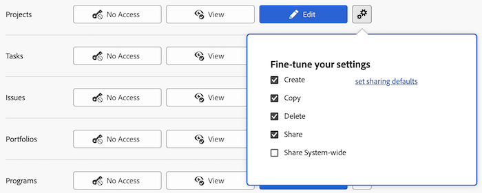

# Bevilja åtkomst till projekt

<!-- Audited: 12/2023 -->

Som Adobe Workfront-administratör kan du använda en åtkomstnivå för att definiera en användares åtkomst till projekt, vilket förklaras i följande artiklar:

* [Översikt över åtkomstnivåer](../../../administration-and-setup/add-users/access-levels-and-object-permissions/access-levels-overview.md)
* [Översikt över nya åtkomstnivåer](/help/quicksilver/administration-and-setup/add-users/how-access-levels-work/access-level-overview.md)

Mer information om hur du använder anpassade åtkomstnivåer för att hantera användarnas åtkomst till andra objekttyper i Workfront finns i [Skapa eller ändra anpassade åtkomstnivåer](../../../administration-and-setup/add-users/configure-and-grant-access/create-modify-access-levels.md).

## Åtkomstkrav

+++ Expandera om du vill visa åtkomstkrav för funktionerna i den här artikeln.

<table style="table-layout:auto"> 
 <col> 
 <col> 
 <tbody> 
  <tr> 
   <td role="rowheader">Adobe Workfront package</td> 
   <td>Alla</td> 
  </tr> 
    <tr> 
   <td role="rowheader">Adobe Workfront-licens</td> 
   <td> 
Standard

   
Plan

</td> 
  </tr> 
  <tr> 
   <td role="rowheader">Konfigurationer på åtkomstnivå</td> 
   <td> 
Du måste vara Workfront-administratör.
 </td> 
  </tr> 
 </tbody> 
</table>

Mer information om informationen i den här tabellen finns i [Åtkomstkrav i Workfront-dokumentationen](/help/quicksilver/administration-and-setup/add-users/access-levels-and-object-permissions/access-level-requirements-in-documentation.md).

+++

## Konfigurera användaråtkomst till projekt med en anpassad åtkomstnivå

1. Börja skapa eller redigera åtkomstnivån enligt beskrivningen i [Skapa eller ändra anpassade åtkomstnivåer](../../../administration-and-setup/add-users/configure-and-grant-access/create-modify-access-levels.md).
1. Klicka på kugghjulsikonen  på knappen **Visa** eller **Redigera** till höger om Projekt och välj sedan de funktioner som du vill ge under **Finjustera dina inställningar**.

   

   >[!NOTE]
   >
   >* Användare med en arbetslicens har begränsade projekträttigheter. De kan bidra till ett projekt, men inte hantera ett.
   >* Användare med en granskningslicens har behörighet att visa projekt från konverterade utgåvor, men deras visningsrättigheter är begränsade.
   >* Mer information om behörigheter som användare kan ge när de delar projekt med andra finns i [Dela ett projekt i Adobe Workfront](../../../workfront-basics/grant-and-request-access-to-objects/share-a-project.md).
   >* När du konfigurerar en åtkomstnivåinställning för en viss typ av objekt påverkar den konfigurationen inte användarens åtkomst till objekt med lägre rankning. Du kan till exempel begränsa användare från att ta bort projekt på åtkomstnivån, men detta förhindrar inte att de tar bort aktiviteter, som har lägre rankning än projekt. Mer information om objekthierarkin finns i avsnittet [Objektens inbördes beroende och hierarki](../../../workfront-basics/navigate-workfront/workfront-navigation/understand-objects.md#understanding-interdependency-and-hierarchy-of-objects) i artikeln [Förstå objekt i Adobe Workfront](../../../workfront-basics/navigate-workfront/workfront-navigation/understand-objects.md).
   >* En användare vars åtkomstnivå inte tillåter åtkomst till ekonomiska data kan inte ge åtkomst som skulle göra det möjligt för andra att visa ekonomiska data. Detta innefattar att ge åtkomst till projekt som skulle visa ekonomiska data, eller ändra en åtkomstnivå för att tillåta visning av ekonomiska data.

1. (Valfritt) Klicka på **ange delningsstandardvärden** till höger om alternativet Skapa och **Lägg till regel** om du vill lägga till en delningsregel för nya projekt.

   När användaren med den här åtkomstnivån skapar ett projekt delas projektet automatiskt med de användare som du väljer på menyn till vänster.

   

   På menyn till höger anger du hur du vill att projektet ska delas med användarna:

   

   >[!NOTE]
   >
   >Om en användare med den här åtkomstnivån använder en projektåtkomstmall åsidosätter mallen delningsinställningarna på åtkomstnivån. Mer information om mallar för projektåtkomst finns i [Dela ett projekt i Adobe Workfront](../../../workfront-basics/grant-and-request-access-to-objects/share-a-project.md).

   Du kan upprepa det här steget om du vill lägga till så många projektdelningsregler som du behöver för åtkomstnivån.

1. Klicka på krysset för att stänga rutan **Finjustera dina inställningar**.
1. (Valfritt) Om du vill konfigurera åtkomstinställningar för andra objekt och områden på den åtkomstnivå du arbetar med ska du fortsätta med en av artiklarna i [Konfigurera åtkomst till Adobe Workfront](../../../administration-and-setup/add-users/configure-and-grant-access/configure-access.md), till exempel [Bevilja åtkomst till aktiviteter](../../../administration-and-setup/add-users/configure-and-grant-access/grant-access-tasks.md) och [Bevilja åtkomst till ekonomiska data](../../../administration-and-setup/add-users/configure-and-grant-access/grant-access-financial.md).
1. När du är klar klickar du på **Spara**.

   När åtkomstnivån har skapats kan du tilldela den till en användare. Mer information finns i [Redigera en användares profil](../../../administration-and-setup/add-users/create-and-manage-users/edit-a-users-profile.md).

## Åtkomst till projekt per licenstyp

Mer information om vad användare på varje åtkomstnivå kan göra med projekt finns i avsnittet [Projekt](../../../administration-and-setup/add-users/access-levels-and-object-permissions/functionality-available-for-each-object-type.md#projects) i artikeln [Tillgängliga funktioner för varje objekttyp](../../../administration-and-setup/add-users/access-levels-and-object-permissions/functionality-available-for-each-object-type.md).

## Åtkomst till delade projekt

Som ägare eller skapare av ett problem kan du dela med andra användare genom att ge dem behörighet till det, vilket förklaras i [Dela ett projekt i Adobe Workfront](../../../workfront-basics/grant-and-request-access-to-objects/share-a-project.md).

<!--
If you make changes here, make them also in the "Grant access to" articles where this snippet had to be converted to text:
* reports, dashboards, and calendars
* financial data
* issue
-->

När du delar ett objekt med en annan användare bestäms mottagarens rättigheter till det av en kombination av två saker:

* De behörigheter som du ger mottagaren för objektet
* Mottagarens åtkomstnivåinställningar för objektets typ
