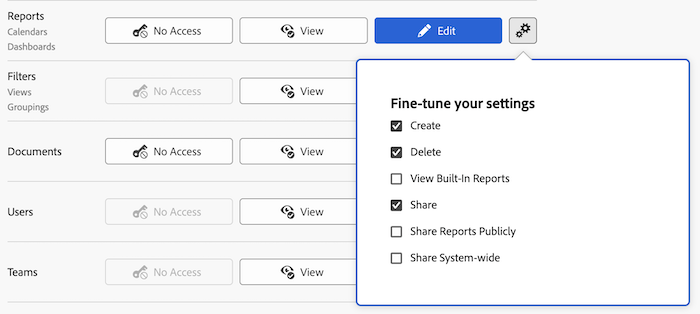

# Ge åtkomst till rapporter, instrumentpaneler och kalendrar

Som Adobe Workfront-administratör kan du använda en åtkomstnivå för att definiera en användares åtkomst till rapporter, instrumentpaneler och kalendrar, vilket förklaras i [Översikt över åtkomstnivåer](../../../administration-and-setup/add-users/access-levels-and-object-permissions/access-levels-overview.md).

Den här åtkomsten ger även åtkomst till externa sidor. Mer information om externa sidor finns i [Bevilja åtkomst till ekonomiska data](../../../administration-and-setup/add-users/configure-and-grant-access/grant-access-financial.md).

>[!NOTE]
>
>* Om du vill ge användarna åtkomst till rapporter, kontrollpaneler och kalendrar måste du även ge dessa användare tillgång till filter, vyer och grupperingar. Instruktioner finns i [Bevilja åtkomst till filter, vyer och grupperingar](../../../administration-and-setup/add-users/configure-and-grant-access/grant-access-fvg.md).
>* När någon delar en rapport, instrumentpanel eller kalender med en annan användare bestäms mottagarens rättigheter av en kombination av två saker: Mottagarens åtkomstnivåinställning för rapporter, instrumentpaneler och kalendrar _och_ alla behörigheter som den delade användaren har beviljat för rapporten, instrumentpanelen eller kalendern
>
>Mer information om behörigheter som användare kan bevilja för en rapport, instrumentpanel eller kalender när de delar den finns i [Dela rapporter, instrumentpaneler och kalendrar](../../../workfront-basics/grant-and-request-access-to-objects/permissions-reports-dashboards-calendars.md).

## Åtkomstkrav

+++ Expandera om du vill visa åtkomstkrav för funktionerna i den här artikeln.

Du måste ha följande åtkomst för att kunna utföra stegen i den här artikeln:

<table style="table-layout:auto"> 
 <col> 
 <col> 
 <tbody> 
  <tr> 
   <td role="rowheader">Adobe Workfront</td> 
   <td>Alla</td> 
  </tr> 
  <tr> 
   <td role="rowheader">Adobe Workfront-licens</td> 
   <td>Plan</td> 
  </tr> 
  <tr> 
   <td role="rowheader">Konfigurationer på åtkomstnivå</td> 
   <td> 
Du måste vara Workfront-administratör.
 
<b>Obs!</b> Om du fortfarande inte har åtkomst frågar du Workfront-administratören om de har angett ytterligare begränsningar för din åtkomstnivå. Mer information om hur en Workfront-administratör kan ändra åtkomstnivån finns i <a href="../../../administration-and-setup/add-users/configure-and-grant-access/create-modify-access-levels.md" class="MCXref xref" data-mc-variable-override="">Skapa eller ändra anpassade åtkomstnivåer</a>.
 </td> 
  </tr> 
 </tbody> 
</table>

+++

## Konfigurera användaråtkomst till rapporter, instrumentpaneler och kalendrar med en anpassad åtkomstnivå

1. Börja skapa eller redigera åtkomstnivån enligt beskrivningen i [Skapa eller ändra anpassade åtkomstnivåer](../../../administration-and-setup/add-users/configure-and-grant-access/create-modify-access-levels.md).
1. Klicka på kugghjulsikonen  på knappen **Visa** eller **Redigera** till höger om Rapporter och välj sedan de funktioner som du vill ge under **Finjustera inställningarna**.

   

   Följande alternativ är aktiverade som standard:

   * **Skapa**
   * **Ta bort**
   * **Visa inbyggda rapporter**: Du måste välja det här alternativet om du vill visa rapporter som skapats av Workfront.
   * **Dela**
   * **Dela rapporter offentligt**: Du kan dela rapporter offentligt genom att dela en offentlig länk till rapporten med alla som inte har ett Workfront-konto. Det här alternativet måste vara markerat för att den här delningsnivån ska kunna användas.
   * **Dela hela systemet**: Rapporter kan delas med alla i systemet som har en Workfront-licens. Det här alternativet måste vara markerat för att den här delningsnivån ska kunna användas.

     Mer information om att dela rapporter, instrumentpaneler och kalendrar finns i [Dela rapporter, instrumentpaneler och kalendrar](../../../workfront-basics/grant-and-request-access-to-objects/permissions-reports-dashboards-calendars.md).

1. (Valfritt) Om du vill konfigurera åtkomstinställningar för andra objekt och områden på den åtkomstnivå du arbetar med ska du fortsätta med en av artiklarna i [Konfigurera åtkomst till Adobe Workfront](../../../administration-and-setup/add-users/configure-and-grant-access/configure-access.md), till exempel [Bevilja åtkomst till aktiviteter](../../../administration-and-setup/add-users/configure-and-grant-access/grant-access-tasks.md) och [Bevilja åtkomst till ekonomiska data](../../../administration-and-setup/add-users/configure-and-grant-access/grant-access-financial.md).
1. När du är klar klickar du på **Spara**.

   När åtkomstnivån har skapats kan du tilldela den till en användare. Mer information finns i [Redigera en användares profil](../../../administration-and-setup/add-users/create-and-manage-users/edit-a-users-profile.md).

## Åtkomst till rapporter, kontrollpaneler och kalendrar per licenstyp

Mer information om vad användare på varje åtkomstnivå kan göra med problem finns i avsnittet [Rapporter](../../../administration-and-setup/add-users/access-levels-and-object-permissions/functionality-available-for-each-object-type.md#reports) i artikeln [Tillgängliga funktioner för varje objekttyp](../../../administration-and-setup/add-users/access-levels-and-object-permissions/functionality-available-for-each-object-type.md).

## Tillgång till delade rapporter, kontrollpaneler och kalendrar

Som ägare eller skapare av en rapport, instrumentpanel eller kalender kan du dela den med andra användare genom att ge dem behörighet till den, vilket förklaras i [Dela rapporter, instrumentpaneler och kalendrar](../../../workfront-basics/grant-and-request-access-to-objects/permissions-reports-dashboards-calendars.md).

<!--

If you make changes here, make them also in the "Grant access to" articles where this snippet had to be converted to text:

* reports, dashboards, and calendars

* financial data

* issue

-->

När du delar ett objekt med en annan användare bestäms mottagarens rättigheter till det av en kombination av två saker:

* De behörigheter som du ger mottagaren för objektet
* Mottagarens åtkomstnivåinställningar för objektets typ
