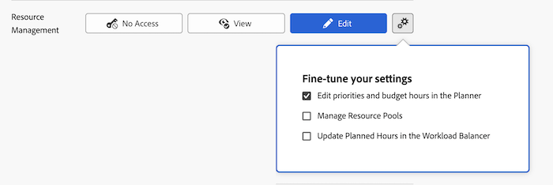

# Bevilja åtkomst till resurshantering

Som Adobe Workfront-administratör kan du använda en åtkomstnivå för att definiera en användares åtkomst till Resurshantering, enligt beskrivningen i [Översikt över åtkomstnivåer](../../../administration-and-setup/add-users/access-levels-and-object-permissions/access-levels-overview.md).

## Åtkomstkrav

+++ Expandera om du vill visa åtkomstkrav för funktionerna i den här artikeln.

Du måste ha följande åtkomst för att kunna utföra stegen i den här artikeln:

<table style="table-layout:auto"> 
 <col> 
 <col> 
 <tbody> 
  <tr> 
   <td role="rowheader">Adobe Workfront</td> 
   <td>Alla</td> 
  </tr> 
  <tr> 
   <td role="rowheader">Adobe Workfront-licens</td> 
   <td>Plan</td> 
  </tr> 
  <tr> 
   <td role="rowheader">Konfigurationer på åtkomstnivå</td> 
   <td> 
Du måste vara Workfront-administratör.
 
<b>Obs!</b> Om du fortfarande inte har åtkomst frågar du Workfront-administratören om de har angett ytterligare begränsningar för din åtkomstnivå. Mer information om hur en Workfront-administratör kan ändra åtkomstnivån finns i <a href="../../../administration-and-setup/add-users/configure-and-grant-access/create-modify-access-levels.md" class="MCXref xref" data-mc-variable-override="">Skapa eller ändra anpassade åtkomstnivåer</a>.
 </td> 
  </tr> 
 </tbody> 
</table>

+++

## Konfigurera användaråtkomst till verktygen för resurshantering med en anpassad åtkomstnivå

1. Börja skapa eller redigera åtkomstnivån enligt beskrivningen i [Skapa eller ändra anpassade åtkomstnivåer](../../../administration-and-setup/add-users/configure-and-grant-access/create-modify-access-levels.md).
1. Klicka på kugghjulsikonen  på knappen **Visa** eller **Redigera** till höger om Resurshantering och välj sedan de funktioner som du vill ge under **Finjustera dina inställningar**.

   

   <table style="table-layout:auto"> 
    <col> 
    <col> 
    <tbody> 
     <tr> 
      <td role="rowheader">Redigera prioriteringar och budgettimmar i planeraren</td> 
      <td> 
Tillåter användare med den här licensen att göra följande:
 
Prioritera projekt i resursplaneraren.
 
Budgetallokering för resurser i verktygen för resursplanering (avsnittet Resursplanering och Resursbudgetering i ett projekts affärsfall).
 
Det här alternativet är aktiverat som standard.
 </td> 
     </tr> 
     <tr> 
      <td role="rowheader">Hantera resursgrupper</td> 
      <td> 
Tillåter användare med den här licensen att skapa, redigera och ta bort resurspooler. Det här alternativet är inaktiverat som standard.
 </td> 
     </tr> 
     <tr data-mc-conditions=""> 
      <td role="rowheader">Uppdatera planerade timmar i arbetsbelastningsutjämnaren </td> 
      <td> 
Tillåter användare med den här licensen att uppdatera planerade timmar för arbetsobjekt när de uppdaterar användarallokeringarna i belastningsutjämnaren. Det totala antalet allokerade timmar blir antalet planerade timmar för arbetsobjekten.
 
Det här alternativet är inaktiverat som standard.
 
 Mer information finns i <a href="../../../resource-mgmt/workload-balancer/manage-user-allocations-workload-balancer.md" class="MCXref xref">Hantera användartilldelningar i Utjämning av arbetsbelastning</a>.
 </td> 
     </tr> 
    </tbody> 
   </table>

1. (Valfritt) Om du vill konfigurera åtkomstinställningar för andra objekt och områden på den åtkomstnivå du arbetar med ska du fortsätta med en av artiklarna i [Konfigurera åtkomst till Adobe Workfront](../../../administration-and-setup/add-users/configure-and-grant-access/configure-access.md), till exempel [Bevilja åtkomst till aktiviteter](../../../administration-and-setup/add-users/configure-and-grant-access/grant-access-tasks.md) och [Bevilja åtkomst till ekonomiska data](../../../administration-and-setup/add-users/configure-and-grant-access/grant-access-financial.md).
1. När du är klar klickar du på **Spara**.

   När åtkomstnivån har skapats kan du tilldela den till en användare. Mer information finns i [Redigera en användares profil](../../../administration-and-setup/add-users/create-and-manage-users/edit-a-users-profile.md).

## Tillgång till resurshantering per licenstyp

Mer information om vad användare på varje åtkomstnivå kan göra med Resurshantering finns i avsnittet [Resurshantering](../../../administration-and-setup/add-users/access-levels-and-object-permissions/functionality-available-for-each-object-type.md#resource) i artikeln [Tillgängliga funktioner för varje objekttyp](../../../administration-and-setup/add-users/access-levels-and-object-permissions/functionality-available-for-each-object-type.md).

## Tillgång till delade problem

<!--
If you make changes here, make them also in the "Grant access to" articles where this snippet had to be converted to text:
* reports, dashboards, and calendars
* financial data
* issue
-->

När du delar ett objekt med en annan användare bestäms mottagarens rättigheter att budgetera eller visa resursallokeringen på det av en kombination av tre saker:

* Mottagarens åtkomstnivåinställning för Resurshantering
* Användarens åtkomst till ekonomiska data, enligt beskrivningen i [Bevilja åtkomst till ekonomiska data](../../../administration-and-setup/add-users/configure-and-grant-access/grant-access-financial.md)
* Alla behörigheter till ekonomiska data som delaren har gett objektet

Mer information om behörigheter som användare kan ge ekonomiska data för ett objekt när de delar objektet finns i [Dela ekonomiska behörigheter för ett objekt](../../../workfront-basics/grant-and-request-access-to-objects/share-financial-permissions-object.md).
