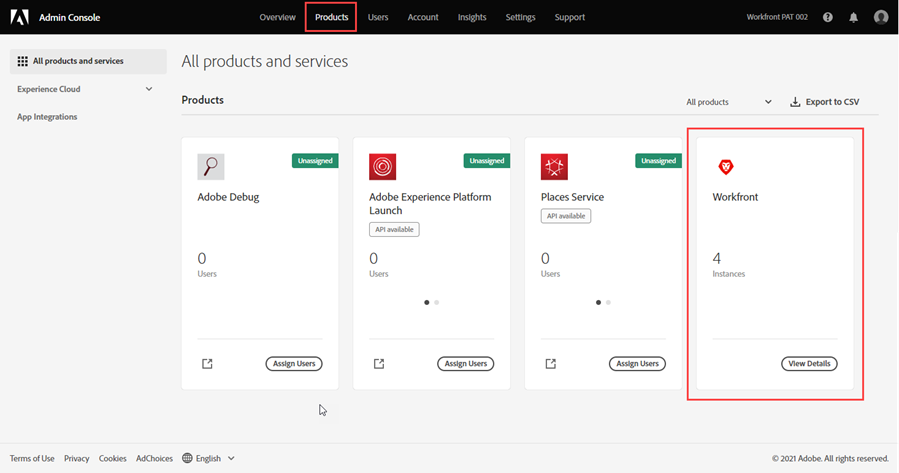
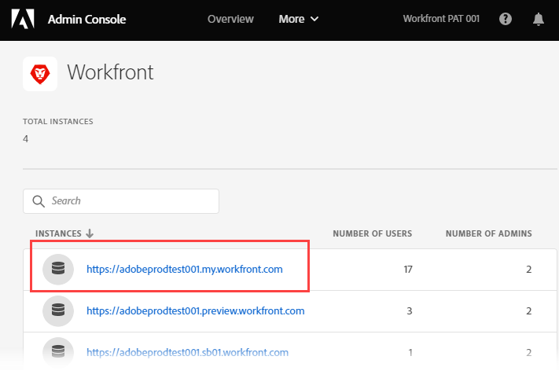
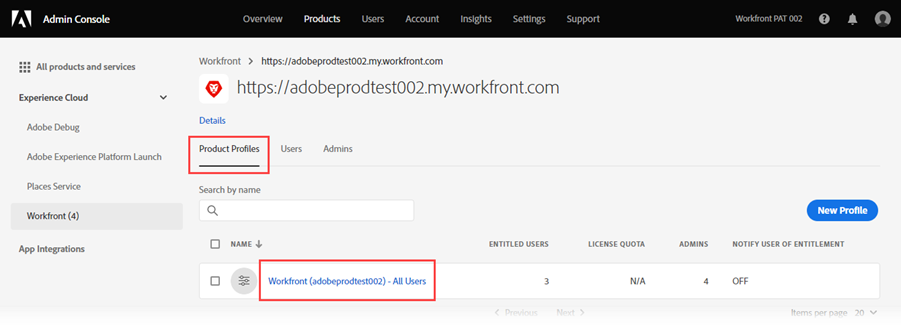

# Hantera användare i Adobe Admin Console

<!--
The highlighted information on this page refers to functionality not yet generally available. It is available only in the Preview environment for all customers. After the monthly releases to Production, the same features are also available in the Production environment for customers who enabled fast releases.    

For information about fast releases, see [Enable or disable fast releases for your organization](/help/quicksilver/administration-and-setup/set-up-workfront/configure-system-defaults/enable-fast-release-process.md). 
-->

>[!IMPORTANT]
>
>Funktionerna i den här artikeln är bara tillgängliga efter att din organisations instans av Workfront har överförts till Adobe Business Platform.
>
>En lista över procedurer som skiljer sig åt beroende på om din organisation har anslutit sig till Adobe Business Platform finns i [Plattformsbaserade administrationsskillnader (Adobe Workfront/Adobe Business Platform)](../../../administration-and-setup/get-started-wf-administration/actions-in-admin-console.md).

Som Adobe-administratör kan du skapa Adobe Workfront-systemadministratörer med Adobe Admin Console. Konsolen är en central plats för att hantera Adobe-berättiganden i hela organisationen. Mer information finns i [Admin Console-översikt](https://helpx.adobe.com/se/enterprise/using/admin-console.html).

>[!NOTE]
>
>* **Workfront-administratörer måste konfigureras i Adobe Admin Console.** Mer information och instruktioner finns i [Skapa systemadministratörer i Workfront med Adobe Admin Console](#create-system-administrators-in-workfront-with-the-adobe-admin-console) i den här artikeln.
>* **Om din organisation använder enkel inloggning (SSO)** rekommenderar vi att du skapar användare och tilldelar dem till Workfront i Adobe Admin Console. Det går att skapa dessa användare i Workfront, men det kan uppstå problem när informationen ska överföras till Adobe Admin Console, baserat på hur organisationens Admin Console är konfigurerad.
>   När du har skapat användaren i Adobe Admin Console kan du konfigurera användarens information i Workfront, till exempel tilldela roller, grupper, team och åtkomstnivåer.
>* **Om din organisation inte använder enkel inloggning (SSO)** kan du lägga till användare som inte är systemadministratörer direkt i Workfront. Det går att lägga till användare i Adobe Admin Console, men om du lägger till dem i Workfront kan du ange åtkomstnivå när du skapar dem, vilket sparar tid.

När du ändrar användarprofiler från Admin Console läggs en uppdatering till på aktivitetsfliken System för användaren i Workfront. Uppdateringen visas som den har gjorts av &quot;System&quot;. Detta avser Adobe Admin Console-administratören och inte Workfront huvudadministratör.

## Åtkomstkrav

+++ Expandera om du vill visa åtkomstkrav för funktionerna i den här artikeln.

<table style="table-layout:auto"> 
 <col> 
 </col> 
 <col> 
 </col> 
 <tbody> 
  <tr> 
   <td role="rowheader">Adobe Workfront package</td> 
   <td>
Alla
</td> 
  </tr> 
  <tr> 
   <td role="rowheader">Administratörsrättigheter för Adobe</td> 
   <td> 
Du måste vara produktprofiladministratör för Adobe-produkter för din organisation
 </td> 
  </tr> 
 </tbody> 
</table>

Mer information finns i [Åtkomstkrav i Workfront-dokumentationen](/help/quicksilver/administration-and-setup/add-users/access-levels-and-object-permissions/access-level-requirements-in-documentation.md).

+++

## Förutsättningar

Innan du använder Admin Console för Workfront bör du få ett e-postmeddelande med en inbjudan till konsolen.

1. Om du inte har använt Adobe tidigare och du har fått ett e-postmeddelande om att du nu har administratörsbehörighet för att hantera Adobe program och tjänster för din organisation klickar du på knappen i e-postmeddelandet för att skapa ett Adobe-konto och öppna Admin Console.

   eller

   Om du redan har ett Adobe-konto går du till [Adobe Admin Console-sidan](https://adminconsole.adobe.com/).

## Mer information om Adobe Admin Console

* Workfront systemadministratörer kan inaktivera en Workfront-användare i Workfront, men detta inaktiverar inte användaren i Admin Console.

  <!--
  
For information about deactivating a user in Workfront, see 

  -->

* Användaren **Hemgrupp** bestäms utifrån den användare som skapade dem. Detta går inte att anpassa inifrån Admin Console.
* Åtkomstnivån för Workfront-systemadministratören kan bara redigeras inifrån Adobe Admin Console.

  <!--
  DRAFTED IN FLARE:
  How is this done?
  
  -->

* Om du vill ändra en användares åtkomst från systemadministratören till någon annan åtkomstnivå måste du först göra det via Admin Console.

  <!--
   This is not clear
  -->

* Om du vill ta bort systemadministratörsåtkomst från en användare i Workfront måste du använda Adobe Admin Console för att ta bort användaren som produktprofiladministratör. Detta ändrar användarens Workfront-åtkomstnivå från systemadministratör till begärande.

  >[!IMPORTANT]
  >
  >Gör inga ändringar i själva produktprofilen.

* Adobe Admin Console-administratörer kan ställa in automatiska tilldelningsregler för att automatisera processen att tilldela Adobe-produkter till användare i organisationen. Mer information och instruktioner finns i [Hantera automatiska tilldelningsregler](https://helpx.adobe.com/se/enterprise/using/automatic-assignment-rules.html) i Adobe-dokumentationen.

  >[!NOTE]
  >
  >Om du väljer en betrodd organisation när du konfigurerar automatiska tilldelningar finns organisationen i området Användare i valda kataloger eller domäner. Klicka på listrutepilen bredvid fältet **Välj katalog** och välj organisationer. Betrodd organisation är märkt med ett Betrott märke.

## Gå till användar- och administratörsområdet för din Production-instans av Workfront {#access-the-user-and-admin-area-for-your-production-instance-of-workfront}

1. På [Adobe Admin Console-sidan](https://adminconsole.adobe.com/) väljer du fliken **Produkter** i det övre navigeringsfältet och sedan **Workfront**.

   <!---->

1. I listan som visas väljer du länken längst upp.

   Det här är din produktionsinstans där dina användare arbetar.

   <!---->

   >[!TIP]
   >
   >Den andra länken i listan, din Preview-instans, är en testmiljö som replikerar din produktionsmiljö. Mer information finns i [Sandlådemiljön för Adobe Workfront Preview](../../../administration-and-setup/set-up-workfront/workfront-testing-environments/wf-preview-sandbox-environment.md).
   >
   >
   >Du kan också se länkar till sandlådemiljöer i listan. Mer information finns i [Sandlådemiljön för Adobe Workfront Preview](../../../administration-and-setup/set-up-workfront/workfront-testing-environments/wf-preview-sandbox-environment.md).

1. Klicka på länken Workfront produktprofil i den lista som visas med fliken **Produktprofiler** markerad.

   

   Den här listan innehåller alla användare som redan är tilldelade till din Production-instans av Workfront.

   >[!IMPORTANT]
   >
   >Gör inga ändringar i själva produktprofilen.

1. Fortsätt till ett av följande avsnitt i den här artikeln:

   * [Skapa användare i Workfront med Adobe Admin Console](#create-users-in-workfront-with-the-adobe-admin-console)
   * [Skapa systemadministratörer i Workfront med Adobe Admin Console](#create-system-administrators-in-workfront-with-the-adobe-admin-console)

## Skapa systemadministratörer i Workfront med Adobe Admin Console {#create-system-administrators-in-workfront-with-the-adobe-admin-console}

<!--Audited: 12/2023-->

Åtkomstnivån för systemadministratören ges endast på Adobe Admin Console. Du kan inte bevilja eller ta bort administratörsåtkomst inifrån Workfront.

Du måste lägga till en användare i din Production-instans av Workfront innan du kan göra användaren till Workfront-systemadministratör.

1. Gå till användar- och administratörsområdet i Admin Console, enligt beskrivningen i avsnittet [Öppna användar- och administratörsområdet för din Production-instans av Workfront](#access-the-user-and-admin-area-for-your-production-instance-of-workfront) i den här artikeln.
1. Välj fliken **Administratörer** ovanför listan över användare.
1. Välj **Lägg till administratör**.
1. I rutan **Lägg till administratörer för produktprofiler** anger du e-postadresserna eller namnen för de administratörer som du vill lägga till och väljer sedan **Spara**.

   

   Systemadministratörerna skapas i Workfront.

   >[!IMPORTANT]
   >
   >* Gör inga ändringar i själva produktprofilen.
   >* Se till att du är på sidan med rubriken&quot;Lägg till administratörer av produktprofiler&quot;. Produktadministratörer har en annan funktion än produktprofiladministratörer i Adobe Admin Console och beskrivs inte i den här artikeln.

## Skapa användare i Workfront med Adobe Admin Console {#create-users-in-workfront-with-the-adobe-admin-console}

>[!NOTE]
>
>Vi rekommenderar att du lägger till användare som inte är systemadministratörer direkt i Workfront. Det går att lägga till användare i Adobe Admin Console, men om du lägger till dem i Workfront kan du ange åtkomstnivå när du skapar dem, vilket sparar tid.

* [Skapa användare i Workfront direkt i Adobe Admin Console](#create-users-in-workfront-directly-in-the-adobe-admin-console)
* [Skapa användare i Workfront och godkänn dem för Adobe Admin Console](#create-users-in-workfront-and-approve-them-for-the-adobe-admin-console)

### Skapa användare i Workfront direkt i Adobe Admin Console

1. Gå till användar- och administratörsområdet i Admin Console, enligt beskrivningen i avsnittet [Öppna användar- och administratörsområdet för din Production-instans av Workfront](#access-the-user-and-admin-area-for-your-production-instance-of-workfront) i den här artikeln.
1. Markera fliken **Användare** ovanför listan och välj **Lägg till användare**.
1. I rutan **Lägg till användare i den här produktprofilen** anger du e-postadressen eller namnet på en användare som du vill lägga till och väljer sedan **Spara**.

   Användaren skapas i Workfront med åtkomstnivån Begärande eller Medarbetare, beroende på organisationens Workfront-paket.

   >[!IMPORTANT]
   >
   >Gör inga ändringar i själva produktprofilen.

1. Ändra användarens åtkomstnivå i Workfront.

   Instruktioner om hur en Workfront-administratör kan ändra användarens åtkomstnivå finns i [Redigera en användares profil](../../../administration-and-setup/add-users/create-and-manage-users/edit-a-users-profile.md).

1. Upprepa steg 3 och 4 för att lägga till fler användare.

   >[!NOTE]
   >
   >För nya Adobe-användare skickar Admin Console ett e-postmeddelande med en inbjudan om att slutföra registreringsprocessen. Alla användare måste slutföra registreringsprocessen för att få tillgång till alla Adobe-program.
   >
   >För befintliga Adobe-användare kan det hända att användaren inte får något e-postmeddelande om att Workfront är tillgängligt. Detta är en inställning som styrs av Adobe-administratören för produkten. Din Adobe-administratör kan vara en annan person än Workfront-administratören.

### Skapa användare i Workfront och godkänn dem för Adobe Admin Console

Med det här arbetsflödet kan gruppadministratörer som inte har tillgång till Adobe Admin Console skapa användare.

Först skapar gruppadministratören användaren i Workfront. Detta skapar användaren med statusen Inaktiverad och Väntande godkännande.

Sedan godkänner en Workfront-administratör användaren. Detta aktiverar användaren i Workfront och lägger till dem i Adobe Admin Console.

#### Skapa användaren i Workfront (gruppadministratör)

Instruktioner om hur du skapar en användare i Workfront finns i [Lägg till användare](/help/quicksilver/administration-and-setup/add-users/create-and-manage-users/add-users.md).

#### Godkänn användaren (Workfront-administratör)

Godkänna en användare:

{{step-1-to-users}}

1. Markera användaren och klicka sedan på ikonen **Mer**  .

1. Om du vill godkänna användaren klickar du på **Godkänn** och sedan på **Skicka**.

   eller

   Om du vill avvisa användaren och ta bort dem från Workfront klickar du på **Avvisa** och sedan på **Skicka**.

   Godkända användare läggs automatiskt till i Adobe Admin Console.

   Avvisade användare tas automatiskt bort från Workfront.

## Redigera befintliga användare i Adobe Admin Console

Du kan redigera följande användarinformation i Adobe Admin Console:

* Användargrupper och produkter som är kopplade till användaren
* Administrativa rättigheter
* Land

Mer information om hur du redigerar en enskild användare i Adobe Admin Console finns i [Redigera användarinformation](https://helpx.adobe.com/se/enterprise/using/manage-users-individually.html#edit-user-details) i artikeln Hantera användare individuellt i Adobe-dokumentationen.

Mer information om gruppredigering av användare i Adobe Admin Console finns i
[Redigera användarinformation](https://helpx.adobe.com/se/enterprise/using/bulk-upload-users.html#edit-user-details) i artikeln Hantera flera användare i Adobe-dokumentationen.

## Ta bort en användare

>[!NOTE]
>
>* Om en användare finns i en eller flera Admin Console-användargrupper och produktprofilen har lagts till i en eller flera av användargrupperna, tas de inte bort från produkten om du inaktiverar användaren från Workfront. Användaren måste tas bort från användargruppen i Admin Console.
>* Om du tar bort en användare från Adobe Admin Console inaktiveras användaren i Workfront, men användaren tas inte bort från Workfront.

Instruktioner om hur du tar bort användare i Adobe Admin Console finns i [Hantera kataloganvändare](https://helpx.adobe.com/se/enterprise/using/manage-directory-users.html) i Adobe-dokumentationen.

<!--

&nbsp;

&nbsp;

&nbsp;

You can create Adobe Workfront users and system administrators with the <a href="https://adminconsole.adobe.com/" alt="Admin Console link">Adobe Admin Console</a>. The console is a central location for managing the Adobe entitlements across your organization. For more information, see the <a href="https://helpx.adobe.com/se/enterprise/using/admin-console.html" alt="Admin Console Overview">Admin Console Overview</a>.

Before using the Admin Console for Workfront, you should receive a receive an email inviting you to the console. Click in the invitation to accept it and create an account. You can also use an existing account, if already available.

<h2>Create users</h2>

Create users in WF with the Adobe admin console

-->

<!--

May need to add something about oging throug WF -- check with Jonah

To create users in Workfront with the Admin Console:

<ol>
<li value="1"> 
From the <a href="https://adminconsole.adobe.com/">Admin Console page</a>, select the <b>Products</b> tab and then select the <b>Workfront</b> product tile.
 </li>
<li value="2"> 
Select the link to the Workfront instance you want to change.
 </li>
<li value="3"> 
Select the Product profile link. This shows a list of the currently-assigned users. If the list is very long, you can also search for users in the search field above the list.
 </li>
<li value="4"> 
Select the <b>Add User</b> button.
 </li>
<li value="5"> 
In the <b>Add users</b> box, enter the email address or name of the user you want to add. Select <b>Save</b>. The administrator is created in Workfront with <b>Requestor</b> access level.
 </li>
</ol>
<h2>Create system administrators</h2>

To create system administrators:

<ol>
<li value="1"> 
Make product profile assignments first. To be a Workfront System Administrator, the user must be assigned the Workfront product profile and be an admin for that product profile.
 </li>
<li value="2"> 
From the console, select the <b>Products</b> tab and then select the <b>Admins</b> tab. 
 </li>
<li value="3"> 
Select <b>Add Admin</b>.
 </li>
<li value="4"> 
In the <b>Add product profile administrators</b> box, enter the email address or name of the administrator you want to add. Select <b>Save</b>. The user is created in Workfront with <b>Requestor</b> access level.
 </li>
</ol>
<h2>Additional details for the Admin Console</h2>
<ul>
<li> 
System Administrator access level is granted only on the Admin Console. You cannot grant or remove admin access from within Workfront.
 </li>
</ul>
<ul>
<li> 
Creating and deleting users inside Workfront is only possible through the Admin Console.
 </li>
<li> 
Workfront System Administrators can deactivate Workfront users from within Workfront, but this does not deactivate the user in the Admin Console.
 </li>
<li> 
All new users are are assigned <b>Requestor</b> access level upon creation. Also, the user <b>Home Group</b> is determined based on the user who created them. This is currently not customizable from within the Admin Console.
 </li>
<li> 
The Workfront System Administrator access level can only be edited from within the Adobe Admin Console.
 </li>
<li> 
Editing a user who is a system admin to any other access level must be done through the Admin Console first.
 </li>
<li> 
To remove Workfront system admin access, remove users as Product Profile Administrators. This action changes the user access level in Workfront from a system admin to a <b>Requestor</b>.
 </li>
</ul>

-->
