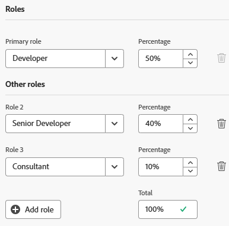
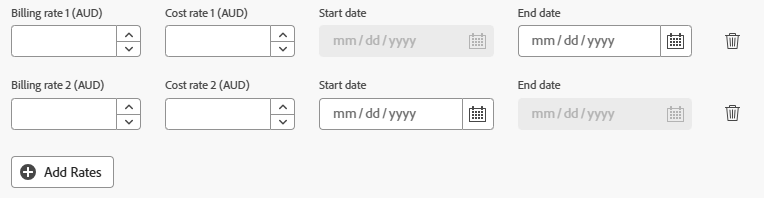

# Redigera en användares profil

{{highlighted-preview}}

<!--

>[!IMPORTANT]
>
>The procedure described on this page applies only to organizations that have not yet been onboarded to the Admin Console. If your organization has been onboarded to the Adobe Admin Console, you must perform this action through the Adobe Admin Console.
>
>For instructions on editing a user's profile in the Adobe Admin Console, see the section "Edit user details" in the article [Manage users individually](https://helpx.adobe.com/se/enterprise/using/manage-users-individually.html) or contact your Adobe Admin Console Administrator.
>
>For a list of procedures that differ based on whether your organization has been onboarded to the Adobe Admin Console, see [Platform-based administration differences (Adobe Workfront/Adobe Business Platform)](../../../administration-and-setup/get-started-wf-administration/actions-in-admin-console.md).
-->

Som Adobe Workfront-administratör kan du skapa användare och hantera befintliga profiler. Mer information om hur du skapar användare finns i [Lägg till användare](../../../administration-and-setup/add-users/create-and-manage-users/add-users.md).

Mer information om användare som uppdaterar sina egna profiler finns i [Konfigurera mina inställningar](/help/quicksilver/workfront-basics/manage-your-account-and-profile/configuring-your-user-profile/configure-my-settings.md).

## Åtkomstkrav

+++ Expandera om du vill visa åtkomstkrav för funktionerna i den här artikeln.

Du måste ha följande åtkomst för att kunna utföra stegen i den här artikeln:

<table style="table-layout:auto"> 
 <col> 
 <col> 
 <tbody> 
  <tr> 
   <td role="rowheader">Adobe Workfront</td> 
   <td>Alla</td> 
  </tr> 
  <tr> 
   <td role="rowheader">Adobe Workfront-licens</td> 
   <td>
Nytt: Standard

eller

Aktuell: Planera
</td> 
  </tr> 
  <tr> 
   <td role="rowheader">Konfigurationer på åtkomstnivå</td> 
   <td> 
Du måste ha något av följande:
 
    <ul> 
     <li> 
Åtkomstnivån Systemadministratör. </li> 
     <li> 
<b>Användare</b> i din åtkomstnivå har konfigurerats till <b>Redigera</b> åtkomst, med <b>Skapa</b> och minst ett av de två <b>användaradministratörsalternativen</b> som har aktiverats under <b>Finjustera inställningarna</b> . 
 
Om <b>Användaradministratör (gruppanvändare)</b> är aktiverat måste du vara gruppadministratör för en grupp där användaren är medlem.
 </li> 
    </ul> </td> 
  </tr> 
 </tbody> 
</table>

Mer information om informationen i den här tabellen finns i [Åtkomstkrav i Workfront-dokumentationen](/help/quicksilver/administration-and-setup/add-users/access-levels-and-object-permissions/access-level-requirements-in-documentation.md).

+++

## Redigera en användarprofil

{{step-1-to-users}}

1. Markera användaren och klicka sedan på ikonen **Redigera**  .

   Rutan Redigera användare visas.

1. Ändra informationen i något av avsnitten i rutan **Redigera användare** och klicka på **Spara** när du vill.

### Personlig information

* **Förnamn**
* **Efternamn**

  >[!NOTE]
  >
  >När du redigerar ett användarnamn i Workfront redigeras inte användarens namn i Adobe Admin Console.

* **E-postadress**: E-postadressen för en användare är även användarens användarnamn i Workfront. Fältet är skiftlägeskänsligt och måste vara unikt. Om någon användare försöker lägga till en icke-unik e-postadress tre gånger i ett 10-minutersfönster visas ett reCAPTCHA-svar.

  Välj inställningen **Jag är inte en robot** innan du kan fortsätta.

  Om du använder e-postadressen tillåtelselista och anger en e-postdomän som inte finns med i listan får användaren inga e-postmeddelanden. Mer information om tillåtelselista finns i [Konfigurera din e-postadress med tillåtelselista](/help/quicksilver/administration-and-setup/get-started-wf-administration/configure-your-email-allowlist.md).

  Om din organisation har migrerats till Adobe Admin Console kan du inte redigera en användares e-postadress i Workfront. Användarens e-postadress anges i Adobe Admin Console.

* **Ändra lösenord**: Klicka på den här knappen om du vill återställa användarens lösenord. Du måste ange ditt eget lösenord innan du kan återställa en annan användares lösenord.

  Om du vill återställa en annan användares lösenord måste du vara Workfront-administratör eller gruppadministratör.

  Om du är gruppadministratör kan du bara återställa lösenord för användare i de grupper där du är utsedd till administratör. Behörigheten Användaradministratör (gruppanvändare) måste även aktiveras på din åtkomstnivå:

  

  Den här inställningen är inaktiverad som standard. Mer information finns i [Skapa eller ändra anpassade åtkomstnivåer](/help/quicksilver/administration-and-setup/add-users/configure-and-grant-access/create-modify-access-levels.md).

  Du kan inte återställa lösenordet för en Workfront-administratör.

<!--
* **&lt;SSO Configuration&gt; Username**: If your Workfront administrator enabled an SSO integration with Workfront, the SSO Username displays in this field. The type of SSO configuration enabled for your Workfront instance is visible in this field.
* **OnlyAllow &lt;SSO Configuration&gt; Authentication**: If your Workfront administrator enabled an SSO integration with Workfront and has updated all users for SSO, this field is selected by default. The type of SSO configuration enabled for your Workfront instance is visible in this field.
  
  When this field is selected, the user is required to log into Workfront with their SSO credentials. Unchecking it will allow them to log in to Workfront with their Workfront credentials.

  For more information about configuring Workfront with an SSO solution, see [Overview of single sign-on in Adobe Workfront](/help/quicksilver/administration-and-setup/add-users/single-sign-on/sso-in-workfront.md).

  For more information about updating users for SSO, see [Update users for single sign-on](/help/quicksilver/administration-and-setup/add-users/single-sign-on/update-users-sso.md).

  >[!NOTE]
  >
  >If you are a group administrator, you can edit the &lt;SSO Configuration&gt; fields only for users in the groups where you are designated as such. Also, the User Admin (Group Users) permission must be enabled in your access level.
  >
  >If you are a group administrator and you have the User Admin (All Users) permission enabled in your access level, you can edit the &lt;SSO Configuration&gt; fields for all users.
-->

* **Profilfoto**: Klicka på **Överför nytt** för att läsa in användarens profilbild. Du kan överföra en JPG-, GIF- eller PNG-fil. Filstorleksgränsen är 4 MB.

  Profilbilden blir användarens avatar och visas i hela Workfront-systemet, oavsett var användarens namn visas.

* **Jobbinformation**: Information om jobbet, t.ex. jobbtiteln (i fältet **Titel**) och vilket expertområde användaren ansvarar för (i fältet **Tala med mig om**).
* **Kontaktinformation**: Användarens telefonnummer (i **Telefonnummer**, **Ext.** och **Mobile number** (fält) och adress (i fälten **Address**, **City**, **State**, **Postal Code** och **Country**).

  Om användaren har aktiverats för Unified User Management (UUM) eller Adobe Identity Management System (IMS), godtar fältet **Country** i avsnittet Kontaktinformation bara landskodsvärden (till exempel USA, GB, IN).

### Inställningar

* **Tidszon**: Användarens tidszon.

  Mer information om hur du kan hjälpa användare att samarbeta i Workfront över tidszoner finns i [Arbeta över tidszoner](/help/quicksilver/workfront-basics/tips-tricks-and-troubleshooting/working-across-timezones.md).

* **Språk för e-post**: Användarens rekommenderade e-postspråk. Detta påverkar formatet för siffror och datum i e-postmeddelanden som kommer från Workfront till den här användaren.

  >[!NOTE]
  >
  >När din organisation använder Adobe Unified Experience lagras användarens språkinställningar i sin Adobe-profil och e-postspråkinställningen används inte. Mer information om hur du använder de här inställningarna finns i [Adobe Unified Experience for Workfront](/help/quicksilver/workfront-basics/navigate-workfront/workfront-navigation/adobe-unified-experience.md).

* **Ta emot e-postmeddelanden från den här testmiljön**: Markera det här alternativet om du vill ta emot e-postmeddelanden från miljön som du är inloggad i.

  >[!NOTE]
  >
  >Det här alternativet är bara tillgängligt i förhandsgransknings- och sandlådemiljöer. E-postmeddelanden är som standard aktiverade i produktionsmiljön.

<!--* **Automatically set the task status to In Progress when tasks are self-assigned**: When this option is selected, work that the user self-assigns is automatically set to In Progress status instead of New.-->

<!--**Send work I assign to myself to my Working On tab**: This setting refers to a deprecated feature that has been removed from Workfront.-->

* **Generera automatiskt korrektur när dokument överförs**: Markera det här alternativet om du vill att de dokument som användaren överför ska generera ett korrektur omedelbart.

### Meddelanden

Välj de e-postmeddelanden som ska aktiveras för den nya användaren.

Du kan välja både snabbmeddelanden och dagliga sammanfattningsmeddelanden.

Mer information finns i [Konfigurera händelsemeddelanden för alla i systemet](/help/quicksilver/administration-and-setup/manage-workfront/emails/configure-event-notifications-for-everyone-in-the-system.md).

### Åtkomst

* **Användaren är aktiv**: Aktivera det här alternativet för att ange att användaren är aktiv. Aktiva användare använder en Workfront-licens. Om du inaktiverar fältet inaktiveras användaren och användaren hindras från att logga in på Workfront.

* **Åtkomstnivå**: Välj den åtkomstnivå som ska tilldelas den här användaren.

  När du tilldelar en åtkomstnivå till en användare kan du tilldela en nivå som är lika med eller lägre än din egen åtkomstnivå. (Om åtkomstnivån till exempel är Standard kan du inte tilldela åtkomstnivån Administratör.)

  Du kan dock inte tilldela en åtkomstnivå som är lägre än din egen åtkomstnivå om Workfront-administratören har aktiverat icke-standardbehörigheter på åtkomstnivån som inte är aktiverade på din egen åtkomstnivå.

  Om du till exempel har en Standard-licens utan åtkomst till borttagningsåtgärder, kan du inte tilldela någon en Light-licens med åtkomst till borttagningsåtgärder även om Light-licensen är lägre än Standard-licensen. Mer information finns i [Skapa eller ändra anpassade åtkomstnivåer](/help/quicksilver/administration-and-setup/add-users/configure-and-grant-access/create-modify-access-levels.md).

  Mer information om åtkomstnivåer finns i [Konfigurera åtkomst till Adobe Workfront](/help/quicksilver/administration-and-setup/add-users/configure-and-grant-access/configure-access.md).

  >[!NOTE]
  >
  >Om din organisation använder den nya åtkomstmodellen (Standard/Light/Contributor) kan du inte tilldela om en Standard- eller Light-användare till en Contributor-åtkomstnivå om användaren redan har nått sin beslutsgräns för månaden.
  >
  >Mer information om den nya åtkomstmodellen finns i [Översikt över nya åtkomstnivåer](/help/quicksilver/administration-and-setup/add-users/how-access-levels-work/access-level-overview.md).
  >
  >Mer information om beslutsbegränsningar finns i [Begränsat dokument och en översikt över korrektur för obetalda användare](/help/quicksilver/review-and-approve-work/proof-doc-decision-limits.md).

* **Layoutmall**: Välj en layoutmall för användaren. den här layoutmallen har företräde framför layoutmallar som tilldelats användarens hemgrupp, hemteam eller primära roll. Mer information om tilldelningsprioriteten för layoutmallar finns i [Skapa och hantera layoutmallar](/help/quicksilver/administration-and-setup/customize-workfront/use-layout-templates/create-and-manage-layout-templates.md).

  Följande lista beskriver hur listan med mallar som du har tillgängliga i det här fältet beror på din åtkomst:

   * Som Workfront-administratör kan du se alla layoutmallar på system- och gruppnivå.
   * Som gruppadministratör kan du se layoutmallar på systemnivå samt de som är kopplade till de grupper som du hanterar.
   * Som användare med en Standard- eller Plan-licens och tillgång till redigeringsanvändare kan du bara se layoutmallar på systemnivå.

     Mer information om layoutmallar på gruppnivå finns i [Skapa och ändra en grupps layoutmallar](/help/quicksilver/administration-and-setup/manage-groups/work-with-group-objects/create-and-modify-a-groups-layout-templates.md).

### Organisation

* **Företag**: Användarens företag. Användare kan bara associeras med ett företag. Du måste skapa ett företag innan du kan associera det med en användare. Endast aktiva företag visas i listan. Mer information om hur du skapar företag finns i [Skapa och redigera företag](/help/quicksilver/administration-and-setup/set-up-workfront/organizational-setup/create-and-edit-companies.md).
* **Rapporterar till**: Om du har angett ett företag för användaren kan du även ange användarens direkthanterare i det här fältet. En användare kan bara ha en hanterare. Det här fältet visas inte om användaren inte är associerad med ett företag först.
* **Direktrapporter**: Om du har angett ett företag för användaren kan du även ange användares direktrapporter. En användare kan ha flera direktrapporter. Det här fältet visas inte om användaren inte är associerad med ett företag först.
* **Hemteam**: Ange hemteamet för användaren. Användare kan bara ha ett hemteam. Hemteamet är viktigt när du tilldelar en layoutmall eller när du definierar knappen Arbeta med det för uppgifter och ärenden som tilldelats användaren.
* **Andra team**: Användare kan tillhöra flera team. En användare kan visa arbetsobjekt som är tilldelade något av deras team i hemområdet.
* **Aktuell hemgrupp**: Välj en lämplig grupp att tilldela användaren till. Detta ger användaren möjlighet att komma åt objekt som delas med gruppen. Du kan också dela layoutmallar med användarens hemgrupp.

  Detta är ett obligatoriskt fält. Alla användare måste vara kopplade till en hemgrupp. Om du inte väljer någon får din hemgrupp rollen som den nya användarens hemgrupp.

  Du kan bara tilldela en grupp till en användare om något av följande är sant:

   * du är Workfront-administratör
   * du är administratör för gruppen
   * gruppen är offentlig

* **Andra grupper**: Användare kan tillhöra flera grupper. Du kan bara tilldela en grupp till en användare om du är Workfront-administratör, är administratör för gruppen eller om gruppen är offentlig.

  >[!IMPORTANT]
  >
  >Om du lägger till en användare i fler än 100 grupper kan prestandaproblem uppstå i alla områden i Workfront som läser in listan med grupper.

  Mer information om publika grupper finns i [Skapa en grupp](/help/quicksilver/administration-and-setup/manage-groups/create-and-manage-groups/create-a-group.md).

  Mer information om grupper finns i [Översikt över grupper](/help/quicksilver/administration-and-setup/manage-groups/groups-overview/groups.md).

### Resursplanering

* **Arbetstid**: Representerar den procentandel av heltidsekvivalenttiden (FTE) som användaren är tillgänglig för det faktiska arbetet, exklusive extrakostnader. Arbetstiden måste vara ett decimaltal upp till 1 och får inte vara 0. Exempel: 20 % tillgänglighet för faktiskt arbete är 0,2.

  Fältets standardvärde är 1, vilket anger att en användare tillbringar hela sitt heltidsanställda på faktiskt, projektrelaterat arbete.

  Systemet använder det här talet för att beräkna användarens tillgänglighet för faktiskt, projektrelaterat arbete.

  Mer information om hur du skapar scheman i Workfront finns i [Skapa ett schema](/help/quicksilver/administration-and-setup/set-up-workfront/configure-timesheets-schedules/create-schedules.md).

  Schemalagda undantag och ledig tid kan också påverka användarens kapacitet.

  Workfront beräknar en användares tillgänglighet beroende på inställningarna för resurshantering i inställningsområdet. Mer information finns i [Konfigurera inställningar för resurshantering](/help/quicksilver/administration-and-setup/set-up-workfront/configure-system-defaults/configure-resource-mgmt-preferences.md).

  >[!TIP]
  >
  >Ange värdet 1 för Arbetstid för att ange att användaren är tillgänglig för projektrelaterat arbete och hela heltidsekvivalenten.

* **Ange inaktiveringsdatum**: Klicka på den här knappen om du vill schemalägga att den här användaren ska inaktiveras ett visst datum och vid en viss tidpunkt.
* **Inaktiveringsdatum**: Det datum och den tidpunkt då användaren inaktiveras. Mer information om schemaläggning av användare för inaktivering finns i [Schemalägg användare för inaktivering](/help/quicksilver/administration-and-setup/add-users/create-and-manage-users/deactivate-a-user.md#schedule-users-for-deactivation) i [Inaktivera eller återaktivera en användare](/help/quicksilver/administration-and-setup/add-users/create-and-manage-users/deactivate-a-user.md).
* **Primär roll**: Det här är den primära jobbrollen som användaren kan utföra i Workfront. Alla uppgifter och utgåvor som användaren är tilldelad till tilldelas även den här jobbrollen. Jobbroller är viktiga i resurshanteringen. Du kan bara uppdatera det här fältet om du har en Standard- eller Plan-licens med administratörsbehörighet eller om du är Workfront-administratör. Mer information om hur du konfigurerar användare med administrativ användaråtkomst finns i [Bevilja åtkomst till användare](/help/quicksilver/administration-and-setup/add-users/configure-and-grant-access/grant-access-other-users.md).

  Endast aktiva jobbroller visas i listan.

* (Villkorligt) Om du valde en **primär roll** visas fältet **Procent av FTE-tillgänglighet** . Ange hur många procent av tiden i användarens schema som ska tilldelas den här jobbrollen. Standardvärdet för procentandelen FTE-tillgänglighet för den primära rollen är 100 %.
* **Andra roller**: En användare kan ha flera jobbroller i Workfront. Jobbroller är viktiga i resurshanteringen. Det finns ingen gräns för hur många jobbroller en användare kan utföra. Vi rekommenderar dock att du inte tilldelar en användare till ett för stort antal jobbroller eftersom resurshanteringen kan bli alltför komplex för dessa användare.

  Endast aktiva jobbroller visas i listan. Mer information om jobbroller finns i [Skapa och hantera jobbroller](/help/quicksilver/administration-and-setup/set-up-workfront/organizational-setup/create-manage-job-roles.md).

  Du kan bara uppdatera det här fältet om du har en Standard- eller Plan-licens med administratörsbehörighet eller om du är Workfront-administratör.

  Mer information om hur du konfigurerar användare med administrativ användaråtkomst finns i [Bevilja åtkomst till användare](/help/quicksilver/administration-and-setup/add-users/configure-and-grant-access/grant-access-other-users.md).

* (Villkorligt) Om du markerade en eller flera **andra roller** visas fältet **Procent av FTE-tillgänglighet** för varje roll. Ange hur stor procentandel av tiden i användarens schema som ska tilldelas varje jobbroll. Standardvärdet för procentandelen FTE-tillgänglighet för andra roller är 0 %.

  Om andra roller har 0 % FTE-tillgänglighet visas de inte i resursplaneraren, såvida inte användarna har tilldelats till uppgifter i de här rollerna.

  

  Summan av alla **procent FTE-tillgänglighet** för alla roller måste vara lika med 100 %. Varje procentandel av FTE-tillgänglighet beräknar tillgängliga timmar för varje roll per användare i resursplaneraren. Tillgängliga timmar för varje roll per användare beror på användarens tillgängliga tid.

  Den tillgängliga tiden för användaren beräknas av Workfront utifrån den metod som Workfront-administratören har valt för att beräkna FTE i Inställningar för resurshantering.

  Mer information om hur du beräknar tillgänglighet för användaren finns i [Översikt över beräkning av timmar och FTE för användare och roller i resursplaneraren](/help/quicksilver/resource-mgmt/resource-planning/calculate-hours-fte-for-users-roles-resource-planner.md).

  Mer information om hur du konfigurerar inställningar för resurshantering finns i [Konfigurera inställningar för resurshantering](/help/quicksilver/administration-and-setup/set-up-workfront/configure-system-defaults/configure-resource-mgmt-preferences.md).

  (Valfritt) Rolltilldelningar för giltighetsdatum används i ekonomiska beräkningar om användarens jobbroll ändras under ett projekt.

  Klicka på **Definiera roller efter datum**, välj **Primär roll** och **Andra roller** och ange allokeringsprocenten för varje roll. Rollerna kan vara desamma som de befintliga rollerna (med olika procentandelar) eller nya roller. Välj startdatum när de här rollerna blir aktiva. Detta kan vara ett framtida datum. När de senaste rollerna blir aktiva kan du klicka på **Visa tidigare roller** för att visa föregående, inaktiva roller.

* **Schema**: Associera ett schema med användaren. Schemat för användaren beräknar tidslinjen för de uppgifter som användaren är tilldelad till.

  Du måste skapa ett schema innan du kan associera det med en användare. Mer information om hur du skapar scheman finns i [Skapa ett schema](/help/quicksilver/administration-and-setup/set-up-workfront/configure-timesheets-schedules/create-schedules.md).

  >[!NOTE]
  >
  >Vi rekommenderar att schemat som du associerar med användaren matchar användarens tidszon.

  >[!IMPORTANT]
  >
  >Workfront använder schemat för en användare endast när inställningen **Beräkna resurstillgänglighet med** är inställd på **Användarens schema**. Information om hur den här inställningen påverkar vilket schema som används för resurshantering finns i [Konfigurera inställningar för resurshantering](/help/quicksilver/administration-and-setup/set-up-workfront/configure-system-defaults/configure-resource-mgmt-preferences.md).

* **Tidrapportprofil**: Associera en tidrapportprofil med användaren för att säkerställa att tidrapporter genereras automatiskt för användaren.

  Listan med profiler som är tillgängliga i det här fältet beror på din åtkomst:

   * Som Workfront-administratör kan du se alla tidrapportprofiler på systemnivå och på gruppnivå.
   * Som gruppadministratör kan du visa tidrapportprofiler på systemnivå, samt de som är kopplade till de grupper som du hanterar.
   * Som användare med en Standard- eller Plan-licens och tillgång till redigeringsanvändare kan du bara se tidrapportprofiler på systemnivå. Mer information om tidrapportprofiler på gruppnivå finns i [Skapa, redigera och tilldela tidrapportprofiler](/help/quicksilver/timesheets/create-and-manage-timesheets/create-timesheet-profiles.md).

* **Standardtimtyp**: Välj standardtimtyp för användaren. Det här är timtypen som används som standard när användaren loggar tid.
* **Tillgängliga timtyper**: Välj de timtyper som ska vara tillgängliga för användaren. Dessa timtyper visas överallt i Workfront där användaren kan logga tid. En användare kan bara se timtyperna som är aktiverade på projektnivå och på användarnivå. Mer information om vilka timtyper som är tillgängliga för användare finns i [Definiera timtyper och tillgänglighet](/help/quicksilver/timesheets/create-and-manage-timesheets/define-hour-types-and-availability.md).
* **Logga in**: Välj om användaren ska logga in på arbetsposter i timmar eller dagar. Mer information finns i [Konfigurera om tiden är inloggad i timmar eller dagar](/help/quicksilver/timesheets/config-timesheet-prefs/config-time-logged-hrs-days.md).
* **FTE**: Detta är heltidsmotsvarigheten för användaren. Workfront använder det här numret för att beräkna användarens tillgänglighet baserat på standardschemat endast när inställningarna för resurshantering på systemnivå är inställda på standardschemat.

  FTE anger hur lång tid användaren kan tillbringa på jobbet. Detta inkluderar overheadkostnader och tid för projektarbete. Till exempel ingår även tid som används i möten eller utbildning i heltidsanställda.

  FTE måste vara ett decimaltal upp till 1 och det får inte vara 0. Om till exempel FTE-värdet är 0,5 och standardschemat i Workfront är 40 timmar är användaren tillgänglig för 20 timmar i veckan.

  Fältets standardvärde är 1.

  Schemalägg undantag, ledig tid och värdet för Arbetstid kan påverka användarens tillgänglighet.

  Workfront beräknar en användares tillgänglighet beroende på inställningarna för resurshantering i inställningsområdet.

  Om inställningarna för resurshantering på systemnivå är inställda på Användarens schema, ignoreras det värde du anger här och användaren anses vara tillgänglig enligt det som anges i deras schema.

  Mer information finns i [Konfigurera inställningar för resurshantering](/help/quicksilver/administration-and-setup/set-up-workfront/configure-system-defaults/configure-resource-mgmt-preferences.md).

  Mer information om hur du skapar scheman i Workfront finns i [Skapa ett schema](/help/quicksilver/administration-and-setup/set-up-workfront/configure-timesheets-schedules/create-schedules.md).

* **Resurspooler**: Associera användaren med resurspooler. Mer information finns i [Associera resurspooler med användare](/help/quicksilver/resource-mgmt/resource-planning/resource-pools/associate-resource-pools-with-users.md).
* **Kostnadsnivå**: Kostnadsbeloppet per timme för användaren.

  Klicka på **Lägg till kurs** om du vill se datumfaktiska kostnadstariffer. Ange värdet för kostnadstariffen för tidsperioden och tilldela startdatum och slutdatum efter behov. Kostnadsnivå 1 har inget startdatum och den sista kostnadstariffen har inget slutdatum.

  Vissa datum läggs till automatiskt. Om t.ex. Kostnadsgrad 1 inte har ett slutdatum och du lägger till Kostnadsnivå 2 med startdatumet 1 maj 2023, läggs ett slutdatum som är 30 april 2023 till Kostnadsnivå 1 så att inga luckor uppstår.

* **Faktureringshastighet**: Användarens faktureringsbelopp per timme.

  Klicka på **Lägg till ränta** om du vill se gällande faktureringspriser för datum. Ange faktureringsvärdet för tidsperioden och tilldela startdatum och slutdatum efter behov. Faktureringsränta 1 har inget startdatum och den senaste faktureringstakten har inget slutdatum.

  Vissa datum läggs till automatiskt. Om till exempel Faktureringstariff 1 inte har något slutdatum och du lägger till en andra med startdatumet 1 maj 2023, läggs ett slutdatum som är 30 april 2023 till Faktureringstariff 1 så att inga luckor uppstår.

  

### Anpassad Forms

Koppla ett befintligt anpassat formulär till den här användaren. Du måste skapa ett anpassat formulär innan du kan koppla det till en användare. Endast aktiva anpassade formulär visas i listan. Fält som du inte har behörighet att redigera visas inte i ett anpassat formulär.

>[!NOTE]
>
>Avancerade anpassade formulärfunktioner som externa sökningsfält och inbyggda Workfront-fält är bara tillgängliga när du öppnar användarposten på informationssidan, inte i dialogrutan Redigera användare. (I listan över användare klickar du på användarnamnet för att öppna informationen.)

Mer information om hur du skapar anpassade formulär finns i [Skapa ett anpassat formulär](/help/quicksilver/administration-and-setup/customize-workfront/create-manage-custom-forms/form-designer/design-a-form/design-a-form.md).

### Kommentar

Skriv den kommentar som du vill skicka till användaren och till uppdateringsområdet i användarprofilen.

<!--
   <table style="table-layout:auto"> 
    <col> 
    <col> 
    <tbody> 
     <tr> 
      <td role="rowheader">Personal Info </td> 
      <td> 
       <ul> 
        <li>
<b>First Name</b>
</li>
        <li>
<b>Last Name</b>

<b>NOTE:</b>

Editing a user's name in Workfront does not edit the user's name in the Adobe Admin Console.
</li> 
        <li> 
<b>Email Address:</b> The email address for a user is also their username in Workfront. This field is case-sensitive and must be unique. If any user attempts to add a non-unique email address 3 times within a 10-minute window, a reCAPTCHA response appears.
 
 Select the <b>I am not a robot</b> setting before you can proceed.

If you use the email allowlist and enter an email domain not on the list, the user will not receive email notifications. For more information about the allowlist, see <a href="../../../administration-and-setup/get-started-wf-administration/configure-your-email-allowlist.md" class="MCXref xref">Configure your email allowlist</a>.

If your organization has been migrated to the Adobe Admin Console, you cannot edit a user's email address in Workfront. The user's email address is set in the Adobe Admin Console. </li> 
        <li> 
<b>Reset Password</b>: Click this link to reset the user's password. You must enter your own password before you can reset another user's password.
 
To reset another user's password, you must be a Workfront administrator, or a group administrator.
 
<b>NOTE</b>:  
          <ul> 
           <li> 
If you are a group administrator, you can reset passwords only for users in the groups where you are designated as an administrator. Also, the User Admin (Group Users) permission must be enabled in your access level:
 
  
 
This setting is disabled by default. For more information, see <a href="../../../administration-and-setup/add-users/configure-and-grant-access/create-modify-access-levels.md" class="MCXref xref">Create or modify custom access levels</a>.
 </li> 
           <li> 
You cannot reset the password of a Workfront administrator.
 </li> 
          </ul> 
 </li> 
        <li><b>&lt;SSO Configuration&gt; Username</b>: If your Workfront administrator enabled an SSO integration with Workfront, the SSO Username displays in this field. The type of SSO configuration enabled for your Workfront instance is visible in this field. </li> 
        <li> 
<b>OnlyAllow &lt;SSO Configuration&gt; Authentication</b>: If your Workfront administrator enabled an SSO integration with Workfront and has updated all users for SSO, this field is selected by default. The type of SSO configuration enabled for your Workfront instance is visible in this field.
 
When this field is selected, the user is required to log into Workfront with their SSO credentials. Unchecking it will allow them to log in to Workfront with their Workfront credentials.
 
For more information about configuring Workfront with an SSO solution, see <a href="../../../administration-and-setup/add-users/single-sign-on/sso-in-workfront.md" class="MCXref xref">Overview of single sign-on in Adobe Workfront</a>
 
For more information about updating users for SSO, see <a href="../../../administration-and-setup/add-users/single-sign-on/update-users-sso.md" class="MCXref xref">Update users for single sign-on</a>.
 
        
<b>NOTE</b>:
 
        
 If you are a group administrator, you can edit the &lt;SSO Configuration&gt; fields only for users in the groups where you are designated as such. Also, the User Admin (Group Users) permission must be enabled in your access level.
        
If you are a group administrator and you have the User Admin (All Users) permission enabled in your access level, you can edit the &lt;SSO Configuration&gt; fields for all users.
 </li> 
        <li><b>Job Info:</b> Information about the job, like the job title (in the <b>Title</b> field), and what area of expertise the user is responsible for (in the <b>Talk to Me About</b> field).</li> 
        <li>
<b>Contact Info</b>: The user's phone number (in the <b>Phone number, Ext.</b>, and <b>Mobile number</b> fields) and address (in the <b>Address, City, State, Postal Code, Country</b> fields ).

        
If the user is enabled for Unified User Management (UUM) or Adobe Identity Management System (IMS), the <b>Country</b> field in the Contact Info section only accepts country code values (for example, US, GB, IN).
</li>
       </ul> </td> 
     </tr> 
     <tr> 
      <td role="rowheader">Preferences </td> 
      <td> 
       <ul> 
      <li> 
<b>Time Zone:</b> The user's time zone.
 
For information about helping users collaborate in Workfront across time zones, see <a href="../../../workfront-basics/tips-tricks-and-troubleshooting/working-across-timezones.md" class="MCXref xref">Working across time zones</a>.
 </li>

      <li>
<b>Email Locale</b>: The user's preferred email locale. This affects the format of numbers and dates in the emails that come from Workfront to this user.

      
<b>NOTE:</b> When your organization is on the Adobe Unified Experience, the user's language preferences are stored in their Adobe profile and the email locale is not used. For information about accessing these preferences, see <a href="/help/quicksilver/workfront-basics/navigate-workfront/workfront-navigation/adobe-unified-experience.md">Adobe Unified Experience for Workfront</a>.
</li> 
      
      <li><b>Receive emails from this test environment</b>: Check this option if you want to receive email notifications from the environment that you are currently logged in.
      
<b>NOTE</b>

      
This option is available only in the Preview and Sandbox environments. Email notifications are enabled in the Production environment by default. 

      </li> 
      
      </li> 
       <li><b>Send work I assign to myself to my Working On tab</b>: This setting refers to a deprecated feature that has been removed from Workfront.</li> 
       <li><b>Automatically generate proofs when uploading documents</b>: Check this option if you want the documents that the user uploads to immediately generate a proof. </li>
       </ul> </td> 
     </tr> 
     <tr> 
      <td role="rowheader">Notifications</td> 
      <td> 
Select the email notifications which should be enabled for the new user.
 
You can select instant as well as daily digest notifications.
 
For more information, see <a href="../../../administration-and-setup/manage-workfront/emails/configure-event-notifications-for-everyone-in-the-system.md" class="MCXref xref">Configure event notifications for everyone in the system</a>.
 </td> 
     </tr> 
     <tr> 
      <td role="rowheader">Access</td> 
      <td> 
       <ul> 
      <li><b>Is Active:</b> Select this box to indicate that the user is active. Active users use a Workfront license. Clearing the box deactivates the user and prevents them from logging in to Workfront.</li> 
       <li> 
<b>Access Level:</b> Select the access level to assign to this user.
 
       
When you assign an access level to a user, you can assign a level equal to or lower than your own access level.

       
For example, if your access level is Plan, you cannot assign the Administrator access level. However, you cannot assign an access level that by default is lower than your own access level if the Workfront administrator has enabled non-default permissions on the access level that are not also enabled in your own access level. 

       
For example, if you have a Plan license with no access to delete tasks, you cannot assign someone a Work license with access to delete tasks, although the Work license is lower than the Plan license. For more information, see  <a href="../../../administration-and-setup/add-users/configure-and-grant-access/create-modify-access-levels.md" class="MCXref xref">Create or modify custom access levels</a>. 
 
       
For more information about access levels, see <a href="../../../administration-and-setup/add-users/configure-and-grant-access/configure-access.md" class="MCXref xref">Configure access to Adobe Workfront</a>.

       
 <b>NOTE:</b>
 
       
 If your organization uses the new access model (Standard/Light/Contributor), you cannot reassign a Standard or Light user to a Contributor access level if that user has already reached their decision limit for the month. 

For more information on the new access model, see <a href="../how-access-levels-work/access-level-overview.md" class="MCXref xref">New access levels overview</a>. 

For information on decision limits, see <a href="/help/quicksilver/review-and-approve-work/proof-doc-decision-limits.md" class="MCXref xref">Limited document and proof decision for non-paid users overview</a>.
</li> 
       <li> 
<b>Layout Template</b>: Choose a Layout Template for the user. This Layout Template takes precedence over any Layout Template assigned to the user's Home Group, Home Team or Primary Role. For more information about the assignment priority of Layout Templates, see <a href="../../../administration-and-setup/customize-workfront/use-layout-templates/create-and-manage-layout-templates.md" class="MCXref xref">Create and manage layout templates</a>.
 
<b>NOTE</b>:  
The following list describes how the list of templates you have available in this field depends on your access:
 
       <ul> 
       <li>As a Workfront administrator, you can see all system-level and group-level Layout Templates.</li> 
       <li>As a group administrator, you can see system-level layout template, as well as those associated with the groups that you manage.</li> 
       <li>As a user with a Plan license and access to edit users, you can see only system-level Layout Templates.</li> 
       </ul> 
For more information about group-level Layout Templates, see <a href="../../../administration-and-setup/customize-workfront/use-layout-templates/create-and-manage-layout-templates.md" class="MCXref xref">Create and manage layout templates</a>.
 
 </li> 
       </ul> </td> 
     </tr> 
     <tr> 
      <td role="rowheader">Organization </td> 
      <td> 
       <ul> 
      <li><b>Company</b>: The company of the user. Users can be associated only with one company. You must create a company before you can associate it with a user. Only active companies display in the list. For information about creating companies, see <a href="../../../administration-and-setup/set-up-workfront/organizational-setup/create-and-edit-companies.md" class="MCXref xref">Create and edit companies</a>.</li> 
      <li><b>Reports to:</b> If you specified a company for the user, you can also specify the direct manager of the user in this field. A user can have only one manager. This field does not display if the user is not associated with a company first. </li> 
      <li><b>Direct Reports:</b> If you specified a company for the user, you can also specify the direct reports of the user. A user can have multiple direct reports. This field does not display if the user is not associated with a company first.</li> 
      <li><b>Home Team</b>: Specify the home team for the user. Users can only have one home team. The Home Team is important when assigning a layout template or when defining the Work On It button for the tasks and issues assigned to the user. </li> 
      <li><b>Other Teams</b>: Users can belong to multiple teams. A user can view work items assigned to any of their teams in their Home area. </li> 
      <li> 
<b>Home Group:</b> Select an appropriate group to assign the user. This gives the user the ability to access objects that are shared with the group. You can also share layout templates with the user's Home Group.
 
This is a required field. Every user must be associated with a home group. If you don't select one, your Home Group is assigned as the new user's Home Group.
 
<b>NOTE</b>:
 
      
 You can assign a group to a user only if one of the following is true:

      <ul><li>you are a Workfront administrator</li>
      <li>you are the administrator of the group</li>
      <li>the group is public.</li></ul> 
      <li> 
<b>Other Groups</b>: Users can belong to multiple groups. You can assign a group to a user only if you are a Workfront administrator, you are the administrator of the group, or the group is public.
 
<b>IMPORTANT</b>:
 
      
Adding a user to more than 100 groups may cause performance issues in any area of Workfront that loads the list of groups.
 
For more information about public groups, see <a href="../../../administration-and-setup/manage-groups/create-and-manage-groups/create-a-group.md" class="MCXref xref">Create a group</a>.
 
For more information about groups, see <a href="../../../administration-and-setup/manage-groups/groups-overview/groups.md" class="MCXref xref">Groups overview</a>.
 </li> 
       </ul> </td> 
     </tr> 
     <tr> 
      <td role="rowheader">Resource Planning </td> 
      <td> 
       <ul>
       <li>
       <b>Work Time</b>: Represents the percentage of the Full Time Equivalent (FTE) time that the user is available for actual work, not including overhead. Work Time must be a decimal number up to 1, and it cannot be 0. For example, a 20% availability for actual work would be 0.2.

      The field's default is 1, indicating that a user spends their entire FTE on actual, project-related work.  

      The system uses this number to calculate the availability of the user for actual, project-related work. 

      For more information about creating schedules in Workfront, see <a href="../../set-up-workfront/configure-timesheets-schedules/create-schedules.md">Create a schedule</a>.

      Schedule exceptions and time off might also affect the user's capacity. 

      Workfront calculates a user's availability depending on the Resource Management preferences in your Setup area. For more information, see <a href="../../set-up-workfront/configure-system-defaults/configure-resource-mgmt-preferences.md">Configure Resource Management preferences</a>. 

      <b>TIP</b>

      Set the Work Time value to 1 to indicate that the user is available for project-related work their entire full-time equivalent.
      </li> 
      <li> <b>Schedule Deactivation</b>: Check this box if you want to schedule this user to be deactivated on a certain date and at a certain time. </li> 
       <li><b>Scheduled Deactivation Date</b>: The date and time on which the user becomes deactivated. For information about scheduling users for deactivation, see the <a href="../../../administration-and-setup/add-users/create-and-manage-users/deactivate-a-user.md#scheduling-users-for-deactivation" class="MCXref xref">Schedule users for deactivation</a> in <a href="../../../administration-and-setup/add-users/create-and-manage-users/deactivate-a-user.md" class="MCXref xref">Deactivate or reactivate a user</a>.</li> 
       <li> 
<b>Primary Role</b>: This is the primary job role that the user can fulfill in Workfront. Every task and issue that the user is assigned to is also assigned to this job role. Job roles are essential in resource management. You can update this field only if you have a Plan license with administrative user access, or if you are a Workfront administrator. For more information about setting up users with administrative user access, see <a href="../../../administration-and-setup/add-users/configure-and-grant-access/grant-access-other-users.md" class="MCXref xref">Grant access to users</a>.
 
Only active job roles display in the list. 
 </li> 
       <li>If you selected a <b>Primary Role</b>, the <b>Percentage of FTE Availability</b> field displays. Specify what percentage of time of the user's schedule is allocated to this job role. The default value for the Percentage of FTE Availability for the Primary Role is 100%. </li> 
       <li> 
<b>Other Roles</b>: A user can have multiple job roles in Workfront. Job roles are essential in resource management. There is no limit for how many job roles a user can fulfill. However, we recommend to not assign one user to an excessively large number of job roles, because resource management might become too complex for these users.
Only active job roles display in the list. For more information about job roles, see <a href="../../../administration-and-setup/set-up-workfront/organizational-setup/create-manage-job-roles.md" class="MCXref xref">Create and manage job roles</a>.
 
You can update this field only if you have a Plan license with administrative user access, or if you are a Workfront administrator.  For more information about setting up users with administrative user access, see <a href="../../../administration-and-setup/add-users/configure-and-grant-access/grant-access-other-users.md" class="MCXref xref">Grant access to users</a>.
 </li> 
       <li> 
(Conditional) If you selected one or multiple <b>Other Roles</b>, the <b>Percentage of FTE Availability</b> field displays for each role. Specify what percentage of time of the user's schedule is allocated to each job role. The default value for the Percentage of FTE Availability for the Other Roles is 0%.
 
<b>NOTE</b>:  If Other Roles have a 0% FTE Availability, they do not display in the Resource Planner, unless the users are assigned to tasks in these roles.
 
  
 
<b>NOTE</b>: 
The sum of all <b>Percentages of FTE Availability</b> for all roles must equal 100%. Each Percentage of FTE Availability calculates the Available Hours for each role per user in the Resource Planner. The Available Hours for each role per user depends on the available time for the user.
 
The available time for the user is calculated by Workfront depending on the method that has been selected by the Workfront administrator to calculate the FTE in the Resource Management Preferences.
 
For information about calculating availability for the user, see <a href="../../../resource-mgmt/resource-planning/calculate-hours-fte-for-users-roles-resource-planner.md" class="MCXref xref">Overview of calculating hours and FTE for users and roles in the Resource Planner</a>.
 
For information about configuring Resource Management preferences, see <a href="../../../administration-and-setup/set-up-workfront/configure-system-defaults/configure-resource-mgmt-preferences.md" class="MCXref xref">Configure Resource Management preferences</a>.
 

       
(Optional) Date effective job role assignments are used in financial calculations if the user's job role changes during a project.

Click <b>Define roles by date</b>, select the <b>Primary Role</b> and <b>Other Roles</b>, and enter the allocation percentage for each role. The roles could be the same as the existing roles (using different percentages), or new roles. Select the <b>Start date</b> when these roles become active. This can be a future date. When the newest roles become active, you can click <b>Show previous roles</b> to see the previous, inactive roles.
 </li>
       <li> 
<b>Schedule</b>: Associate a schedule with the user. The schedule of the user calculates the timeline of the tasks the user is assigned to.
 
You must create a schedule before you can associate it with a user. For more information about creating schedules, see <a href="../../../administration-and-setup/set-up-workfront/configure-timesheets-schedules/create-schedules.md" class="MCXref xref">Create a schedule</a>.
 
<b>NOTE</b>: We recommend that the schedule you associate with the user matches the user's Time Zone.
 </li> 
       <li> 
<b>Timesheet Profile</b>: Associate a Timesheet Profile with the user to ensure that timesheets generate automatically for the user.
 
<b>NOTE</b>:  The list of profiles you have available in this field depends on your access:
       <ul>
       <li>As a Workfront administrator, you can see all system-level and all group-level Timesheet Profiles.</li>
       <li>As a group administrator, you can see system-level Timesheet Profiles, as well as those associated with the groups that you manage.</li>
       <li>As a user with a Plan license and access to edit users, you can see only system-level Timesheet Profiles. For more information about group-level Timesheet Profiles, see <a href="../../../timesheets/create-and-manage-timesheets/create-timesheet-profiles.md" class="MCXref xref">Create, edit, and assign timesheet profiles</a>.</li>
      </ul>
 </li> 
       <li><b>Default Hour Type</b>: Select the default hour type for the user. This is the hour type that is used by default when the user logs time.</li> 
       <li><b>Available Hour Types</b>: Select the hour types that should be available to the user. These hour types are visible everywhere in Workfront where the user can log time. A user can only see the hour types that are enabled at the project level as well as the user level. For more information about what hour types are available to users, see <a href="../../../timesheets/create-and-manage-timesheets/define-hour-types-and-availability.md" class="MCXref xref">Define hour types and availability</a>.</li> 
       <li><b>Log Time in:</b> Select whether the user should log time on work items in hours or days. For more information, see <a href="../../../timesheets/config-timesheet-prefs/config-time-logged-hrs-days.md" class="MCXref xref">Configure whether time is logged in hours or days</a>.</li>
       
      <li> <b>FTE</b>: This is the Full Time Equivalent of the user. Workfront uses this number to calculate the availability of the user based on the Default Schedule only when the Resource Management Preferences at the system level are set to The Default Schedule. 

      
The FTE indicates the amount of time that the user can spend at work. This includes overhead, as well as time spent on project work. For example, time that is spent in meetings, or training is also included in the FTE.
 

      The FTE must be a decimal number up to 1, and it cannot be 0. For example, if the FTE value is 0.5 and the Default Schedule in Workfront is 40 hours, the user is available for 20 hours a week. 

      The field's default is 1.

      Schedule exceptions, time off might, and the value of Work Time may affect the availability of the user. 

      Workfront calculates a user's availability depending on the Resource Management preferences in your Setup area.

      If the Resource Management Preferences at the system level are set to The User's Schedule, the value you specify here is ignored and the user is considered to be available according to what is specified in their schedule. 

      For more information, see <a href="../../set-up-workfront/configure-system-defaults/configure-resource-mgmt-preferences.md">Configure Resource Management preferences</a>. 

      For more information about creating schedules in Workfront, see <a href="../../set-up-workfront/configure-timesheets-schedules/create-schedules.md">Create a schedule</a>.
      </li> 
      
      <li><b>Resource Pools</b>: Associate the user with Resource Pools. For more information, see <a href="../../../resource-mgmt/resource-planning/resource-pools/associate-resource-pools-with-users.md" class="MCXref xref">Associate resource pools with users </a>.</li> 
      
      <li><b>Cost Rate</b>: The amount of cost per hour for the user.
      
For date effective cost rates, click <strong>Add Rate</strong>. Enter the value of the cost rate for the time period, and assign a Start Date and End Date as needed. Cost Rate 1 will not have a start date and the last cost rate will not have an end date.

Some dates are added automatically. For example, if Cost Rate 1 does not have an end date, and you add Cost Rate 2 with a start date of May 1, 2023, an end date of April 30, 2023 is added to Cost Rate 1 so that no gaps exist.
</li> 
      
      <li><b>Billing Rate</b>: The amount of billing per hour for the user.
      
For date effective billing rates, click <strong>Add Rate</strong>. Enter the value of the billing rate for the time period, and assign a Start Date and End Date as needed. Billing Rate 1 will not have a start date and the last billing rate will not have an end date.
 
Some dates are added automatically. For example, if Billing Rate 1 does not have an end date, and you add a second with a start date of May 1, 2023, an end date of April 30, 2023 is added to Billing Rate 1 so that no gaps exist.

  
</li>

      </ul> </td> 
     </tr> 
     <tr> 
      <td role="rowheader">Custom Forms</td> 
      <td>
Associate an existing user custom form with this user. You must create a custom form before you can associate it with a user. Only active custom forms display in the list. Fields you do not have access to edit are not displayed in an individual custom form.
 
<strong>Note:</strong> Advanced custom form features such as External lookup fields and Workfront native fields are only available when you open the user record on the details page, not on the Edit User dialog. (From the list of users, click the user name to open the details.)
 
For information about creating custom forms, see <a href="/help/quicksilver/administration-and-setup/customize-workfront/create-manage-custom-forms/form-designer/design-a-form/design-a-form.md" class="MCXref xref">Create a custom form</a>.
</td> 
     </tr> 
     <tr> 
      <td role="rowheader">Comment</td> 
      <td>Type the comment you want to send to the users and to the Updates area of their user profiles.</td> 
     </tr> 
    </tbody> 
   </table>
-->
