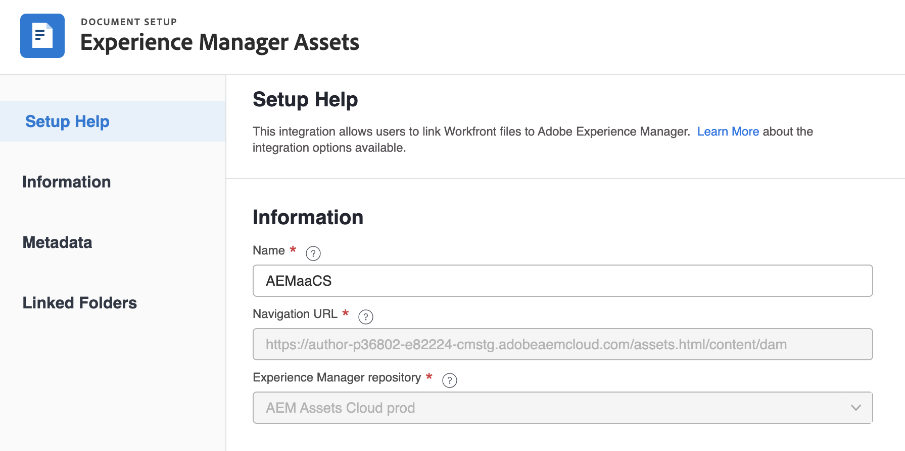
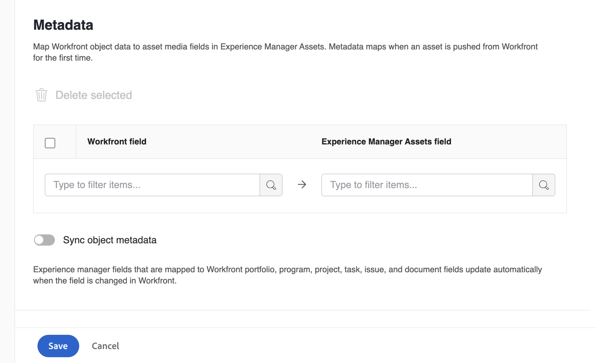

# Konfigurera integreringen av [!UICONTROL Experience Manager Assets as a Cloud Service]

<!-- Audited: 1/2024 -->

>[!IMPORTANT]
>
>Den här funktionen är bara tillgänglig för organisationer som har anslutit sig till [!DNL Adobe Admin Console].

Du kan koppla ditt arbete till ditt innehåll i [!DNL Experience Manager Assets] &#x200B;:

* Överför resurser och metadata från [!DNL Adobe Workfront] till [!DNL Experience Manager Assets]-&#x200B;
* Länka resurser från [!DNL Experience Manager Assets] till dina projekt och uppgifter i [!DNL Workfront&#x200B;]
* Underlätta versionsanvändning
* Skapa mappar länkade till [!DNL Experience Manager Assets]
* Spåra metadata för resurser och mappar
* Synkronisera projektmetadata mellan [!DNL Workfront] och [!DNL Experience Manager Assets]

>[!NOTE]
>
>Du kan också ansluta flera [!DNL Experience Manager Assets]-databaser till en [!UICONTROL Workfront] -miljö, eller flera [!DNL Workfront] -miljöer till en [!DNL Experience Manager Assets] -databas över olika organisations-ID:n. Följ konfigurationsinstruktionerna i den här artikeln för varje integrering som du vill konfigurera.

## Åtkomstkrav

+++ Expandera om du vill visa åtkomstkrav för funktionerna i den här artikeln.

<table>
  <tr>
   <td>Adobe Workfront package
   </td>
   <td> 
Prime eller Ultimate

    
Arbetsflöde Ultimate

   </td>
  </tr>
    <tr>
   <td>Adobe Workfront-licenser
   </td>
   <td>Standard
   
Plan

   </td>
  </tr>
  </tr>
    <tr>
   <td>Adobe Experience Manager-licenser
   </td>
   <td>Standard
   </td>
  </tr>
  <tr>
   <td>Ytterligare produkter
   </td>
   <td>Du måste ha [!DNL Experience Manager Assets as a Cloud Service] och du måste läggas till i produkten som en användare.
   </td>
  </tr>
   <tr>
   <td>Konfigurationer på åtkomstnivå
   </td>
   <td>Du måste vara en [!DNL Workfront]-administratör.
   </td>
  </tr>
</table>

Mer information om informationen i den här tabellen finns i [Åtkomstkrav i Workfront-dokumentationen](/help/quicksilver/administration-and-setup/add-users/access-levels-and-object-permissions/access-level-requirements-in-documentation.md).

+++

## Förutsättningar

Innan du börjar,

* Du måste ha [!DNL Workfront] och [!DNL Adobe Experience Manager Assets] kopplade till ett organisations-ID i [!DNL Adobe Admin Console]. Mer information finns i [Plattformsbaserade administrationsskillnader ([!DNL Adobe Workfront]/[!DNL Adobe Business Platform])](/help/quicksilver/administration-and-setup/get-started-wf-administration/actions-in-admin-console.md).

## Ställ in integreringsinformation

{{step-1-to-setup}}

1. Välj **[!UICONTROL Documents]** i den vänstra panelen och välj sedan **[!UICONTROL [!DNL Experience Manager] Integration]**.

   >[!NOTE]
   >
   >Det här konfigurationsområdet visas bara om din [!DNL Workfront]-miljö ingår i en [!DNL Adobe Admin Console].

1. Välj **[!UICONTROL Add [!DNL Experience Manager] Integration]**.
1. I fältet **[!UICONTROL Name]** anger du det namn som du vill att användare ska se när de interagerar med den här integreringen i Workfront och Experience Manager Assets.
1. I fältet **[!UICONTROL Navigation URL]** fyller systemet automatiskt i navigerings-URL:en. Den här skrivskyddade URL:en används för att länka till din organisations [!DNL Experience Manager]-instans från [!UICONTROL Main Menu] för snabb åtkomst.
1. Välj en databas i listrutan **[!UICONTROL [!DNL Experience Manager] Assets repository]**. Systemet fyller automatiskt i alla [!DNL Experience Manager]-databaser som är associerade med det organisations-ID som din användarprofil är tilldelad till.
   

1. Klicka på **[!UICONTROL Save]** eller gå vidare till avsnittet [Konfigurera metadata (valfritt)](#set-up-metadata-optional) i den här artikeln.

   >[!NOTE]
   >
   >På grund av integreringens komplexitet kan du inte ändra databasen efter att du har sparat den ursprungliga konfigurationen.

## Konfigurera metadata (valfritt)

Du kan mappa [!DNL Workfront] objektdata till resursmediefält i [!DNL Experience Manager] Assets.

>[!IMPORTANT]
>
>Du kan bara mappa metadata i en riktning: från [!DNL Workfront] till [!DNL Experience Manager]. Metadata för dokument som är länkade till [!DNL Workfront] från [!DNL Experience Manager] kan inte överföras till [!DNL Workfront].

### Konfigurera metadatafält

Innan du börjar mappa metadatafält måste du konfigurera metadatafält i både Workfront och Experience Manager Assets.

Konfigurera metadatafält:

1. Konfigurera ett metadataschema i [!DNL Experience Manager Assets] enligt beskrivningen i [Konfigurera metadatamappning för resurser mellan Adobe [!DNL Workfront]  och [!DNL Experience Manager Assets]](https://experienceleague.adobe.com/sv/docs/experience-manager-cloud-service/content/assets/integrations/configure-asset-metadata-mapping).

1. Konfigurera anpassade formulärfält i Workfront. [!DNL Workfront] har många inbyggda anpassade fält som du kan använda. Du kan även skapa egna anpassade fält enligt beskrivningen i [Skapa ett anpassat formulär](/help/quicksilver/administration-and-setup/customize-workfront/create-manage-custom-forms/form-designer/design-a-form/design-a-form.md).

+++ **Expandera om du vill visa mer information om Workfront- och Experience Manager Assets-fält som stöds** 

**Experience Manager Assets-taggar**

Du kan mappa ett fält som stöds av Workfront till en tagg i Experience Manager Assets. För att göra detta måste du se till att taggvärdena i Experience Manager Assets matchar Workfront.

* Taggar och Workfront-fältvärden måste överensstämma exakt med stavning och format.
* Workfront-fältvärden som mappas till Experience Manager-resurstaggar måste vara gemener, även om taggen i Experience Manager Assets verkar ha versaler.
* Workfront fältvärden får inte innehålla blanksteg.
* Fältvärdet i Workfront måste även innehålla mappstrukturen för Experience Manager Assets-taggen.
* Om du vill mappa flera enkelradiga textfält till taggar anger du en kommaseparerad lista över taggvärdena i Workfront-sidan av metadatamappningen och `xcm:keywords` på Experience Manager Assets-sidan. Varje fältvärde mappas till en separat tagg. Du kan använda ett beräkningsfält för att kombinera flera Workfront-fält till ett enda kommaseparerat textfält.
* Du kan mappa värden från nedrullningsbara listor, alternativknappar och kryssrutefält genom att ange en kommaavgränsad lista med tillgängliga värden i det fältet.

>[!INFO]
>
>**Exempel**: För att matcha taggen som visas i mappstrukturen här är fältvärdet i Workfront `landscapes:trees/spruce`. Lägg märke till de gemena bokstäverna i fältvärdet för Workfront.
>
>Om du vill att taggen ska vara objektet längst till vänster i taggträdet måste den följas av ett kolon. I det här exemplet skulle fältvärdet i Workfront vara `landscapes:` för att mappa till taggen landscapes.
>
>

När du har skapat taggarna i Experience Manager Assets visas de i listrutan Taggar i avsnittet Metadata. Om du vill länka ett fält till en tagg väljer du `xcm:keywords` i listrutan Experience Manager Assets i metadatamappningsområdet.

Mer information om taggar i Experience Manager Assets, inklusive hur du skapar och hanterar taggar, finns i [Administrera taggar](https://experienceleague.adobe.com/sv/docs/experience-manager-64/administering/contentmanagement/tags).

**Anpassade metadataschfält för Experience Manager Assets**

Du kan mappa både inbyggda och anpassade Workfront-fält till anpassade metadatamatafält i Experience Manager Assets.

Anpassade metadatafält som skapas i Experience Manager Assets ordnas i sina egna avsnitt i området för metadatainställningar.

<!-- 
link to documentation about creating schema - waiting on response from Anuj about best article to link to
-->

**Workfront-fält**

Du kan mappa både inbyggda och anpassade Workfront-fält till Experience Manager Assets. Följande fältvärden måste matcha i både fall och stavning mellan Workfront och Experience Manager Assets:

* Nedrullningsbara fält
* Markera flera fält

>[!TIP]
>
> Om du vill kontrollera om fältvärdena matchar exakt går du till
>
> * Inställningar > Anpassad Forms i Workfront eller fältet i objektet
> * Assets > metadatamaterial i Experience Manager Assets

+++

### Mappa metadata för resurser

Metadata mappas när en resurs överförs från [!DNL Workfront] för första gången. Dokument med inbyggda eller anpassade fält mappas automatiskt till angivna fält första gången en resurs skickas till [!DNL Experience Manager Assets].

Så här mappar du metadata för resurser:

<!--
1. Select **[!UICONTROL Assets]** above the metadata table.
-->
1. I kolumnen **[!UICONTROL [!DNL Workfront] field]** väljer du ett inbyggt eller anpassat Workfront-fält.

   >[!NOTE]
   >
   >Du kan mappa ett enskilt [!DNL Workfront]-fält till flera [!UICONTROL Experience Manager Assets]-fält. Du kan inte mappa flera [!DNL Workfront]-fält till ett enskilt [!DNL Experience Manager Assets]-fält.
   ><!--To map a Workfront field to an Experience Manager Assets tag, see -->

1. I fältet [!DNL Experience Manager Assets] kan du söka igenom de förifyllda kategorierna eller ange minst två bokstäver i sökfältet för att få åtkomst till ytterligare kategorier.
1. Upprepa steg 2 och 3 efter behov.
   
1. Klicka på [!UICONTROL Save] eller gå vidare till avsnittet [Konfigurera arbetsflöden](#set-up-workflows-optional) i den här artikeln.

<!--

### Map metadata for folders

When users create a linked folder on a project, the associated project, portfolio, and program data is mapped to folder metadata fields in [!DNL Experience Manager Assets].

>[!NOTE]
>
>This integration does not support custom metadata from [!DNL Adobe Experience Manager].

To map metadata for folders: 

1. Select **[!UICONTROL Folders]** above the metadata table.
1. In the **[!UICONTROL [!DNL Workfront] field]** column, choose a built-in or custom Workfront field.

    >[!NOTE]
    >
    >You can map a single Workfront field to multiple Experience Manager Assets fields. You can't map multiple [!DNL Workfront] fields to a single [!DNL Experience Manager Assets] field.

1. In the **[!DNL Experience Manager Assets]** field, search through the pre-populated categories or enter at least two letters in the search field to access additional categories.
1. Repeat steps 2 and 3 as needed.

1. Click **[!UICONTROL Save]** or move on to the [Project metadata sync](#project-metadata-sync) section in this article.

### Object metadata sync

An [!DNL Experience Manager] fields that is mapped to [!DNL Workfront] portfolio, program, project, task, issue, and document fields update automatically when the field is changed in [!DNL Workfront].

When this option is enabled, any asset that has been pushed to Adobe Experience manager includes a card on the Document Details page that displays a real-time view of the document's Adobe Experience Manager metadata.

>[!IMPORTANT]
>
>Users must have write access in [!DNL Experience Manager] for assets living in the object in order for the metadata to sync when it's updated.

1. Enable the **[!UICONTROL Sync object metadata]** field.
1. Click **Save** or move on to the [Set up workflows (Optional)](#set-up-workflows-optional) section in this article.-->

## Ställa in arbetsflöden (valfritt)

Ett arbetsflöde är en uppsättning åtgärder som kopplar Workfront till Adobe Experience Manager as a Cloud Service. Som Workfront-administratör kan du konfigurera arbetsflöden i Workfront och sedan tilldela dem till Projektmallar.

När ett projekt skapas med en projektmall som ett arbetsflöde är tilldelat till, aktiveras de åtgärder som definieras i arbetsflödet.

Arbetsflöden aktiveras och konfigureras för Adobe Experience Manager som helhet. Dessa arbetsflöden kan sedan användas på projektmallar. De kan justeras eller anpassas på mallnivå eller på projektnivå när ett projekt skapas från den mallen.

Följande arbetsflöden är tillgängliga i Adobe Experience Manager-integreringen:

* [Skapa länkade Adobe Experience Manager-mappar](#create-adobe-experience-manager-linked-folders)
* [Publicera material som skickas till Adobe Experience Manager Assets](#publish-assets-that-are-sent-to-adobe-experience-manager-assets)

### Skapa länkade Adobe Experience Manager-mappar

Du kan skapa upp till 100 länkade mappar per mappträd.

1. Växla **[!UICONTROL Create Linked folder]** på.
1. Ange ett namn för den länkade mapp som du skapar.
1. (Villkorligt) Aktivera alternativet **Standardmappträd** om du vill att den här länkade mappen ska vara standardmapp för projekt som skapats med mallar som använder den här integreringen. Du kan välja en eller flera standardmappar.
1. Välj en mappsökväg för att ange var du vill att alla länkade mappar som är associerade med den här integreringen ska vara.
1. (Villkorligt) Så här lägger du till ett mappträd (kapslade mappar) i integreringen:

   1. Klicka på ikonen **Lägg till mapp** .
   1. I fältet **Namntyp** väljer du hur du vill namnge mappen:

      * **Namn**: Ange ett namn för mappen.
      * **Objektdata**: Välj källa för mappnamnet, till exempel Projektnamn.

      >[!NOTE]
      >
      >* Mappnamn får inte innehålla fler än 100 tecken.
      >* Följande tecken kommer att tas bort från mappnamn:
      >
      >   `/`, `:`, `[`, `]`, `|`, `*`

   1. Om du vill lägga till en kapslad mapp i mappträdet klickar du på menyn med tre punkter bredvid mappen som du vill skapa en kapslad mapp i och väljer **Lägg till mapp**. Fyll i fälten enligt beskrivningen i Stega föregående steg.
   1. Om du vill länka en mapp till Workfront markerar du mappen och klickar på **Skapa länkad mapp**   ikon  .
   1. (Valfritt) Om du vill redigera en mapp markerar du mappen och klickar på ikonen **Redigera mapp**  .
   1. (Valfritt) Om du vill ta bort en mapp markerar du mappen och klickar på ikonen **Ta bort mapp**  .
1. (Villkorligt) Om du vill lägga till ytterligare ett mappträd klickar du på **+ Lägg till mappträd** och följer stegen i steg 5.

1. Klicka på **[!UICONTROL Save]** eller gå vidare till avsnittet [Publicera resurser som skickas till Adobe Experience Manager Assets](#publish-assets-that-are-sent-to-adobe-experience-manager-assets) i den här artikeln.

>[!NOTE]
>
>* Workfront AEM Native Integration kan skapa **högst 100 mappar per projekt och integrering**, oavsett hur många mappträd som ingår.
>   * Exempel: En integrering med fyra mappträd i ett enda projekt kan skapa upp till totalt 100 mappar - inte 400.
>* Den första mappen i varje mappträd markeras automatiskt som länkad till Workfront. Om du inte vill att den här mappen ska länkas kan du bryta länken till den.
>* Om inget mappträd anges blir rotmappen länkad.

### Publicera material som skickas till Adobe Experience Manager Assets

1. Växla på **[!UICONTROL Publish assets automatically]**.
1. Markera rutan bredvid den plats där du vill publicera resurser som skickats till Adobe Experience Manager-resurser. Du kan aktivera ett eller båda alternativen.
1. (Villkorligt) Om du har aktiverat alternativet Brand Portal väljer du den Brand Portal där du vill publicera resurser.
1. Klicka på **[!UICONTROL Save]** eller gå vidare till avsnittet [Konfigurera länkade mappar (valfritt)](#set-up-linked-folders-optional) i den här artikeln.

## Konfigurera länkade mappar (valfritt)

Du kan tillåta användare att skapa mappar som är länkade till [!DNL Experience Manager] i ett [!DNL Workfront]-projekt. När en mapp är länkad visas alla resurser som läggs till i mappen automatiskt i både [!DNL Workfront] och [!DNL Experience Manager]. När en resurs läggs till i den länkade mappen i [!DNL Workfront] för första gången skickas resursens metadata till [!DNL Experience Manager Assets].

I stegen nedan anger du var du vill att de länkade mapparna ska skapas. Varje integrering kan bara ha en plats för alla länkade mappar.

Så här konfigurerar du länkade mappar:

1. Växla **[!UICONTROL Enable Linked folder]** på.
1. Välj en mappsökväg för att ange var du vill att alla länkade mappar som är associerade med den här integreringen ska vara.

   >[!NOTE]
   >
   >Användare måste ha skrivåtkomst i [!DNL Adobe Experience Manager Assets] till den mapp som anges för att skapa en länkad mapp.

1. Klicka på **[!UICONTROL Save]**.
