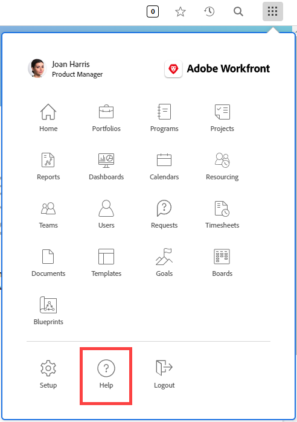

# Konfigurera en anpassad hjälp-URL

Om du skapar en anpassad intern hjälpwebbplats som innehåller information om hur din organisation använder Workfront kan du konfigurera hjälpikonen för huvudmenyn för att gå till den webbplatsen.

Detta påverkar inte huvudhjälplänken på huvudmenyn och de sammanhangsberoende hjälplänkarna i hela Workfront, som tar användare till Workfront hjälpwebbplats.

Information om hur användare kommer åt både en anpassad hjälp-URL som du konfigurerar i Workfront och den vanliga Workfront-hjälpwebbplatsen finns i [Få tillgång till Workfront-hjälpen i den nya Adobe Workfront-upplevelsen](/help/quicksilver/workfront-basics/navigate-workfront/workfront-navigation/access-workfront-help.md).

## Åtkomstkrav

Du måste ha följande åtkomst för att kunna utföra stegen i den här artikeln:

<table style="table-layout:auto"> 
 <col> 
 <col> 
 <tbody> 
  <tr> 
   <td role="rowheader">Adobe Workfront</td> 
   <td>Alla</td> 
  </tr> 
  <tr> 
   <td role="rowheader">Adobe Workfront-licens</td> 
   <td>Plan</td> 
  </tr> 
  <tr> 
   <td role="rowheader">Konfigurationer på åtkomstnivå</td> 
   <td> 
Du måste vara Workfront-administratör.
 
<b>Obs!</b> Om du fortfarande inte har åtkomst frågar du Workfront-administratören om de har angett ytterligare begränsningar för din åtkomstnivå. Mer information om hur en Workfront-administratör kan ändra åtkomstnivån finns i <a href="../../../administration-and-setup/add-users/configure-and-grant-access/create-modify-access-levels.md" class="MCXref xref">Skapa eller ändra anpassade åtkomstnivåer</a>.
 </td> 
  </tr> 
 </tbody> 
</table>

## Konfigurera en anpassad hjälp-URL

1. Klicka på ikonen Huvudmeny  i det övre högra hörnet av Adobe Workfront och klicka sedan på Konfigurera.
1. Klicka på **System** > **Inställningar**.
1. I avsnittet **Allmänna inställningar** skriver du den URL där din anpassade hjälpwebbplats finns i fältet **Anpassad hjälp-URL**.

   Om din anpassade hjälpplats kräver inloggningsuppgifter krävs dessa för användare när de kommer åt webbplatsen från Workfront. Autentiseringsuppgifterna till din anpassade hjälpwebbplats kan behöva hanteras separat från Workfront-autentiseringsuppgifterna om du inte använder enkel inloggning (SSO).

1. Klicka på **Spara**.
