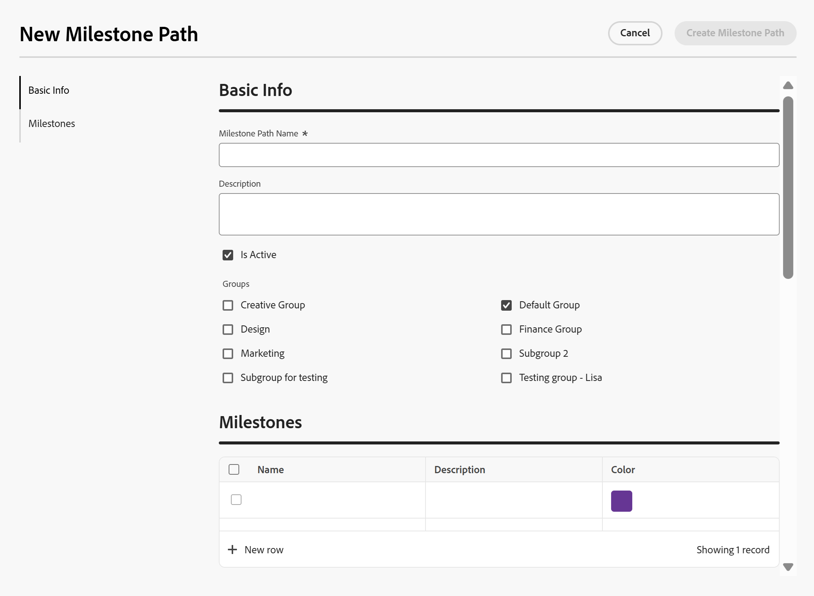

# Skapa en milstolpe-bana

<!--Audited: 07/2024-->

<!--
NOTE: DON'T DELETE, DRAFT OR HIDE THIS ARTICLE. IT IS LINKED TO THE PRODUCT, THROUGH THE CONTEXT SENSITIVE HELP LINKS.
-->

<!--The highlighted information on this page refers to functionality not yet generally available. It is available only in the Preview environment for all customers. After the monthly releases to Production, the same features are also available in the Production environment for customers who enabled fast releases.    

For information about fast releases, see [Enable or disable fast releases for your organization](/help/quicksilver/administration-and-setup/set-up-workfront/configure-system-defaults/enable-fast-release-process.md). -->

Den markerade informationen på den här sidan avser funktioner som ännu inte är allmänt tillgängliga. Det är bara tillgängligt i förhandsvisningsmiljön för alla kunder. Samma funktioner är också tillgängliga i produktionsmiljön för alla kunder från och med en vecka från förhandsversionen.

Mer information finns i [Modernisering av gränssnitt](/help/quicksilver/product-announcements/product-releases/interface-modernization/interface-modernization.md).

Som Adobe Workfront-administratör kan du skapa milstolpar som sedan kan användas i alla projekt i systemet. De ändringar du gör i milstolpbanorna i det här området påverkar hela Workfront-systemet.

## Åtkomstkrav

+++ Expandera om du vill visa åtkomstkrav för funktionerna i den här artikeln.

Du måste ha följande åtkomst för att kunna utföra stegen i den här artikeln:

<table style="table-layout:auto"> 
 <col> 
 <col> 
 <tbody> 
  <tr> 
   <td role="rowheader">Adobe Workfront</td> 
   <td>Alla</td> 
  </tr> 
  <tr> 
   <td role="rowheader">Adobe Workfront-licens</td> 
   <td>
Standard

   
Plan

   </td> 
  </tr> 
  <tr> 
   <td role="rowheader">Konfigurationer på åtkomstnivå</td> 
   <td> 
Du måste vara Workfront-administratör.
</td> 
  </tr> 
 </tbody> 
</table>

*Mer information finns i [Åtkomstkrav i Workfront-dokumentation](/help/quicksilver/administration-and-setup/add-users/access-levels-and-object-permissions/access-level-requirements-in-documentation.md).

+++

## Milstolpar och milstolpar

Du kan koppla nyckelåtgärderna i ett projekt till fördefinierade milstolpar. Den här funktionen kan ge chefer och andra intressenter en översikt över hur ett projekt fortskrider.

Summan av alla fördefinierade milstolpar kallas för en milstolpe-bana.

Det första steget i att bygga en milstolpe är att identifiera vilka milstolparna är och att fastställa milstolparna. Eftersom du kan koppla en milstolpe-väg till flera projekt måste milstolpen vara allmänna faser eller faser i alla projekt.

Mer information om hur du kan associera en milstolpe med ett projekt och en milstolpe med en aktivitet finns i [Associera milstolpar med aktiviteter](../../../manage-work/tasks/manage-tasks/associate-milestones-with-tasks.md).

## Skapa en milstolpe-bana

{{step-1-to-setup}}

1. Klicka på **Processer** > **Milstolpbanor**.
1. Klicka på **Ny milstolpe-sökväg.**

   

   Dialogrutan Ny milstolpe-bana öppnas.

   

   

1. Klicka på **Grundläggande information** i den vänstra panelen.

   Uppdatera följande information:

   <table style="table-layout:auto">
    <tr>
      <td>Sökväg för milstolpe</td>
       <td>Ange ett namn för milstolpebanan.</td>
    </tr>
    <tr>
      <td>Beskrivning</td>
      <td>Ange en beskrivning för att definiera milstolpebanan.</td>
    </tr>
    <tr>
       <td>Är aktiv</td>
      <td>Markera den här kryssrutan om du vill att milstolpen ska vara aktiv. Andra användare kan hitta den här sökvägen och bifoga den till projekt när de skapar eller redigerar projekt. Det går inte att koppla inaktiva milstolpesökvägar till projekt. Detta är aktiverat som standard.</td>
    </tr>
    <tr>
      <td>Grupper</td>
      <td>Markera de grupper som visas så att användare i de här grupperna kan se och använda den här milstolpen i sina projekt. Hemgruppen för den användare som anger milstolpen är markerad som standard.</td>
    </tr>
   </table>

1. Klicka på **Milstolpar** i den vänstra panelen.
1. I produktionsmiljön klickar du på **Lägg till milstolpe** för att lägga till milstolpar i sökvägen.
   Klicka på **Ny rad** i förhandsvisningsmiljön om du vill lägga till milstolpar i sökvägen.
1. Uppdatera följande information:

   <table style="table-layout:auto"> 
    <col> 
    <col> 
    <tbody> 
     <tr> 
      <td role="rowheader">Namn</td> 
      <td>Skriv beskrivande namn för varje milstolpe.</td> 
     </tr> 
     <tr> 
      <td role="rowheader">Beskrivning</td> 
      <td>Ange en beskrivning för milstolpen.</td> 
     </tr> 
     <tr> 
      <td role="rowheader">Färg</td> 
      <td> 
Välj en färg som du vill associera med din milstolpe. 
 
Om du inte väljer någon färg väljs den senaste färgen som användes i en milstolpe-bana. Vi rekommenderar att du väljer en unik färg för varje milstolpe. Färgen används för visuella ändamål och för rapportering.
 </td> 
     </tr> 
    </tbody> 
   </table>

1. (Valfritt) Dra och släpp varje milstolpe för att ordna om dem.
1. Klicka på **Skapa milstolpe-sökväg** om du vill spara ändringarna.

   Din milstolpe-väg är klar att kopplas till ett projekt.

   Mer information om hur du associerar milstolpar till projekt och milstolpar till aktiviteter finns i [Associera milstolpar med aktiviteter](../../../manage-work/tasks/manage-tasks/associate-milestones-with-tasks.md).

1. (Valfritt) Välj en milstolpe i listan Milstolpbanor och klicka sedan på ikonen **Redigera**  för att öppna milstolpbanan och redigera informationen.
1. (Valfritt) Klicka på ikonen **Exportera**  och välj sedan bland följande format för att exportera listan över milstolpbanor till en fil:

   * PDF
   * Excel
   * Excel (xlsx)
   * Tabbavgränsad

1. (Valfritt) Markera en eller flera milstolpar i listan med milstolpar och klicka sedan på ikonen **Ta bort**  för att ta bort den.
1. Klicka på **Ja, ta bort den**.

   Milstolpen tas bort och kan inte återställas. Milstolpbanan tas bort från alla projekt som tidigare associerats med den och alla milstolpar tas bort från de uppgifter som är associerade med dem.

   Borttagna milstolpar kan inte återställas.

## Visa information om milstolpens sökväg i en projektrapport

Du kan visa information om en milstolpe-sökväg i en projektrapport.

Du måste associera en milstolpe-sökväg med ett projekt innan du kan se informationen om projektet i en projektrapport.

Mer information om hur du associerar milstolpbanor till projekt finns i [Redigera projekt](/help/quicksilver/manage-work/projects/manage-projects/edit-projects.md).

{{step1-to-reports}}

1. Klicka på **Ny rapport** och sedan på **Projekt**.
1. Klicka på **Lägg till kolumn**.
1. I **Visa i den här kolumnen** börjar du skriva **Milstolpens sökväg** och klickar sedan på **Milstolpens sökvägsnamn** när den visas.
1. (Valfritt) Klicka på **Filter** och lägg till följande filter i rapporten: **Sökväg till projektmilstolpe är inte tom**.

   Filtret ser till att du bara visar projekt som är kopplade till en milstolpe-sökväg i rapporten.

1. Klicka på **Spara + Stäng**.
1. Lägg till ett namn för rapporten och klicka sedan på **Använd**.

   Projektrapporten visas. De milstolpesökvägar som är associerade med varje projekt visas i den sista kolumnen i rapporten.
1. Klicka på namnet på en milstolpe-sökväg i rapportens sista kolumn.

   Detaljerna för milstolpens bana visas.

   

   Sidan med information om milstolpens sökväg innehåller följande information:

   * Namn, ID och beskrivning för milstolpe-sökväg
   * Bangrupper för milstolpe
   * Ikoner för milstolpe, beskrivningar, färger och färger

1. (Valfritt) Klicka på **Tillbaka** om du vill gå tillbaka till projektrapporten.

