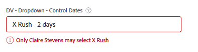
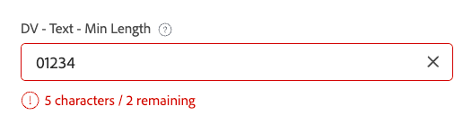

# Exempel på avancerad logik i anpassade formulär

Med logiska regler kan du anpassa fälten ytterligare i ett anpassat formulär.

I den här artikeln finns exempel på uttryck som används för att skapa avancerad logik för anpassade fält.

Mer information om hur du lägger till logik i ett anpassat formulär finns i [Lägga till logikregler i anpassade formulär och fält](/help/quicksilver/administration-and-setup/customize-workfront/create-manage-custom-forms/form-designer/design-a-form/display-skip-logic-form-designer.md).

## Åtkomstkrav

+++ Expandera om du vill visa åtkomstkrav för funktionerna i den här artikeln.

<table style="table-layout:auto"> 
 <col> 
 <col> 
 <tbody> 
  <tr> 
   <td>Adobe Workfront package</td> 
   <td><p>Alla</p></td> 
  </tr> 
  <tr> 
   <td>Adobe Workfront-licens</td> 
   <td><p>Standard</p>
       <p>Plan</p></td>
  </tr> 
  <tr> 
   <td>Konfigurationer på åtkomstnivå</td> 
   <td> <p>Administrativ åtkomst till anpassade formulär</p> </td> 
  </tr>  
 </tbody> 
</table>

Mer information finns i [Åtkomstkrav i Workfront-dokumentationen](/help/quicksilver/administration-and-setup/add-users/access-levels-and-object-permissions/access-level-requirements-in-documentation.md).

+++

## Exempel på valideringslogik

Valideringslogiken byggs med formler och du kan göra logiken så enkel eller komplex som du behöver. Valideringen kan baseras på värdena i andra fält eller objektens status, och du kan ange ett felmeddelande när valideringen misslyckas.

Om fältet med den logik som används uppfyller de definierade valideringsvillkoren när en användare fyller i det anpassade formuläret, markeras fältet och felmeddelandet visas.

Du kan använda valideringslogik för följande fälttyper: enkelradstext, stycke, envalslistruta, flervalslistruta, extern sökning, typsnitt, datum, kryssrutegrupp och alternativknappar.

### Tillåt endast projektägaren att välja &quot;Rush&quot; SLA

I det här exemplet har ett envalsfält alternativ för SLA Standard - 14 dagar, Prioritet - 7 dagar och Rush - 2 dagar.

Valideringsuttryck:

```
IF({ownerID}!=$$USER&&{DE:DV - Dropdown - Control Dates}="2",CONCAT("Only ",{owner}.{name}," may select X Rush"))
```

När någon som inte är projektägare (inklusive systemadministratören) försöker välja **X Rush** visas ett fel:



### Datumvalidering baserad på val i föregående fält

I SLA-exemplet kan du lägga till ett datumfält som valideras baserat på inställningarna från det föregående listrutan.

Valideringsuttryck:

```
IF({DE:DV - Date - Dropdown SLA}<ADDDAYS($$TODAY,{DE:DV - Dropdown - Control Dates}),CONCAT("Earliest: ",ADDDAYS($$TODAY,{DE:DV - Dropdown - Control Dates})))
```

Om användaren väljer ett datum som ligger före det tillåtna datumet visas det tidigaste datum som användaren kan välja:


### Minsta antal tecken med möjlighet att åsidosätta

I det här exemplet används ett minsta antal tecken i ett textfält med en teckensiffra. Dessutom har en separat kryssruta ställts in för att inaktivera valideringen för teckenantalet.

Valideringsuttryck:

```
IF({DE:DV - Override}!="Disable Validation"&&LEN({DE:DV - Text - Min Length})<"7",CONCAT(LEN({DE:DV - Text - Min Length})," characters / ",("7"-LEN({DE:DV - Text - Min Length}))," remaining"))
```

Du kan åsidosätta valideringen genom att markera kryssrutan:


Ett löpande teckenantal ingår i textfältet:



### Lås ett fält så att bara ägaren kan redigera det

I det här exemplet kan ett fält bara redigeras av projektägaren. Inte ens systemadministratören kan redigera fältet.

Valideringsuttryck:

```
IF({ownerID}!=$$USER,IF(ISBLANK({ownerID}),"Project Owner will provide this.",CONCAT("Only ",{owner}.{name}," can edit this.")))
```

Om en användare som inte är projektägare försöker skriva i fältet visas ett meddelande om att endast projektägaren kan redigera fältet.


### Typeahead tillåter eller avvisar värden baserade på andra fältvärden

I det här exemplet tillåter eller avvisar ett typsnittsfält dynamiskt värden baserat på det värde som anges i ett annat fält i formuläret.

Valideringsuttryck:

```
IF({DE:DV - Text - Budget}>"10000",
   IF({DE:DV - TA User - by Budget}.{role}!="Director","Requires Director Approver")
)
```

Om värdet i budgetfältet är större än $10 000 kan endast användare med en Director-roll väljas från typsnittet, även om inget rollfilter är aktiverat i typsnittskonfigurationen.


### Tillåt inte värden som är mindre än 10 dagar från registreringsdatumet

I det här exemplet tillåter valideringen endast värden som är 10 dagar från registreringsdatumet i framtiden. Alternativet att åsidosätta valideringen (i ett separat kryssrutefält) ingår också i formeln, tillsammans med att datumfältet får vara tomt.

Valideringsuttryck:

```
IF({DE:DV - Override}!="Disable Validation"&&ISBLANK({DE:DV - Date - Deadline})!="true"&&{DE:DV - Date - Deadline}<ADDDAYS({entryDate},"10"),CONCAT("Earliest: ",ADDDAYS({entryDate},"10")))
```

Värden som är mindre än 10 dagar från startdatumet utlöser validering:


Ett tomt värde utlöser inte valideringsmeddelandet:


### Tvinga exakta/minimi/maximala markeringar i ett flervalsfält

I det här exemplet kräver ett flervalsfält, t.ex. en kryssrutegrupp, att användaren väljer ett visst antal alternativ.

Valideringsuttryck (välj exakt två):

```
IF({DE:DV - Override}!="Disable Validation"&&ARRAYLENGTH(ARRAY({DE:DV - Checkbox - Pick exactly 2},","))!="2","Pick Exactly 2 Options")
```

Valideringsuttryck (välj minst två):

```
IF({DE:DV - Override}!="Disable Validation"&&ARRAYLENGTH(ARRAY({DE:DV - Checkbox - Pick at least 2},","))<"2","Pick at least 2 choices")
```

Valideringsuttryck (välj högst två):

```
IF({DE:DV - Override}!="Disable Validation"&&ARRAYLENGTH(ARRAY({DE:DV - Checkbox - Pick no more than 2},","))>"2","Pick no more than 2 choices")
```

Användaren ser valideringsfel om han/hon inte väljer rätt antal alternativ.


