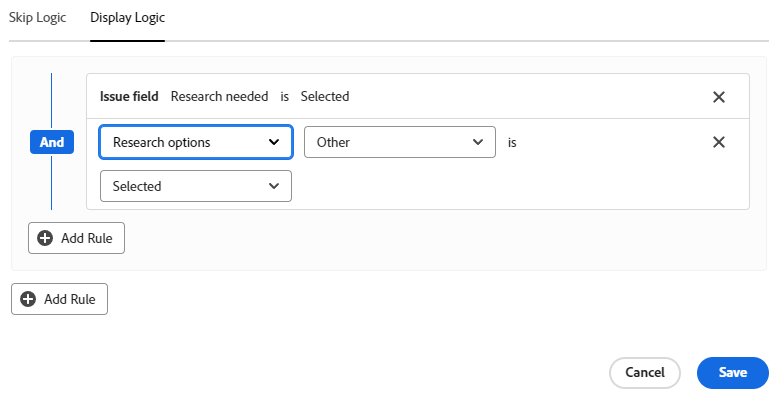

# Lägga till visningslogik och hoppa över logik i ett formulär

Du kan bestämma vilka avsnitt i ett anpassat formulär som ska visas eller hoppas över baserat på vad användaren gör när han eller hon fyller i det.

>[!NOTE]
>
>Logiken används bara i ett formulär och kan inte baseras på val från ett annat formulär.

## Åtkomstkrav

+++ Expandera om du vill visa åtkomstkrav för funktionerna i den här artikeln.

Du måste ha följande för att kunna utföra stegen i den här artikeln:

<table style="table-layout:auto"> 
 <col> 
 <col> 
 <tbody> 
  <tr data-mc-conditions=""> 
   <td role="rowheader">Adobe Workfront </td> 
   <td>Alla</td> 
  </tr> 
  <tr> 
   <td role="rowheader">Adobe Workfront-licens</td> 
   <td>
   
Nytt: Standard

   
eller

   
Aktuell: Planera
</td> 
  </tr> 
  <tr data-mc-conditions=""> 
   <td role="rowheader">Konfigurationer på åtkomstnivå</td> 
   <td>Administrativ åtkomst till anpassade formulär </td> 
  </tr>  
 </tbody> 
</table>

Mer information om informationen i den här tabellen finns i [Åtkomstkrav i Workfront-dokumentationen](/help/quicksilver/administration-and-setup/add-users/access-levels-and-object-permissions/access-level-requirements-in-documentation.md).

+++

## Visa och hoppa över logiska ikoner

Anpassade formulär visar ikoner som anger vilken logik som används i vissa fält. Ikoner i ett fält i formulärdesignern anger att logik används i fältet.

| Ikon | Placering i fält i formulärdesignern | Definition |
|--- |--- |--- |
|  | Nederst till vänster | Fältet är målfält för visningslogik. Om du har gjort en viss markering i formuläret visas det här fältet. |
|  | Nederst till höger | Fältet definierar visningslogik. Målfältet visas när du väljer eller anger ett värde i det här fältet. |
|  | Nederst till vänster | Fältet är målfält för hopplogik. Om formuläret är markerat hoppar formuläret framför det här fältet och fälten däremellan döljs. |
|  | Nederst till höger | Fältet definierar hopplogik. En specifik markering eller ett specifikt värde i det här fältet hoppar över andra fält och går direkt till målfältet. |

Välj ett fält med den logik som används för att visa de befintliga logikreglerna i fältinställningarna.

## Att tänka på när du använder visningslogik och hopplogik

* Om du vill lägga till visningslogik i ett anpassat fält, en widget eller en avsnittsbrytning måste minst ett flervalsfält (alternativknappar, listrutor eller kryssrutor) placeras före det i formuläret.
Mer information om anpassade fält och widgetar i anpassade formulär finns i [Skapa ett anpassat formulär](/help/quicksilver/administration-and-setup/customize-workfront/create-manage-custom-forms/form-designer/design-a-form/design-a-form.md).
* Du kan inte lägga till hopplogik i en widget eller avsnittsbrytning. Du kan bara lägga till den i ett flervalsfält (alternativknappar, listrutor eller kryssrutor).
* Du kan inte använda visnings- eller hopplogik för att visa eller dölja alternativen för ett fält med flera alternativ. Du kan t.ex. inte begränsa vilka alternativ som visas för en listruta, en kryssrutegrupp eller ett alternativknappsfält, baserat på det andra fältets visnings- eller hopplogik.
* Du kan lägga till både visningslogik och hopplogik i ett anpassat fält om allt av följande gäller för det anpassade fältet:

   * Det är ett flervalsfält (alternativknappar, listrutor eller kryssrutor)
   * Det föregås av ett flervalsfält
   * Därefter kommer ett annat anpassat fält

* När du kopierar formulär med visningslogik eller hopplogik kopieras logiken till det nya anpassade formuläret.
* När du redigerar flera objekt samtidigt visas alla anpassade fält i rutan Redigera objekt, inklusive de fält som hoppas över eller döljs.
* Tänk på följande när du skapar en visningslogikregel för ett anpassat formulär:

   * Anpassade fält som inte ingår i en programsats för visningslogik visas som standard i ett anpassat formulär.
   * Du kan skapa logiksatser för visning av flera fält.
   * Om alla fält under en avsnittsbrytning har visningslogik och alla är dolda som ett resultat av logiken, döljs hela avsnittet i det anpassade formuläret.

## Lägga till visningslogik i ett anpassat formulär

Visningslogik definierar vilka anpassade fält som visas i formuläret när användaren väljer ett specifikt värde i ett flervalsfält. Logiken läggs till i målfältet, som bara visas när värdet är markerat.

{{step-1-to-setup}}

1. Klicka på **Anpassad Forms**.
1. Skapa ett nytt anpassat formulär eller öppna ett befintligt formulär. Mer information finns i [Skapa ett anpassat formulär](/help/quicksilver/administration-and-setup/customize-workfront/create-manage-custom-forms/form-designer/design-a-form/design-a-form.md).
1. Lägg till fält i formuläret efter behov. Minst ett flervalsfält (alternativknapp, listruta eller kryssruta) måste placeras före målfältet som ska visas.
1. Markera målfältet och klicka på **Lägg till logik** längst ned till vänster på skärmen.
1. Välj fliken **Visningslogik**.
1. Klicka på **Lägg till visningsregel** i logikverktyget.

   

1. Följ stegen nedan i verktyget för att skapa logiksatsen.

   1. Det första alternativet är att välja definieringsfältet. Det här är fältet med det urvalsvärde som visar målet. Det måste vara ett flervalsfält.
   1. Det andra alternativet är att välja markeringsvärdet. Endast de värden som redan har definierats för det fältet är tillgängliga.
   1. Det tredje alternativet är **Markerat** eller **Inte markerat**. Om du väljer **Markerad** innebär det att målfältet visas när värdet är markerat. Om du väljer **Inte markerad** innebär det att målfältet visas när något annat värde är markerat i definieringsfältet.
   1. Om du vill lägga till en **And**-regel i logiksatsen klickar du på **Lägg till regel** direkt under den regel du just skapade. Följ samma instruktioner för att skapa regeln. Alla And-regler måste uppfyllas för att målfältet ska visas.

      

   1. Om du vill lägga till en **eller**-regel i logiksatsen klickar du på **Lägg till regel** i slutet av logikverktyget. Klicka sedan på **Lägg till regel** i Eller-området och följ samma instruktioner för att skapa regeln. När en eller-regel är uppfylld visas målfältet.

1. Klicka på **Spara** när du är klar med att skapa logiksatsen.

   Ikonerna för visningslogik läggs till i målfältet och i definitionsfältet i formulärdesignern.

## Lägga till hopplogik i ett anpassat formulär

Hopplogik definierar anpassade formulärfält som hoppas över när användaren väljer ett specifikt värde i ett flervalsfält. Överhoppade fält är dolda i formuläret. Logiken tillämpas på det definierande fältet där markeringen görs, inte på de fält som hoppas över.

{{step-1-to-setup}}

1. Klicka på **Anpassad Forms**.
1. Skapa ett nytt anpassat formulär eller öppna ett befintligt formulär. Mer information finns i [Skapa ett anpassat formulär](/help/quicksilver/administration-and-setup/customize-workfront/create-manage-custom-forms/form-designer/design-a-form/design-a-form.md).
1. Lägg till fält i formuläret efter behov. Det definierande fältet för hopplogik måste vara ett flervalsfält (alternativknapp, listruta eller kryssruta).
1. Markera definitionsfältet och klicka på **Lägg till logik** längst ned till vänster på skärmen.
1. Välj fliken **Hoppa över logik**.
1. Klicka på **Lägg till överhoppningsregel** i logikverktyget.

   

1. Följ stegen nedan i verktyget för att skapa logiksatsen.

   1. Definitionsfältet visas i byggaren. Det är fältet som du valde att tillämpa hopplogiken på.
   1. Det första alternativet är att välja markeringsvärdet. Endast de värden som redan definierats för fältet är tillgängliga.
   1. Det andra alternativet är **Markerat** eller **Inte markerat**. Om du väljer **Markerad** innebär det att när värdet är markerat visas målfältet och fälten däremellan hoppas över. Om du väljer **Inte markerad** innebär det att när något annat värde är markerat i definieringsfältet visas målfältet och fälten däremellan hoppas över.
   1. Det tredje alternativet är målfältet eller var du vill hoppa till. Välj ett fältnamn eller **Slut på formulär**. Du kan behöva klicka på ordet&quot;tom&quot; innan du väljer ett alternativ.

      

   1. Om du vill lägga till en **eller**-regel i logiksatsen klickar du på **Lägg till regel** i slutet av logikverktyget. Välj sedan de alternativ som följer samma anvisningar för att skapa regeln. När en **eller**-regel är uppfylld visas målfältet.

1. Klicka på **Spara** när du är klar med att skapa logiksatsen.

   Ikonerna för hopplogik läggs till i målfältet och definieringsfältet i formulärdesignern.

