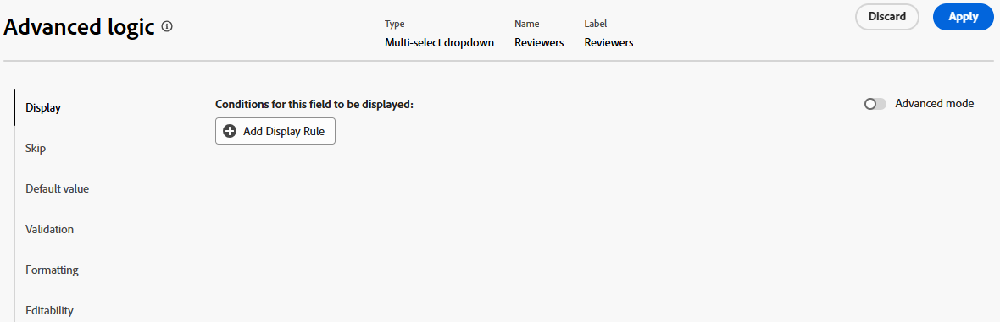
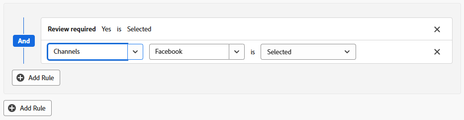
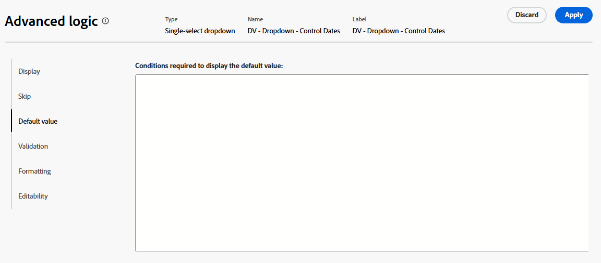
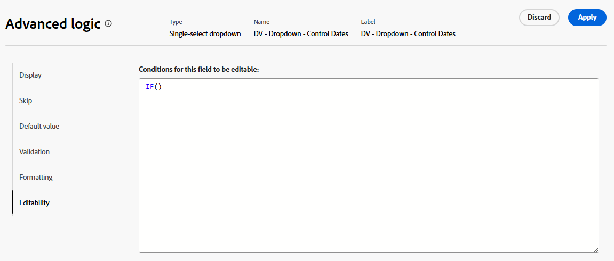

# Lägga till logiska regler i anpassade formulär och fält

Med logiska regler kan du anpassa fälten i formuläret ytterligare.

Du kan till exempel visa eller hoppa över fält eller avsnitt i ett anpassat formulär baserat på de val som en användare gör när han eller hon fyller i det.

>[!NOTE]
>
>Logiken används bara i ett formulär och kan inte baseras på val från ett annat formulär.

## Åtkomstkrav

+++ Expandera om du vill visa åtkomstkrav för funktionerna i den här artikeln.

<table style="table-layout:auto"> 
 <col> 
 <col> 
 <tbody> 
  <tr> 
   <td>Adobe Workfront package</td> 
   <td> <p>Om du vill använda avancerad visning, standardvärde, villkorsstyrd formatering eller redigeringslogik: Arbetsflöde Prime eller senare</p>
         <p>Så här använder du alla andra logiktyper: Alla Workfront- eller Workflow-paket</p> </td> 
  </tr> 
  <tr> 
   <td>Adobe Workfront-licens</td> 
   <td><p>Standard</p>
       <p>Plan</p></td>
  </tr> 
  <tr> 
   <td>Konfigurationer på åtkomstnivå</td> 
   <td> <p>Administrativ åtkomst till anpassade formulär</p> </td> 
  </tr>  
 </tbody> 
</table>

Mer information finns i [Åtkomstkrav i Workfront-dokumentationen](/help/quicksilver/administration-and-setup/add-users/access-levels-and-object-permissions/access-level-requirements-in-documentation.md).

+++

## Logikindikatorikoner

Anpassade formulär visar ikoner som anger när logik används i fälten.

Klicka på **Visa logik** i formulärdesignerns sidhuvud om du vill visa eller dölja ikonerna för de olika fältslogiktyperna.

| Ikon | Definition |
| --- | --- |
|  | Fältet är det målfält där visningslogiken används. Om du har gjort en viss markering i formuläret visas det här fältet. |
|  | Fältet är referensfältet för visningslogik. Målfältet visas när du väljer eller anger ett värde i det här fältet. |
|  | Fältet är målfältet där hopplogik används. Om du väljer eller anger ett värde i det här fältet hoppar du över andra fält och går direkt till referensfältet. |
|  | Fältet är referensfältet för hopplogik. Om du väljer ett specifikt fält i målfältet, hoppar formuläret framför det här fältet och fälten däremellan döljs. |
|  | Fältet är det målfält där valideringslogik används. Ett specifikt val eller värde i referensfältet avgör om valideringen misslyckas. Målfältet och referensfältet kan vara samma för valideringslogik. |
|  | Fältet är referensfältet för valideringslogik. Ett specifikt val eller värde i det här fältet avgör om valideringen misslyckas i målfältet. Målfältet och referensfältet kan vara samma för valideringslogik. |
|  | Fältet är det målfält där standardvärdelogik används. Ett specifikt val eller värde i referensfältet avgör standardvärdet. Målfältet och referensfältet kan vara samma för standardvärdeslogiken. |
|  | Fältet är referensfält för standardvärdeslogik. Ett specifikt val eller värde i det här fältet avgör standardvärdet i målfältet. Målfältet och referensfältet kan vara samma för standardvärdeslogiken. |
|  | Fältet är det målfält där formateringslogik används. Formateringen bestäms av en viss markering eller ett visst värde i referensfältet. Målfältet och referensfältet kan vara samma för formateringslogik. |
|  | Fältet är referensfältet för formateringslogik. Ett specifikt val eller värde i det här fältet avgör formateringen i målfältet. Målfältet och referensfältet kan vara samma för formateringslogik. |
|  | Fältet är målfältet där redigerbarhetslogik används. Fältet kan vara redigerbart eller skrivskyddat när de definierade villkoren uppfylls. Målfältet och referensfältet kan vara samma för redigeringslogik. |
|  | Fältet är referensfältet för redigeringslogik. När de definierade villkoren uppfylls i det här fältet används logiken i målfältet. Målfältet och referensfältet kan vara samma för redigeringslogik. |


Om du bara vill visa och hoppa över logik markerar du ett fält för att visa de befintliga logikreglerna i fältinställningarna.


## Att tänka på när du använder visningslogik och hopplogik

* Om du vill lägga till visningslogik i ett anpassat fält, en widget eller en avsnittsbrytning måste minst ett flervalsfält (alternativknappar, listrutor eller kryssrutor) placeras före det i formuläret.
Mer information om anpassade fält och widgetar i anpassade formulär finns i [Skapa ett anpassat formulär](/help/quicksilver/administration-and-setup/customize-workfront/create-manage-custom-forms/form-designer/design-a-form/design-a-form.md).
* Du kan inte lägga till hopplogik i en widget eller avsnittsbrytning. Du kan bara lägga till den i ett flervalsfält (alternativknappar, listrutor eller kryssrutor).
* Du kan inte använda visnings- eller hopplogik för att visa eller dölja alternativen för ett fält med flera alternativ. Du kan t.ex. inte begränsa vilka alternativ som visas för en listruta, en kryssrutegrupp eller ett alternativknappsfält, baserat på det andra fältets visnings- eller hopplogik.
* Du kan lägga till både visningslogik och hopplogik i ett anpassat fält om allt av följande gäller för det anpassade fältet:

   * Det är ett flervalsfält (alternativknappar, listrutor eller kryssrutor)
   * Det föregås av ett flervalsfält
   * Därefter kommer ett annat anpassat fält

* När du kopierar formulär med visningslogik eller hopplogik kopieras logiken till det nya anpassade formuläret.
* När du redigerar flera objekt samtidigt visas alla anpassade fält i rutan Redigera objekt, inklusive de fält som hoppas över eller döljs.
* Tänk på följande när du skapar en visningslogikregel för ett anpassat formulär:

   * Anpassade fält som inte ingår i en programsats för visningslogik visas som standard i ett anpassat formulär.
   * Du kan skapa logiksatser för visning av flera fält.
   * Om alla fält under en avsnittsbrytning har visningslogik och alla är dolda som ett resultat av logiken, döljs hela avsnittet i det anpassade formuläret.

## Lägga till visningslogik i ett anpassat formulär

Visningslogik definierar vilka anpassade fält som visas i formuläret när användaren väljer ett specifikt värde i ett flervalsfält. Logiken läggs till i målfältet, som bara visas när värdet är markerat.

>[!NOTE]
>
>Den här proceduren beskriver det grundläggande läget för visningslogik. Avancerad visningslogik finns också tillgänglig. Mer information finns i [Lägg till avancerad visningslogik i ett anpassat formulär](#add-advanced-display-logic-to-a-custom-form) i den här artikeln.

{{step-1-to-setup}}

1. Klicka på **Anpassad Forms**.
1. Skapa ett nytt anpassat formulär eller öppna ett befintligt formulär. Mer information finns i [Skapa ett anpassat formulär](/help/quicksilver/administration-and-setup/customize-workfront/create-manage-custom-forms/form-designer/design-a-form/design-a-form.md).
1. Lägg till fält i formuläret efter behov. Minst ett flervalsfält (alternativknapp, listruta eller kryssruta) måste placeras före målfältet som ska visas.
1. Markera målfältet och klicka på **Lägg till logik**.
1. Välj fliken **Visning** i logikverktyget.
1. Klicka på **Lägg till visningsregel**.

   

1. Följ stegen nedan för att skapa logiksatsen i verktyget.

   1. Det första alternativet är att välja definieringsfältet. Det här är fältet med det urvalsvärde som visar målet. Det måste vara ett flervalsfält.
   1. Det andra alternativet är att välja markeringsvärdet. Endast de värden som redan har definierats för det fältet är tillgängliga.
   1. Det tredje alternativet är **Markerat** eller **Inte markerat**. Om du väljer **Markerad** innebär det att målfältet visas när värdet är markerat. Om du väljer **Inte markerad** innebär det att målfältet visas när något annat värde är markerat i definieringsfältet.
   1. Om du vill lägga till en **And**-regel i logiksatsen klickar du på **Lägg till regel** direkt under den regel du just skapade. Följ samma instruktioner för att skapa regeln. Alla And-regler måste uppfyllas för att målfältet ska visas.

      

   1. Om du vill lägga till en **eller**-regel i logiksatsen klickar du på **Lägg till regel** i slutet av logikverktyget. Klicka sedan på **Lägg till regel** i Eller-området och följ samma instruktioner för att skapa regeln. När en eller-regel är uppfylld visas målfältet.

1. Klicka på **Använd** när du är klar med att skapa logiksatsen.

   Logiken används och logikonerna läggs till i målfältet och referensfältet i formulärdesignern.

## Lägga till avancerad visningslogik i ett anpassat formulär

Med den avancerade visningslogiken för anpassade formulärfält kan du skapa komplex logik med hjälp av formler. Du kan använda den här logiken för följande fälttyper: enkelradstext, stycke, text med formatering, listruta för ett val, flervalsmeny, extern sökning, flervalssökning, intern fältreferens, typsnitt, beräknat, datum, kryssrutegrupp och alternativknappar.

>[!NOTE]
>
>Den här proceduren beskriver det avancerade läget för visningslogik. Det finns även grundläggande visningslogik. Mer information finns i [Lägg till visningslogik i ett anpassat formulär](#add-display-logic-to-a-custom-form) i den här artikeln.

### Exempel

Du kan använda avancerad visningslogik för att styra synligheten för anpassade formuläravsnitt baserat på användarroller och synligheten för ett fält baserat på ett annat fälts status.

Ingen logik används för standardavsnittet i formuläret, så det är alltid synligt för alla användare.

Om du använder följande villkor visas avsnittet Resurser som krävs endast när en användare med jobbrollen Resurshanterare visar formuläret.

```IF($$USER.{roleID}="123abc", true)```

Observera att ```123abc``` representerar resurs-ID:t för resurshanteraren.


Samma villkor med ett annat roll-ID används i avsnittet KPI:er för projektfinansiering för att definiera att endast rollen Ekonomisk rådgivare kan visa avsnittet.

Med följande villkor blir fältet Sold KPI bara synligt när projektet är klart. Den här logiken används direkt i fältet i stället för i ett formuläravsnitt. Du behöver inte ange vilken roll som ska kunna visa fältet, eftersom det redan är definierat i det avsnitt där fältet finns.

```IF({status}="CPL", true)```


### Definiera avancerad visningslogik

{{step-1-to-setup}}

1. Klicka på **Anpassad Forms**.
1. Skapa ett nytt anpassat formulär eller öppna ett befintligt formulär. Mer information finns i [Skapa ett anpassat formulär](/help/quicksilver/administration-and-setup/customize-workfront/create-manage-custom-forms/form-designer/design-a-form/design-a-form.md).
1. Lägg till fält i formuläret efter behov.
1. Markera fältet som logiken ska användas i och klicka på **Lägg till logik**.
1. Välj fliken **Visning** i logikverktyget.
1. Aktivera **avancerat läge**.

   Det här alternativet kan aktiveras automatiskt för fälttyper som inte har stöd för det enkla läget för visningslogik.

   

1. Skapa visningsvillkoret i redigeraren.

   Mer information om beräkningar och uttryck finns i [Lägga till beräknade fält i ett formulär](/help/quicksilver/administration-and-setup/customize-workfront/create-manage-custom-forms/form-designer/design-a-form/add-a-calculated-field.md) och [Översikt över beräknade datauttryck](/help/quicksilver/reports-and-dashboards/reports/calc-cstm-data-reports/calculated-data-expressions.md).

1. Klicka på **Använd**.

   Logiken används och logikonerna läggs till i målfältet och referensfältet i formulärdesignern.

   >[!NOTE]
   >
   >Avancerad visningslogik stöds inte i formulärdesignerns förhandsgranskningsläge.

## Lägga till hopplogik i ett anpassat formulär

Hopplogik definierar anpassade formulärfält som hoppas över när användaren väljer ett specifikt värde i ett flervalsfält. Överhoppade fält är dolda i formuläret. Logiken tillämpas på det definierande fältet där markeringen görs, inte på de fält som hoppas över.

{{step-1-to-setup}}

1. Klicka på **Anpassad Forms**.
1. Skapa ett nytt anpassat formulär eller öppna ett befintligt formulär. Mer information finns i [Skapa ett anpassat formulär](/help/quicksilver/administration-and-setup/customize-workfront/create-manage-custom-forms/form-designer/design-a-form/design-a-form.md).
1. Lägg till fält i formuläret efter behov. Det definierande fältet för hopplogik måste vara ett flervalsfält (alternativknapp, listruta eller kryssruta).
1. Markera definitionsfältet och klicka på **Lägg till logik** längst ned till vänster på skärmen.
1. Välj fliken **Hoppa över** i logikverktyget.
1. Klicka på **Lägg till överhoppningsregel**.

   

1. Följ stegen nedan för att skapa logiksatsen i verktyget.

   1. Definitionsfältet visas i byggaren. Det är fältet som du valde att tillämpa hopplogiken på.
   1. Det första alternativet är att välja markeringsvärdet. Endast de värden som redan definierats för fältet är tillgängliga.
   1. Det andra alternativet är **Markerat** eller **Inte markerat**. Om du väljer **Markerad** innebär det att när värdet är markerat visas målfältet och fälten däremellan hoppas över. Om du väljer **Inte markerad** innebär det att när något annat värde är markerat i definieringsfältet visas målfältet och fälten däremellan hoppas över.
   1. Det tredje alternativet är målfältet eller var du vill hoppa till. Välj ett fältnamn eller **Slut på formulär**. Du kan behöva klicka på ordet&quot;tom&quot; innan du väljer ett alternativ.

      

   1. Om du vill lägga till en **eller**-regel i logiksatsen klickar du på **Lägg till regel** i slutet av logikverktyget. Välj sedan de alternativ som följer samma anvisningar för att skapa regeln. När en **eller**-regel är uppfylld visas målfältet.

1. Klicka på **Använd** när du är klar med att skapa logiksatsen.

   Logiken används och logikonerna läggs till i målfältet och referensfältet i formulärdesignern.

## Lägga till standardvärdeslogik i ett anpassat formulär

Med standardvärdeslogik kan du konfigurera standardvärden för anpassade formulärfält med hjälp av formler. Standardvärdet visas när de definierade villkoren uppfylls. Ett standardvärde kan vara ett statiskt värde eller ett dynamiskt värde som refererar till andra fält i objektet. Även om standardvärdet kan referera till andra fält, ändras det inte som andra fält i formulärändringen.

Du kan använda avancerad standardvärdelogik för följande fälttyper: enkelradig text, stycke, listruta för enstaka val, listruta för flera val, extern sökning, flervalssökning. intern fältreferens, typsnitt, kryssrutegrupp och alternativknappar.

>[!TIP]
>
>Ett standardvärde används bara en gång för ett anpassat fält när det anpassade formuläret kopplas till objektet. Om standardvärdeformeln är beroende av värdet i ett annat fält, måste värdet i det andra fältet redan finnas när det anpassade formuläret bifogas.

>[!NOTE]
>
>Standardlogiken för standardvärden i formulärdesignern finns fortfarande. Om båda typerna används i samma fält prioriteras den avancerade logiken. Mer information om standardvärdeslogik finns i [Lägga till alternativknappar, kryssrutegrupper och listrutor](/help/quicksilver/administration-and-setup/customize-workfront/create-manage-custom-forms/form-designer/design-a-form/design-a-form.md#add-radio-buttons-checkbox-groups-and-drop-downs) i [Skapa ett eget formulär](/help/quicksilver/administration-and-setup/customize-workfront/create-manage-custom-forms/form-designer/design-a-form/design-a-form.md).

### Exempel

Med hjälp av följande formel kommer det flervalsfält som logiken tillämpas på att hämta standardvärdet från projektbeskrivningen när projektstatusen är Planering.

```
IF({status} = 'PLN', ARRAY({description}, ','))
```

När det anpassade formuläret är kopplat till ett projekt och projektstatusen är Planering, används projektbeskrivningsfältets värde som standardvärde i fältet för flerval. Eftersom det är ett flervalsfält kan fler än ett värde hämtas när värdena matchar beskrivningen. Om beskrivningsvärdet inte matchar något av alternativen för flervalsvärden kommer flervalsfältet inte att ha något standardvärde och användaren kan välja ett värde i listrutan.

### Definiera standardvärdeslogik

1. Klicka på **Anpassad Forms**.
1. Skapa ett nytt anpassat formulär eller öppna ett befintligt formulär. Mer information finns i [Skapa ett anpassat formulär](/help/quicksilver/administration-and-setup/customize-workfront/create-manage-custom-forms/form-designer/design-a-form/design-a-form.md).
1. Lägg till fält i formuläret efter behov.
1. Markera fältet som logiken ska användas i och klicka på **Lägg till logik**.
1. Välj fliken **Standardvärde** i logikverktyget.

   

1. Bygg standardvärdevillkoret i redigeraren.

   Mer information om beräkningar och uttryck finns i [Lägga till beräknade fält i ett formulär](/help/quicksilver/administration-and-setup/customize-workfront/create-manage-custom-forms/form-designer/design-a-form/add-a-calculated-field.md) och [Översikt över beräknade datauttryck](/help/quicksilver/reports-and-dashboards/reports/calc-cstm-data-reports/calculated-data-expressions.md).

1. Klicka på **Använd**.

   Logiken används och logikonerna läggs till i målfältet och referensfältet i formulärdesignern.

   >[!NOTE]
   >
   >Standardvärdelogik stöds inte i förhandsgranskningsläget för formulärdesignern.

## Lägga till valideringslogik i ett anpassat formulär

Valideringslogiken byggs med formler och du kan göra logiken så enkel eller komplex som du behöver. Valideringen kan baseras på värdena i andra fält eller objektens status, och du kan ange ett felmeddelande när valideringen misslyckas.

Om fältet med den logik som används uppfyller de definierade valideringsvillkoren när en användare fyller i det anpassade formuläret, markeras fältet och felmeddelandet visas.

Du kan använda valideringslogik för följande fälttyper: enkelradstext, stycke, listruta med ett val, listruta med flera val, extern sökning, flervalsfunktion för extern sökning, typsnitt, datum, kryssrutegrupp och alternativknappar.

### Exempel

Med hjälp av följande villkor visar budgetfältet ett meddelande under fältet när användaren anger ett värde som utlöser meddelandet. Om det angivna värdet till exempel är negativt visas det första meddelandet. Om användaren försöker ändra projektstatus till Aktuell innan ett budgetvärde anges, visas det andra meddelandet.

```
IF({DE:Budget Field} < 0,
     "Budget cannot be negative",
     IF({DE:Budget Field} == 0 && {status} == "CUR", "Budget must be specified before moving to Current status")
)
```

Ett annat enkelt exempel är att ett telefonnummerfält måste innehålla ett visst antal siffror för att vara giltigt.

Ett ytterligare exempel för validering baserad på andra fält är ett fält för mötesrumsstorlek (liten, mellanstor eller stor) och ett separat fält för antalet mötesdeltagare. Antalet personer för varje rumsstorlek skrivs i valideringsformeln. Om antalet deltagare som användaren anger är för många för det valda mötesrummet visas felmeddelandet.

Fler exempel på valideringslogik finns i [Exempel på avancerad logik i anpassade formulär](/help/quicksilver/administration-and-setup/customize-workfront/create-manage-custom-forms/form-designer/design-a-form/advanced-logic-examples.md).

### Definiera valideringslogik

{{step-1-to-setup}}

1. Klicka på **Anpassad Forms**.
1. Skapa ett nytt anpassat formulär eller öppna ett befintligt formulär. Mer information finns i [Skapa ett anpassat formulär](/help/quicksilver/administration-and-setup/customize-workfront/create-manage-custom-forms/form-designer/design-a-form/design-a-form.md).
1. Lägg till fält i formuläret efter behov.
1. Markera fältet som logiken ska användas i och klicka på **Lägg till logik**.
1. Välj fliken **Validering** i logikverktyget.

   

1. Bygg valideringsvillkoret i redigeraren, inklusive felmeddelandet som visas när valideringen inte uppfylls.

   Mer information om beräkningar och uttryck finns i [Lägga till beräknade fält i ett formulär](/help/quicksilver/administration-and-setup/customize-workfront/create-manage-custom-forms/form-designer/design-a-form/add-a-calculated-field.md) och [Översikt över beräknade datauttryck](/help/quicksilver/reports-and-dashboards/reports/calc-cstm-data-reports/calculated-data-expressions.md).

1. Klicka på **Använd**.

   Logiken används och logikonerna läggs till i målfältet och referensfältet i formulärdesignern.

   >[!NOTE]
   >
   >Valideringslogik stöds inte i förhandsgranskningsläget för formulärdesignern.

## Lägga till formateringslogik i ett anpassat formulär

Formateringslogiken markerar ett fältvärde när det uppfyller de definierade villkoren. Den använda formateringen fungerar för flera fält samtidigt.

Du kan använda formateringslogik för följande fälttyper: enkelradstext, stycke, listruta för enstaka val, flervalslistruta, extern sökning, flervalsfunktion för extern sökning, typsnitt, beräknat, datum, kryssrutegrupp och alternativknappar.

Formatering som används i anpassade formulär är skilt från formatering som används i listor och rapporter. Mer information om rapportformatering finns i [Använda villkorsstyrd formatering i vyer](/help/quicksilver/reports-and-dashboards/reports/reporting-elements/use-conditional-formatting-views.md).

### Exempel

Med följande villkor visas budgetfältet rött när användaren anger ett värde på 1 000 eller mer. Fältet visas gult när användaren anger ett värde på minst 500.

Om du vill lägga till en hovringsdefinition av formateringen använder du fältet Instruktioner i det anpassade formuläret. Ett meddelande i budgetfältet kan t.ex. innehålla texten&quot;Ange en budget inom ett rimligt intervall&quot;. Värden över 500 är ett varningsmeddelande och över 1 000 anses vara för höga.&quot;

```
IF(
     {DE:Budget Field} >=1000,
     FORMAT($$NEGATIVE),
     IF({DE:Budget Field} >= 500, FORMAT($$NOTICE))
)
```

### Definiera formateringslogik

{{step-1-to-setup}}

1. Klicka på **Anpassad Forms**.
1. Skapa ett nytt anpassat formulär eller öppna ett befintligt formulär. Mer information finns i [Skapa ett anpassat formulär](/help/quicksilver/administration-and-setup/customize-workfront/create-manage-custom-forms/form-designer/design-a-form/design-a-form.md).
1. Lägg till fält i formuläret efter behov.
1. Markera fältet som logiken ska användas i och klicka på **Lägg till logik**.
1. Välj fliken **Formatering** i logikverktyget.

   

1. Skapa formateringsvillkoret i redigeraren.

   Du kan lägga till upp till fem formateringsregler per fält.

   Färgalternativen för markering av fält är:

   * `$$POSITIVE (green)`
   * `$$INFORMATIVE (blue)`
   * `$$NEGATIVE (red)`
   * `$$NOTICE (orange)`

   Textformateringsalternativen är:

   * `$$BOLD`
   * `$$ITALIC`
   * `$$UNDERLINE`

   Endast ett färgalternativ kan användas per funktion, tillsammans med upp till tre ytterligare textformateringsalternativ. Om inget färgalternativ anges används systemets standardfärg.

   Mer information om beräkningar och uttryck finns i [Lägga till beräknade fält i ett formulär](/help/quicksilver/administration-and-setup/customize-workfront/create-manage-custom-forms/form-designer/design-a-form/add-a-calculated-field.md) och [Översikt över beräknade datauttryck](/help/quicksilver/reports-and-dashboards/reports/calc-cstm-data-reports/calculated-data-expressions.md).

1. Klicka på **Använd**.

   Logiken används och logikonerna läggs till i målfältet och referensfältet i formulärdesignern.

   >[!NOTE]
   >
   >Formateringslogik stöds inte i formulärdesignerns förhandsgranskningsläge.

## Lägg till redigeringslogik i ett anpassat formulär

Ändringslogik avgör om ett anpassat formulärfält kan redigeras eller om det är skrivskyddat. Den här logiken skapas med formler, och när fältet uppfyller de definierade villkoren kan det anges som redigerbart eller skrivskyddat.

Du kan använda redigeringslogik för följande fälttyper: enkelradstext, stycke, text med formatering, listruta för enstaka val, flervalsmeny, extern sökning, flervalssökning, typsnitt, datum, kryssrutegrupp och alternativknappar.

### Exempel

Med följande formel kan fältet med tillämpad logik bara redigeras när ett annat fält som kallas Radio har markerat alternativet Aktiverad.

```
IF({DE:Radio} = "Enabled", true)
```

Om du använder följande formel går det bara att redigera beskrivningsfältet när det är tomt. När ett värde har angetts blir det skrivskyddat.

```
IF(ISBLANK({DE:Description}), true)
```

Med följande formel kan fältet med tillämpad logik bara redigeras när en användare med jobbrollen Resurshanterare visar formuläret.

```
IF($$USER.{role}.{name}="Resource Manager", true)
```

### Definiera redigeringslogik

{{step-1-to-setup}}

1. Klicka på **Anpassad Forms**.
1. Skapa ett nytt anpassat formulär eller öppna ett befintligt formulär. Mer information finns i [Skapa ett anpassat formulär](/help/quicksilver/administration-and-setup/customize-workfront/create-manage-custom-forms/form-designer/design-a-form/design-a-form.md).
1. Lägg till fält i formuläret efter behov.
1. Markera fältet som logiken ska användas i och klicka på **Lägg till logik**.
1. Välj fliken **Redigerbarhet** i logikverktyget.

   

1. Bygg redigeringsvillkoret i redigeraren.

   Mer information om beräkningar och uttryck finns i [Lägga till beräknade fält i ett formulär](/help/quicksilver/administration-and-setup/customize-workfront/create-manage-custom-forms/form-designer/design-a-form/add-a-calculated-field.md) och [Översikt över beräknade datauttryck](/help/quicksilver/reports-and-dashboards/reports/calc-cstm-data-reports/calculated-data-expressions.md).

1. Klicka på **Använd**.

   Logiken används och logikonerna läggs till i målfältet och referensfältet i formulärdesignern.

   >[!NOTE]
   >
   >Ändringslogik stöds inte i förhandsgranskningsläget för formulärdesignern.
