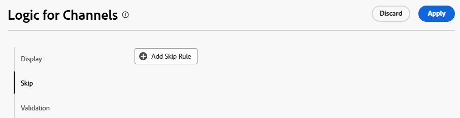
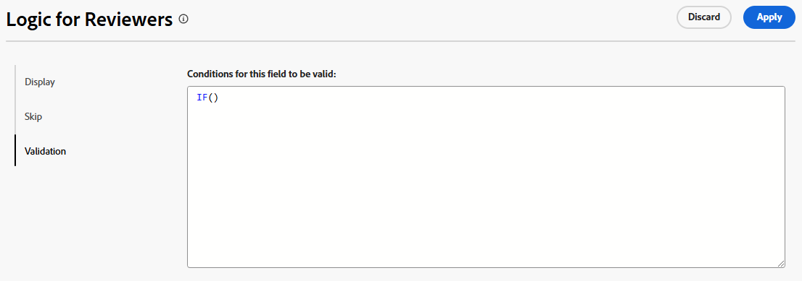

# Lägga till logiska regler i anpassade formulär och fält

{{highlighted-preview}}

Med logiska regler kan du anpassa fälten i formuläret ytterligare.

Du kan till exempel visa eller hoppa över fält eller avsnitt i ett anpassat formulär baserat på de val som en användare gör när han eller hon fyller i det.

>[!NOTE]
>
>Logiken används bara i ett formulär och kan inte baseras på val från ett annat formulär.

## Åtkomstkrav

+++ Expandera om du vill visa åtkomstkrav för funktionerna i den här artikeln.

Du måste ha följande åtkomst för att kunna utföra stegen i den här artikeln:

<table style="table-layout:auto"> 
 <col> 
 <col> 
 <tbody> 
  <tr data-mc-conditions=""> 
   <td role="rowheader">Adobe Workfront </td> 
   <td>Alla</td> 
  </tr> 
  <tr> 
   <td role="rowheader">Adobe Workfront-licens</td> 
   <td>
   <p>Nytt: Standard</p>
   <p>eller</p>
   <p>Aktuell: Planera</p></td> 
  </tr> 
  <tr data-mc-conditions=""> 
   <td role="rowheader">Konfigurationer på åtkomstnivå</td> 
   <td>Administrativ åtkomst till anpassade formulär </td> 
  </tr>  
 </tbody> 
</table>

Mer information om informationen i den här tabellen finns i [Åtkomstkrav i Workfront-dokumentationen](/help/quicksilver/administration-and-setup/add-users/access-levels-and-object-permissions/access-level-requirements-in-documentation.md).

+++

## Visa och hoppa över logiska ikoner

Anpassade formulär visar ikoner som anger när visnings- eller hopplogik används i vissa fält. Ikoner i ett fält i formulärdesignern anger att logik används i fältet.

| Ikon | Placering i fält i formulärdesignern | Definition |
|--- |--- |--- |
|  | Nederst till vänster | Fältet är målfält för visningslogik. Om du har gjort en viss markering i formuläret visas det här fältet. |
|  | Nederst till höger | Fältet definierar visningslogik. Målfältet visas när du väljer eller anger ett värde i det här fältet. |
|  | Nederst till vänster | Fältet är målfält för hopplogik. Om formuläret är markerat hoppar formuläret framför det här fältet och fälten däremellan döljs. |
|  | Nederst till höger | Fältet definierar hopplogik. En specifik markering eller ett specifikt värde i det här fältet hoppar över andra fält och går direkt till målfältet. |


Välj ett fält med den logik som används för att visa de befintliga logikreglerna i fältinställningarna.


## Att tänka på när du använder visningslogik och hopplogik

* Om du vill lägga till visningslogik i ett anpassat fält, en widget eller en avsnittsbrytning måste minst ett flervalsfält (alternativknappar, listrutor eller kryssrutor) placeras före det i formuläret.
Mer information om anpassade fält och widgetar i anpassade formulär finns i [Skapa ett anpassat formulär](/help/quicksilver/administration-and-setup/customize-workfront/create-manage-custom-forms/form-designer/design-a-form/design-a-form.md).
* Du kan inte lägga till hopplogik i en widget eller avsnittsbrytning. Du kan bara lägga till den i ett flervalsfält (alternativknappar, listrutor eller kryssrutor).
* Du kan inte använda visnings- eller hopplogik för att visa eller dölja alternativen för ett fält med flera alternativ. Du kan t.ex. inte begränsa vilka alternativ som visas för en listruta, en kryssrutegrupp eller ett alternativknappsfält, baserat på det andra fältets visnings- eller hopplogik.
* Du kan lägga till både visningslogik och hopplogik i ett anpassat fält om allt av följande gäller för det anpassade fältet:

   * Det är ett flervalsfält (alternativknappar, listrutor eller kryssrutor)
   * Det föregås av ett flervalsfält
   * Därefter kommer ett annat anpassat fält

* När du kopierar formulär med visningslogik eller hopplogik kopieras logiken till det nya anpassade formuläret.
* När du redigerar flera objekt samtidigt visas alla anpassade fält i rutan Redigera objekt, inklusive de fält som hoppas över eller döljs.
* Tänk på följande när du skapar en visningslogikregel för ett anpassat formulär:

   * Anpassade fält som inte ingår i en programsats för visningslogik visas som standard i ett anpassat formulär.
   * Du kan skapa logiksatser för visning av flera fält.
   * Om alla fält under en avsnittsbrytning har visningslogik och alla är dolda som ett resultat av logiken, döljs hela avsnittet i det anpassade formuläret.

## Lägga till visningslogik i ett anpassat formulär

Visningslogik definierar vilka anpassade fält som visas i formuläret när användaren väljer ett specifikt värde i ett flervalsfält. Logiken läggs till i målfältet, som bara visas när värdet är markerat.

<!--
>[!NOTE]
>
><span class="preview">This procedure describes the basic mode for display logic. Advanced display logic is also available. For more information, see [Add advanced display logic to a custom form](#add-advanced-display-logic-to-a-custom-form), in this article.</span>
-->

{{step-1-to-setup}}

1. Klicka på **Anpassad Forms**.
1. Skapa ett nytt anpassat formulär eller öppna ett befintligt formulär. Mer information finns i [Skapa ett anpassat formulär](/help/quicksilver/administration-and-setup/customize-workfront/create-manage-custom-forms/form-designer/design-a-form/design-a-form.md).
1. Lägg till fält i formuläret efter behov. Minst ett flervalsfält (alternativknapp, listruta eller kryssruta) måste placeras före målfältet som ska visas.
1. Markera målfältet och klicka på **Lägg till logik**.
1. Välj fliken **Visning** i logikverktyget.
1. Klicka på **Lägg till visningsregel**.

   <span class="preview">Exempelbild i förhandsvisningsmiljön:</span>

   

   Exempelbild i produktionsmiljön:

   

1. Följ stegen nedan för att skapa logiksatsen i verktyget.

   1. Det första alternativet är att välja definieringsfältet. Det här är fältet med det urvalsvärde som visar målet. Det måste vara ett flervalsfält.
   1. Det andra alternativet är att välja markeringsvärdet. Endast de värden som redan har definierats för det fältet är tillgängliga.
   1. Det tredje alternativet är **Markerat** eller **Inte markerat**. Om du väljer **Markerad** innebär det att målfältet visas när värdet är markerat. Om du väljer **Inte markerad** innebär det att målfältet visas när något annat värde är markerat i definieringsfältet.
   1. Om du vill lägga till en **And**-regel i logiksatsen klickar du på **Lägg till regel** direkt under den regel du just skapade. Följ samma instruktioner för att skapa regeln. Alla And-regler måste uppfyllas för att målfältet ska visas.

      <span class="preview">Exempelbild i förhandsvisningsmiljön:</span>

      

      Exempelbild i produktionsmiljön:

      

   1. Om du vill lägga till en **eller**-regel i logiksatsen klickar du på **Lägg till regel** i slutet av logikverktyget. Klicka sedan på **Lägg till regel** i Eller-området och följ samma instruktioner för att skapa regeln. När en eller-regel är uppfylld visas målfältet.

1. Klicka på **Spara** <span class="preview"> eller **Använd**</span> när du är klar med att skapa logiksatsen.

   Ikonerna för visningslogik läggs till i målfältet och i definitionsfältet i formulärdesignern.

<!--
<div class="preview">

## Add advanced display logic to a custom form

The advanced display logic for custom form fields allows you to build complex logic using formulas. You can apply this logic to the following field types: drop-down, radio button, checkbox, typeahead, single line text, paragraph text, date field, text with formatting, and calculated fields.

### Examples

You can use advanced display logic to control the visibility of custom form sections based on user roles and the visibility of a field based on another field's status.

No logic is applied to the default section on the form, so it is always visible to all users.

Using the following condition, the Resources Required section is only displayed when a user with the job role of Resource Manager views the form.

```IF($$USER.{roleID}="123abc", true)```

Note that ```123abc``` represents the role ID of the Resource Manager.


The same condition with a different role ID is applied to the Project Financial KPIs section to define that  only the Financial Advisor role can view the section.

Using the following condition, the Sold KPI field only becomes visible when the project is complete. This logic is applied directly to the field instead of to a form section. There is no need to specify which role can view the field, because that is already defined in the section that the field is in.

```IF({status}="CPL", true)```


### Define advanced display logic

{{step-1-to-setup}}

1. Click **Custom Forms**.
1. Create a new custom form or open an existing form. See [Create a custom form](/help/quicksilver/administration-and-setup/customize-workfront/create-manage-custom-forms/form-designer/design-a-form/design-a-form.md) for details.
1. Add fields to the form as needed.
1. Select the field to apply logic to, and click **Add Logic**.
1. Select the **Display** tab on the logic builder.
1. Turn on **Advanced mode**.
   
   This option might be turned on automatically, for fields that do not support the simple mode of display logic.

   

1. Build the display condition in the editor.

   For more information about calculations and expressions, see [Add calculated fields to a form](/help/quicksilver/administration-and-setup/customize-workfront/create-manage-custom-forms/form-designer/design-a-form/add-a-calculated-field.md) and [Overview of calculated data expressions](/help/quicksilver/reports-and-dashboards/reports/calc-cstm-data-reports/calculated-data-expressions.md).

1. Click **Apply**.
   
   The logic is applied to the field and the display logic icon is added in the form designer.

</div>
-->

## Lägga till hopplogik i ett anpassat formulär

Hopplogik definierar anpassade formulärfält som hoppas över när användaren väljer ett specifikt värde i ett flervalsfält. Överhoppade fält är dolda i formuläret. Logiken tillämpas på det definierande fältet där markeringen görs, inte på de fält som hoppas över.

{{step-1-to-setup}}

1. Klicka på **Anpassad Forms**.
1. Skapa ett nytt anpassat formulär eller öppna ett befintligt formulär. Mer information finns i [Skapa ett anpassat formulär](/help/quicksilver/administration-and-setup/customize-workfront/create-manage-custom-forms/form-designer/design-a-form/design-a-form.md).
1. Lägg till fält i formuläret efter behov. Det definierande fältet för hopplogik måste vara ett flervalsfält (alternativknapp, listruta eller kryssruta).
1. Markera definitionsfältet och klicka på **Lägg till logik** längst ned till vänster på skärmen.
1. Välj fliken **Hoppa över** i logikverktyget.
1. Klicka på **Lägg till överhoppningsregel**.


   <span class="preview">Exempelbild i förhandsvisningsmiljön:</span>

   

   Exempelbild i produktionsmiljön:

   

1. Följ stegen nedan för att skapa logiksatsen i verktyget.

   1. Definitionsfältet visas i byggaren. Det är fältet som du valde att tillämpa hopplogiken på.
   1. Det första alternativet är att välja markeringsvärdet. Endast de värden som redan definierats för fältet är tillgängliga.
   1. Det andra alternativet är **Markerat** eller **Inte markerat**. Om du väljer **Markerad** innebär det att när värdet är markerat visas målfältet och fälten däremellan hoppas över. Om du väljer **Inte markerad** innebär det att när något annat värde är markerat i definieringsfältet visas målfältet och fälten däremellan hoppas över.
   1. Det tredje alternativet är målfältet eller var du vill hoppa till. Välj ett fältnamn eller **Slut på formulär**. Du kan behöva klicka på ordet&quot;tom&quot; innan du väljer ett alternativ.

      <span class="preview">Exempelbild i förhandsvisningsmiljön:</span>

      

      Exempelbild i produktionsmiljön:

      

   1. Om du vill lägga till en **eller**-regel i logiksatsen klickar du på **Lägg till regel** i slutet av logikverktyget. Välj sedan de alternativ som följer samma anvisningar för att skapa regeln. När en **eller**-regel är uppfylld visas målfältet.

1. Klicka på **Spara** <span class="preview"> eller **Använd**</span> när du är klar med att skapa logiksatsen.

   Ikonerna för hopplogik läggs till i målfältet och definieringsfältet i formulärdesignern.

<div class="preview">

## Lägga till valideringslogik i ett anpassat formulär

Valideringslogiken byggs med formler och du kan göra logiken så enkel eller komplex som du behöver. Valideringen kan baseras på värdena i andra fält eller objektens status, och du kan ange ett felmeddelande när valideringen misslyckas.

Om fältet med den logik som används uppfyller de definierade valideringsvillkoren när en användare fyller i det anpassade formuläret, markeras fältet och felmeddelandet visas.

Du kan använda valideringslogik för följande fälttyper: nedrullningsbar text, alternativknapp, kryssruta, skrivhuvud, enkelradstext, stycketext, datumfält, text med formatering och beräknade fält.

### Exempel

Med hjälp av följande villkor visar budgetfältet ett meddelande under fältet när användaren anger ett värde som utlöser meddelandet. Om det angivna värdet till exempel är negativt visas det första meddelandet. Om användaren försöker ändra projektstatus till Aktuell innan ett budgetvärde anges, visas det andra meddelandet.

```
IF({DE:Budget Field} < 0,
     "Budget cannot be negative",
     IF({DE:Budget Field} == 0 && {status} == "CUR", "Budget must be specified before moving to Current status")
)
```

Ett annat enkelt exempel är att ett telefonnummerfält måste innehålla ett visst antal siffror för att vara giltigt.

Ett ytterligare exempel för validering baserad på andra fält är ett fält för mötesrumsstorlek (liten, mellanstor eller stor) och ett separat fält för antalet mötesdeltagare. Antalet personer för varje rumsstorlek skrivs i valideringsformeln. Om antalet deltagare som användaren anger är för många för det valda mötesrummet visas felmeddelandet.

### Definiera valideringslogik

{{step-1-to-setup}}

1. Klicka på **Anpassad Forms**.
1. Skapa ett nytt anpassat formulär eller öppna ett befintligt formulär. Mer information finns i [Skapa ett anpassat formulär](/help/quicksilver/administration-and-setup/customize-workfront/create-manage-custom-forms/form-designer/design-a-form/design-a-form.md).
1. Lägg till fält i formuläret efter behov.
1. Markera fältet som logiken ska användas i och klicka på **Lägg till logik**.
1. Välj fliken **Validering** i logikverktyget.

   

1. Bygg valideringsvillkoret i redigeraren, inklusive felmeddelandet som visas när valideringen inte uppfylls.

   Mer information om beräkningar och uttryck finns i [Lägga till beräknade fält i ett formulär](/help/quicksilver/administration-and-setup/customize-workfront/create-manage-custom-forms/form-designer/design-a-form/add-a-calculated-field.md) och [Översikt över beräknade datauttryck](/help/quicksilver/reports-and-dashboards/reports/calc-cstm-data-reports/calculated-data-expressions.md).

1. Klicka på **Använd**.

   Logiken tillämpas på fältet i formulärdesignern.

</div>

<!--
<div class="preview">

## Add formatting logic to a custom form

Formatting logic highlights a field value when it meets the defined conditions. You can apply formatting logic to all field types, and it will work on multiple fields at once.

Formatting applied to custom forms is separate from formatting applied to lists and reports. For information on report formatting, see [Use conditional formatting in views](/help/quicksilver/reports-and-dashboards/reports/reporting-elements/use-conditional-formatting-views.md).

### Example

Using the following condition, the Budget field appears red when the user enters a value of 1000 or more. The field appears yellow when the user enters a value of 500 or more.

To add a hover-over definition of the formatting, use the Instructions field in the custom form. For example, a message on the Budget field could say "Please enter a budget within a reasonable range. Values over 500 are a warning notice, and above 1000 is considered too high."

```
IF(
     {DE:Budget Field} >=1000,
     FORMAT($$NEGATIVE),
     IF({DE:Budget Field} >= 500, FORMAT($$NOTICE))
)
```

### Define formatting logic

{{step-1-to-setup}}

1. Click **Custom Forms**.
1. Create a new custom form or open an existing form. See [Create a custom form](/help/quicksilver/administration-and-setup/customize-workfront/create-manage-custom-forms/form-designer/design-a-form/design-a-form.md) for details.
1. Add fields to the form as needed.
1. Select the field to apply logic to, and click **Add Logic**.
1. Select the **Formatting** tab on the logic builder.

   

1. Build the formatting condition in the editor.

   You can add up to five formatting rules per field.

   The field highlighting color options are:

   * `$$POSITIVE (green)`
   * `$$INFORMATIVE (blue)`
   * `$$NEGATIVE (red)`
   * `$$NOTICE (orange)`
   
   The text formatting options are:
   
   * `$$BOLD`
   * `$$ITALIC`
   * `$$UNDERLINE`

   Only one color option may be used per function, along with up to three additional text formatting options. If no color option is specified, the system's default color is applied.

   For more information about calculations and expressions, see [Add calculated fields to a form](/help/quicksilver/administration-and-setup/customize-workfront/create-manage-custom-forms/form-designer/design-a-form/add-a-calculated-field.md) and [Overview of calculated data expressions](/help/quicksilver/reports-and-dashboards/reports/calc-cstm-data-reports/calculated-data-expressions.md).

1. Click **Apply**.
   
   The logic is applied to the field in the form designer.

</div>
-->
