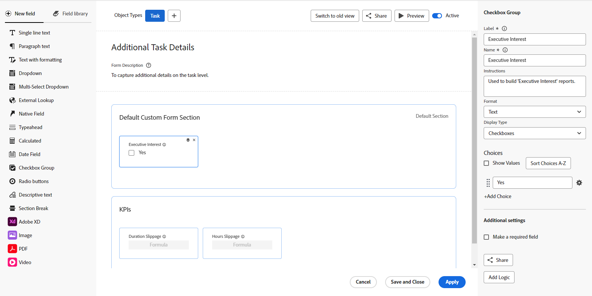

# Översikt över formulärdesignern

Du kan använda den nya formulärdesignern för att utforma ett anpassat formulär som användare kan koppla till ett Workfront-objekt. Användare som arbetar med objektet kan fylla i det anpassade formuläret för att ge information om objektet.

Den nya formulärdesignern har en ny arbetsyteliknande arbetsyta som gör att du kan visa fälten, arbetsytan och fältinställningarna samtidigt. Du kan också dra och släppa fält i avsnitten när du utformar formuläret.

## Hur man kommer åt den nya formulärdesignern

Det finns en ny knapp längst upp i både den nya formulärdesignern och den äldre formulärbyggaren. Du kan använda den här knappen för att växla mellan det äldre verktyget och det nya designverktyget.

## Nya funktioner som är tillgängliga för formulärdesignern

Med den nya formulärdesignern har vi lagt till möjligheten att:

* **Kopiera ett fält**: Nu kan du kopiera befintliga fält genom att klicka på ikonen Kopiera på fälten direkt från arbetsytan.

* **Ändra storlek för beskrivande text**: Du kan nu tilldela små, medelstora eller stora storlekar till beskrivande textfält. Du kan också använda dem på samma rad med andra fält.

* **Använda ett standardavsnitt**: Om den som skapat formuläret inte har lagt till något avsnitt överst i formuläret visas nu ett standardavsnitt på arbetsytan, så att användarna kan justera behörigheterna för fält som inte har något anpassat avsnitt tilldelat.

  >[!NOTE]
  >
  >Standardavsnittet visas inte i objekt när formuläret har kopplats till objektet.

## Funktioner som tagits bort från formulärdesignern

Vi har tagit bort följande funktioner inifrån formulärdesignern:

* Formulärinställningar, Formulärdelning, Flikar för fältdelning

   * Formulärinställningarna är nu tillgängliga längst upp på arbetsytan

   * Huvudfliken Formulärdelning och underfliken Fältdelning

  >[!NOTE]
  >
  >Du kan styra formulär- och fältdelning via Konfigurera > Anpassad Forms > Forms eller Fält.

* Spåra fältändringar i uppdateringsflöden

  >[!NOTE]
  >
  >Du hittar detta i Inställningar > Gränssnitt > Uppdatera feeds

