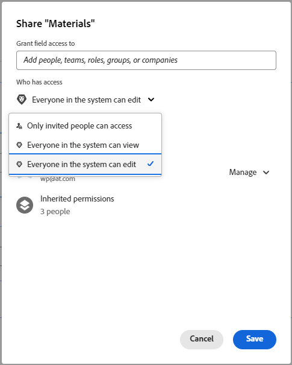

# Konfigurera delning för anpassade fält och widgetar

När du lägger till ett nytt anpassat fält eller en ny widget i ett anpassat formulär kan alla i systemet som har tillgång till anpassade formulär redigera egenskaperna för det objektet, till exempel dess etikett och namn. Du kan ändra detta genom att styra vem det kan delas med.

Mer information om anpassade fält och widgetar i anpassade formulär finns i [Skapa ett anpassat formulär](/help/quicksilver/administration-and-setup/customize-workfront/create-manage-custom-forms/form-designer/design-a-form/design-a-form.md).

## Åtkomstkrav

+++ Expandera om du vill visa åtkomstkrav för funktionerna i den här artikeln.

<table style="table-layout:auto"> 
 <col> 
 <col> 
 <tbody> 
  <tr> 
   <td>Adobe Workfront package</td> 
   <td>
Alla
</td> 
  </tr> 
  <tr> 
   <td>Adobe Workfront-licens</td> 
   <td>
Standard

       
Plan
</td>
  </tr> 
  <tr> 
   <td>Konfigurationer på åtkomstnivå</td> 
   <td> 
Administrativ åtkomst till anpassade formulär
 </td> 
  </tr>  
 </tbody> 
</table>

Mer information finns i [Åtkomstkrav i Workfront-dokumentationen](/help/quicksilver/administration-and-setup/add-users/access-levels-and-object-permissions/access-level-requirements-in-documentation.md).

+++

## Konfigurera delning av anpassade fält eller widgetar från listan med formulär

{{step-1-to-setup}}

1. Klicka på **Anpassad Forms** i den vänstra panelen.
1. Klicka på **Fält** för att öppna fältområdet.
1. Markera objektet som du vill konfigurera delning för och klicka sedan på .
1. I rutan Anpassad fältåtkomst som visas anger du vem du vill dela objektet med och hur du vill dela det:

   1. Nära det nedre vänstra hörnet av rutan **Anpassad fältåtkomst**, under **Ge anpassad fältåtkomst till**, börja skriva namnet på en användare, ett team, en jobbroll, en grupp eller ett företag som du vill dela objektet med och klicka sedan på namnet när det visas.

      

   1. Om du vill ange mer information om hur du vill dela objektet klickar du på listrutan till höger om namnet och använder sedan något av följande alternativ:

      

      <table style="table-layout:auto"> 
       <col> 
       <col> 
       <tbody> 
        <tr> 
         <td role="rowheader">Se det</td> 
         <td> 
Du kan klicka på <strong>Avancerade inställningar</strong> för att ange om du vill att användaren eller användarna ska kunna använda sin åtkomst för att lägga till objektet i ett anpassat formulär eller dela det med andra användare.
 </td> 
        </tr> 
        <tr> 
         <td role="rowheader">Hantera det</td> 
         <td> 
Tillåter åtkomst för att redigera det anpassade fältet och visa det i fältbiblioteket och på sidan där du skapar anpassade formulär.
 
Du kan klicka på <strong>Avancerade inställningar</strong> för att ange om du vill att användaren eller användarna ska kunna använda sin åtkomst för att ta bort objektet från systemet eller dela det med andra användare.
 </td> 
        </tr> 
       </tbody> 
      </table>

1. (Valfritt) Upprepa föregående steg om du vill lägga till andra namn i listan och konfigurera deras alternativ.
1. (Valfritt) Klicka på kugghjulsikonen  i det övre högra hörnet om du vill välja ett systemomfattande delningsalternativ för fältet.

   Alla följande alternativ visas inte på den här listrutan samtidigt. Den andra visas till exempel bara när en av de andra två är markerad.

   * **Gör det här redigerbara systemet brett så att alla i Workfront kan redigera det** (standardalternativet)

     När du lägger till ett anpassat fält eller en anpassad widget, och du inte begränsar delning för det, kan alla i systemet som har tillgång till anpassade formulär visa det och redigera dess egenskaper.

   * **Ta bort systemomfattande redigeringsåtkomst**

     Begränsar åtkomsten till endast dem som du har lagt till i listan.

   * **Gör detta synligt i hela systemet så att alla i Workfront kan se det**

1. Klicka på **Spara**.

## Konfigurera delning av anpassade fält eller widgetar från formulärdesignern

{{step-1-to-setup}}

1. Klicka på **Anpassad Forms** i den vänstra panelen.
1. Öppna ett anpassat formulär eller skapa ett nytt anpassat formulär.
1. Markera det objekt som du vill konfigurera delning för i formulärdesignern och klicka sedan på **Dela** i fältredigeringsområdet till höger.
1. I rutan som visas, under **Bevilja anpassad formuläråtkomst till**, börjar du skriva namnet på användaren, teamet, jobbrollen, gruppen eller företaget som du vill dela objektet med och trycker sedan på **Retur** när namnet visas.
1. Om du vill veta mer om hur du delar ett objekt klickar du på den nedrullningsbara menyn till höger om namnet och använder sedan något av följande alternativ:

   <table style="table-layout:auto"> 
    <col> 
    <col> 
      <tbody> 
       <tr> 
        <td role="rowheader">Se det</td> 
        <td> 
Klicka på <strong>Avancerade inställningar</strong> för att ange om du vill att användarna ska kunna lägga till objektet i ett anpassat formulär eller dela det med andra användare.
 </td> 
       </tr> 
       <tr> 
        <td role="rowheader">Hantera det</td> 
        <td> 
Tillåter åtkomst att redigera det anpassade fältet och visa det både i fältbiblioteket och i formulärdesignern.
 
Klicka på <strong>Avancerade inställningar</strong> för att ange om du vill att användarna ska kunna ta bort objektet från systemet eller dela det med andra användare.
 </td> 
       </tr> 
     </tbody> 
    </table>

1. (Valfritt) Upprepa steg 5-6 om du vill lägga till andra namn i listan och konfigurera deras alternativ.
1. (Valfritt) Välj ett systemomfattande delningsalternativ för fältet:

   * **Alla i systemet kan redigera** (standardalternativet)

     När du lägger till ett anpassat fält eller en anpassad widget, och du inte begränsar delning för det, kan alla i systemet som har tillgång till anpassade formulär visa det och redigera dess egenskaper.

   * **Alla i systemet kan visa**
   * **Endast inbjudna personer kan komma åt**

     Begränsar åtkomsten till endast de som du har lagt till i listan.

   

1. Klicka på **Spara**.

## Ärvd åtkomst till anpassade fält och widgetar när ett anpassat formulär delas

När någon delar ett anpassat formulär med en grupp, en jobbroll, ett team eller ett företag ärver mottagarna Visa-åtkomst till anpassade fält och widgetar som finns i formuläret. Denna åtkomstnivå till dessa objekt i formuläret behålls alltid så att formuläret kan fungera för mottagarna som det är tänkt av den person som skapade det. Detta gäller även för mottagare som har Redigera-åtkomst till formuläret.

Du kan ta reda på vem som har ärvt åtkomst till ett anpassat fält eller en anpassad widget och du kan ta bort åtkomsten till den.

>[!NOTE]
>
>Om en mottagare har Hantera-åtkomst till ett anpassat fält eller en anpassad widget i det delade anpassade formuläret, behålls åtkomsten för mottagaren.

### Ta reda på vem som har ärvt åtkomst till ett anpassat fält eller en anpassad widget {#find-out-who-has-inherited-access-to-a-custom-field-or-widget}

{{step-1-to-setup}}

1. Klicka på **Anpassad Forms** i den vänstra panelen.
1. Klicka på **Fält** och markera sedan fält-, bild- eller åtkomstwidgeten.
1. I rutan som visas klickar du på **Ärvda behörigheter** och visar namnen som visas.
1. Klicka på **Avbryt**.

### Ta bort åtkomst till ett anpassat fält eller en anpassad widget i ett anpassat formulär som delas {#remove-access-to-a-custom-field-or-widget-in-a-custom-form-that-was-shared}

Om du behöver ta bort åtkomsten till ett anpassat fält eller en anpassad widget i ett anpassat formulär som delats, måste du ta bort delningen av formuläret. Instruktioner finns i avsnittet [Ta bort åtkomst till ett anpassat formulär](/help/quicksilver/administration-and-setup/customize-workfront/create-manage-custom-forms/share-access-to-a-custom-form.md#remove-access-to-a-custom-form-from-the-list-of-forms) i artikeln [Dela ett anpassat formulär](/help/quicksilver/administration-and-setup/customize-workfront/create-manage-custom-forms/share-access-to-a-custom-form.md).
