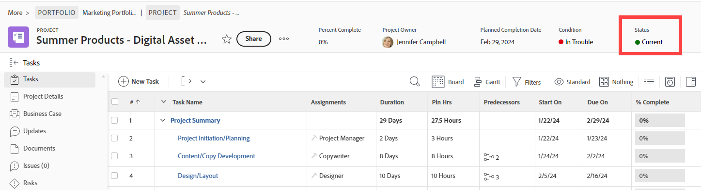

# Skapa eller redigera en status

<!--DON'T DELETE, DRAFT OR HIDE THIS ARTICLE. IT IS LINKED TO THE PRODUCT THROUGH CONTEXT SENSITIVE HELP LINKS.-->

Som Adobe Workfront-administratör kan du skapa anpassade statusvärden för projekt, uppgifter och ärenden. Dessa kan vara till för användare i hela Workfront eller för specifika grupper eller undergrupper. Mer information om status finns i [Översikt över status](../../../administration-and-setup/customize-workfront/creating-custom-status-and-priority-labels/statuses-overview.md).

>[!NOTE]
>
>Gruppadministratörer kan också skapa egna gruppstatusar som bara kan användas av deras grupper. Mer information finns i [Skapa eller redigera en gruppstatus](../../../administration-and-setup/manage-groups/manage-group-statuses/create-or-edit-a-group-status.md).

## Åtkomstkrav

Du måste ha följande åtkomst för att kunna utföra stegen i den här artikeln:

<table style="table-layout:auto"> 
 <col> 
 <col> 
 <tbody> 
  <tr> 
   <td role="rowheader">Adobe Workfront</td> 
   <td>Alla</td> 
  </tr> 
  <tr> 
   <td role="rowheader">Adobe Workfront-licens</td> 
   <td>Plan</td> 
  </tr> 
  <tr> 
   <td role="rowheader">Konfigurationer på åtkomstnivå</td> 
   <td> 
Du måste vara Workfront-administratör.
 
<b>ANMÄRKNING</b>: Om du fortfarande inte har åtkomst frågar du Workfront-administratören om de anger ytterligare begränsningar för din åtkomstnivå. Information om hur en Workfront-administratör kan ändra åtkomstnivån finns i <a href="../../../administration-and-setup/add-users/configure-and-grant-access/create-modify-access-levels.md" class="MCXref xref">Skapa eller ändra anpassade åtkomstnivåer</a>.
 </td> 
  </tr> 
 </tbody> 
</table>

## Skapa eller redigera en anpassad status

Du kan lägga till en anpassad status som kan användas av hela organisationen eller av en enda grupp.

När du skapar en anpassad status för hela organisationen kan du konfigurera den så att alla grupper i systemet kan använda den utan att redigera den. Eller så kan du konfigurera det så att gruppadministratörer kan ändra det för sina grupper, vilket förklaras i [Skapa eller redigera en gruppstatus](../../../administration-and-setup/manage-groups/manage-group-statuses/create-or-edit-a-group-status.md).

1. Klicka på **Huvudmeny** icon  i det övre högra hörnet av Adobe Workfront och klicka sedan på **Inställningar** .

1. Klicka på i den vänstra panelen **Projektinställningar** > **Status**.

1. (Villkorligt) Om du skapar eller redigerar en status som ska användas i hela systemet måste du se till att **Systemstatus** är markerat i rutan i det övre högra hörnet.

   

   eller

   Om statusen är för en grupp eller undergrupp börjar du skriva namnet på gruppen i det övre högra hörnet och markerar den när den visas.

   

1. Markera fliken för objekttypen (**Projekt**, **Uppgifter**, eller **Problem**) som du vill associera med statusen.

1. Om du skapar en ny status klickar du på **Lägg till en ny status**.

   eller

   Om du redigerar en befintlig status håller du pekaren över den och klickar sedan på **Redigera** som visas längst till höger.

   

1. Konfigurera statusen med följande alternativ:

   <table style="table-layout:auto"> 
    <col> 
    <col> 
    <tbody> 
     <tr> 
      <td role="rowheader">Statusnamn</td> 
      <td> 
Ange ett namn för statusen. Detta är ett obligatoriskt fält.
 
När du skapar ett statusnamn bör du tänka på att andra i systemet kan skapa en status med samma namn. Vi rekommenderar att du använder ett unikt namn för att undvika förvirring när du väljer status i Workfront.
 </td> 
     </tr> 
     <tr> 
      <td role="rowheader">Beskrivning</td> 
      <td>(Valfritt) Skriv en beskrivning av statusen. Detta förmedlar sitt syfte till dem som använder det.</td> 
     </tr> 
     <tr> 
      <td role="rowheader">Färg</td> 
      <td> 
Anpassa statusens färg genom att klicka på färgfältet och välja en färg på panelen Färgruta. Du kan också ange ett hexadecimalt tal i fältet.
 
Statusfärgen visas i det övre högra hörnet av Workfront när en användare tittar på objektet.
  
 </td> 
     </tr> 
     <tr> 
      <td role="rowheader">Liknar med</td> 
      <td> 
Välj ett av alternativen i listan som bäst beskriver statusens funktion. Om statusnamnet till exempel är Klar ska det alternativ som det motsvarar vara Fullständigt.
 
Alla statusvärden måste motsvara ett av dessa alternativ eftersom detta avgör hur statusfunktionen fungerar.
 
Det här alternativet kan inte ändras efter att statusen har skapats.
 </td> 
     </tr> 
     <tr> 
      <td role="rowheader">Nyckel</td> 
      <td> 
Om du skapar en ny status skriver du en kod eller förkortning för statusen eller använder den som har genererats åt dig. Nyckeln måste vara unik i Workfront eftersom den kan användas för rapportering. Om du försöker ange en nyckel som redan används i systemet blir fältet rött.
 
Det kan vara användbart att använda en förkortning som är identifierbar för dem som kommer att använda den.
 
Det här alternativet kan inte ändras efter att statusen har skapats.
 
Du kan inte ändra tangentkoden för statusarna Planning, Current och Complete. Detta är viktigt om du skapar en rapport i textläge.
 </td> 
     </tr> 
     <tr> 
      <td role="rowheader">Dölj status</td> 
      <td> 
(Endast projekt- och aktivitetsstatus)
 
Aktivera det här alternativet om du vill att statusen ska vara dold för användarna. När det är inaktiverat (standardinställningen) kan alla användare i systemet använda statusen.
 
Du kan dölja statusen Problem genom att inaktivera alla fyra problemtyperna (Felrapport, Ändra ordning, Problem, Begäran).
 </td> 
     </tr> 
     <tr> 
      <td role="rowheader">Lås för alla grupper</td> 
      <td>
       
När en status är låst kan användare i hela systemet se och använda den, och gruppadministratörer kan inte anpassa den för sina grupper.
 
       
När en status är olåst kan gruppadministratörer anpassa den för sina enskilda grupper.

   

       
Du kan använda både låsta och olåsta lägen i en systemgodkännandeprocess. Om du skapar en systemgodkännandeprocess med en olåst systemstatus kan användare i hela systemet bifoga godkännandeprocessen till vilket projekt, vilken uppgift eller vilken utgåva som helst i systemet.

       
 I följande scenarier visas varningsmeddelanden som hjälper dig och dina användare att förstå resultaten av upplåsning av en status:

       <ul>
       <li>En administratör låser upp en systemnivåstatus som används i en godkännandeprocess. Ett meddelande varnar som kan ta bort den olåsta statusen för sina grupper, vilket skulle förhindra gruppmedlemmar från att använda godkännandeprocessen korrekt för objekt som tilldelats deras grupp.</li>
       <li>En användare börjar redigera en godkännandeprocess som använder en olåst status. Ett meddelande varnar användaren om olåst status så att de kan utvärdera om det skulle vara en bra idé att låsa om eller ersätta den.</li>
       <li>En godkännandeprocess på systemnivå med olåst status bifogas till ett objekt och statusen togs bort för gruppen som tilldelats till objektet. När en gruppmedlem går till avsnittet Godkännanden för objektet, visas ett meddelande om att godkännandeprocessen inte kan initieras för objektet.</li>
       </ul>
       
Mer information om att låsa status finns i <a href="../../../administration-and-setup/customize-workfront/creating-custom-status-and-priority-labels/lock-or-unlock-a-custom-system-level-status.md" class="MCXref xref">Låsta och olåsta statusvärden på systemnivå</a>.

       

      </td>
     </tr> 
    </tbody> 
   </table>

1. Klicka **Spara**.

   Instruktioner om hur du gör den här statusen till standardstatus finns i [Använd anpassade statusvärden som standardstatusvärden](../../../administration-and-setup/customize-workfront/creating-custom-status-and-priority-labels/use-custom-statuses-as-default-statuses.md).

Mer information om hur du ändrar ordning på gruppstatus finns i [Ändra ordning på systemnivå och gruppstatus](../../../administration-and-setup/customize-workfront/creating-custom-status-and-priority-labels/reorder-system-statuses.md).
