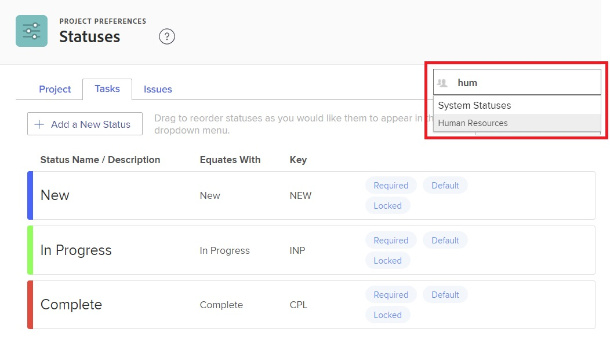

# Ändra ordning på systemnivå och gruppstatus

Som Workfront-administratör kan du ändra ordningen för projekt-, uppgifts- och utfärdandestatus för alla i systemet eller för en enskild grupp.

<!--The system version of this snippet mentions a single group because a sysadmin call also reorder statuses there. Group admin version of this article is still needed.-->

>[!NOTE]
>
>* Om du ändrar ordning på statusarna på systemnivå påverkas inte ordningen på statusarna i grupper.
>
>  Statuserna i en nyligen skapad grupp på den översta nivån ärver dock ordningen för statusvärdena på systemnivå. (En ny undergrupp ärver ordningen för statusarna i gruppen en nivå upp.)
>
>* Du kan ändra ordningen på låsta statusar. Mer information om låsta lägen finns i [Skapa eller redigera en status](../../../administration-and-setup/customize-workfront/creating-custom-status-and-priority-labels/create-or-edit-a-status.md).
>* Gruppadministratörer kan också ändra ordningen på de statusar som används i deras grupper. Mer information finns i [Ordna om gruppstatus](../../../administration-and-setup/manage-groups/manage-group-statuses/reorder-group-statuses-from-groups-area.md).
>

## Åtkomstkrav

Du måste ha följande för att kunna utföra stegen i den här artikeln:

<table style="table-layout:auto"> 
 <col> 
 <col> 
 <tbody> 
  <tr> 
   <td role="rowheader">Adobe Workfront-plan* </td> 
   <td>Alla</td> 
  </tr> 
  <tr data-mc-conditions="SnippetConditions-wf-groups.system-level"> 
   <td role="rowheader">Adobe Workfront-licens*</td> 
   <td> 
Plan 
 
Du måste vara Workfront-administratör. Mer information om Workfront-administratörer finns i <a href="../../../administration-and-setup/add-users/configure-and-grant-access/grant-a-user-full-administrative-access.md" class="MCXref xref">Bevilja användaren fullständig administrativ åtkomst</a>.
 </td> 
  </tr> 
 </tbody> 
</table>

&#42;Kontakta Workfront-administratören om du behöver ta reda på vilken plan eller licenstyp du har.

## Standardordning för statusvärden

Som standard visas statusvärden i följande ordning:

<table style="table-layout:auto"> 
 <col> 
 <col> 
 <col> 
 <thead> 
  <tr> 
   <th width="33.33%">Projekt</th> 
   <th width="33.33%">Uppgift</th> 
   <th width="33.33%">Problem</th> 
  </tr> 
 </thead> 
 <tbody> 
  <tr> 
   <td> 
    <ul> 
     <li>Aktuell</li> 
     <li>Död</li> 
     <li> Parkerad </li> 
     <li> Planering </li> 
     <li> Slutförd </li> 
     <li> Begärd </li> 
     <li> Godkänd </li> 
     <li> Avvisad </li> 
     <li> Idea </li> 
    </ul> </td> 
   <td> 
    <ul> 
     <li>Nytt</li> 
     <li>Pågår</li> 
     <li>Slutförd</li> 
    </ul> </td> 
   <td> 
    <ul> 
     <li>Nytt</li> 
     <li>Pågår</li> 
     <li>Återöppnad</li> 
     <li>Väntar på feedback</li> 
     <li>Parkerad</li> 
     <li>Kan inte duplicera</li> 
     <li>Stängd</li> 
     <li>Löst</li> 
     <li>Verifierad slutförd</li> 
     <li>Lös inte</li> 
    </ul> </td> 
  </tr> 
 </tbody> 
</table>

## Ändra ordning på status för uppgifter och projekt i hela systemet eller för en grupp

1. Klicka på **Huvudmeny** icon  i det övre högra hörnet av Adobe Workfront och klicka sedan på **Inställningar** .

1. Klicka på i den vänstra panelen **Projektinställningar > Status**.
1. (Villkorligt) Om du ändrar ordning på statusarna för en grupp börjar du skriva namnet på gruppen i rutan i det övre högra hörnet och klickar sedan på namnet när det visas.

   

1. Ovanför statuslistan som visas klickar du på **Projekt** eller **Uppgifter** -fliken.

1. Dra och släpp statusarna i önskad ordning.

   Den nya statusordern sparas automatiskt.

1. Om du vill testa den nya statusordningen går du till en uppgift eller ett projekt, klickar på statusen i det övre högra hörnet och ser till att statusvärdena som visas är i den ordning som du har konfigurerat.

## Ändra ordning på statusvärden för utgåvor

1. Klicka på **Huvudmeny** icon  i det övre högra hörnet av Adobe Workfront och klicka sedan på **Inställningar** .

1. Klicka **Projektinställningar > Status.**
1. (Villkorligt) Om du ändrar ordning på statusarna för en grupp börjar du skriva namnet på gruppen i rutan i det övre högra hörnet och klickar sedan på namnet när det visas.

   

1. Klicka på **Problem** -fliken.
1. (Valfritt) Välj en problemtyp (**Felrapport**, **Ändra ordning**, **Problem**, eller **Begäran**).

   >[!NOTE]
   >
   >* Du kan inte anpassa statusordningen för den Överordnad listan.
   >* Vi rekommenderar att du beställer statusar för varje utgåva på samma sätt. Mer information om problemtyper finns i [Konfigurera begärandetyper](../../../administration-and-setup/set-up-workfront/configure-system-defaults/configure-request-types.md).

1. Dra och släpp statusarna i önskad ordning.

   Den nya statusordern sparas automatiskt.

1. Om du vill testa den nya statusordningen går du till ett problem, klickar på statusen i det övre högra hörnet och ser till att statusvärdena som visas är i den ordning som du har konfigurerat.
