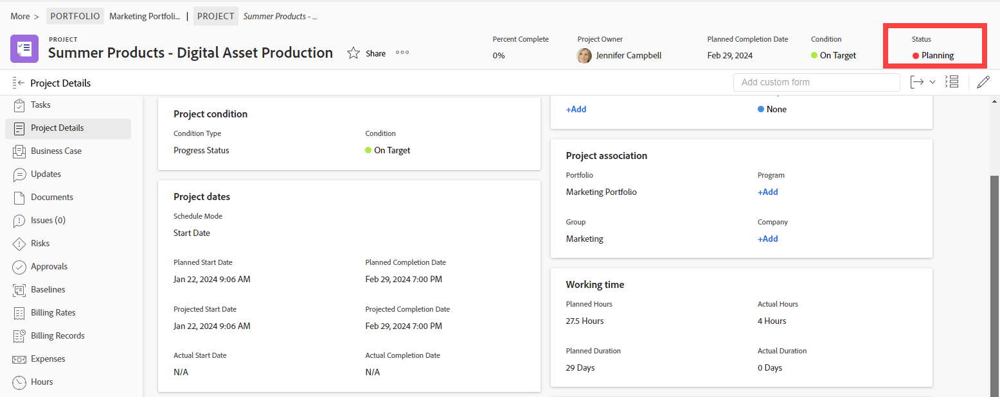

# Översikt över status

<!-- Audited: 01/2024 -->

Om du vill ta reda på vilket utvecklingsstadium ett projekt, en uppgift eller ett problem har kan användaren visa statusen.

I det här projektet visar till exempel statusen Planering att projektledaren för närvarande planerar aspekter av projektet, till exempel tidslinjen, aktivitetstilldelningar och godkännanden.

Du måste ha följande åtkomst och behörigheter till ett projekt, en uppgift eller en utgåva för att kunna se status:

* Visa eller öka din åtkomstnivå till projekt, uppgifter och problem
* Visa eller högre behörigheter för objektet

Du måste ha följande åtkomst och behörigheter till ett projekt, en uppgift eller ett ärende för att kunna ändra deras status manuellt:

* Redigera åtkomst på din åtkomstnivå till projekt, uppgifter och problem
* Contribute eller högre behörighet för uppgiften eller problemet
* Hantera behörigheter för projektet.

Att ändra status för ett projekt, en uppgift eller ett problem är vanligtvis en manuell process. Det finns dock tillfällen då status för ett problem ändras automatiskt, beroende på andra faktorer som inträffar i systemet.

Adobe Workfront levereras med nio projektstatusar, tre aktivitetsstatusar och 10 problemstatusar. Mer information finns i följande artiklar:

* [Öppna listan över systemprojektstatus](../../../administration-and-setup/customize-workfront/creating-custom-status-and-priority-labels/project-statuses.md)
* [Åtkomst till listan över status för systemaktivitet](../../../administration-and-setup/customize-workfront/creating-custom-status-and-priority-labels/task-statuses.md)
* [Åtkomst till listan över status för systemproblem](../../../administration-and-setup/customize-workfront/creating-custom-status-and-priority-labels/issue-statuses.md)

## Anpassade statusvärden

Förutom standardstatusvärdena som medföljer Workfront kan en Workfront-administratör lägga till anpassade projekt-, uppgifts- och utfärdandestatusar som passar organisationens behov. Du kan skapa statusvärden på systemnivå som används av alla i din Workfront-instans, eller gruppnivåstatusar som bara används av vissa grupper. Mer information finns i [Skapa eller redigera en status](../../../administration-and-setup/customize-workfront/creating-custom-status-and-priority-labels/create-or-edit-a-status.md).

## Gruppstatus

Gruppadministratörer kan skapa anpassade statusvärden på gruppnivå för att tillgodose gruppgruppernas behov. Mer information finns i [Hantera gruppstatus](../../../administration-and-setup/manage-groups/manage-group-statuses/manage-group-statuses.md).
