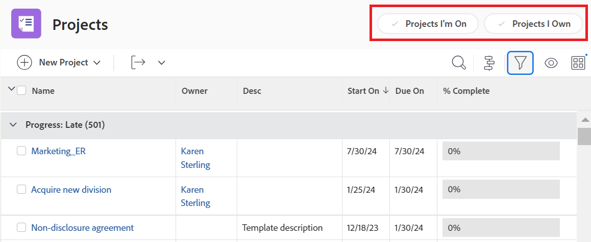

# Anpassa filter, vyer och grupperingar med en layoutmall

Som Adobe Workfront-administratör kan du använda en layoutmall för att ange vilka listkontroller som ska visas i listrutorna Filter, Visa och Gruppering. De här menyerna visas ovanför listor i hela Workfront, t.ex. en lista med uppgifter för ett projekt:

Mer information om layoutmallar finns i [Skapa och hantera layoutmallar](../../../administration-and-setup/customize-workfront/use-layout-templates/create-and-manage-layout-templates.md).

Mer information om layoutmallar för grupper finns i [Skapa och ändra en grupps layoutmallar](../../../administration-and-setup/manage-groups/work-with-group-objects/create-and-modify-a-groups-layout-templates.md).

## Åtkomstkrav

Du måste ha följande åtkomst för att kunna utföra stegen i den här artikeln:

<table style="table-layout:auto"> 
 <col> 
 <col> 
 <tbody> 
  <tr> 
   <td role="rowheader">Adobe Workfront</td> 
   <td>Alla</td> 
  </tr> 
  <tr> 
   <td role="rowheader">Adobe Workfront-licens</td> 
   <td>Plan</td> 
  </tr> 
  <tr> 
   <td role="rowheader">Konfigurationer på åtkomstnivå</td> 
   <td> 
För att kunna utföra dessa steg på systemnivå måste du ha åtkomstnivån Systemadministratör.
Om du vill utföra dem för en grupp måste du vara gruppchef.
 
<b>ANMÄRKNING</b>: Om du fortfarande inte har åtkomst frågar du Workfront-administratören om de anger ytterligare begränsningar för din åtkomstnivå. Information om hur en Workfront-administratör kan ändra åtkomstnivån finns i <a href="../../../administration-and-setup/add-users/configure-and-grant-access/create-modify-access-levels.md" class="MCXref xref">Skapa eller ändra anpassade åtkomstnivåer</a>.
 </td> 
  </tr> 
 </tbody> 
</table>

## Anpassa kontrollerna i listorna Filter, Visa och Gruppera:

1. Börja arbeta med en layoutmall enligt beskrivningen i [Skapa och hantera layoutmallar](../../../administration-and-setup/customize-workfront/use-layout-templates/create-and-manage-layout-templates.md).
1. Klicka på nedpilen  under **Anpassa det användarna ser** och sedan klicka **Listor** i listrutan som visas.

   

1. Klicka på nedpilen  under **Välj en lista att anpassa** väljer du sedan den typ av Workfront-objekt som du vill anpassa listkontrollerna för Filter, Visa och Gruppering för.

   

   >[!NOTE]
   >
   >Om du väljer Projekt som listan som ska anpassas och sedan inaktiverar Projekt som jag är på eller Projekt som jag äger i filteravsnittet, kommer användarna inte längre att se eller kunna använda det filtret:
   >
   >* I listan med filter som visas när de klickar på filterikonen  ovanför en lista:
   >   
   >  
   >   
   >* I huvudet i rubriken Projekt:
   >   
   >  

1. (Valfritt) Om du vill ändra standardfilter, -vy eller -gruppering för layoutmallen för du muspekaren över filtret, vyn eller grupperingen och klickar sedan på **Ange som standard**.

   De standardinställningar du väljer avgör vilka användare av Filter, Visa och Gruppera som ska se i listor i hela Workfront när layoutmallen tilldelas dem. Om du inte ändrar dessa standardinställningar visas alla listor enligt följande:

   * **Filter**: Alla
   * **Visa**: Standard (om tillämpligt) vissa listor har inte den här vyn)
   * **Gruppering**: Ingenting

   Du kan dölja alternativen Alla, Standard och Ingenting efter att du har valt olika standardvärden (se steg 5), men de kan inte tas bort.

   Du kan ta bort andra alternativ som används som standard, men du måste först välja ett annat standardalternativ.

   Mer information om hur du tar bort filter, vyer och grupperingar finns i [Skapa, redigera och dela standardfilter, vyer och grupperingar](../../../administration-and-setup/set-up-workfront/configure-system-defaults/create-and-share-default-fvgs.md).

1. Dölj och lägg till listkontroller enligt följande:

   <table style="table-layout:auto"> 
    <col> 
    <col> 
    <tbody> 
     <tr> 
      <td role="rowheader">Dölja en listkontroll</td> 
      <td> 
Avmarkera eller markera rutan bredvid den listkontroll som du vill dölja eller visa.
 
Om en kryssruta är nedtonad kan du inte dölja den listkontrollen. Standardvärdet  inställningen för varje listkontroll är nedtonad eftersom du inte kan dölja inställningen som är konfigurerad som standard.
 </td> 
     </tr> 
     <tr> 
      <td role="rowheader">Lägga till en anpassad listkontroll</td> 
      <td> 
 
        <ol> 
         <li value="1"> Klicka <strong>Lägg till filter</strong>, <strong>Lägg till vy</strong>, eller <strong>Lägg till gruppering</strong> längst ned i listan Filter, Visa eller Gruppering. I rutan som visas börjar du skriva namnet på en befintlig anpassad listkontroll som du tidigare skapat för din organisation och klickar sedan på namnet när det visas.</li> 
         <li value="2"> Om du vill att den nya anpassade listkontrolluppsättningen ska vara standardfilter, vy eller gruppering för layoutmallen klickar du på <strong>Ange som standard</strong>. </li> 
         <li value="3"> 
Klicka <strong>Lägg till</strong> när du är klar.
 
<b>ANMÄRKNING</b>: 
Användare kan lägga till anpassade listkontroller i sina egna listor. Om du lägger till anpassade listkontroller i en layoutmall läggs listkontrollerna till och de flyttas längst ned på panelen. inte ersätter dem.
 
Detta gäller även om du tilldelar användaren en ny layoutmall med anpassade listkontroller. 
 
Mer information om hur du anpassar listkontroller finns i <a href="../../../reports-and-dashboards/reports/reporting-elements/filters-overview.md" class="MCXref xref">Översikt över filter i Adobe Workfront</a>, <a href="../../../reports-and-dashboards/reports/reporting-elements/views-overview.md" class="MCXref xref">Översikt över vyer i Adobe Workfront</a>och <a href="../../../reports-and-dashboards/reports/reporting-elements/groupings-overview.md" class="MCXref xref">Översikt över grupperingar i Adobe Workfront</a>.
 
 </li> 
        </ol> 
 </td> 
     </tr> 
    </tbody> 
   </table>

1. Fortsätt att anpassa layoutmallen.

   eller

   Om du är klar med anpassningen klickar du på **Spara**.

   >[!TIP]
   >
   >Du kan klicka på Spara när som helst för att spara förloppet och sedan fortsätta att ändra mallen senare.
