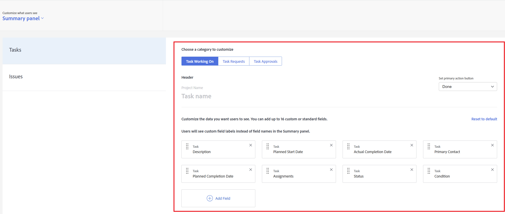

# Anpassa panelen Sammanfattning med hjälp av en layoutmall

<!--Audited: 11/2024-->

<!--The highlighted information on this page refers to functionality not yet generally available. It is available only in the Preview environment for all customers. After the monthly releases to Production, the same features are also available in the Production environment for customers who enabled fast releases.    

For information about fast releases, see [Enable or disable fast releases for your organization](/help/quicksilver/administration-and-setup/set-up-workfront/configure-system-defaults/enable-fast-release-process.md).    -->

Du kan använda en layoutmall för att konfigurera vad användare ser på panelen Sammanfattning när de klickar på en uppgift eller ett problem. Varje konfiguration som du gör enligt stegen nedan påverkar panelen Sammanfattning. Dessa anpassningar gäller inte för panelen Dokumentsammanfattning.

Du kan konfigurera

* Vilka fält som visas för en uppgift eller ett problem i området Detaljer, och i vilken ordning
* Vare sig uppdateringar, loggad tid, bifogade dokument och tidsstämplar visas för en vald uppgift eller utgåva

Du kan också anpassa fälten som användarna ser i området Hem när användarna klickar på ett projektgodkännande, dokumentgodkännande eller godkännande av dokumentversion som de har tilldelats.

Mer information om panelen Sammanfattning finns i [Översikt över sammanfattning](../../../workfront-basics/the-new-workfront-experience/summary-overview.md).

Mer information om hur du skapar layoutmallar finns i [Skapa och hantera layoutmallar](../use-layout-templates/create-and-manage-layout-templates.md).

Mer information om layoutmallar för grupper finns i [Skapa och ändra en grupps layoutmallar](../../../administration-and-setup/manage-groups/work-with-group-objects/create-and-modify-a-groups-layout-templates.md).

När du har konfigurerat en layoutmall måste du tilldela den till användare för att de ändringar du har gjort ska kunna visas för andra. Mer information om hur du tilldelar en layoutmall till användare finns i [Tilldela användare till en layoutmall](../use-layout-templates/assign-users-to-layout-template.md).

## Åtkomstkrav

+++ Expandera om du vill visa åtkomstkrav för funktionerna i den här artikeln.

Du måste ha följande åtkomst för att kunna utföra stegen i den här artikeln:

<table style="table-layout:auto"> 
 <col> 
 <col> 
 <tbody> 
  <tr> 
   <td role="rowheader">Adobe Workfront</td> 
   <td>Alla</td> 
  </tr> 
  <tr> 
   <td role="rowheader">Adobe Workfront-licens*</td> 
   <td>
Nytt: Standard

  
 Aktuell: Planera

   </td> 
  </tr> 
  <tr> 
   <td role="rowheader">Konfigurationer på åtkomstnivå</td> 
   <td> 
För att kunna utföra dessa steg på systemnivå måste du ha åtkomstnivån Systemadministratör.
Om du vill utföra dem för en grupp måste du vara chef för den gruppen.
 </td> 
  </tr> 
 </tbody> 
</table>

*Mer information finns i [Åtkomstkrav i Workfront-dokumentation](/help/quicksilver/administration-and-setup/add-users/access-levels-and-object-permissions/access-level-requirements-in-documentation.md).

+++

## Anpassa panelen Sammanfattning med hjälp av en layoutmall

1. Börja arbeta med en layoutmall enligt beskrivningen i [Skapa och hantera layoutmallar](../../../administration-and-setup/customize-workfront/use-layout-templates/create-and-manage-layout-templates.md).

1. Klicka på nedpilen  under **Anpassa det som visas för användarna** och klicka sedan på **sammanfattningspanelen**.

1. I listan som visas under klickar du på den objekttyp som du vill anpassa panelen Sammanfattning för.

   Tabellen nedan förklarar vad du kan anpassa för varje objekt

   <table style="table-layout:auto"> 
    <col> 
    <col> 
    <tbody> 
     <tr> 
      <td role="rowheader">Uppgifter</td> 
      <td> 
I en lista med uppgifter påverkar den här inställningen panelen Sammanfattning som visas på sidans högra sida när en användare väljer en åtgärd och sedan klickar på ikonen Öppna sammanfattning .

   
  
 </td> 
     </tr> 
     <tr> 
      <td role="rowheader">Problem</td> 
      <td>
I en lista över problem påverkar den här inställningen panelen Sammanfattning som visas på sidans högra sida när en användare väljer ett problem och sedan klickar på ikonen Öppna sammanfattning .
 </td> 
     </tr> 
    </tbody> 
   </table>

<!--These were removed with the new Home: 

<tr> 
      <td role="rowheader">Projects</td> 
      <td><ul><li>
In Home, when a user clicks a project approval assigned to them, your configuration for this setting affects the area to the right of the approval.

      
<b>IMPORTANT:</b> 

This is a deprecated feature. Any changes you make to this area are related to a feature that Workfront has removed. This option will be removed from Workfront with a later maintenance update.
</li>
      </ul> 
      </td> 
     </tr> 
     <tr> 
      <td role="rowheader">Documents</td> 
      <td>
     <ul><li>
In Home, when a user clicks a document approval assigned to them, your configuration for this setting affects the area to the right of the approval.

      
<b>IMPORTANT:</b> 

 This is a deprecated feature. Any changes you make to this area are related to a feature that Workfront has removed. This option will be removed from Workfront with a later maintenance update.
</li>
      </ul>
      </td> 
     </tr> 
     <tr> 
      <td role="rowheader">Document Versions</td> 
      <td><ul><li>
In Home, when a user clicks an approval assigned to them for a particular version of a document, your configuration for this setting affects the area to the right of the approval.

      

<b>IMPORTANT:</b>
 This is a deprecated feature. Any changes you make to this area are related to a feature that Workfront has removed. This option will be removed from Workfront with a later maintenance update.
</li>
      </ul>
      </td> 
     </tr> -->

>[!IMPORTANT]
>
>Om en uppgift inte har tilldelats kan användaren som är tilldelad layoutmallen inte se fältanpassningarna i Sammanfattning.

1. (Villkorligt) Om du klickade på Åtgärder eller Problem i föregående steg väljer du den kategori av uppgift eller problem som du vill anpassa.

   

1. (Villkorligt) Om listrutan **Ange primär åtgärd** visas (om du väljer **Åtgärder** eller **Problem** i listan till vänster) klickar du på den primära åtgärd (**Klar** eller **Status**) som du vill ska vara tillgänglig för användare på sammanfattningspanelen när de visar en uppgift eller ett problem.

   

1. Lägg till  eller dölj  för den valda objekttypen.

   

1. Upprepa steg 3-6 för att anpassa panelen Sammanfattning för andra objekttyper.
1. Klicka på **Globala inställningar**, nära det nedre vänstra hörnet, och aktivera eller inaktivera sedan något av följande alternativ för Adobe Workfront-objekt i sammanfattningen:

   <table style="table-layout:auto"> 
    <col> 
    <col> 
    <tbody> 
     <tr> 
      <td role="rowheader">Visa uppdateringar för arbete</td> 
      <td>Visar alla uppdateringar som gjorts för en vald uppgift eller ett valt problem på panelen Sammanfattning. Detta omfattar både systemuppdateringar och uppdateringar som görs av en användare. Användare kan fortfarande filtrera bort systemuppdateringar enligt beskrivningen i <a href="../../../workfront-basics/updating-work-items-and-viewing-updates/update-work.md#enable" class="MCXref xref">Aktivera eller inaktivera systemuppdateringar</a> i <a href="../../../workfront-basics/updating-work-items-and-viewing-updates/update-work.md" class="MCXref xref">Uppdateringsarbete</a>.</td> 
     </tr> 
     <tr> 
      <td role="rowheader">Logga tid för arbete</td> 
      <td>Visar alternativet Logga tid mot arbete när en uppgift eller ett problem har valts, vilket gör att användare kan logga tid på arbetsobjekt direkt från Hem- och sammanfattningsområdena.</td> 
     </tr> 
     <tr> 
      <td role="rowheader">Visa dokument som är kopplade till arbetet</td> 
      <td>Visar ett dokumentområde på panelen Sammanfattning när en uppgift eller ett problem har valts, med en lista över eventuella dokument som har kopplats till uppgiften eller problemet. Användarna kan klicka på dokumenten för att visa dem i ett förhandsgranskningsfönster.</td> 
     </tr> 
     <tr> 
      <td role="rowheader">Dölj tidsstämpel</td> 
      <td>Döljer tidsstämplar för följande datumfält på panelen Sammanfattning:
       <ul>
        <li>Planerat slutförandedatum</li>
        <li>Bekräftelsedatum</li>
        <li>Skickat den</li>
       </ul></td> 
     </tr> 
    </tbody> 
   </table>

1. Fortsätt att anpassa layoutmallen.

   eller

   Klicka på **Spara** om du är klar med anpassningen.

Mer information om layoutmallar finns i [Skapa och hantera layoutmallar](../../../administration-and-setup/customize-workfront/use-layout-templates/create-and-manage-layout-templates.md).
