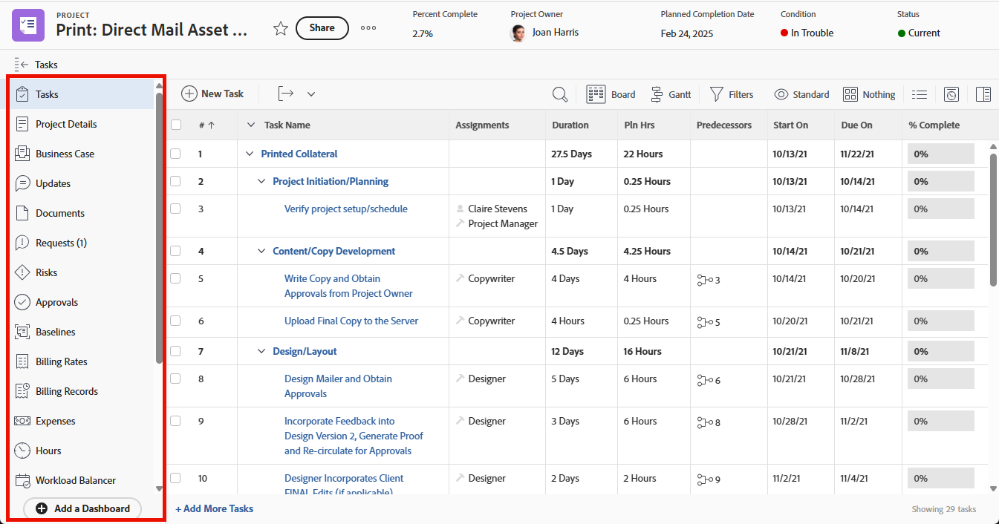

# Anpassa den vänstra panelen med en layoutmall

{{highlighted-preview}}

<!--Audited: 10/2024-->

I en layoutmall kan du anpassa vad användarna ser i det vänstra panelområdet genom [!DNL Adobe Workfront].

Du kan till exempel ta reda på vilket av följande objekt som visas i den vänstra panelen när du visar ett projekt:

>[!IMPORTANT]
>
>Ändringar som görs i ordning och synlighet återspeglas i mobilappen.

Mer information om hur du skapar layoutmallar finns i [Skapa och hantera layoutmallar](../use-layout-templates/create-and-manage-layout-templates.md).

Mer information om layoutmallar för grupper finns i [Skapa och ändra en grupps layoutmallar](../../../administration-and-setup/manage-groups/work-with-group-objects/create-and-modify-a-groups-layout-templates.md).

När du har konfigurerat en layoutmall måste du tilldela den till användare för att de ändringar du har gjort ska kunna visas för andra. Mer information om hur du tilldelar en layoutmall till användare finns i [Tilldela användare till en layoutmall](../use-layout-templates/assign-users-to-layout-template.md).

## Åtkomstkrav

+++ Expandera om du vill visa åtkomstkrav för funktionerna i den här artikeln.

<table style="table-layout:auto"> 
 <col> 
 <col> 
 <tbody> 
  <tr> 
   <td>Adobe Workfront package</td> 
   <td>
Alla

       
Det går bara att lägga till anpassade program i den vänstra panelen för organisationer som har licens för Adobe App Builder.
</td> 
  </tr> 
  <tr> 
   <td>Adobe Workfront-licens</td> 
   <td>
Standard

       
Plan
</td>
  </tr> 
  </tr> 
  <tr> 
   <td>Konfigurationer på åtkomstnivå</td> 
   <td> 
För att kunna utföra dessa steg på systemnivå måste du ha åtkomstnivån Systemadministratör.

        
Om du vill utföra dem för en grupp måste du vara chef för den gruppen.
 </td> 
  </tr> 
 </tbody> 
</table>

Mer information finns i [Åtkomstkrav i Workfront-dokumentationen](/help/quicksilver/administration-and-setup/add-users/access-levels-and-object-permissions/access-level-requirements-in-documentation.md).

+++

## Anpassa den vänstra panelen för ett område i [!DNL Workfront]:

1. Börja arbeta med en layoutmall enligt beskrivningen i [Skapa och hantera layoutmallar](../../../administration-and-setup/customize-workfront/use-layout-templates/create-and-manage-layout-templates.md).
1. Klicka på nedpilen  under **[!UICONTROL Customize what users see]** och klicka sedan på namnet på en objekttyp eller ett [!DNL Workfront] -område vars vänstra panel du vill anpassa.

   Objekttyperna och [!DNL Workfront] områden vars vänstra panel du kan anpassa visas i följande tabell:

   <table style="table-layout:auto"> 
    <col> 
    <col> 
    <col> 
    <thead> 
     <tr> 
      <th>Objekttyp eller [!DNL Workfront]-område</th> 
      <th>När användare klickar på följande..</th> 
      <th>Avsnitt i den vänstra panelen som visas när du har visat dem i layoutmallen:</th> 
     </tr> 
    </thead> 
    <tbody> 
     <tr> 
      <td>[!UICONTROL Project]</td> 
      <td>Namnet på ett projekt</td> 
      <td>[!UICONTROL Tasks], [!UICONTROL Project Details], [!UICONTROL Business Case], [!UICONTROL Updates], [!UICONTROL Documents], [!UICONTROL Issues], [!UICONTROL Risks], [!UICONTROL Approvals], [!UICONTROL Baselines], [!UICONTROL Billing Rates], [!UICONTROL Billing Records], [!UICONTROL Expenses], [!UICONTROL Hours], [!UICONTROL Workload Balancer], [!UICONTROL People], [!UICONTROL Utilization], [!UICONTROL Queue Details], [!UICONTROL Routing Rules], [!UICONTROL Queue Topic], [!UICONTROL Topic Group], [!UICONTROL Metrics], [!UICONTROL Planning]*, [!UICONTROL Custom application]**</td> 
     </tr> 
     <tr> 
      <td>[!UICONTROL Task]</td> 
      <td>Namnet på en uppgift</td> 
      <td> [!UICONTROL Updates], [!UICONTROL Documents], [!UICONTROL Task Details], [!UICONTROL Subtask], [!UICONTROL Issues], [!UICONTROL Hours], [!UICONTROL Approvals], [!UICONTROL Expenses], [!UICONTROL Predecessors], [!UICONTROL Custom application]**</td> 
     </tr> 
     <tr> 
      <td>[!UICONTROL Issue]</td> 
      <td>Namnet på en utgåva</td> 
      <td> [!UICONTROL Updates], [!UICONTROL Documents], [!UICONTROL Issue Details], [!UICONTROL Hours], [!UICONTROL Approvals], [!UICONTROL Custom application]**</td> 
     </tr> 
     <tr> 
      <td>[!UICONTROL Portfolio]</td> 
      <td>Namnet på en portfölj</td> 
      <td>[!UICONTROL Projects], [!UICONTROL Programs], [!UICONTROL Portfolio Details], [!UICONTROL Portfolio] [!UICONTROL Optimization], [!UICONTROL Documents], [!UICONTROL Updates], [!UICONTROL Planning]*, [!UICONTROL Custom application]**</td> 
     </tr> 
     <tr> 
      <td>[!UICONTROL Program]</td> 
      <td>Namnet på ett program</td> 
      <td>[!UICONTROL Projects], [!UICONTROL Program Details], [!UICONTROL Updates], [!UICONTROL Documents], [!UICONTROL Planning]*, [!UICONTROL Custom application]**</td> 
     </tr> 
     <tr> 
      <td>[!UICONTROL Template]</td> 
      <td>Namnet på en projektmall</td> 
      <td>[!UICONTROL Template Tasks], [!UICONTROL Template Details], [!UICONTROL Updates], [!UICONTROL Documents], [!UICONTROL Risks], [!UICONTROL Expenses], [!UICONTROL People], [!UICONTROL Approvals], [!UICONTROL Billing Rates], [!UICONTROL Queue Details], [!UICONTROL Routing Rules], [!UICONTROL Queue Topic], [!UICONTROL Topic Group]</td> 
     </tr> 
     <tr> 
      <td>[!UICONTROL Template Task]</td> 
      <td>Namnet på en malluppgift</td> 
      <td>[!UICONTROL Updates], [!UICONTROL Documents], [!UICONTROL Template Task Details], [!UICONTROL Subtasks], [!UICONTROL Expenses], [!UICONTROL Approvals], [!UICONTROL Predecessors]</td>
     </tr>
     <!--
      <tr> 
       <td>Document</td> 
       <td>Document Details (for a document uploaded to Workfront)</td> 
       <td>Updates, Approvals, All Versions, Custom Forms</td> 
      </tr>
     --> 
     <tr> 
      <td> [!UICONTROL Billing Record]</td> 
      <td>Namnet på en faktureringspost för ett projekt</td> 
      <td>[!UICONTROL Billing Record Details], [!UICONTROL Billable Hours], [!UICONTROL Billable Expenses], [!UICONTROL Fixed Revenues]</td> 
     </tr> 
     <tr> 
      <td>[!UICONTROL Projects]</td> 
      <td>Projekt  i [!UICONTROL Main Menu] </td> 
      <td>[!UICONTROL Projects]</td> 
     </tr> 
     <tr> 
      <td>[!UICONTROL Resourcing]</td> 
      <td>[!UICONTROL Resourcing] i [!UICONTROL Main Menu] </td> 
      <td>[!UICONTROL Planner] (kan inte döljas), [!UICONTROL Workload Balancer], [!UICONTROL Utilization], [!UICONTROL Resource Pools]</td> 
     </tr> 
     <tr> 
      <td>[!UICONTROL Requests]</td> 
      <td>Namnet på en begäran</td> 
      <td>[!UICONTROL New Request], [!UICONTROL Submitted requests], [!UICONTROL All Requests], [!UICONTROL Drafts]</td> 
     </tr> 
     <tr> 
      <td>[!UICONTROL Dashboards]</td> 
      <td>Namnet på en instrumentpanel</td> 
      <td>[!UICONTROL My Dashboards], [!UICONTROL Shared Dashboards], [!UICONTROL All Dashboards]</td> 
     </tr> 
     <tr> 
      <td>[!UICONTROL Scrum Team]</td> 
      <td>Namnet på ett Scrum-team</td> 
      <td>
[!UICONTROL Iterations], [!UICONTROL Current iteration], [!UICONTROL Backlog], [!UICONTROL Workload Balancer], [!UICONTROL Updates], [!UICONTROL Team Settings]
 
<strong>OBS!</strong> Objektet <strong>[!UICONTROL Current iteration]</strong> visas bara på den vänstra panelen när det finns minst en uppgift eller ett problem i iterationen.
</td> 
     </tr> 
     <tr> 
      <td>[!UICONTROL Kanban Team]</td> 
      <td>Namnet på ett Kanban-team</td> 
      <td>[!UICONTROL Workload Balancer], [!UICONTROL Kanban board], [!UICONTROL Backlog], [!UICONTROL Updates], [!UICONTROL Team Settings]</td> 
     </tr> 
     <tr> 
      <td>[!UICONTROL Waterfall Team]</td> 
      <td>Namnet på ett Waterfall-team</td> 
      <td>[!UICONTROL Workload Balancer], [!UICONTROL Updates], [!UICONTROL Team Requests], [!UICONTROL Team Settings]</td> 
     </tr> 
     <tr> 
      <td>[!UICONTROL Iteration]</td> 
      <td>Namnet på en iteration</td> 
      <td>[!UICONTROL Stories], [!UICONTROL Issues], [!UICONTROL Story Board], [!UICONTROL Overview], [!UICONTROL Custom Forms], [!UICONTROL Updates] </td> 
     </tr> 
     <tr> 
       <td>[!UICONTROL User Details]</td> 
       <td>Namnet på en användare</td> 
       <td>[!UICONTROL Details], [!UICONTROL Org Chart], [!UICONTROL Time Off], [!UICONTROL Custom Forms], [!UICONTROL Business Profiles], [!UICONTROL Updates], [!UICONTROL Workload Balancer]</td> 
     </tr>
     <tr> 
       <td>[!UICONTROL Rate Card]</td> 
       <td>Namnet på ett tariffkort</td> 
       <td>[!UICONTROL Job Roles and Rates] (kan inte döljas), [!UICONTROL Rate Card Details]</td> 
     </tr>
     <tr> 
       <td>[!UICONTROL Group]</td> 
       <td>Namnet på en grupp</td> 
       <td>[!UICONTROL Group Members], [!UICONTROL Subgroup Members], [!UICONTROL Group Details], [!UICONTROL Project Preferences], [!UICONTROL Tasks & Issues Preferences], [!UICONTROL Timesheets & Hours], [!UICONTROL Subgroups], [!UICONTROL Statuses], [!UICONTROL Event Notifications], [!UICONTROL Portfolios], [!UICONTROL Programs], [!UICONTROL Projects], [!UICONTROL Templates], [!UICONTROL Recently Deleted], [!UICONTROL Recently Restored], [!UICONTROL Approvals], [!UICONTROL Companies], [!UICONTROL Teams], [!UICONTROL Schedules], [!UICONTROL Timesheet Profiles], [!UICONTROL Layout Templates]</td> 
     </tr>
     <!--
      <tr> 
       <td>Company</td> 
       <td>The name of the company</td> 
       <td> 
People (cannot be hidden), Billing Rates, Custom Forms 
 </td> 
      </tr>
     --> 
     <!--
      <tr> 
       <td>Timesheets</td> 
       <td>The name of the timesheet</td> 
       <td>My Timesheets, Timesheets I Approve, All Timesheets (cannot be hidden) </td> 
      </tr>
     --> 
    </tbody> 
   </table>

   *Ditt företag måste köpa ytterligare en licens för Workfront Planning för att kunna lägga till det här området i den vänstra panelen av projekt, portfolior och program. Mer information finns i [Kom igång med Adobe Workfront Planning](/help/quicksilver/planning/general/planning-overview.md)

   **Anpassade program måste skapas separat innan de blir tillgängliga som alternativ i den vänstra panelen. Mer information finns i [Skapa ett anpassat program för Workfront med Adobe App Builder](/help/quicksilver/app-builder/app-builder.md).

1. Gör något av följande i listan **[!UICONTROL Left panel]** för att avgöra vad användare kommer att se i den vänstra panelen för det [!DNL Workfront] -område eller den objekttyp som du har valt:

   * Klicka på ikonerna **Visa**  eller **Dölj**  om du vill visa eller dölja avsnitt i den vänstra panelen. Du kan inte dölja objekt som inte har en **Visa**- eller **Dölj**-ikon.

   * Dra objekt  om du vill ändra deras ordning på den vänstra panelen.

   >[!NOTE]
   >
   >Följande objekt i listrutan **[!UICONTROL Customize what users see]** avser andra områden än den vänstra panelen:
   >* [!UICONTROL Lists]
   >* [!UICONTROL Summary panel]
   >* [!UICONTROL Home]
   >* [!UICONTROL Branding]
   > 
   >Mer information om hur du anpassar ytterligare områden finns i följande artiklar:
   >
   >* [Anpassa filter, vyer och grupperingar med en layoutmall](../../../administration-and-setup/customize-workfront/use-layout-templates/customize-fvg-list-controls-layout-template.md)
   >* [Anpassa [!UICONTROL Summary panel] med en layoutmall](/help/quicksilver/administration-and-setup/customize-workfront/use-layout-templates/customize-home-summary-layout-template.md)
   >* [Anpassa startsidan med en layoutmall](/help/quicksilver/administration-and-setup/customize-workfront/use-layout-templates/customize-new-home-layout-template.md)
   >* [Varumärket Adobe [!DNL Workfront] med en layoutmall](../../../administration-and-setup/customize-workfront/use-layout-templates/brand-wf-using-a-layout-template.md)

1. (Valfritt) Om du vill lägga till ett vänsterpanelsobjekt som länkar till någon av organisationens kontrollpaneler klickar du på **[!UICONTROL Add dashboard]**, skriver **[!UICONTROL Quick link name]** för objektet och väljer sedan kontrollpanelen.

   Du måste skapa kontrollpanelen innan den visas i listan.

   Instrumentpanelsobjekt visas längst ned på den vänstra panelen.

   >[!NOTE]
   >
   >Användarna kan lägga till anpassade kontrollpanelsobjekt på sin egen vänstra panel. När du lägger till anpassade kontrollpanelsobjekt i en layoutmall visas dina objekt förutom de objekt de lägger till, utan att de skrivs över eller återställs. Detta gäller även om du tilldelar användare till en ny layoutmall med anpassade instrumentpanelsobjekt. Mer information om hur användare kan anpassa den vänstra panelen finns i [Lägga till en kontrollpanel i den vänstra panelen av ett Workfront-objekt eller -område](../../../workfront-basics/manage-your-account-and-profile/configuring-your-user-profile/create-custom-tabs.md).
   >
   >Mer information om kontrollpaneler finns i [Kontrollpaneler](../../../reports-and-dashboards/dashboards/dashboards-overview.md).

1. Fortsätt att anpassa layoutmallen. Du kan klicka på **Använd** när som helst för att spara förloppet.

   eller

   Om du är klar med anpassningen klickar du på **Spara och stäng**.
