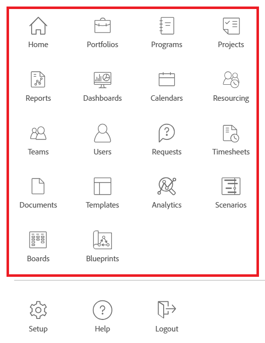

# Anpassa huvudmenyn med hjälp av en layoutmall

<!--Audited: 01/2024-->

Som Adobe Workfront-administratör eller gruppadministratör kan du använda en layoutmall för att konfigurera de alternativ som användare ser när de öppnar huvudmenyn i Workfront.

>[!NOTE]
>
>De alternativ på huvudmenyn som användarna ser beror på licenstypen och vilka inställningar som har konfigurerats på åtkomstnivån. Vissa användare som kommer att använda den här layoutmallen kanske inte ser alla alternativ som du väljer här. Mer information finns i [Hur åtkomstnivåer och behörigheter fungerar tillsammans](../../../administration-and-setup/add-users/access-levels-and-object-permissions/how-access-levels-permissions-work-together.md) och [Konfigurerbar åtkomst till funktioner för varje objekttyp](../../../administration-and-setup/add-users/access-levels-and-object-permissions/configurable-functionality-in-each-access-level-by-object-type.md).
>
>Du kan se olika alternativ på huvudmenyn om din organisation har anslutit sig till Adobe Workfront Unified Experience. Mer information finns i [Adobe Unified Experience for Workfront](/help/quicksilver/workfront-basics/navigate-workfront/workfront-navigation/adobe-unified-experience.md).

Mer information om hur du skapar layoutmallar finns i [Skapa och hantera layoutmallar](../use-layout-templates/create-and-manage-layout-templates.md).

Mer information om layoutmallar för grupper finns i [Skapa och ändra en grupps layoutmallar](../../../administration-and-setup/manage-groups/work-with-group-objects/create-and-modify-a-groups-layout-templates.md).

När du har konfigurerat en layoutmall måste du tilldela den till användare för att de ändringar du har gjort ska kunna visas för andra. Mer information om hur du tilldelar en layoutmall till användare finns i [Tilldela användare till en layoutmall](../use-layout-templates/assign-users-to-layout-template.md).

## Åtkomstkrav

+++ Expandera om du vill visa åtkomstkrav för funktionerna i den här artikeln.

Du måste ha följande åtkomst för att kunna utföra stegen i den här artikeln:

<table style="table-layout:auto"> 
 <col> 
 <col> 
 <tbody> 
  <tr> 
   <td role="rowheader"><strong>Adobe Workfront</strong></td> 
   <td>
Alla

Det går bara att lägga till anpassade program på huvudmenyn för organisationer som har licens för Adobe App Builder.
</td> 
  </tr> 
  <tr> 
   <td role="rowheader"><strong>Adobe Workfront-licens*</strong></td> 
   <td>
Aktuell: Planera

   eller
   
Nytt: Standard
</td> 
  </tr> 
  <tr> 
   <td role="rowheader"><strong>Åtkomstnivåkonfiguration</strong></td> 
   <td> 
För att kunna utföra dessa steg på systemnivå måste du ha åtkomstnivån Systemadministratör.

    
Om du vill utföra dem för en grupp måste du vara chef för den gruppen.
 
     </td> 
  </tr> 
 </tbody> 
</table>

*Mer information om åtkomstkrav finns i [Åtkomstkrav i Workfront-dokumentation](/help/quicksilver/administration-and-setup/add-users/access-levels-and-object-permissions/access-level-requirements-in-documentation.md).

+++

## Anpassa huvudmenyn

1. Börja arbeta med en layoutmall enligt beskrivningen i [Skapa och hantera layoutmallar](../../../administration-and-setup/customize-workfront/use-layout-templates/create-and-manage-layout-templates.md).
1. Klicka på **Ange huvudmeny** i mallens övre högra hörn.

   Rutan Huvudmeny öppnas och du kan se de områden som för närvarande visas på mallens huvudmeny, samt de alternativ som är tillgängliga att lägga till. Följande är alla möjliga objekt som du kan lägga till:
   * Startsida

     >[!TIP]
     >
     >Som standard visas området Mina uppdateringar i hemikonen på huvudmenyn för dem som granskar licensen (i den aktuella licensplanen), såvida de inte har en layoutmall kopplad till sin profil som innehåller området Mina uppdateringar på huvudmenyn, utöver området Hem.

   * Portföljer
   * Program
   * Projekt
   * Rapporter
   * Kontrollpaneler
   * Kalendrar
   * Resurser
   * Scenarier

     >[!NOTE]
     >
     >Scenario Planner kräver ytterligare licens. Mer information om Workfront Scenarioplan finns i [Översikt över scenarioplanen](../../../scenario-planner/scenario-planner-overview.md).

   * Team
   * Användare

     >[!NOTE]
     >
     >Endast användare med en planlicens (i den aktuella licensmodellen) eller användare med en standardlicens (i den nya licensmodellen) kan se ikonen  i huvudmenyn i området Användare.

   * Begäranden
   * Tidrapporter
   * Dokument
   * Mallar
   * Analyser
   * Korrektur
   * Mål

     >[!NOTE]
     >
     >Målet kräver ytterligare licens. Mer information om Workfront-mål finns i [Översikt över Adobe Workfront-mål](../../../workfront-goals/goal-management/wf-goals-overview.md).

   * Mina uppdateringar
   * Varumärkena
   * Utkast
   * Planering

     >[!NOTE]
     >
     >Planering kräver ytterligare licens. Mer information om Workfront Planning finns i [Adobe Workfront Planning - översikt](/help/quicksilver/planning/general/planning-overview.md)
      * Anpassat program

     >[!NOTE]
     >
     > Anpassade program måste skapas separat innan de blir tillgängliga som alternativ för huvudmeny. Mer information finns i [Skapa ett anpassat program för Workfront med Adobe App Builder](/help/quicksilver/app-builder/app-builder.md).

1. Gör något av följande:

   * Dölj  **Aktiva objekt** som du inte vill visa
   * Visa  **Tillgängliga objekt** som du vill visa på huvudmenyn.
   * Dra ikonen  **aktiva objekt** om du vill ändra deras visningsordning på huvudmenyn.

1. Klicka på **Klar**.

   Du kan när som helst klicka på **Avbryt** om du vill ångra ändringarna.

1. Fortsätt att anpassa layoutmallen.

   eller

   Klicka på **Spara** om du är klar med anpassningen.

   >[!TIP]
   >
   >Du kan klicka på Spara när som helst för att spara förloppet och sedan fortsätta att ändra mallen senare.

Mer information om layoutmallar finns i [Skapa och hantera layoutmallar](../../../administration-and-setup/customize-workfront/use-layout-templates/create-and-manage-layout-templates.md).
