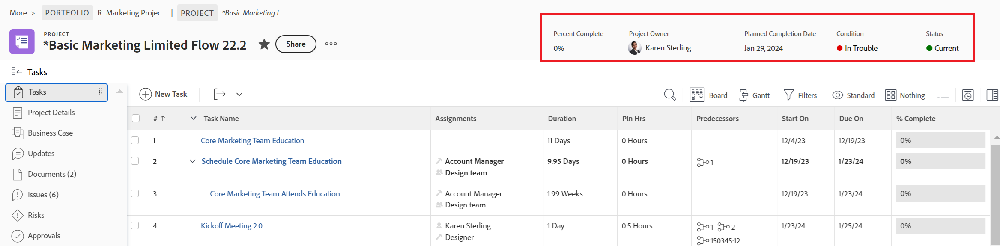

# Anpassa objektrubriker med hjälp av en layoutmall

Som Adobe Workfront-administratör eller gruppadministratör kan du använda en layoutmall för att konfigurera de fält som användarna ser i objekthuvudet när de öppnar ett objekts sida.

>[!IMPORTANT]
>
>Det går för närvarande att anpassa objektrubriker för projekt, uppgifter och ärenden.

Mer information om hur du skapar layoutmallar finns i [Skapa och hantera layoutmallar](../use-layout-templates/create-and-manage-layout-templates.md).

Mer information om layoutmallar för grupper finns i [Skapa och ändra en grupps layoutmallar](../../../administration-and-setup/manage-groups/work-with-group-objects/create-and-modify-a-groups-layout-templates.md).

När du har konfigurerat en layoutmall måste du tilldela den till användare för att de ändringar du har gjort ska kunna visas för andra. Mer information om hur du tilldelar en layoutmall till användare finns i [Tilldela användare till en layoutmall](../use-layout-templates/assign-users-to-layout-template.md).

## Åtkomstkrav

Du måste ha följande åtkomst för att kunna utföra stegen i den här artikeln:

<table>
  <tr>
   <td><strong>Adobe Workfront</strong>
   </td>
   <td>Alla
   </td>
  </tr>
  <tr>
   <td><strong>Adobe Workfront-licens</strong>
   </td>
   <td>Plan
   </td>
  </tr>
  <tr>
   <td><strong>Konfigurationer på åtkomstnivå</strong>
   </td>
   <td>Du måste vara Workfront eller gruppadministratör.

   </td>
  </tr>
</table>

Om du fortfarande inte har åtkomst frågar du Workfront-administratören om de anger ytterligare begränsningar för din åtkomstnivå. Information om hur en Workfront-administratör kan ändra åtkomstnivån finns i [Skapa eller ändra anpassade åtkomstnivåer](../../add-users/configure-and-grant-access/create-modify-access-levels.md).

## Anpassa objektrubriker

1. Börja arbeta med en layoutmall enligt beskrivningen i [Skapa och hantera layoutmallar](../../customize-workfront/use-layout-templates/create-and-manage-layout-templates.md).
1. I **Anpassa det användarna ser** nedrullningsbar meny, välja **Projekt**, **Uppgifter**, eller **Problem**.

   <!--when this will be possible for more than 3 objects, at production, make this more general: update the sentence above to say "select an object you want to customize in the Customize what users see drop-down menu). -->

1. I [!UICONTROL Header fields] för du muspekaren över de fält som visas och gör något av följande:
   * Klicka på **x** ikon för att ta bort ett fält

     eller

   * Klicka och håll ned **ta** för att dra och släppa fältet på en ny plats.

   <!--(NOTE: make sure the default names of these fields have not changed; otherwise, update screen shot)-->

   

1. Du kan ha upp till fem fält i ett objekts sidhuvud.
Om du redan har markerat fem fält måste du ta bort ett fält innan du kan lägga till ett nytt.
1. I **Lägg till fält** börjar du skriva namnet på ett icke-redigerbart Workfront-fält som du vill lägga till och markerar det sedan när det visas i listan. Fältet läggs till i det högra hörnet av rutan Lägg till och visas som det första fältet i det övre vänstra hörnet av objektets rubrik.

   >[!TIP]
   >
   >* Du kan bara lägga till fält som visas i området Översikt i objektets informationsavsnitt och som inte går att redigera. Icke-redigerbara fält är fält som användare inte kan redigera manuellt. De beräknas automatiskt av Workfront.
   >
   >* Du kan lägga till redigerbara fält som redan ingår i standardrubrikerna (till exempel Projektägare, Status, Procent färdigt, Uppdrag).
   >
   >* När du lägger till fältet &quot;Löst av&quot; i huvudet på ett problem, ändras fältet till &quot;Lösa problem, Aktivitet eller Projekt&quot;, när det finns ett matchande objekt kopplat till problemet.

   

1. (Valfritt) Dra och släpp fält som lagts till i en annan ordning.

1. Fortsätt att anpassa layoutmallen.

   eller

   Om du är klar med anpassningen klickar du på **Spara**.

   >[!TIP]
   >
   >Du kan klicka på Spara när som helst för att spara förloppet och sedan fortsätta att ändra mallen senare.
