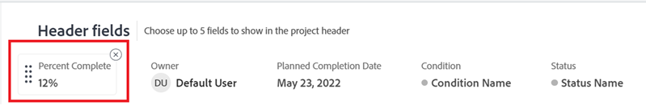
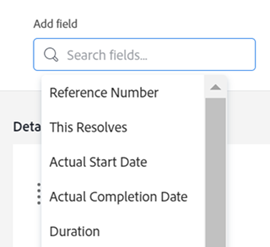

# Anpassa objektrubriker med hjälp av en layoutmall

Som Adobe Workfront-administratör eller gruppadministratör kan du använda en layoutmall för att konfigurera de fält som användarna ser i objekthuvudet när de öppnar ett objekts sida.

>[!IMPORTANT]
>
>Det går för närvarande att anpassa objektrubriker för projekt, uppgifter, utgåvor, portfolior, program, mallar, faktureringsposter, team, användare, företag, grupper och kurskort.

Mer information om hur du skapar layoutmallar finns i [Skapa och hantera layoutmallar](../use-layout-templates/create-and-manage-layout-templates.md).

Mer information om layoutmallar för grupper finns i [Skapa och ändra en grupps layoutmallar](../../../administration-and-setup/manage-groups/work-with-group-objects/create-and-modify-a-groups-layout-templates.md).

När du har konfigurerat en layoutmall måste du tilldela den till användare för att de ändringar du har gjort ska kunna visas för andra. Mer information om hur du tilldelar en layoutmall till användare finns i [Tilldela användare till en layoutmall](../use-layout-templates/assign-users-to-layout-template.md).

## Åtkomstkrav

+++ Expandera om du vill visa åtkomstkrav för funktionerna i den här artikeln.

<table style="table-layout:auto"> 
 <col> 
 <col> 
 <tbody> 
  <tr> 
   <td>Adobe Workfront package</td> 
   <td>
Alla
</td> 
  </tr> 
  <tr> 
   <td>Adobe Workfront-licens</td> 
   <td>
Standard

       
Plan
</td>
  </tr> 
  </tr> 
  <tr> 
   <td>Konfigurationer på åtkomstnivå</td> 
   <td> 
För att kunna utföra dessa steg på systemnivå måste du ha åtkomstnivån Systemadministratör.

        
Om du vill utföra dem för en grupp måste du vara chef för den gruppen.
 </td> 
  </tr> 
 </tbody> 
</table>

Mer information finns i [Åtkomstkrav i Workfront-dokumentationen](/help/quicksilver/administration-and-setup/add-users/access-levels-and-object-permissions/access-level-requirements-in-documentation.md).

+++

## Anpassa objektrubriker

1. Börja arbeta med en layoutmall enligt beskrivningen i [Skapa och hantera layoutmallar](../../customize-workfront/use-layout-templates/create-and-manage-layout-templates.md).
1. I listrutan **Anpassa vad användarna ser** markerar du det objekt vars huvud du vill anpassa.
1. Håll markören över de aktuella fälten i avsnittet [!UICONTROL Header fields] och gör något av följande:
   * Klicka på ikonen **x** för att ta bort ett fält

     eller

   * Klicka på och håll ned ikonen **gripna** för att dra och släppa fältet på en ny plats.

   

1. Du kan ha upp till fem fält i ett objekts sidhuvud.

   Om du redan har markerat fem fält måste du ta bort ett fält innan du kan lägga till ett nytt.

1. I rutan **Lägg till fält** börjar du skriva namnet på ett anpassat fält eller ett inbyggt Workfront-fält som du vill lägga till och markerar det när det visas i listan. Fältet läggs till i det högra hörnet av rutan Lägg till och visas som det första fältet i det övre högra hörnet av objektets rubrik.

   >[!TIP]
   >
   >* Du kan lägga till anpassade fält eller andra inbyggda fält som är tillgängliga i området Översikt i avsnittet Detaljer för ett objekt. Endast problem har till exempel fältet Allvarlighetsgrad och det fältet är inte tillgängligt att lägga till i projekt eller uppgifter.
   >
   >* När en användare redigerar ett anpassat fält i huvudet och det finns i ett anpassat formulär som inte är kopplat till objektet, läggs det anpassade formuläret automatiskt till objektet.
   >
   >* När du lägger till fältet &quot;Löst av&quot; i huvudet på ett problem, ändras fältet till &quot;Lösa problem, Aktivitet eller Projekt&quot; när det finns ett matchande objekt kopplat till problemet.

   

1. (Valfritt) Dra och släpp fälten i en annan ordning.

1. Fortsätt att anpassa layoutmallen. Du kan klicka på **Använd** när som helst för att spara förloppet.

   eller

   Om du är klar med anpassningen klickar du på **Spara och stäng**.

