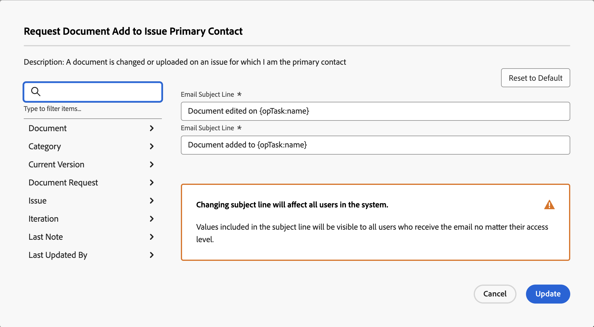

# Anpassa e-postämnen för händelsemeddelanden

Du kan anpassa ämnesraden för e-postmeddelanden som utlöses av händelsemeddelanden:

Om du ändrar ämnesraderna påverkas alla användare i systemet, oavsett mottagarens åtkomstnivå. Användarna ser alla objekt och fält som ingår i e-postämnet.

Vissa händelsemeddelanden har flera ämnesrader, vilket innebär att dessa händelsemeddelanden kan ha flera e-postämnen baserat på deras funktion.

>[!IMPORTANT]
>
>Var försiktig när du tar bort standardfält för fall när ämnesraderna refererar till flera objekt. Nedan följer en lista över händelsemeddelanden som innehåller sådana ämnesrader:
>
>* Någon inkluderar mig i en dirigerad uppdatering
>* Någon inkluderar mitt team för en dirigerad uppdatering
>* Arbetsobjektskommentar till kopplade deltagare
>* Arbetsuppgiftskommentar till tilldelad arbetsuppgift
>

## Åtkomstkrav

+++ Expandera om du vill visa åtkomstkrav för funktionerna i den här artikeln.

<table style="table-layout:auto"> 
 <col> 
 </col> 
 <col> 
 </col> 
 <tbody> 
  <tr> 
   <td role="rowheader">Adobe Workfront package</td> 
   <td>Alla</td> 
  </tr> 
  <tr> 
   <td role="rowheader">Adobe Workfront-licens</td> 
   <td>
   
Standard

   
Plan

   </td> 
  </tr> 
  <tr> 
   <td role="rowheader">Konfigurationer på åtkomstnivå</td> 
   <td> 
Planering eller senare, med administrativ åtkomst till påminnelsemeddelanden
 </td> 
  </tr> 
 </tbody> 
</table>

Mer information finns i [Åtkomstkrav i Workfront-dokumentationen](/help/quicksilver/administration-and-setup/add-users/access-levels-and-object-permissions/access-level-requirements-in-documentation.md).

+++

## Anpassa ämnesrader för e-post för händelsemeddelanden {#customize-email-subject-lines-for-event-notifications}

{{step-1-to-setup}}

1. Klicka på **E-post** > **Meddelanden** i den vänstra panelen.

1. Klicka på fliken **Händelsemeddelanden**.
1. Klicka på namnet på det händelsemeddelande som du vill anpassa för att öppna rutan **Händelsemeddelande**.
1. I rutan **E-posta ämnesrad** ändrar du texten och fälten, inklusive anpassade fält, i e-postmeddelandets ämne.

   Namnen på de tillagda fälten måste matcha kamelversalsyntaxen i vår databasstruktur. <!--For more information about how our objects and their fields are named in the Workfront database, see the [Adobe Workfront API](../../../wf-api/workfront-api.md).-->

1. Klicka på **Uppdatera** för att spara de nya ämnesraderna för dina e-postmeddelanden.

## Anpassa ämnesrader för e-post för e-post med flera objekt

Vissa händelsemeddelanden har flera ämnesrader, beroende på vilka objekt de utlöser.

&quot;Någon inkluderar mig till exempel i en dirigerad uppdatering&quot; har två olika ämnesrader: den första för uppgifter, ärenden, malluppgifter och dokument (kallas även &quot;referenceObject&quot;) och den andra för objekt som tillåter användare att göra kommentarer, som portfölj, program och så vidare (kallas även &quot;topReferenceObject&quot;).

Om en användare ingår i en konversation om uppgiften, utgåvan, malluppgiften eller dokumentet, genereras ett e-postmeddelande med den första ämnesraden. Ämnesraden innehåller &quot;referenceObject:name&quot; och systemet definierar objektet och visar lämpligt namn i ämnesfältet. Ämnesraden i e-postmeddelandet ser ut ungefär så här:&quot;Kommentar till uppgift 123 i projekt ABC.&quot;

Om det läggs till i en projektkonversation genereras ett e-postmeddelande med det andra ämnet. Här innehåller ämnesraden&quot;topReferenceObject:name&quot; och återigen identifierar Workfront vilket objekt som refererades och returnerar objektnamnet i stället för&quot;topReferenceObject:name&quot; i ämnesraden. Ämnesraden i e-postmeddelandet ser ut ungefär så här:&quot;Kommentar i projekt ABC&quot;.

Om du vill redigera ämnesraderna i e-postmeddelanden och lägga till ytterligare fält på någon av ämnesraderna läser du [Anpassa ämnesrader i e-postmeddelanden för händelsemeddelanden](#customize-email-subject-lines-for-event-notifications) i den här artikeln.

## Anpassa ämnesrader för e-postmeddelanden

Vissa händelsemeddelanden har också flera e-postämnen som beskriver de olika åtgärder som vidtas för objekten.

Att begära att ett dokument ska läggas till i ett problem är till exempel en händelse som kan utlösa två olika e-postmeddelanden: en för när dokumentet läggs till och en för när dokumentet redigeras.

Om du vill redigera ämnesraderna i e-postmeddelanden och lägga till ytterligare fält på någon av ämnesraderna läser du [Anpassa ämnesrader i e-postmeddelanden för händelsemeddelanden](#customize-email-subject-lines-for-event-notifications) i den här artikeln.
