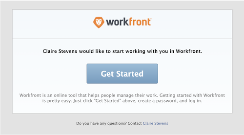

# Hantera e-postinbjudningar till nya användare

<!--

*** DON'T DELETE, DRAFT OR HIDE THIS ARTICLE. IT IS LINKED TO THE PRODUCT, THROUGH THE CONTEXT SENSITIVE HELP LINKS. **

-->

>[!IMPORTANT]
>
>Det förfarande som beskrivs på denna sida gäller endast organisationer som ännu inte har anslutit sig till Admin Console. Om du har anslutit dig till Adobe Admin Console måste du utföra den här åtgärden via Adobe Admin Console.
>
>En lista över procedurer som skiljer sig åt beroende på om din organisation har anslutit sig till Adobe Admin Console finns i [Plattformsbaserade skillnader i administration (Adobe Workfront/Adobe Business Platform)](../../../administration-and-setup/get-started-wf-administration/actions-in-admin-console.md).

Som Adobe Workfront-administratör kan du lägga till användare i Workfront och meddela dem att de har lagts till genom att använda e-postinbjudningar.

Med e-postinbjudan kan nya användare följa en länk där de kan välja ett lösenord för sitt Workfront-konto. De kan sedan slutföra konfigurationen av sitt konto.

Vi rekommenderar att du använder e-postinbjudningar till dina nya användare så att de kan välja sitt eget lösenord för att skydda de nya kontona. Du kan också välja ett lösenord för en ny användare när du skapar kontot. Mer information om hur du lägger till nya användare i Workfront finns i [Lägg till användare](../../../administration-and-setup/add-users/create-and-manage-users/add-users.md).

Du kan konfigurera den nya användarens e-post för:

* Alla nya användare som läggs till i Workfront
* Användare som har lagts till i Workfront med en begärande licens

Alla nya användare ser samma e-postmeddelande när en e-postinbjudan skickas.

Mer information om hur du tar emot e-postinbjudningar finns i [Ta emot e-postinbjudningar och skapa ett lösenord för Adobe Workfront](../../../workfront-basics/manage-your-account-and-profile/managing-your-workfront-account/receive-email-invitations.md).

## Åtkomstkrav

+++ Expandera om du vill visa åtkomstkrav för funktionerna i den här artikeln.

Du måste ha följande åtkomst för att kunna utföra stegen i den här artikeln:

<table style="table-layout:auto"> 
 <col> 
 <col> 
 <tbody> 
  <tr> 
   <td role="rowheader">Adobe Workfront</td> 
   <td>Alla</td> 
  </tr> 
  <tr> 
   <td role="rowheader">Adobe Workfront-licens</td> 
   <td>Plan</td> 
  </tr> 
  <tr> 
   <td role="rowheader">Konfigurationer på åtkomstnivå</td> 
   <td> 
Systemadministratör
 </td> 
  </tr> 
 </tbody> 
</table>

+++

## Generera e-postinbjudningar {#generate-email-invitations}

E-postinbjudningar genereras i följande scenarier:

* När du skapar en ny användare och väljer **Skicka en inbjudan via e-post till den här personen** i formuläret **Ny användare**. Mer information om hur du skapar nya användare finns i [Lägg till användare](../../../administration-and-setup/add-users/create-and-manage-users/add-users.md).
* När du importerar flera nya användare och du väljer alternativet **Skicka inbjudningsmeddelanden till dessa personer**. Mer information om hur du importerar flera nya användare finns i [Importera användare](../../../administration-and-setup/add-users/create-and-manage-users/import-users.md).
* När användarna har skapats kan du manuellt generera inbjudningar till användare som ännu inte har registrerat sitt konto hos Workfront och som inte har etablerat något Workfront-lösenord.\
  Användare som har ett konto som har skapats men ännu inte registrerat sitt konto markeras som **Oregistrerad** i Workfront.

  >[!NOTE]
  >
  >Om du avmarkerar rutan **Skicka en e-postinbjudan till den här personen** när du skapar användaren kan e-postinbjudan inte genereras manuellt. Det går bara att skicka om e-postinbjudningarna manuellt för användare som har skickats den ursprungliga e-postinbjudan när deras konto skapades. Mer information om hur du skapar nya användare finns i [Lägg till användare](../../../administration-and-setup/add-users/create-and-manage-users/add-users.md).

Generera e-postinbjudningar till befintliga oregistrerade användare manuellt:

{{step-1-to-users}}

1. Välj den användare som visar etiketten **Oregistrerad** efter sitt namn.

   

1. Klicka på ikonen Mer  och klicka sedan på **Påminn användare för att registrera**.

   En e-postinbjudan skickas till den nya användaren med en ny länk som denne kan använda för att skapa sitt Workfront-lösenord.

   >[!NOTE]
   >
   >Om din organisation har anslutit sig till Admin Console och du lägger till en användare via Workfront har du inte möjlighet att skicka en e-postinbjudan till nya användare.
   >
   >Nya användare i Adobe läggs till i Admin Console, och Admin Console skickar ett e-postmeddelande som bjuder in dem att slutföra registreringsprocessen. Alla användare måste slutföra registreringsprocessen för att få tillgång till alla Adobe-system.
   >
   >För användare som redan har Adobe kan användaren få ett e-postmeddelande om att Workfront är tillgängligt eller inte. Detta är en inställning som styrs av Adobe-administratören för produkten.

## Konfigurera e-postinbjudningar {#configure-email-invitations}

Som Workfront-administratör kan du konfigurera det meddelande du vill ta med i e-postinbjudningarna för nya användare.

{{step-1-to-setup}}

1. Klicka på **E-post** > **Inbjudningar** i listan till vänster.

1. Gör någon av följande ändringar i avsnittet **Allmänna alternativ**:

   <table style="table-layout:auto"> 
    <col> 
    <col> 
    <tbody> 
     <tr> 
      <td role="rowheader"><strong>Inaktivera inbjudningslänkar efter ... dagar</strong> </td> 
      <td> 
Ange efter hur lång tid e-postinbjudningarna inte längre innehåller en giltig länk till Workfront. Standardantalet dagar är 45.
 </td> 
     </tr> 
     <tr> 
      <td role="rowheader"><strong>Inkludera ett meddelande och/eller tjänstens varaktighet</strong> </td> 
      <td> 
Välj det här alternativet om du vill ändra e-postinbjudan för alla nya användare som har lagts till i Workfront. Detta gäller inte användare med en begärande licens.
 
       <ul> 
        <li><strong>Meddelande</strong>: Om du väljer att ändra e-postinbjudan för alla nya användare anger du den text som du vill inkludera i dina e-postinbjudningar som e-postbrödtext.</li> 
        <li><strong>Villkor</strong>: Om du väljer att ändra e-postinbjudan för alla nya användare anger du den text du vill inkludera i e-postinbjudningarna som villkor. </li> 
        <li><strong>Inkludera ett meddelande och/eller tjänstvillkor för helpdesk-användare</strong>: Välj det här alternativet om du vill ändra e-postinbjudan för alla nya användare som har lagts till i Workfront och som har en begärande licens.</li> 
        <li><strong>Meddelande</strong>: Om du väljer att ändra e-postinbjudan för alla nya användare med en begärande licens anger du den text som du vill inkludera i e-postinbjudningarna som e-postbrödtext.</li> 
        <li><strong>Villkor</strong>: Om du väljer att ändra e-postinbjudan för alla nya användare med en beställarlicens anger du den text som du vill inkludera i dina e-postinbjudningar som villkor. </li> 
        <li> 
I avsnittet <strong>Förhandsgranska inbjudan</strong> kan du se en förhandsgranskning av din e-postinbjudan. Om du valde att ta med ett anpassat meddelande i din e-postinbjudan visas det anpassade meddelandet i det här området.
 
  
 </li> 
       </ul> </td> 
     </tr> 
    </tbody> 
   </table>

1. Klicka på **Spara**.
