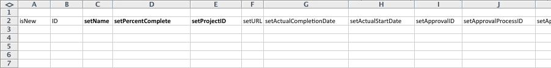

# Startscenario: enkel import av projekt och uppgifter

Beskriver i detalj de tillgängliga inställningarna och kontrollerna för ett grundläggande projekt- och uppgiftsimport med hjälp av snabbstartsmetoden.

## Scenario

Implementeringsteamet importerar hellre projekt- och uppgiftsinformation för aktiva projekt istället för att manuellt mata in dessa data i systemet.

* [Projekt](#projects)
* [Uppgiftslista](#task-list)

### Projekt {#projects}

I följande tabell visas fyra projekt och deras grundläggande information som måste mappas till filformaten Snabbstart.

Det här scenariot förutsätter att användare redan har importerats till Adobe Workfront. Om användare inte redan är i Workfront kan du ersätta andra namn eller slutföra snabbstartscenariot med användare före det här scenariot.

1. Implementera Workfront.

   | Planerat startdatum | Idag |
   |---|---|
   | Projektledare | Jennifer Campbell |
   | Projektsponsorer | Marc Lewis |
   | Grupp | Marknadsföring |
   | Företag | *Ditt företag* |

   {style="table-layout:auto"}

1. Implementera HR System.

   | Planerat startdatum | 14 juli 20XX |
   |---|---|
   | Projektledare | Pam Reynolds |
   | Projektsponsorer | Marc Lewis |
   | Grupp | Marknadsföring |
   | Företag | *Ditt företag* |

   {style="table-layout:auto"}

1. Implementera dokumenthanteringssystemet.

   | Planerat startdatum | 22 augusti 20XX |
   |---|---|
   | Projektledare | Jennifer Campbell |
   | Projektsponsorer | Ray Andrews |
   | Grupp | IT |
   | Företag | *Ditt företag* |

   {style="table-layout:auto"}

1. Implementera det nya kalendersystemet.

   | Planerat startdatum | 6 september 20XX |
   |---|---|
   | Projektledare | Pam Reynolds |
   | Projektsponsorer | Ray Andrews |
   | Grupp | IT |
   | Företag | *Ditt företag* |

   {style="table-layout:auto"}

### Uppgiftslista {#task-list}

I följande uppgiftslista visas alltför förenklade uppgiftslistor för projekten. Den enda skillnaden mellan projekten är startdatum och förlopp för varje projekt.

Överordnade uppgifter ärver varaktigheten, arbetet och Procent färdigt för underordnade uppgifter. Det är inte nödvändigt att ange dessa värden för att bli sammanfattningsuppgifter.

>[!NOTE]
>
>Instruktionerna i det här scenariot är inte så tydliga som de stegvisa instruktionerna i [snabbstartscenariot: Förberedelser för företag, grupp, roll och användarsnabbstart](../../../administration-and-setup/manage-workfront/using-kick-starts/kick-starts-scenario-company-group-role-user-prep.md). Du förutsätts redan ha lärt dig hur du söker upp och kopierar värden från företag- och gruppbladen, så dessa steg kommer att nämnas, men inte beskrivas särskilt.

1. Konfigurera.
1. Importera användare.

   <table style="table-layout:auto"> 
    <col width="50%"> 
    <col width="50%"> 
    <tbody> 
     <tr> 
      <td role="rowheader">Tilldelad till</td> 
      <td>Ray Andrews</td> 
     </tr> 
     <tr> 
      <td role="rowheader">Överordnad aktivitet</td> 
      <td>1</td> 
     </tr> 
     <tr> 
      <td role="rowheader">Varaktighet</td> 
      <td>1 timme</td> 
     </tr> 
     <tr> 
      <td role="rowheader">Arbete</td> 
      <td>1 timme</td> 
     </tr> 
     <tr> 
      <td role="rowheader">Procent färdigt</td> 
      <td> 
Workfront: 0 %
 
HR: 100 %
 
Dokument: 100 %
 
Kalender: 100 %
 </td> 
     </tr> 
    </tbody> 
   </table>

1. Ange behörigheter.

   <table style="table-layout:auto"> 
    <col width="50%"> 
    <col width="50%"> 
    <tbody> 
     <tr> 
      <td role="rowheader">Tilldelad till</td> 
      <td>Ray Andrews</td> 
     </tr> 
     <tr> 
      <td role="rowheader">Överordnad aktivitet</td> 
      <td>1</td> 
     </tr> 
     <tr> 
      <td role="rowheader">Pred</td> 
      <td>2</td> 
     </tr> 
     <tr> 
      <td role="rowheader">Varaktighet</td> 
      <td>1 timme</td> 
     </tr> 
     <tr> 
      <td role="rowheader">Arbete</td> 
      <td>1 timme</td> 
     </tr> 
     <tr> 
      <td role="rowheader">Procent färdigt</td> 
      <td> 
Workfront: 0 %
 
HR: 100 %
 
Dokument: 100 %
 
Kalender: 100 %
 </td> 
     </tr> 
    </tbody> 
   </table>

1. Skapa grupper.

   <table style="table-layout:auto"> 
    <col width="50%"> 
    <col width="50%"> 
    <tbody> 
     <tr> 
      <td role="rowheader">Tilldelad till</td> 
      <td>Ray Andrews</td> 
     </tr> 
     <tr> 
      <td role="rowheader">Överordnad aktivitet</td> 
      <td>1</td> 
     </tr> 
     <tr> 
      <td role="rowheader">Pred</td> 
      <td>4</td> 
     </tr> 
     <tr> 
      <td role="rowheader">Varaktighet</td> 
      <td>2 dagar</td> 
     </tr> 
     <tr> 
      <td role="rowheader">Arbete</td> 
      <td>4 timmar</td> 
     </tr> 
     <tr> 
      <td role="rowheader">Procent färdigt</td> 
      <td> 
Workfront: 0 %
 
HR: 100 %
 
Dokument: 100 %
 
Kalender: 25 %
 </td> 
     </tr> 
    </tbody> 
   </table>

1. Förbered träning.

   <table style="table-layout:auto"> 
    <col width="50%"> 
    <col width="50%"> 
    <tbody> 
     <tr> 
      <td role="rowheader">Tilldelad till</td> 
      <td>Chris Manning</td> 
     </tr> 
     <tr> 
      <td role="rowheader">Varaktighet</td> 
      <td>2 dagar</td> 
     </tr> 
     <tr> 
      <td role="rowheader">Arbete</td> 
      <td>4 timmar</td> 
     </tr> 
     <tr> 
      <td role="rowheader">Procent färdigt</td> 
      <td> 
Workfront: 0 %
 
HR: 100 %
 
Dokument: 50 %
 
Kalender: 100 %
 </td> 
     </tr> 
    </tbody> 
   </table>

1. Bygg löpande supportpolicyer.

   <table style="table-layout:auto"> 
    <col width="50%"> 
    <col width="50%"> 
    <tbody> 
     <tr> 
      <td role="rowheader">Tilldelad till</td> 
      <td>Chris Manning</td> 
     </tr> 
     <tr> 
      <td role="rowheader">Varaktighet</td> 
      <td>2 dagar</td> 
     </tr> 
     <tr> 
      <td role="rowheader">Arbete</td> 
      <td>4 timmar</td> 
     </tr> 
     <tr> 
      <td role="rowheader">Procent färdigt</td> 
      <td> 
Workfront: 0 %
 
HR: 100 %
 
Dokument: 50 %
 
Kalender: 0 %
 </td> 
     </tr> 
    </tbody> 
   </table>

1. Kom ut.

   | Pred | 1, 6, 7 |
   |---|---|

   {style="table-layout:auto"}

1. Utbilda användare.

   <table style="table-layout:auto"> 
    <col width="50%"> 
    <col width="50%"> 
    <tbody> 
     <tr> 
      <td role="rowheader">Tilldelad till</td> 
      <td>Chris Manning</td> 
     </tr> 
     <tr> 
      <td role="rowheader">Överordnad aktivitet</td> 
      <td>8</td> 
     </tr> 
     <tr> 
      <td role="rowheader">Varaktighet</td> 
      <td>1 dag</td> 
     </tr> 
     <tr> 
      <td role="rowheader">Arbete</td> 
      <td>2 timmar</td> 
     </tr> 
     <tr> 
      <td role="rowheader">Procent färdigt</td> 
      <td> 
Workfront: 0 %
 
HR: 0 %
 
Dokument: 0 %
 
Kalender: 0 %
 </td> 
     </tr> 
    </tbody> 
   </table>

## Ladda ned mall

Gå till Startsidan. Markera objekten Företag, Grupp, Projekt, Aktivitet och Användare. Markera kryssrutan Inkludera befintliga data (gör detta för att snabbt referera till företags-, grupp- och användar-ID). Klicka på knappen Hämta.

## Information om indataprojekt

Öppna filen Workfront.xlsx som du just laddat ned. Gå till PROJ-projektbladet.

Om du inte redan har skapat projekt i Workfront ska det vara tomt.

Ange värden för följande projektfält:

* **Set isNew column**
Ange TRUE i raderna 3 till 6 för kolumnen isNew.
* **Ange unika ID**
Ange ett unikt ID i varje rad för ID-kolumnen - Vanligtvis fungerar heltal som börjar med 1 bra när du skapar nya poster.
* **Ange projektnamn**
Ange namnen på varje projekt i kolumnen setName.
* **Ange projektschema**

  Ange ID:t för schemat som du vill att projektet ska använda i fältet setScheduleID

* **Ange projektets planerade startdatum**

  Ange datum och tid i kolumnen setPlannedStartDate med tiden och datumet då du vill att projektet ska starta. Om det lämnas tomt importerar Workfront projektet med dagens datum och en tidsstämpel på dagens midnatt enligt webbläsarens tidszon.

* **Ange aktivitetsnummer**
Ange värden i kolumnen setTaskNumber för att styra i vilken ordning uppgifterna ska visas i projektplanen.
* **Ange projektdatum.**
Ange planerat startdatum för varje projekt i kolumnen setPlannedStartDate.
* **Ange annan nödvändig information.**
Fyll i annan information, till exempel en beskrivning eller aktuell status, efter behov. Leta upp grupp-ID:n för varje projekt på GROUP Group-bladet och ange dem i kolumnen setGroupID för respektive projekt. Leta upp företags-ID för projekten på CMPY Company-bladet och ange det i kolumnen setCompanyID. Leta upp användar-ID för varje projektägare på användarbladet för ANVÄNDARE och ange det i kolumnen setOwnerID. Leta upp användar-ID för varje projektsponsor på användarbladet för ANVÄNDARE och ange det i kolumnen setSponsorID.

>[!NOTE]
>
>Giltiga värden för fälten Status och Prioritet finns genom att granska status- och prioritetsinställningarna för varje objekt i området Arbetsflödesinställningar i Workfront.

## Information om indataaktivitet

Du kan lägga till information om aktiviteterna i projektet när du importerar projektet med hjälp av snabbstarter.

Öppna filen Workfront.xlsx som du just laddat ned. **Gå till uppgiftsbladet.**

Om du inte redan har skapat uppgifter i Workfront ska det här bladet vara tomt.

Det enklaste sättet att mappa uppgifter är ett projekt i taget (särskilt när uppgifterna är desamma i varje projekt). Du kan sedan kopiera uppgiftsplanen för det första projektet och göra små justeringar av uppgiftsplanen för efterföljande projekt. De återstående stegen förutsätter att du skapar uppgifter för bara projektet Implementera Workfront. Enligt scenariot kommer du att importera 9 uppgifter per projekt, så skriv in TRUE i raderna 3 till 11 för kolumnen isNew.

Ange värden för följande aktivitetsfält:

* **Ange ID**
Ange ett unikt ID i varje rad för ID-kolumnen.
* **Ange namn**
Ange uppgiftsnamnen i kolumnen setName.
* **Bekräfta projekt-ID**
Ange det ID som du angett för projektet Implementera Workfront. Kontrollera att det är rätt ID i PROJ-projektbladet.
* **Ange användare**
Gå till användarbladet för ANVÄNDARE för att leta upp ID:t för användaren som tilldelats varje uppgift och ange dessa värden i respektive celler i kolumnen setAssignedToID.
* **Identifiera aktivitetsrelationer**
För uppgifter 2 till 5 anger du 1 i kolumnen setParentID. För uppgift 9 anger du 8 i kolumnen setParentID. I kolumnen setPredecessorString anger du uppgiftsnumret för varje föregående aktivitet. Om en uppgift har flera föregående aktiviteter, som till exempel uppgift 8 i det här scenariot, måste du använda ett komma för att separera varje föregående uppgifts-ID. Föregångare kan definieras med fördröjningar i relationer som inte är Slutför-Start genom att använda kortkommandot som beskrivs i artikeln Skapa föregående relationer.
* **Ange varaktighet**
Ange varaktigheten för varje uppgift genom att ange antal timmar, dagar, veckor eller månader för uppgiften i fältet setDuration. Ange sedan varaktighetsenheten i fältet setDurationUnit.

  |   | Godtagbart värde |
  |---|---|
  | Minuter | M |
  | Timmar | H |
  | Dagar | D |
  | Veckor | B |
  | Månader | T |

  Minuter kan också representeras som en del av en timme (t.ex. minuter = 5 timmar)

* Ange mängden arbetsinsats för varje uppgift i fältet setWorkRequired. Ange sedan arbetsenheten i fältet setWorkUnit. Om värdet för arbete som krävs skiljer sig från längden måste du också ange ett A i fältet setDurationType.

  | Varaktighetstyp | Godtagbart värde |
  |---|---|
  | Beräknad tilldelning | A |
  | Beräknat arbete | B |
  | Ansträngningsstyrd | D |
  | Enkel | S |

* Ange heltalsåtergivningen av procentandelen färdig i fältet setPercentComplete för varje uppgift. Värdet ska inte innehålla procentsymbolen (%).
* Ta med en beskrivning och annan information för varje uppgift som du skapar, efter behov.

  

* Kolumnerna setPlannedStartDate och setTaskConstraint används inte för att skapa tidslinjen för det här projektet eftersom vi förlitar oss på predecessor-relationer. Du kan ange ett datum för varje uppgift i stället. Om du gör det måste du också ange en giltig aktivitetsbegränsning i kolumnen setTaskConstraint. Granska uppgiftsbegränsningen och relaterade artiklar för mer information om giltiga värden för det här fältet.

  I det här scenariot är det enklaste sättet att skapa uppgifter för andra projekt som du importerar att kopiera de uppgifter du just definierat och klistra in dem nedan, med början på rad 12. Då ska du:

   1. Numrera om värdena i ID-kolumnen.
   1. Uppdatera kolumnen setProjectID till det värde du anger för nästa projekt.
   1. Uppdatera värdena setParentID och setPredecessorString så att de återspeglar de nya ID:n som tilldelats det här projektets uppgifter.
   1. Uppdatera aktivitetstilldelningar och procent färdigt.
   1. Upprepa dessa steg för nästa projekts uppgifter.

* **Importera Excel-filen**

  Följ anvisningarna i [Importera data till Adobe Workfront med en snabbstartmall](../../../administration-and-setup/manage-workfront/using-kick-starts/import-data-via-kickstarts.md).
