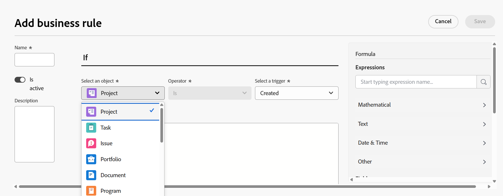

# Skapa och redigera affärsregler

<!--

<span class="preview">The highlighted information on this page refers to functionality not yet generally available. It is available only in the Preview environment for all customers. After the monthly releases to Production, the same features are also available in the Production environment for customers who enabled fast releases. </span>   

-->

Med en affärsregel kan du validera Workfront-objekt och hindra användare från att skapa, redigera eller ta bort ett objekt när vissa villkor är uppfyllda. Validering av affärsregler förbättrar datakvaliteten och effektiviteten genom att man förhindrar åtgärder som kan äventyra dataintegriteten.

<!--

<div class="preview">

Organizations that have the Workflow Ultimate package can also configure business rules to automate actions for the created, edited, or modified object when certain conditions are met. Available actions include sharing the object or attaching a custom form to the object.  

</div>

-->

En affärsregel kan bara tilldelas ett objekt. Om du t.ex. skapar en affärsregel för att inte redigera projekt under vissa förhållanden, kan du inte använda samma regel för uppgifter. Du måste skapa en separat affärsregel med samma villkor för uppgifter.

Åtkomstnivåer och objektdelning har högre prioritet än affärsregler när en användare interagerar med ett objekt. Om en användare t.ex. har en åtkomstnivå eller behörighet som inte tillåter redigering av ett projekt, har de företräde framför en affärsregel som tillåter redigering av ett projekt under vissa villkor.

När mer än en affärsregel gäller för ett objekt följs alla regler, men tillämpas inte i en viss ordning. Du har till exempel två affärsregler. Det finns en begränsning för att skapa utgifter i februari. Den andra förhindrar redigering av ett projekt när projektstatusen är Slutförd. Om en användare försöker lägga till en utgift i ett slutfört projekt i juni, kan utgiften inte läggas till eftersom den har utlöst den andra regeln.

Affärsreglerna gäller för att skapa, redigera och ta bort objekt via API:t och Workfront-gränssnittet.

>[!NOTE]
>
>Eftersom affärsreglerna blockerar vissa åtgärder bör du alltid konfigurera dina affärsregler först i en sandlåda eller förhandsvisningsmiljö och testa dem noggrant innan du aktiverar dem i produktionen.

## Åtkomstkrav

+++ Expandera om du vill visa åtkomstkrav för funktionerna i den här artikeln.

<table style="table-layout:auto"> 
 <col> 
 <col> 
 <tbody> 
  <tr>
   <td>Adobe Workfront package
   </td>
   <td> <p>Verifiering av affärsregel:<ul><li><p>Ultimate</p></li><li>
    <p>Arbetsflöde Ultimate</p></li></ul></p><p>Automatisering av affärsregler:<ul><li>
    <p>Arbetsflöde Ultimate</p></li><ul></p>
   </td>
  </tr> 
  <tr> 
   <td>Adobe Workfront-licens</td> 
   <td>Standard</td> 
  </tr> 
  <tr> 
   <td>Konfigurationer på åtkomstnivå</td> 
   <td>Systemadministratör</td> 
  </tr>  
 </tbody> 
</table>

Mer information finns i [Åtkomstkrav i Workfront-dokumentationen](/help/quicksilver/administration-and-setup/add-users/access-levels-and-object-permissions/access-level-requirements-in-documentation.md).

+++

## Scenarier för affärsregler

* [Scenarier för validering av affärsregler](#scenarios-for-business-rule-validation)
* [Scenarier för automatisering av affärsregler](#scenarios-for-business-rule-automation)

### Scenarier för validering av affärsregler

Formatet för en validering av affärsregler är&quot;OM det definierade villkoret är uppfyllt, hindras användaren från att utföra åtgärden på objektet och meddelandet visas.&quot;

Syntaxen för egenskaperna och andra funktioner i en affärsregel är densamma som syntaxen för ett beräkningsfält i ett anpassat formulär. Mer information om syntaxen finns i [Lägga till beräknade fält med formulärdesignern](/help/quicksilver/administration-and-setup/customize-workfront/create-manage-custom-forms/form-designer/design-a-form/add-a-calculated-field.md).

Mer information om IF-satser finns i [&quot;IF&quot;-programöversikt](/help/quicksilver/reports-and-dashboards/reports/calc-cstm-data-reports/if-statements-overview.md) och [Villkorsoperatorer i beräknade anpassade fält](/help/quicksilver/reports-and-dashboards/reports/calc-cstm-data-reports/condition-operators-calculated-custom-expressions.md).

Mer information om användarbaserade jokertecken finns i [Använda användarbaserade jokertecken för att generera rapporter](/help/quicksilver/reports-and-dashboards/reports/reporting-elements/use-user-based-wildcards-generalize-reports.md).

Mer information om datumbaserade jokertecken finns i [Generera rapporter med datumbaserade jokertecken](/help/quicksilver/reports-and-dashboards/reports/reporting-elements/use-date-based-wildcards-generalize-reports.md).

Ett API-jokertecken finns också i affärsreglerna. Använd `$$ISAPI` för att utlösa regeln endast i API:t. Använd `!$$ISAPI` om du bara vill framtvinga regeln i användargränssnittet och tillåta användare att kringgå regeln via API:t.

* Den här regeln förhindrar till exempel användare från att redigera slutförda projekt via API:t. Om jokertecknet inte användes skulle regeln blockera åtgärden både i användargränssnittet och i API:t.

  ```
  IF({status} = "CPL" && $$ISAPI, "You cannot edit completed projects through the API.")
  ```

Jokertecknen `$$BEFORE_STATE` och `$$AFTER_STATE` används i uttryck för att komma åt objektets fältvärden före och efter redigeringar.

* Dessa jokertecken är båda tillgängliga för redigeringsutlösaren. Standardläget för redigeringsutlösaren (om inget läge ingår i uttrycket) är `$$AFTER_STATE`.
* Utlösaren för att skapa objekt tillåter bara `$$AFTER_STATE` eftersom det tidigare läget inte finns.
* Borttagningsutlösaren för objekt tillåter bara `$$BEFORE_STATE` eftersom efterläget inte finns.

Några enkla affärsregelscenarier är:

* Användare kan inte lägga till nya utgifter under den sista veckan i februari. Denna formel kan anges som:

  ```
  IF(MONTH($$TODAY) = 2 && DAYOFMONTH($$TODAY) >= 22, "You cannot add new expenses during the last week of February.")
  ```

* Användare kan inte redigera projektnamnet för ett projekt med statusen Fullständigt. Denna formel kan anges som:

  ```
  IF({status} = "CPL" && {name} != $$BEFORE_STATE.{name}, "You cannot edit the project name.")
  ```

Systemet tillåter en affärsregel per objekt och utlösare. En redigeringsutlösarregel tillåts t.ex. för utgåvor. Du kan dock inkludera flera regler i en formel med kapslade IF-satser.

Ett scenario med kapslade IF-satser är:

Användare kan inte redigera slutförda projekt och kan inte redigera projekt med ett planerat slutförandedatum i mars. Denna formel kan anges som:

```
IF(
    $$AFTER_STATE.{status}="CPL",
    "You cannot edit a completed project",
    IF(
        MONTH({plannedCompletionDate})=3,
        "You cannot edit a project with a planned completion date in March")
)
```

### Aktivera lokalisering i en affärsregel

Om din organisation använder anpassad lokalisering måste du aktivera översättning av ett affärsregelmeddelande i affärsregeln. Om översättning inte är aktiverat visas meddelandet för läsaren på engelska, även om meddelandetexten finns i lokaliseringslistan och användarens webbläsare är inställd på rätt språk.

När du konfigurerar regeln infogar du ordet TRANSLATE före meddelandet och omger meddelandet inom parentes.

>[!BEGINSHADEBOX]

Exempel:

I det här exemplet antas att meddelandet&quot;Du kan inte redigera färdiga projekt&quot; finns i lokaliseringsdelen av installationsprogrammet och att användarens webbläsare är inställd på det lokaliserade språket.

* `IF({status} = "CPL", "You cannot edit completed projects.") `
Meddelandet visas på engelska.
* `IF({status} = "CPL", TRANSLATE("You cannot edit completed projects."))`
Meddelandet visas på det lokaliserade språket.

>[!ENDSHADEBOX]

Mer information om anpassad lokalisering finns i [Konfigurera anpassad lokalisering](/help/quicksilver/administration-and-setup/set-up-workfront/configure-system-defaults/configure-custom-localization.md).

## Scenarier för automatisering av affärsregler

>[!NOTE]
>
>Din organisation måste ha ett Workflow Ultimate-paket för att kunna använda automatisering av affärsregler.

Formatet för automatisering av affärsregler är&quot;OM det definierade villkoret är uppfyllt aktiveras den valda automatiseringen&quot;.

Formler för automatisering av affärsregler kräver inget felmeddelande

Använd följande formel för att se till att en automatisering körs när det valda objektet och åtgärden inträffar, t.ex. när ett projekt skapas:

```
IF(true, true)
```

Om du bara vill dela ett projekt om projektet har godkänts använder du en formel som den nedan:

```
IF({status} = "APR", true)
```

Du kan använda jokertecken i åtgärder för affärsregler, vilket beskrivs i avsnittet [Scenarier för validering av affärsregler](#scenarios-for-business-rule-validation).


## Lägg till en ny affärsregel

{{step-1-to-setup}}

1. Klicka på **Affärsregler** i den vänstra panelen.
1. Klicka på **Ny affärsregel**.

1. Skriv **Namn** för affärsregeln i dialogrutan Regelbyggaren.
1. I fältet **Är aktiv** väljer du om regeln ska vara aktiv när du sparar den.

   Om du väljer **Nej** sparas regeln som inaktiv och du kan aktivera den senare.

1. (Valfritt) Ange en **beskrivning** av affärsregeln och vad som händer när den tillämpas.


1. Välj den objekttyp som affärsregeln ska tilldelas till.

   

   Du kan tillämpa affärsregler på följande objekt:

   * Projekt
   * Uppgift
   * Problem/förfrågan
   * Portfolio
   * Dokument
   * Program
   * Utgift
   * Företag
   * Upprepning
   * Faktureringspost
   * Grupp
   * Icke-arbetsrelaterad resurs
   * risk
   * Kreditkort
   * Tilldelning
   * Användare
   * Roll
   * Timme
   * Mall
   * Tid av
   * Resurspool
   * Jobbroll
   * Resurskategori utanför arbetsplats
   * Resurspool
   * Tid av
   * Timme
   * Personalplan
   * Mall
   * Resurs för personalplan
<!--
   * <span class="preview">Team</span>
-->

1. Skriv **Namn** för affärsregeln i dialogrutan Regelbyggaren.
1. I fältet **Är aktiv** väljer du om regeln ska vara aktiv när du sparar den.

   Om du väljer **Nej** sparas regeln som inaktiv och du kan aktivera den senare.

1. Välj en **utlösare** för affärsregeln. Alternativen är:

   * **Skapad** Regeln används när en användare försöker skapa ett objekt.
   * **Redigerad** Regeln används när en användare försöker redigera ett objekt.
   * **Borttagen** Regeln används när en användare försöker ta bort ett objekt.

1. Bygg formeln i formelredigeraren i mitten av dialogrutan för affärsregler.

   Formatet på en affärsregel är&quot;OM det definierade villkoret uppfylls förhindras användaren från att utföra åtgärden på objektet och meddelandet visas.&quot;

   I formelområdet är de delar av affärsregeln som du skapar villkoret och det meddelande som visas i Workfront när villkoret är uppfyllt.

   * &quot;object&quot; är den objekttyp som du valde när du skapade affärsregeln. Den visas i dialogrutans rubrik.
   * &quot;action&quot; är den utlösare som du valde för regeln: skapa, redigera eller ta bort objektet.
   * Eftersom objektet och åtgärden redan är definierade, tar du inte med dem i formeln.
   * Det anpassade felmeddelandet <span class="preview"> inkluderas bara om regeln är för validering och </span> visas för användaren när de utlöser affärsregeln. Den ska innehålla tydliga instruktioner om vad som gick fel och hur problemet ska åtgärdas.

     Du kan inkludera en statisk URL-adress i felmeddelandet, för att länka till dokumentation eller andra användbara sidor som hjälper användaren hur de ändrar sin åtgärd inom regelbegränsningen.

     I det här exemplet kommer &quot;Läs mer&quot; att länka till webbadressen. `"You are not allowed to add a new project in November.[Learn more](http://url)"` URL:en måste vara inom parentes, men länktext inom parentes krävs inte. Du kan visa den fullständiga URL:en och det blir en klickbar länk.

   

   Det här exemplet är en affärsregel för projekt. Om den aktuella månaden är november får användarna inte skapa nya projekt, och meddelandet förklarar detta.

   Mer exempel på affärsregler finns i [Scenarier för affärsregler](#scenarios-for-business-rules) i den här artikeln.

1. (Valfritt) Använd formeln **Uttryck** och **Fält** på den högra panelen för att få hjälp med att skapa regeln.

   Sök efter ett uttryck eller fält för att begränsa listan med tillgängliga objekt.

   Listan med tillgängliga fält är begränsad till fält som är relaterade till objekttypen för affärsregeln.

1. (Villkorligt) Om du validerar åtgärden, om din organisation finns i Workfront Ultimate-paketet, väljer du **Validera objektet** i området Sedan.

   För andra paket är det här alternativet förvalt.

1. <span class="preview">(Villkorligt) Om du vill automatisera en annan åtgärd väljer du åtgärden. </span>

   <span class="preview">Mer information om de här åtgärderna finns i avsnittet [Alternativ för automatisering av affärsregler](#business-rule-automation-options) i den här artikeln.</span>

   >[!NOTE]
   >
   ><span class="preview">Din organisation måste finnas i Workflow Ultimate-paketet för att kunna använda åtgärder förutom validering. Om du inte ser de här andra alternativen finns din organisation inte i Workflow Ultimate-paketet.</span>

1. Klicka på **Spara** när du är klar med att skapa affärsregeln.

>[!NOTE]
>
>När du har lagt till en affärsregel bör du testa den genom att lägga till, redigera eller ta bort det associerade objektet för att se till att regeln tillämpas korrekt.

<div class="preview">

### Automatiseringsalternativ för affärsregler

>[!NOTE]
>
>Din organisation måste finnas i Workflow Ultimate-paketet för att kunna använda andra åtgärder än validering. Om du inte ser dessa andra alternativ finns din organisation inte i Workflow Ultimate-paketet.

Du kan ställa in dessa åtgärder så att de automatiseras när affärsregeln aktiveras. Vilka åtgärder som är tillgängliga beror på den valda objekttypen.

| Automatisering | Ytterligare konfiguration |
|---|---|
| Bifoga ett eget formulär | Välj det anpassade formulär som du vill lägga till |
| Dela objektet | Välj personer, roller, grupper, företag eller åtkomstnivåer som du vill dela objektet med. |

</div>

## Aktivera en affärsregel

När en affärsregel är inaktiv visas Falskt i fältet Är aktiv i listan med affärsregler. Du kan inte uppdatera regelns status i listvyn.

Så här aktiverar du en affärsregel:

1. Markera affärsregeln i listan med regler och klicka på ikonen Redigera.
1. Välj **Ja** för **Är aktiv** i dialogrutan för affärsregler.
1. Klicka på **Spara**.

