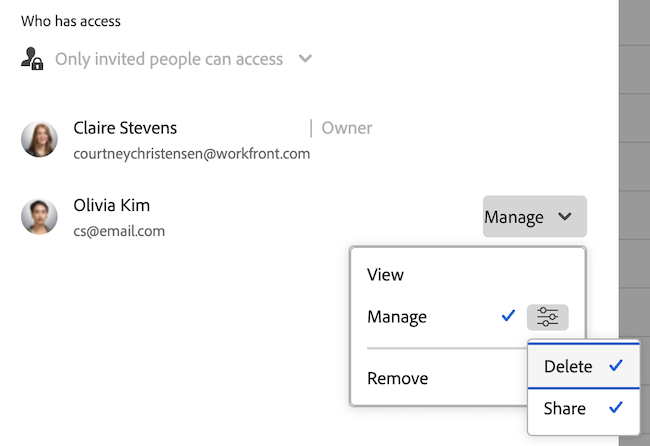

# Skapa, redigera och dela systemomfattande filter, vyer och grupperingar

<!-- Audited: 5/2025 -->

<!--

***DON'T DELETE, DRAFT OR HIDE THIS ARTICLE. IT IS LINKED TO THE PRODUCT, THROUGH THE CONTEXT SENSITIVE HELP LINKS. **

-->

Du kan skapa filter, vyer och grupperingar och göra dem tillgängliga för användare i hela organisationen.

När du skapar systemomfattande filter, vyer och grupperingar enligt beskrivningen i den här artikeln kan användare som du delar dem med utnyttja dem när de visar sina listor. Användare kan skapa egna filter, vyer och grupperingar baserat på de som du skapar, men de kan inte ändra dem direkt.

Observera att systemomfattande filter, vyer och grupperingar som du skapar skiljer sig från de standardformat som Adobe Workfront automatiskt skapar åt dig i systemet. Dessa standardfilter, vyer och grupperingar kan inte redigeras eller tas bort.

## Åtkomstkrav

+++ Expandera om du vill visa åtkomstkrav för funktionerna i den här artikeln.

Du måste ha följande åtkomst för att kunna utföra stegen i den här artikeln:

<table style="table-layout:auto"> 
 <col> 
 <col> 
 <tbody> 
  <tr> 
   <td role="rowheader">[!DNL Adobe Workfront] plan</td> 
   <td>Alla</td> 
  </tr> 
  <tr> 
   <td role="rowheader">[!DNL Adobe Workfront] licens</td> 
   <td>
Nytt: [!UICONTROL Standard]

   eller
   
Aktuell: [!UICONTROL Plan]

   </td> 
  </tr>
  <tr> 
  <tr> 
   <td role="rowheader">Konfigurationer på åtkomstnivå</td> 
   <td>[!UICONTROL System Administrator]</td>
  </tr> 
 </tbody> 
</table>

Mer information om informationen i den här tabellen finns i [Åtkomstkrav i Workfront-dokumentationen](/help/quicksilver/administration-and-setup/add-users/access-levels-and-object-permissions/access-level-requirements-in-documentation.md).

+++

## Skapa filter, vyer eller grupperingar

{{step-1-to-setup}}

1. Klicka på **[!UICONTROL Interface]** och sedan på något av följande: **[!UICONTROL Filters]**, **[!UICONTROL Views]** eller **[!UICONTROL Groupings]**.

1. Om du skapar ett filter, en vy eller en gruppering klickar du på **[!UICONTROL Add Filter]**, **[!UICONTROL Add View]** eller **[!UICONTROL Add Grouping]** och väljer sedan den objekttyp som du vill associera det nya filtret, den nya vyn eller grupperingen med.

   eller

   Om du redigerar ett befintligt filter, en befintlig vy eller en befintlig gruppering markerar du det och klickar sedan på ikonen **[!UICONTROL Edit]**  .

1. Konfigurera filter, vy eller gruppering.

   Mer information om tillgängliga alternativ finns i följande artiklar:

   * [Översikt över filter](../../../reports-and-dashboards/reports/reporting-elements/filters-overview.md)
   * [Vyöversikt i [!UICONTROL Adobe Workfront]](../../../reports-and-dashboards/reports/reporting-elements/views-overview.md)
   * [Översikt över grupperingar i [!UICONTROL Adobe Workfront]](../../../reports-and-dashboards/reports/reporting-elements/groupings-overview.md)

1. Klicka på **[!UICONTROL Save]** nära det nedre vänstra hörnet.

Du kan göra filtret, visningen eller grupperingen tillgänglig för användare i systemet. Mer information om att dela filter, vyer och grupperingar med andra användare finns i avsnittet [Gör filter, vyer och grupperingar tillgängliga för användare](#make-filters-views-or-groupings-available-to-users) i den här artikeln.

## Göra filter, vyer och grupperingar tillgängliga för alla användare {#make-filters-views-or-groupings-available-to-users}

Du kan välja att visa eller dölja filter, vyer eller grupperingar i systemet. Synliga filter är tillgängliga för alla användare i hela systemet. Den här inställningen fungerar som en på/av-switch för hela systemet, inklusive layoutmallen.

Om du vill dölja filter, vyer eller grupperingar för specifika användare rekommenderar vi att du använder en layoutmall i stället för att inaktivera dem i hela systemet.

>[!NOTE]
>
>* Om en användare aktivt använder ett filter, en vy eller en gruppering och sedan en administratör inaktiverar den, har användaren fortfarande åtkomst tills han eller hon väljer ett nytt filter, en ny vy eller en ny gruppering. När de har valt en ny kan de inte längre återgå till den dolda.
>* Om alla filter, vyer och grupperingar begränsas via layoutmallen eller inaktiveras i hela systemet, visas standardalternativen eftersom systemet måste visa något.

Så här visar eller döljer du filter, vyer eller grupperingar:

{{step-1-to-setup}}

1. Klicka på **[!UICONTROL Interface]** och sedan på något av följande: **[!UICONTROL Filters]**, **[!UICONTROL Views]** eller **[!UICONTROL Groupings]**.

1. (Villkorligt) Markera det filter, den vy eller den gruppering som du vill göra tillgänglig för användarna och klicka sedan på **[!UICONTROL Enable system-wide]**.

   

   >[!TIP]
   >
   >Om du vill att filtret, vyn eller grupperingen ska vara tillgänglig för de flesta användare, men dölja den för andra, kan du använda layoutmallen. Mer information finns i [Anpassa filter, vyer och grupperingar med hjälp av en layoutmall](/help/quicksilver/administration-and-setup/customize-workfront/use-layout-templates/customize-fvg-list-controls-layout-template.md).

1. (Villkorligt) Markera det filter, den vy eller den gruppering som du vill dölja för användarna och klicka sedan på **[!UICONTROL Disable system-wide]**. Filtret, vyn eller grupperingen är nu dold både för layoutmallen och för användarna i systemet.

## Dela egna filter, vyer och grupper med specifika användare

I de här stegen beskrivs hur du delar anpassade filter, vyer och grupperingar med specifika användare genom att använda delningsdialogrutan i området [!UICONTROL Interface] i [!UICONTROL Setup]. Du kan bevilja vy eller hantera åtkomst till filter, vyer och grupperingar som du eller andra skapar. Du kan inte dela systemstandardvärden med användare.

{{step-1-to-setup}}

1. Klicka på **[!UICONTROL Interface]** och sedan på något av följande: **[!UICONTROL Filters]**, **[!UICONTROL Views]** eller **[!UICONTROL Groupings]**.

1. Markera filtret, vyn eller grupperingen som du vill dela och klicka sedan på ikonen **[!UICONTROL Share]**  .
1. Börja skriva namnet på specifika användare, team, roller, grupper eller företag som filtret, vyn eller grupperingen ska delas med och klicka sedan på namnet i listrutan.

   Mer information om delning finns i [Översikt över delningsbehörigheter för objekt](../../../workfront-basics/grant-and-request-access-to-objects/sharing-permissions-on-objects-overview.md).

1. Välj **Visa** eller **Hantera** bredvid namnet på användaren, teamet, rollen, gruppen eller företaget. Om du vill finjustera behörigheter klickar du på skjutreglageikonen och justerar behörigheterna.

   

1. Klicka på **[!UICONTROL Save]**. Användare som du har angett kan nu interagera med filtret, vyn eller grupperingen när du visar den objekttyp som du har associerat den med.

## Ta bort filter, vyer och grupperingar

{{step-1-to-setup}}

1. Klicka på **[!UICONTROL Interface]** och sedan på något av följande: **[!UICONTROL Filters]**, **[!UICONTROL Views]** eller **[!UICONTROL Groupings]**.

1. Markera ett eller flera objekt i listan och klicka sedan på ikonen **[!UICONTROL Delete]**  .

1. I dialogrutan **Ta bort** som visas klickar du på **Ja och tar bort den**.
