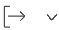

# Redigera och skapa risktyper

<!--Audited: 03/2025-->

<!--DON'T DELETE, DRAFT OR HIDE THIS ARTICLE. IT IS LINKED TO THE PRODUCT, THROUGH THE CONTEXT SENSITIVE HELP LINKS.-->

Adobe Workfront har ett antal standardrisktyper som du kan koppla till projekt i planeringsfasen för att identifiera potentiella hinder innan du godkänner något arbete.

Risker är tänkbara händelser som kan förhindra att projektet slutförs i tid eller inom budgeten.

Förutom standardrisktyperna kan du lägga till nya risktyper som återspeglar organisationens behov.

Du kan koppla risktyper till projektrisker för att identifiera vilken typ av risk ett projekt kan stöta på.

## Åtkomstkrav

+++ Expandera om du vill visa åtkomstkrav för funktionerna i den här artikeln.

<table style="table-layout:auto"> 
 <col> 
 <col> 
 <tbody> 
  <tr> 
   <td>[!DNL Adobe Workfront] package</td> 
   <td>
Alla
</td> 
  </tr> 
  <tr> 
   <td>[!DNL Adobe Workfront] licens</td> 
   <td>
[!UICONTROL Standard]

       
[!UICONTROL Plan]
</td>
  </tr> 
  <tr> 
   <td>Konfigurationer på åtkomstnivå</td> 
   <td>[!UICONTROL System Administrator]</td> 
  </tr> 
 </tbody> 
</table>

Mer information finns i [Åtkomstkrav i Workfront-dokumentationen](/help/quicksilver/administration-and-setup/add-users/access-levels-and-object-permissions/access-level-requirements-in-documentation.md).

+++

## Risktyper

Risktyper är etiketter som du kan använda för att kategorisera risker i rapporteringssyfte.

Som [!DNL Workfront]-administratör kan du skapa [!UICONTROL Risk Types] under [!UICONTROL **Konfigurera**].

Efter att risktyperna har ställts in är de universella för ditt system.

Alla projektägare kan använda samma risktyper för sina projekt.

## Redigera och skapa risktyper

Vissa risktyper finns redan i [!DNL Workfront] som standard.

Du kan göra följande för att öka antalet risktyper i din Workfront-instans:

* [Redigera befintliga risktyper](#edit-existing-risk-types)
* [Skapa risktyper](#create-risk-types)

### Redigera befintliga risktyper {#edit-existing-risk-types}

{{step-1-to-setup}}

1. Klicka på **[!UICONTROL Risk Types]**.
1. Välj den risktyp som du vill redigera.
1. Klicka på ikonen **[!UICONTROL Edit]** .

   Rutan [!UICONTROL **Redigera risktyp**] öppnas.

   

   >[!TIP]
   >
   >Du kan redigera risktypsinformation infogat när du dubbelklickar på Namn eller Beskrivning för en risktyp i en lista över risktyper.

1. (Valfritt) Ändra namn och beskrivning av risktypen.

   Det finns en teckengräns på 50 tecken för fälten **[!UICONTROL Name]** och **[!UICONTROL Description]**.

1. Klicka på **[!UICONTROL Save Changes].**

1. (Valfritt) Om du vill ta bort en risktyp markerar du den i listan, klickar på ikonen [!UICONTROL **Ta bort**]  och sedan på [!UICONTROL **Ja, ta bort den**] . Risktypen tas bort och kan inte återfås.

1. (Valfritt) Om du vill exportera en lista med risktyper klickar du på ikonen [!UICONTROL **Exportera**]  . Du kan exportera till följande filtyper:

   * PDF
   * Excel
   * Excel (xlsx)
   * Tabbavgränsad

   >[!TIP]
   >
   >   Du kan först välja ett begränsat antal risktyper och sedan exportera dem för en mindre lista.

### Skapa risktyper {#create-risk-types}

Du kan skapa risktyper, förutom de som är standard.

{{step-1-to-setup}}

1. Klicka på **[!UICONTROL Risk Types]**.

1. Klicka på **[!UICONTROL New Risk Type]** för att öppna rutan [!UICONTROL **Ny risktyp**]

   eller

   Klicka på [!UICONTROL **Lägg till fler risktyper**] i det nedre vänstra hörnet av listan över risktyper om du vill lägga till risktyper.

   Rutan **Ny risktyp** öppnas.

   

1. Lägg till **[!UICONTROL Name]** (obligatoriskt) och **[!UICONTROL Description]** (valfritt) för risktypen.

   Det finns en teckengräns på 50 tecken för fälten **[!UICONTROL Name]** och **[!UICONTROL Description]**.

1. Klicka på **[!UICONTROL Create Risk Type]**,

   Om du använde infogad redigering för att lägga till din risktyp klickar du på **[!UICONTROL Enter]** när du är klar.

   >[!TIP]
   >
   >Om du vill redigera en anpassad risktyp läser du avsnittet [[!UICONTROL Edit existing] risktyper ](#edit-existing-risk-types) i den här artikeln.

## Bifoga risker med risktyper i projekt

Du kan använda risktyper för att märka risker som lagts till i dina projekt.

Mer information om hur du lägger till risker i projekt finns i [Skapa och redigera risker i projekt](../../../manage-work/projects/define-a-business-case/create-edit-risks-on-projects.md).
