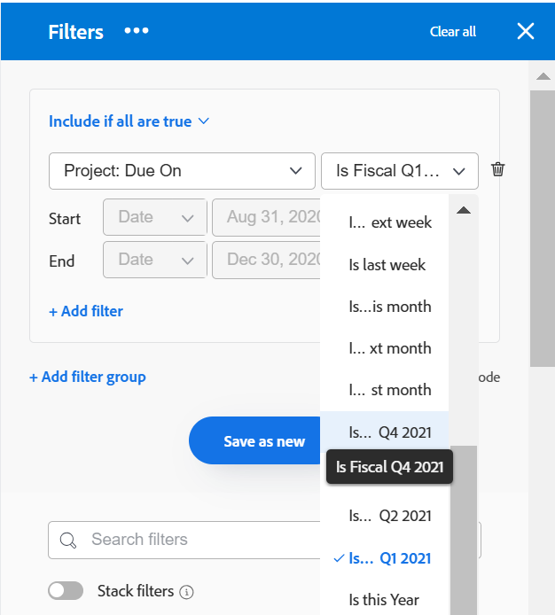

# Aktivera anpassade kvartal

<!--Audited: 11/2024-->

I rapporteringssyfte kan du skapa anpassade kvartal om organisationens kvartal baseras på andra specifika villkor än kalenderdatum (t.ex. arbetsdagar eller kunddagar).

Beroende på vilka produkter ditt företag har köpt kan du konfigurera följande antal kvartal under Konfigurera för Workfront:

* Kunder som endast har köpt [!DNL Workfront] kan konfigurera upp till åtta anpassade kvartal för sitt [!DNL Adobe Workfront]-system.
* Kunder som har köpt [!DNL Workfront] och [!DNL Workfront Planning] kan konfigurera upp till 100 kvartal för sitt [!DNL Workfront]-system, som också är tillgängligt i [!DNL Planning].

## Åtkomstkrav

+++ Expandera om du vill visa åtkomstkrav för funktionerna i den här artikeln.

<table style="table-layout:auto"> 
 <col> 
 <col> 
 <tbody> 
  <tr> 
   <td>[!DNL Adobe Workfront] package</td> 
   <td>
Alla
</td> 
  </tr> 
  <tr> 
   <td>[!DNL Adobe Workfront] licens</td> 
   <td>
[!UICONTROL Standard]

       
[!UICONTROL Plan]
</td>
  </tr> 
  <tr> 
   <td>Konfigurationer på åtkomstnivå</td> 
   <td>[!UICONTROL System Administrator]</td> 
  </tr> 
 </tbody> 
</table>

Mer information finns i [Åtkomstkrav i Workfront-dokumentationen](/help/quicksilver/administration-and-setup/add-users/access-levels-and-object-permissions/access-level-requirements-in-documentation.md).

+++

## Konfigurera anpassade kvartal för ditt [!DNL Workfront]-system

{{step-1-to-setup}}

1. Klicka på **[!UICONTROL Project Preferences]** > **[!UICONTROL Projects].**

1. Välj **[!UICONTROL Timelines]** i avsnittet **[!UICONTROL Enable Custom Quarters]**.

1. Ange ett namn för det anpassade kvartalet, till exempel&quot;Räkenskapskvot 1 2021&quot;.
1. Välj start- och slutdatum för det anpassade kvartalet.

   

1. (Valfritt) Klicka på **[!UICONTROL Add Custom Quarter]** om du vill lägga till ytterligare anpassade kvartal i systemet.

   >[!IMPORTANT]
   >
   > Om ditt företag har köpt [!DNL Workfront Planning] kan du inte spara dina anpassade kvartal om det finns luckor eller överlappningar mellan kvartalen.
   >
   >Mellanrum och överlappningar mellan kvartalen tillåts bara för [!DNL Workfront] kunder.

1. (Valfritt och villkorligt) Om ditt företag bara har köpt [!DNL Workfront], utan [!DNL Workfront Planning], skapar du ett rapportelement som refererar till räkenskapskvartalen.

   **Exempel:** Skapa ett filter för en [!UICONTROL project]-lista och inkludera planerat slutförandedatum för ett projekt som refererar till anpassade kvartal.

   

   Referenserna till &quot;Detta kvartal&quot;, &quot;Nästa kvartal&quot; och &quot;Sista kvartalet&quot; ersätts med nya referenser till de anpassade kvartalen.

   Mer information om rapportelement finns i [Rapportera element: filter, vyer och grupperingar](../../../reports-and-dashboards/reports/reporting-elements/reporting-elements-filters-views-groupings.md).

   Mer information om hur du skapar filter finns i [Skapa eller redigera filter i [!DNL Adobe Workfront]](../../../reports-and-dashboards/reports/reporting-elements/create-filters.md).
1. (Valfritt och villkorligt) Om du har tillgång till [!DNL Workfront Planning] går du till en posttypssida och öppnar en tidslinjevy. I vyn visas de nya anpassade kvartalen.
Mer information finns i [Hantera tidslinjevyn](/help/quicksilver/planning/views/manage-the-timeline-view.md).
