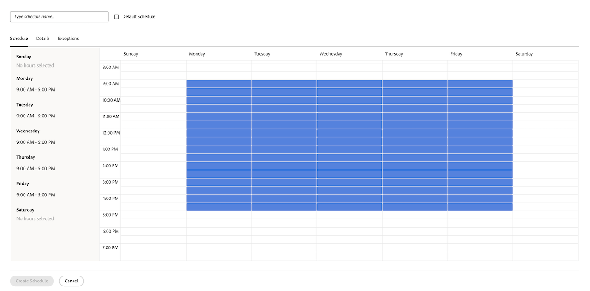
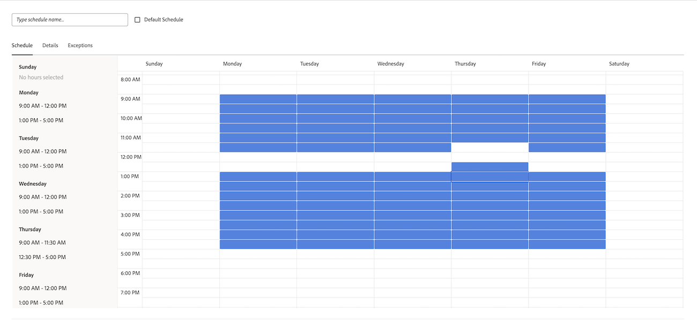
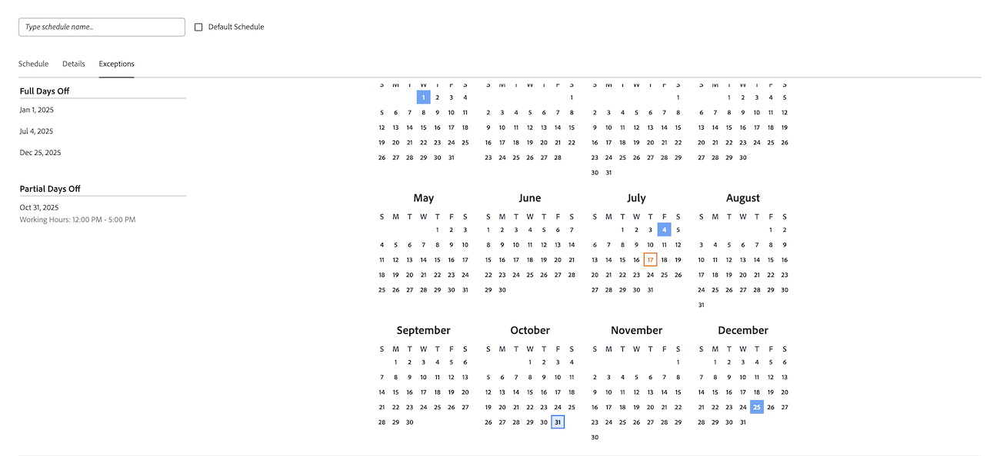

# Skapa ett schema

<!--Audited: 01/2024-->

<!--DON'T DELETE, DRAFT OR HIDE THIS ARTICLE. IT IS LINKED TO THE PRODUCT, THROUGH THE CONTEXT SENSITIVE HELP LINKS. 
Linked to Editing Users, Editing Projects, Creating and managing groups
-->

Som en [!DNL Adobe Workfront] kan du definiera din arbetsvecka med scheman. Du kan associera ett schema med en användare eller ett projekt. Detta gör att [!DNL Workfront] för att beräkna tidslinjer och användartillgänglighet.

När du har användare som arbetar i olika tidszoner ser du till att deras arbete registreras i genom att skapa ett schema i varje tidszon och associera det med dessa användare [!DNL Workfront] i realtid och att deras tillgänglighet alltid är korrekt beroende på när de arbetar.

Mer information om hur du associerar scheman med användare och projekt finns i [Redigera en användares profil](../../../administration-and-setup/add-users/create-and-manage-users/edit-a-users-profile.md) och [Redigera projekt](../../../manage-work/projects/manage-projects/edit-projects.md).

Gruppadministratörer kan också skapa scheman som är kopplade till de grupper som de hanterar. Mer information finns i [Skapa och ändra en grupps scheman](../../../administration-and-setup/manage-groups/work-with-group-objects/create-and-modify-a-groups-schedules.md).

Mer information om hur du använder scheman för att hjälpa användare att samarbeta i [!DNL Workfront] över tidszoner, se [Arbeta över tidszoner](../../../workfront-basics/tips-tricks-and-troubleshooting/working-across-timezones.md).

Mer information om hur scheman används vid resursplanering finns i [Översikt över scheman](/help/quicksilver/administration-and-setup/set-up-workfront/configure-timesheets-schedules/schedules-overview.md) och [Översikt över resursplanering](/help/quicksilver/resource-mgmt/resource-planning/get-started-resource-planner.md).

## Åtkomstkrav

Du måste ha följande åtkomst för att kunna utföra stegen i den här artikeln:

<table style="table-layout:auto"> 
 <col> 
 <col> 
 <tbody> 
  <tr> 
   <td role="rowheader">[!DNL Adobe Workfront] plan</td> 
   <td>Alla</td> 
  </tr> 
  <tr> 
   <td role="rowheader">[!DNL Adobe Workfront] licens</td> 
   <td>
Nytt: [!UICONTROL Standard]

       
eller

       
Aktuell: [!UICONTROL Plan]
</td>
  </tr> 
  <tr> 
   <td role="rowheader">Konfigurationer på åtkomstnivå</td> 
   <td>Du måste vara en [!DNL Workfront] administratör. </td> 
  </tr> 
 </tbody> 
</table>

Mer information om tabellen finns i [Åtkomstkrav i Workfront-dokumentation](/help/quicksilver/administration-and-setup/add-users/access-levels-and-object-permissions/access-level-requirements-in-documentation.md).

## Skapa ett schema

{{step-1-to-setup}}

1. Klicka på **[!UICONTROL Schedules]**.
1. Klicka på **[!UICONTROL New Schedule]**.
1. Ange ett namn för schemat.
1. (Valfritt) Välj **[!UICONTROL Default Schedule]** om du vill identifiera det här schemat som standard.

   Du måste ha minst ett schema i [!DNL Workfront]. Om du bara har ett är det standardschemat.

   Du kan ha fler än ett schema, men du kan bara ha ett standardschema.

   >[!NOTE]
   >
   >Du kan inte ange ett schema som standardschema om du är gruppadministratör. Endast en [!DNL Workfront] kan administratören ange ett schema som standard för systemet.

   

1. På **[!UICONTROL Schedule]** väljer du ett dagligt schema genom att dra den blå konturen över timblocken för att markera dem.

   Vi rekommenderar att du väljer 8 1-timmars block under en 9-timmars tidsperiod. Det här tar plats för lunch eller andra pauser.

   

1. På **[!UICONTROL Details]** anger du följande information:

   <table style="table-layout:auto">
    <tr>
     <td>[!UICONTROL Group with Administration Access]</td>
     <td>
Markera gruppen vars administratörer har behörighet att redigera schemat.

     
<b>VIKTIGT</b>:

      <ul>
       <li>
       
Om du är gruppadministratör och skapar ett schema är det här fältet obligatoriskt.

       
Som gruppadministratör kan du bara skapa ett schema om det är avsett för en grupp eller undergrupp som du är utsedd som administratör för.

       
Om du bara hanterar en grupp markeras gruppen som standard i det här fältet.

       
Om du hanterar flera grupper måste du markera en grupp i det här fältet innan du kan spara schemat.
</li>
       <li>Om du är [!DNL Workfront] om administratören skapar ett schema är det här fältet valfritt. När du skapar ett schema utan att associera det med en grupp, sparas det som ett schema på systemnivå och kan inte hanteras av en gruppadministratör för någon grupp.
       
Scheman som tilldelats konton eller projekt är synliga för alla användare som kan redigera dessa objekt. Detta gäller för scheman på både systemnivå och gruppnivå.

       </li>
       
Om du anger en grupp med administrationsåtkomst för ett schema tilldelas inte schemat till användarna i gruppen. Det tillåter bara gruppadministratörer i gruppen att redigera, ta bort och kopiera schemat.

       
Gruppadministratörer kan inte redigera, ta bort eller kopiera scheman på systemnivå. Mer information finns i <a href="../../../administration-and-setup/manage-groups/group-roles/group-administrators.md" class="MCXref xref">Gruppadministratörer</a>.
     </td>
    </tr>
    <tr>
     <td>[!UICONTROL Groups with View Access]</td>
     <td>
Markera grupperna med [!UICONTROL View] som kan se schemat.

     
Det är bara användarna i de grupper som anges här som kan hitta schemat i listrutan när de tilldelar det till användare eller projekt.
</tr>
    <tr>
     <td>[!UICONTROL Time Zone]</td>
     <td>
Välj tidszon för schemat.

     
Om du associerar schemat med en användare rekommenderar vi att tidzonen för schemat matchar användarens tidszon. Mer information om användarens tidszoner finns i <a href="../../../administration-and-setup/add-users/create-and-manage-users/edit-a-users-profile.md" class="MCXref xref">Redigera en användares profil.
     </td>
    </tr>
   </table>

1. På **[!UICONTROL Exceptions]** anger du eventuella undantag för schemat.

   Undantag är hela eller halva dagar som måste uteslutas från schemat, t.ex. helger eller företagsevenemang.

   >[!NOTE]
   >
   >Om du redan vet vilka de återkommande schemaundantagen är kan du definiera schemaundantagen för många år i framtiden.

   Du kan undanta hela eller delar av dagar från arbetsschemat. Klicka på datumet för att markera det som ett undantag och välj sedan **[!UICONTROL All day]** för att ange om undantaget är en hel dag eller inte.

   

1. Ange start- och sluttid för undantagen för partiella dagar.

   

1. Klicka **[!UICONTROL Save]** och sedan klicka **[!UICONTROL Save]Ändringar**.

1. (Valfritt) Associera schemat med en användare.

   Mer information finns i [Redigera en användares profil](../../../administration-and-setup/add-users/create-and-manage-users/edit-a-users-profile.md).

1. (Valfritt) Associera schemat med ett projekt.

   Mer information finns i [Redigera projekt](../../../manage-work/projects/manage-projects/edit-projects.md).
