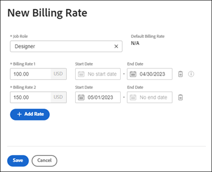

# Åsidosätt faktureringssatser för jobbroller på företagsnivå

När en jobbroll skapas kan du välja en timfaktureringsfrekvens för den rollen. Du kan skapa flera faktureringspriser per timme som är specifika för ett företag. Varje faktureringstaxa gäller för ett visst datumintervall.

På projektnivå kan du aktivera ett alternativ för att tillåta faktureringstariffer på företagsnivå att åsidosätta projektnivåfrekvenser. Mer information finns i [Åsidosätt faktureringstariffer på projektnivå med faktureringstariffer på företagsnivå](../../../manage-work/projects/project-finances/override-project-level-with-company-level-billing-rates.md).

## Åtkomstkrav

+++ Expandera om du vill visa åtkomstkrav för funktionerna i den här artikeln.

Du måste ha följande åtkomst för att kunna utföra stegen i den här artikeln:

<table style="table-layout:auto"> 
 <col> 
 <col> 
 <tbody> 
  <tr> 
   <td role="rowheader">[!DNL Adobe Workfront] plan</td> 
   <td> 
Alla 
 </td> 
  </tr> 
  <tr> 
   <td role="rowheader">[!DNL Adobe Workfront] licens</td> 
   <td>
   
Nytt: [!UICONTROL Standard]

   
eller

   
Aktuell: [!UICONTROL Plan]
</td> 
  </tr> 
  <tr> 
   <td role="rowheader">Konfigurationer på åtkomstnivå</td> 
   <td> 
Administrativ åtkomst till företag om du inte är systemadministratör

   
Redigera åtkomst till finansiella data
 </td> 
  </tr> 
 </tbody> 
</table>

Mer information om informationen i den här tabellen finns i [Åtkomstkrav i Workfront-dokumentationen](/help/quicksilver/administration-and-setup/add-users/access-levels-and-object-permissions/access-level-requirements-in-documentation.md).

+++

## Åsidosätta eller ändra en fastställd faktureringsfrekvens som används för en specifik jobbroll

{{step-1-to-setup}}

1. Klicka på **[!UICONTROL Companies]**.
1. Leta reda på företaget där jobbrollen är tilldelad.
1. Klicka på företagsnamnet i listan.
1. Klicka på **[!UICONTROL Billing Rates]** i den vänstra panelen.
1. Klicka på **[!UICONTROL Add Billing Rate]>[!UICONTROL New Billing Rate]** eller välj en befintlig frekvens att redigera.
1. I dialogrutan [!UICONTROL New Billing Rate] väljer du en [!UICONTROL **jobbroll**] för att definiera faktureringsfrekvensen.

   [!UICONTROL **Standardfaktureringshastighet**] visar systemnivåfrekvensen för den här jobbrollen.

   

1. I fältet [!DNL **Faktureringstariffer 1**] anger du faktureringstaxan. Klicka sedan på [!UICONTROL **Spara**] för att åsidosätta faktureringstakten en gång.

   eller

   Klicka på [!UICONTROL **Lägg till ränta**] om du vill lägga till fler faktureringstariffer med giltighetsdatum.

1. (Villkorligt) Om du lägger till mer än en faktureringsavgift anger du följande information:

   * **[!UICONTROL Billing Rates 1], 2 osv.**: Värdet för faktureringssatsen för tidsperioden.
   * **[!UICONTROL Start Date]**: Det datum då tariffen börjar gälla.
   * **[!UICONTROL End Date]**: Datumet då hastigheten slutar.

     Faktureringsränta 1 har inget startdatum och den senaste faktureringstakten har inget slutdatum. Vissa datum läggs till automatiskt. Om t.ex. Faktureringstariff 1 inte har något slutdatum och du lägger till Faktureringstariff 2 med startdatumet 1 maj 2023, läggs slutdatumet 30 april 2023 till Faktureringstariff 1 så att inga luckor uppstår.

1. Klicka på [!UICONTROL **Spara**].

   >[!NOTE]
   >
   >Jobbrollsatser som ändras i projektet påverkar bara det projektet. Kurser som ändras på företagsnivå kommer att påverka alla projekt. Mer information finns i [Översikt över åsidosättande av faktureringstaxor för jobbroller och beräkning av intäkter för ett projekt](../../../manage-work/projects/project-finances/override-role-billing-rates-and-calculate-project-revenue.md).
