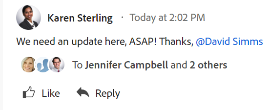

# Översikt över systemspårade uppdateringar

<!-- Audited: 06/2025-->

[!DNL Adobe Workfront] fångar aktiviteten som äger rum på vissa objekt genom att logga statusinformation i objektets [!UICONTROL Updates] -avsnitt.

Mer information om uppdateringsavsnittet finns i [Översikt över uppdateringsavsnittet](/help/quicksilver/workfront-basics/updating-work-items-and-viewing-updates/updates-tab-overview.md).

Området [!UICONTROL Updates] innehåller följande typer av uppdateringar:

* **Användaruppdateringar:** Användare har angett manuellt. Kallas även kommentarer, svar och anteckningar. Användaruppdateringar visas på flikarna Kommentarer och Alla i uppdateringsavsnittet för ett objekt.

  Mer information om hur du konfigurerar användaruppdateringar finns i [Konfigurera inställningar för användaruppdateringar](../../../administration-and-setup/set-up-workfront/system-tracked-update-feeds/configure-preferences-user-updates.md).

  

* **Systemuppdateringar:** Automatiskt utförd av systemet. En systemuppdatering innehåller en kort anteckning som beskriver vilken typ av ändring som har gjorts för objektet. Systemuppdateringar visas i systemaktiviteten och på flikarna Alla i uppdateringsavsnittet för ett objekt.

  Mer information om systemuppdateringsfeeds och hur du aktiverar dem finns i [Konfigurera systemuppdateringar](../../../administration-and-setup/set-up-workfront/system-tracked-update-feeds/configure-system-updates.md).

  

  <!--
  DRAFTED IN FLARE:
  Timestamps for system updates are based on your operating system's timezone.
  
  -->

## Överväganden om systemspårade uppdateringar

Systemspårade uppdateringar är inte tillgängliga för alla objekt som har uppdateringsområdet.

* Området [!UICONTROL Updates] är tillgängligt för följande objekt:

   * [!UICONTROL Project]
   * [!UICONTROL Task]
   * [!UICONTROL Issue]
   * [!UICONTROL Portfolio]
   * [!UICONTROL Program]
   * [!UICONTROL User]
   * [!UICONTROL Template]
   * [!UICONTROL Template Task]
   * [!UICONTROL Team]
   * [!UICONTROL Document]
   * [!UICONTROL Timesheet]
   * [!UICONTROL Story]

     I [!DNL Workfront] är en artikel en uppgift.
   * [!UICONTROL Iteration]
   * [!UICONTROL Goal]

     Alla Workfront-paket innehåller inte Workfront-mål. Mer information finns i [Krav för att använda Workfront-mål](../../../workfront-goals/goal-management/access-needed-for-wf-goals.md).
   * [!UICONTROL Card] på en bräda

     Mer information om uppdateringar av kort finns i [Använda anslutna kort på kort](../../../agile/get-started-with-boards/connected-cards.md).

* [!DNL Workfront] spårar inte systemuppdateringar för följande objekt:

   * [!UICONTROL Team]
   * [!UICONTROL Template]
   * [!UICONTROL Template Task]
   * Ad-hoc [!UICONTROL Card]
   * [!UICONTROL Iterations]

<!--hiding this bit because this is not true, at this time (August 2023). Users with a Work or Review license can see system updates by default as well.

Your [!DNL Workfront] license determines whether system updates display by default in the [!UICONTROL Updates] area of objects. [!DNL Workfront] users with a [!UICONTROL Plan] license have system updates displayed in the [!UICONTROL Updates] area by default. However, users can filter out system updates, as described in the [Enable or disable system updates](../../../workfront-basics/updating-work-items-and-viewing-updates/update-work.md#enable) section in [Update work](../../../workfront-basics/updating-work-items-and-viewing-updates/update-work.md). All other [!DNL Workfront] licenses filter system updates by default.
-->

* Användaruppdateringar visas på fliken Kommentarer och systemuppdateringar visas på flikarna Systemaktivitet och Alla.

  En lista över objekt som inte har systemaktiviteten eller flikarna Alla finns i [Översikt över uppdateringsavsnittet](/help/quicksilver/workfront-basics/updating-work-items-and-viewing-updates/updates-tab-overview.md)

* Du kan inte lägga till ett svar i en systemuppdatering. Eventuella svar på systemaktivitetsposter i den tidigare kommentarsfunktionen före 11 april 2024 fylls dock i på fliken Systemaktivitet som skrivskyddade.

<!--
* The following are differences between the new and the legacy commenting experience: 

   * When using the new commenting experience, user updates display in the Comments tab and system updates display in the System Activity and the All tabs.  

      For more information about the new commenting experience, see [New commenting experience](../../../product-announcements/betas/new-commenting-experience-beta/unified-commenting-experience.md).

      For a list of objects that do not have the System Activity or the All tabs, see [Update section overview](/help/quicksilver/workfront-basics/updating-work-items-and-viewing-updates/updates-tab-overview.md)

   * When using the new commenting experience, you cannot add a comment to a system update. However, any replies made to system activity records in the legacy commenting experience are populated on the System Activity tab as read-only in the new commenting experience.
   * When using the legacy commenting experience, the system and user updates display in one continuous feed. 

   * When using the legacy commenting experience, users can view system updates by default or they can choose to not display them. Disabling system updates is not possible when using the new commenting experience. 

      For information about disabling the display of system updates, see the section [Enable or disable system updates](../../../workfront-basics/updating-work-items-and-viewing-updates/update-work.md#enable) in the article [Update work](../../../workfront-basics/updating-work-items-and-viewing-updates/update-work.md).  

   * The legacy commenting experience has been disabled in the Preview environment. For more information, see [Second Quarter 2024 Update stream and notification enhancements](/help/quicksilver/product-announcements/product-releases/24-q2-release-activity/24-q2-update-stream-enhancements.md).
-->

* [!DNL Workfront]-administratörer kan definiera vilken typ av ändringar som systemet ska spåra i området [!UICONTROL Updates]. Alla objekt som har ett [!UICONTROL Updates]-område har inte också konfigurerbara [!UICONTROL update]-feeds. Följande objekt har ett [!UICONTROL Updates]-område som hämtar systemspårade uppdateringsfeeds, men som inte har konfigurerbara uppdateringsfeeds:

   * [!UICONTROL Document]
   * [!UICONTROL Timesheet]
   * [!UICONTROL Iteration]
   * [!UICONTROL Goal]

