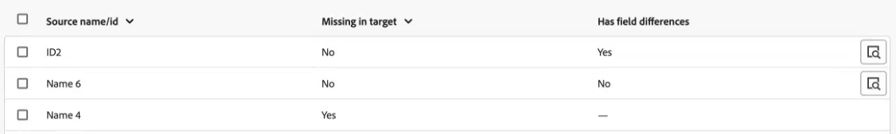

# Jämför objekt mellan miljöer

Du kan jämföra objekt mellan miljöer för att se till att dina miljöerbjudandepaket innehåller de objekt du behöver.

Du väljer miljöer och objekttyper att jämföra. Workfront jämför alla objekt av de valda typerna i båda miljöerna och visar data om objektskillnaderna.

## Åtkomstkrav

Du måste ha följande:

<table>
  <tr>
   <td><strong>[!DNL Adobe Workfront] plan</strong>
   </td>
   <td> Prime eller Ultimate (endast nya planer)
   </td>
  </tr>
  <tr>
   <td><strong>[!DNL Adobe Workfront] licenser</strong>
   </td>
   <td> [!UICONTROL Standard]
   </td>
  </tr>
   <tr>
   <td>Konfigurationer på åtkomstnivå
   </td>
   <td>Du måste vara en [!DNL Workfront]-administratör.
   </td>
  </tr>
</table>

Mer information om informationen i den här tabellen finns i [Åtkomstkrav i Workfront-dokumentationen](/help/quicksilver/administration-and-setup/add-users/access-levels-and-object-permissions/access-level-requirements-in-documentation.md).

## Förutsättningar

Din organisation måste finnas på Adobe Business Platform för att kunna jämföra objekt mellan miljöer.

## Generera en objektjämförelse

1. Gå till en miljö som du vill jämföra ett objekt i.
1. Klicka på ikonen **[!UICONTROL Main Menu]**  i det övre högra hörnet av Adobe Workfront, eller (om den är tillgänglig) klicka på ikonen **[!UICONTROL Main Menu]**  i det övre vänstra hörnet och klicka sedan på **[!UICONTROL Setup]** .
1. Välj **System** i den vänstra navigeringen och välj sedan **Miljökampanj**.
1. Klicka på **Jämför miljöer** i skärmens övre högra hörn.
1. I fältet **Source-miljö** väljer du den miljö som du vill skapa paketet i. Det här är miljön som du kopierar objekt **från**.
1. I fältet **Målmiljö** väljer du den miljö där du vill installera paketet. Det här är miljön som du kopierar objekt **till**.
1. I området **Objekt som ska jämföras** väljer du de objekttyper som du vill jämföra mellan miljöer.
1. Klicka på **Generera jämförelse** i skärmens övre högra hörn.

   Jämförelsen kan ta en stund att generera, beroende på antalet jämförda objekt och storleken.

## Visa objektjämförelse

När jämförelsen är klar visas jämförelsen.

Listan innehåller objekt av de valda typerna som finns i källmiljön, om de objekten saknas i målmiljön och om det finns fältskillnader mellan dem.

>[!BEGINSHADEBOX]

I detta exempel:

* Den första raden visar ett objekt som finns i målmiljön, men som inte är i källmiljön.
* På den andra raden visas ett objekt som finns i målmiljön och som är samma som i källmiljön.
* Den tredje raden visar ett objekt som inte finns i målmiljön.

>[!ENDSHADEBOX]

Så här visar du specifika objektskillnader:

1. Klicka på förstoringsglasikonen  på raden för det objektet.

   Ett fönster öppnas med alla objektets fält. skillnaderna markeras med rött.

## Skapa ett paket från en objektjämförelse

Du kan skapa ett paket direkt från en objektjämförelse.

Instruktioner finns i [Skapa ett paket från en objektjämförelse](/help/quicksilver/administration-and-setup/set-up-workfront/workfront-testing-environments/environment-promotion-create-package.md#create-a-package-from-an-object-comparison) i artikeln Skapa eller redigera ett miljöhöjdspaket.
