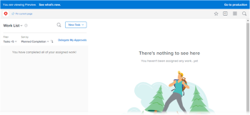

# Sandlådemiljön för förhandsgranskning av [!DNL Adobe Workfront]

<!-- Audited: 12/2023 -->

Det finns två testmiljöer för [!DNL Workfront] som är repliker av din [!DNL Workfront]-produktionsmiljö:

* Sandlådan Förhandsgranska

  Sandlådan för förhandsgranskning är en testmiljö som fungerar som en replik av din aktiva miljö och uppdateras varje helg av [!DNL Workfront]. Data som läggs till i din livemiljö på fredag visas i din förhandsvisningssandlåda senast följande måndag.

  Alla supportpaket har tillgång till förhandsvisnings-sandlådan.

* Sandlådan Anpassad uppdatering

  Sandlådan för anpassad uppdatering är en separat testmiljö som uppdateras manuellt av dig. Det finns en extra kostnad för att hämta den anpassade uppdateringssandlådan. Mer information om den här miljön finns i [Anpassad sandlådemiljö för uppdatering [!DNL Adobe Workfront] .](../../../administration-and-setup/set-up-workfront/workfront-testing-environments/wf-custom-refresh-sandbox-environment.md)

<table style="table-layout:auto"> 
 <col> 
 <col> 
 <col> 
 <thead> 
  <tr> 
   <th> 
 
 </th> 
   <th> 
<strong>[!UICONTROL Standard] Support Package</strong> 
 </th> 
   <th> 
<strong>[!UICONTROL Plus], [!UICONTROL Preferred] och [!UICONTROL Enterprise] Supportpaket </strong> 
 </th> 
  </tr> 
 </thead> 
 <tbody> 
  <tr> 
   <td scope="col"> 
Förhandsgranska sandlåda
 </td> 
   <td scope="col"> 
✔
 </td> 
   <td scope="col"> 
✔
 </td> 
  </tr> 
  <tr> 
   <td scope="col"> 
Anpassad uppdateringssandlåda
 </td> 
   <td scope="col"> 
 
 </td> 
   <td scope="col"> 
✔
 </td> 
  </tr> 
 </tbody> 
</table>

## Förhandsgranska sandlåda

Sandlådan Preview fungerar som en miljö där användare i organisationen kan testa och arbeta med data från produktionsmiljön utan att påverka produktionsmiljön.

Sandlådan Preview innehåller dina faktiska produktionsdata, men den uppdateras varje helg så att data kan ligga upp till en vecka bakom produktionsmiljön. Objekt som har skapats sedan den senaste uppdateringstiden finns i förhandsvisningens sandlådemiljö tills nästa uppdatering.

Data flödar åt samma håll, från produktion till förhandsgranskning, och inte åt andra hållet. En uppdatering av förhandsvisningsmiljön schemaläggs alltid av [!DNL Workfront] varje helg.

Med Förhandsgranska sandlåda kan [!DNL Workfront] även distribuera nya funktioner i en säker miljö innan de är klara att distribueras till Produktion. Du kan testa de nya funktionerna och ge [!DNL Workfront] feedback om deras funktioner genom att gå till förhandsvisningssandlådan. Därför ligger koden för förhandsvisningssandlådan alltid före produktionskoden, även om dina data uppdateras varje vecka.

Förhandsvisningsmiljön är idealisk för att köra utbildningar, testa nya funktioner och fastställa installationsfunktioner.

>[!NOTE]
>
>Lägg märke till den blå banderollen högst upp på skärmen när du öppnar förhandsvisningssandlådan. Banderollen kan inte tas bort medan du arbetar i den här miljön.
>
>Namnet på miljön som du använder (förhandsversion) och den officiella versionen av koden visas på banderollen. Klicka på **[!UICONTROL See what's new]** om du vill ha information om den versionen.
>
>

## Åtkomst till sandlådan Förhandsgranska

Som standard har du som [!DNL Workfront]-administratör åtkomst till [!UICONTROL Preview]-sandlådemiljön. Om du inte kan komma åt sandlådemiljön [!UICONTROL Preview] enligt beskrivningen i det här avsnittet kontaktar du [!DNL Workfront]-administratören eller vårt kundsupportteam.

### Åtkomst till förhandsgranskningssandlådan från gränssnittet [!DNL Workfront] {#accessing-the-preview-sandbox-from-the-workfront-interface}

Som [!DNL Workfront]-administratör kan du komma åt förhandsgranskningssandlådan via gränssnittet [!DNL Workfront].

Så här kommer du åt förhandsvisningssandlådan:

{{step-1-to-setup}}

1. Klicka på **[!UICONTROL System]** > **[!UICONTROL Preferences]**.

1. Klicka på **[!UICONTROL Test Environments]** i avsnittet **[!UICONTROL Sandbox Preview]**.

1. Logga in med dina autentiseringsuppgifter för förhandsgranskning.

   Dessa bör vara samma som dina produktionsuppgifter, såvida du inte har ändrat dem i Production efter att Preview-uppdateringen har utförts. Inloggningarna synkroniseras bara när en uppdatering görs. De synkroniseras inte automatiskt.

### Åtkomst till förhandsvisningssandlådan med en URL {#accessing-the-preview-sandbox-using-a-url}

Du kommer åt förhandsgranskningssandlådan via en URL.

#### Åtkomst till förhandsgranskningssandlådan för konton i kluster 1,2,3 och 5 {#accessing-the-preview-sandbox-for-accounts-on-cluster-1-2-3-and-5}

URL:en för förhandsgranskningssandlådan är: `https://companyname.preview.workfront.com/`.

>[!NOTE]
>
>Om du har bokmärken som länkar till den gamla URL:en för förhandsvisningssandlådan, bör du notera den här ändringen och uppdatera URL:en i bokmärkena.

Så här loggar du in i förhandsvisningssandlådan med en URL:

1. Navigera till denna URL: `https://companyname.preview.workfront.com/`.

   Om du är EMEA-kund och ditt konto finns i kluster 4, se avsnittet Åtkomst till förhandsgranskningssandlådan för konton i kluster 4 (EMEA-konton) nedan.

1. Logga in med dina autentiseringsuppgifter för förhandsgranskning.

   >[!TIP]
   >
   >Dina autentiseringsuppgifter för förhandsgranskning bör vara desamma som dina produktionsuppgifter, såvida du inte har ändrat dem i Produktion efter att uppdateringen av förhandsvisningen har ägt rum. Inloggningarna synkroniseras bara när en uppdatering görs. De synkroniseras inte automatiskt.

#### Åtkomst till sandlådan Preview för konton i kluster 4 (EMEA-konton) {#accessing-the-preview-sandbox-for-accounts-on-cluster-4-emea-accounts}

Så här loggar du in i förhandsvisningssandlådan med en URL:

1. Navigera till denna URL: `https://companyname.preview.workfront.com/`.

   Du kan även få åtkomst till förhandsgranskningssandlådan genom att gå till [https://cl04.preview.workfront.com/login](https://cl04.preview.workfront.com/login).

1. Logga in med dina autentiseringsuppgifter för förhandsgranskning.

   Dina autentiseringsuppgifter för förhandsgranskning bör vara desamma som dina produktionsuppgifter, såvida du inte har ändrat dem i Produktion efter att uppdateringen av förhandsvisningen har ägt rum. Inloggningarna synkroniseras bara när en uppdatering görs. De synkroniseras inte automatiskt.

## Ta emot e-postmeddelanden från sandlådan Förhandsgranska

Workfront inaktiverar all e-postkommunikation från sandlådemiljön Preview. Om du vill få e-postmeddelanden från förhandsgranskningssandlådemiljön måste du aktivera den här funktionen i dina användarinställningar. Mer information om hur du aktiverar e-postmeddelanden i sandlådemiljön för förhandsgranskning finns i [Aktivera leverans av e-postmeddelanden från sandlådemiljön för förhandsgranskning](../../../workfront-basics/using-notifications/enable-delivery-emails-from-preview-sandbox-environment.md).

>[!NOTE]
>
>Rapportleverans och push-meddelanden på mobilappen är alltid inaktiverade för förhandsvisningssandlådemiljön. Varken du eller administratören för [!DNL Workfront] kan aktivera rapportleverans eller push-meddelanden för mobilappen när du använder sandlådemiljön för förhandsgranskning.
>
>Mer information om rapportleveranser för produktionsmiljön finns i [Översikt över rapportleverans](../../../reports-and-dashboards/reports/creating-and-managing-reports/set-up-report-deliveries.md).

## enkel inloggning (SSO)

Om du använder enkel inloggning bör du samarbeta med vårt kundsupportteam för att se till att den är korrekt konfigurerad så att du kan använda dina autentiseringsuppgifter för enkel inloggning för att logga in på sandlådan [!UICONTROL Preview]. Om din första inloggning misslyckas kontaktar du din vanliga supportkontakt eller [!DNL Workfront]-administratören för att få hjälp.

Mer information om enkel inloggning finns i [Översikt över enkel inloggning i Adobe Workfront](../../../administration-and-setup/add-users/single-sign-on/sso-in-workfront.md).

## Konfigurera enkel inloggning i förhandsgranskningssandlådan

>[!IMPORTANT]
>
>Den procedur som beskrivs i det här avsnittet gäller endast för organisationer som ännu inte har anslutit till [!DNL Adobe Admin Console]. Eftersom alla organisationer nu har anslutit sig till [!DNL Adobe Admin Console] behövs ingen åtgärd.
>
>En lista över procedurer som skiljer sig åt beroende på om din organisation har anslutit sig till [!DNL Adobe Admin Console] finns i [Plattformsbaserade administrationsskillnader ([!UICONTROL Adobe Workfront]/[!UICONTROL Adobe Business Platform])](../../../administration-and-setup/get-started-wf-administration/actions-in-admin-console.md).
>
>Det här avsnittet kommer att tas bort inom den närmaste framtiden.

Om du vill konfigurera din förhandsvisningssandlåda så att den fungerar med en enkel inloggningslösning kan du göra det genom att konfigurera den separat från produktionsmiljön. Konfigurationen av enkel inloggning i förhandsgranskningssandlådan är oberoende av SSO-konfigurationen i produktionsmiljön.

När din förhandsvisningssandlåda uppdateras (varje helg) kopieras inte SSO-informationen från din produktionsmiljö för att skriva över konfigurationen för förhandsvisningssandlådan.

Stegen för att konfigurera enkel inloggning i förhandsgranskningssandlådan liknar de som används för att konfigurera den i produktionsmiljön.

Mer information om hur du konfigurerar [!DNL Workfront] med enkel inloggning finns i [Översikt över enkel inloggning i Adobe Workfront](../../../administration-and-setup/add-users/single-sign-on/sso-in-workfront.md).

## Automatisk omberäkning av projekttidslinjer

Genom att beräkna om tidslinjer kan chefer se hur krafter utanför projektet påverkar projektets tidslinje. Ett projekts tidslinje hänvisar till planerade och planerade datum för projektet.

Som Workfront-administratör kan du konfigurera när Workfront automatiskt beräknar om projekttidslinjer. Workfront kan beräkna om projekttidslinjer antingen varje kväll eller när projektomfånget ändras, eller både och.

Mer information finns i [Konfigurera tidslinjeomberäkningar för projekt](/help/quicksilver/administration-and-setup/set-up-workfront/configure-system-defaults/configure-timeline-recalculations-projects.md).

I förhandsvisningsmiljön är nattomberäkningen inaktiverad och projekttidslinjerna beräknas inte om automatiskt. Du måste beräkna om projekttidslinjen manuellt för förhandsvisningsmiljön. Mer information finns i [Beräkna om projekttidslinjer](/help/quicksilver/manage-work/projects/manage-projects/recalculate-project-timeline.md).

## Prestanda och tillgänglighet för förhandsvisningsmiljön

* [!DNL Workfront] Förhandsgranskningsmiljöer är inte avsedda för prestanda- eller inläsningstestning. Använd i stället dessa miljöer för att validera funktionaliteten med organisationens befintliga arbetsflöden.

* Arbetsflöden som innefattar dokument bör fokusera på processen och inte på inläsningstestning. Stora filer stöds inte i sandlådemiljöer.

* [!DNL Workfront] Förhandsvisningsmiljöer är alltid tillgängliga.

* Alla avbrott i en [!DNL Workfront]-förhandsvisningsmiljö under normal kontorstid kommer att vara den första prioriteten omedelbart efter att eventuella produktionsproblem har lösts.

* Alla avbrott i en [!DNL Workfront]-förhandsvisningsmiljö på helger (lördagar och söndagar) adresseras så att miljön körs under kontorstid på måndag.

* Språkkontroll är inte tillgängligt i förhandsvisningsmiljön.
