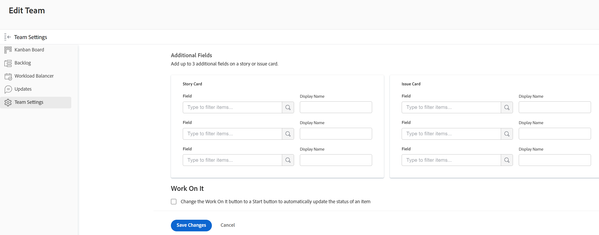
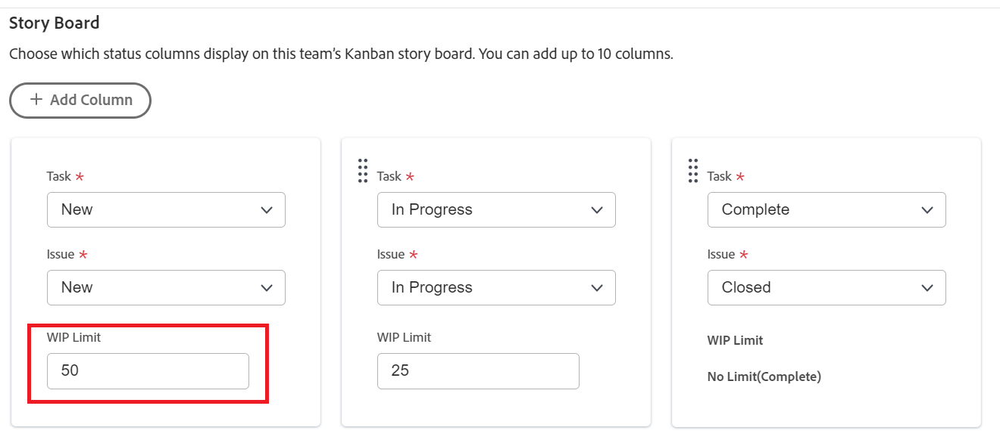

# Konfigurera [!UICONTROL Kanban]

<!--Audited: 12/2023-->

Du kan skapa ett smidigt team i [!DNL Adobe Workfront] enligt beskrivningen i [Skapa ett smidigt team](../../agile/get-started-with-agile-in-workfront/create-an-agile-team.md). När ni skapar ett smidigt team kan ni välja den metod som teamet använder för att slutföra arbetet. Du kan välja mellan följande alternativ:

* Scrum
* Kanban

I den här artikeln beskrivs hur du konfigurerar inställningarna för ett Kanban-team. När du har skapat ett smidigt team och valt Kanban-metod kan du uppdatera följande inställningar i den här artikeln:

* Om artiklarna beräknas i antal poäng eller timmar
* Statuskolumnerna på den flexibla artikelpanelen
* Ytterligare fält att visa på artikelkort på den flexibla artikelpanelen
* Gränsen för pågående arbete (PIA)
* Så här lägger du automatiskt till artiklar från eftersläpningen
* Hur långa kort stannar på Kanban-tavlan

Mer information om hur du konfigurerar ett Scrum-team finns i [Konfigurera Scrum](../get-started-with-agile-in-workfront/configure-scrum.md).

## Åtkomstkrav

+++ Expandera om du vill visa åtkomstkrav för funktionerna i den här artikeln.

<table style="table-layout:auto"> 
 <col> 
 </col> 
 <col> 
 </col> 
 <tbody> 
  <tr> 
   <td role="rowheader">Adobe Workfront package</td> 
   <td> 
Alla
 </td> 
  </tr>

<tr> 
   <td role="rowheader">Adobe Workfront-licens</td> 
   <td> 
Standard
 
   
Arbeta eller högre
 </td> 
  </tr>

<tr> 
   <td role="rowheader">Konfigurationer på åtkomstnivå</td> 
   <td> 
Redigera åtkomst till team
  </td> 
  </tr>

</tbody> 
</table>

Mer information om informationen i den här tabellen finns i [Åtkomstkrav i Workfront-dokumentationen](/help/quicksilver/administration-and-setup/add-users/access-levels-and-object-permissions/access-level-requirements-in-documentation.md).

+++

## Konfigurera om artiklar ska beräknas i punkter eller timmar

Du kan konfigurera artiklar att beräknas med hjälp av punkter eller timmar.

Så här konfigurerar du hur berättelser beräknas för ditt team:

{{step1-to-team}}

1. Klicka på ikonen **[!UICONTROL Switch Teams]**  och välj sedan ett nytt team i listrutan eller sök efter ett team i sökrutan.
1. Välj det flexibla team som du vill hantera.
1. Klicka på **[!UICONTROL More]**-menyn  och välj sedan **[!UICONTROL Edit]**.

   

1. I avsnittet **[!UICONTROL Agile]** i området **[!UICONTROL Estimate Stories in]** väljer du om du vill använda punkter eller timmar för att beräkna artikelns storlek (arbetsbelastning). Om du väljer Punkter anger du hur många timmar som ska vara lika med 1 punkt. (Standardvärdet är 1 punkt = 8 timmar.) Detta är antalet planerade timmar som läggs till i artikeln.

   **Exempel:** Om du har valt att uppskatta artiklar i punkter och 1 punkt motsvarar 8 timmar, och en artikel beräknas till 3 punkter, läggs 24 planerade timmar till i artikeln.

1. Klicka på **[!UICONTROL Save Changes]**.

## Konfigurera statuskolumner på den flexibla artikelpanelen

Du kan definiera de statusar som finns på artikeltavlan för det flexibla teamet. Det här är de enda statusvärdena som visas på artikelpanelen.

Så här definierar du de statusvärden som är tillgängliga för den artikelpanel som är kopplad till det flexibla teamet:

{{step1-to-team}}

1. Klicka på ikonen **[!UICONTROL Switch Teams]**  och välj sedan ett nytt team i listrutan eller sök efter ett team i sökfältet.

1. Välj det flexibla team som du vill hantera.
1. Klicka på menyn **[!UICONTROL More]** och välj sedan **[!UICONTROL Edit]**.

   

1. Gå till området **[!UICONTROL Agile]** i avsnittet **[!UICONTROL Story Board]**.

1. (Valfritt) Klicka på **[!UICONTROL Add Column]** om du vill lägga till ytterligare en statuskolumn på artikelpanelen.
1. (Valfritt) Dra en statuskolumn med dra och släpp-indikatorn för att ändra ordningen på statuskolumnerna på artikelpanelen. Den första kolumnen kan inte flyttas och du kan inte dra en annan kolumn framför den första kolumnen.

   

1. Välj uppgiftsstatus.

   >[!IMPORTANT]
   >
   >Det går bara att välja låsta statusvärden som omfattar hela systemet. Du kan inte välja gruppspecifika statusar. Status för den första kolumnen motsvarar alltid **[!UICONTROL New]**.

   Du kan lägga till anpassade statusvärden om administratören för [!DNL Workfront] har konfigurerat dem. Mer information finns i [Skapa eller redigera en status](../../administration-and-setup/customize-workfront/creating-custom-status-and-priority-labels/create-or-edit-a-status.md).

1. Klicka på **[!UICONTROL Save Changes]**.

## Konfigurera ytterligare fält som ska visas på artikelkort på den flexibla artikelpanelen

När du lägger till fält i artikelkort är fälten skrivskyddade och visas endast när fältet fylls i.

Som standard visas följande typer av data på artikelkortet för uppgifter och problem:

* Artikelnamn med en länk direkt till uppgiften eller utgåvan
* Projektnamnet med en länk direkt till projektet
* Den här länken visas endast för artiklar, inte för underaktiviteter
* Uppgiften eller utgivningsbeskrivningen
* Aktuellt åtagande
* Visa och redigera procentandelen antingen genom att justera själva procentandelen eller genom att justera antalet punkter eller timmar som ska slutföras
* Tilldelade användare

Du kan visa ytterligare data (inklusive anpassade data) på artikelkort. Du kan visa ytterligare fält på artikelkort av någon anledning. Du kan till exempel visa kund-ID:t om du arbetar med artiklar för flera kunder i iteration, eller om du vill visa projektets startdatum eller projektavslutsdatum.

>[!NOTE]
>
>Om du använder ett anpassat fält på ett artikelkort kan det inte innehålla en punkt (eller punkt) i namnet.

Så här konfigurerar du artikelkort som tilldelats det flexibla teamet så att ytterligare fält visas:

{{step1-to-team}}

1. Klicka på ikonen **[!UICONTROL Switch Teams]**  och välj sedan ett nytt team i listrutan eller sök efter ett team i sökfältet.

1. Välj det flexibla team som du vill hantera.
1. Klicka på menyn **[!UICONTROL More]** och välj sedan **[!UICONTROL Edit]**.

   

1. I avsnittet **[!UICONTROL Agile]** anger du ett fältnamn för att hitta det.

   

1. Markera namnet på det fält som du vill lägga till.
1. Skriv in **[!UICONTROL Display name]** som fältet ska visas på artikeln eller utgivningskortet.
1. Klicka på **[!UICONTROL Save Changes]**.

## Konfigurera PIA-gränsen (Work in Progress)

När du definierar PIA-gränsen för ett Kanban-team kan du styra antalet objekt som teamet arbetar med genom att begränsa antalet uppgifter som kan visas i [!UICONTROL New]- eller [!UICONTROL In Progress]-kolumnen på [!UICONTROL Kanban]-panelen.

När du har konfigurerat PIA-gränsen för ett Kanban-team kan du visa PIA-gränsen och uppdatera den från den [!UICONTROL Kanban] flexibla artikelpanelen, enligt beskrivningen i [Hantera PIA-gränsen på [!UICONTROL Kanban]-panelen](../../agile/use-kanban-in-an-agile-team/work-in-progress-limit-on-the-kanban-board.md).

Så här begränsar du PIA för ditt Kanban-team:

{{step1-to-team}}

1. Klicka på ikonen **[!UICONTROL Switch Teams]**  och välj sedan ett nytt team i listrutan eller sök efter ett team i sökfältet.

1. Välj det Kanban-team som du vill hantera.
1. Klicka på **[!UICONTROL More]**-menyn  och välj sedan **[!UICONTROL Edit]**.

   

1. Kontrollera att Kanban är markerat i avsnittet **[!UICONTROL Agile]** i avsnittet **[!UICONTROL Methodology]**.

1. I avsnittet **[!UICONTROL Story Board]**, i fältet **[!UICONTROL WIP Limit]**, anger du det maximala antalet objekt som tillåts i varje kolumn på den [!UICONTROL Kanban] flexibla artikelpanelen. Du kan ange olika gränser för varje kolumn. Den maximala gräns du kan ange för varje kolumn är 100.
När inställningen är angiven visas ett varningsmeddelande på den [!UICONTROL Kanban] flexibla artikelpanelen när gränsen överskrids för en kolumn på artikelpanelen. Det här varningsmeddelandet visas bara första gången som PIA-gränsen överskrids. Det här varningsmeddelandet visas inte i kolumner som har en status som är lika med [!UICONTROL Complete].
Begränsningen för PIA är bara en visuell varning och förhindrar inte teamet från att ha fler objekt i en enda kolumn än den gräns som du anger.

   

1. Klicka på **Spara ändringar**.

## Konfigurera automatiskt att lägga till artiklar från eftersläpningen

<!-- this functionality needs to be verified-->

Du kan konfigurera artiklar från en eftersläpning så att de automatiskt läggs till i den första kolumnen på [!UICONTROL Kanban]-ritytan omedelbart efter att ett objekt har flyttats från den kolumnen.

{{step1-to-team}}

1. Klicka på ikonen **[!UICONTROL Switch Teams]**  och välj sedan ett nytt team i listrutan eller sök efter ett team i sökfältet.

1. Välj det Kanban-team som du vill hantera.
1. Klicka på **[!UICONTROL More]**-menyn  och välj sedan **[!UICONTROL Edit]**.

   

1. Välj **[!UICONTROL Automatically add next story from backlog]** om du vill konfigurera att nästa objekt från eftersläpningen automatiskt läggs till i kolumnen **[!UICONTROL New]** när ett objekt flyttas bort från kolumnen **[!UICONTROL In Progress]**.

   Användarna måste aktivera inställningen **Visa eftersläpning** på [!UICONTROL Kanban] för att den här funktionen ska börja gälla. När användare aktiverar inställningen [!UICONTROL Show Backlog] för [!UICONTROL Kanban Board] utförs följande funktioner:

   Varje gång en artikel flyttas från kolumnen [!UICONTROL In Progress] till en kolumn på artikelpanelen som representerar en [!UICONTROL Complete]-status (eller en status som är lika med [!UICONTROL Complete]), flyttas en artikel från kolumnen Eftersläpning automatiskt till kolumnen [!UICONTROL New] i kolumnen [!UICONTROL Kanban Board] .
När artikeln läggs till från eftersläpningen läggs artikeln med högst prioritet till på artikelpanelen.

1. Klicka på **[!UICONTROL Save Changes]**.

## Konfigurera hur länge kort ska vara på [!UICONTROL Kanban]-kortet

Du kan välja hur länge färdiga kort ska vara kvar på [!UICONTROL Kanban]. Aktiviteter som faller utanför [!UICONTROL Kanban]-tavlan kan fortfarande nås i det ursprungliga projektet.

{{step1-to-team}}

1. (Valfritt) Klicka på ikonen **[!UICONTROL Switch Teams]**  och välj sedan ett nytt Kanban-team i listrutan eller sök efter ett team i sökfältet.
1. Välj Kanban-teamet.
1. Klicka på **[!UICONTROL More]**-menyn  och välj sedan **[!UICONTROL Edit]**.

   

1. Välj ett värde i listrutan **[!UICONTROL Number of days Completed cards stay on the Kanban board]**.

   Du kan välja mellan 1 och 30 dagar.
1. Klicka på **[!UICONTROL Save Changes]**.
