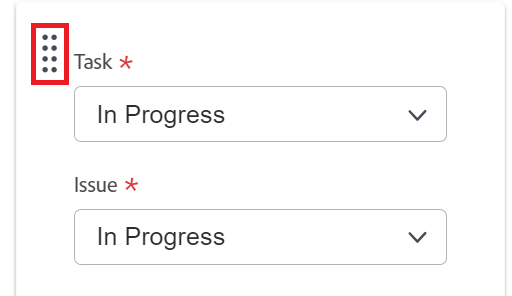

# Konfigurera [!UICONTROL Scrum]

Du kan skapa ett Agile-team i [!DNL Adobe Workfront] enligt beskrivningen i [Skapa ett Agile-team](/help/quicksilver/agile/get-started-with-agile-in-workfront/create-an-agile-team.md). När du skapar ett Agile-team kan du välja den metod som teamet använder för att slutföra sitt arbete. Du kan välja mellan följande alternativ:

* Scrum
* Kanban

I den här artikeln beskrivs hur du konfigurerar inställningarna för ett Scrum-team. När du har skapat ett Agile-team och valt Scrum-metod kan du uppdatera följande inställningar i den här artikeln:

* Om artiklarna beräknas i antal poäng eller timmar
* Statuskolumnerna på Agile-anslagstavlan för iterationer och projekt
* Ytterligare fält att visa på artikelkort på Agile-anslagstavlan
* Hur färgindikatorer används för artiklar på Agile-artikelpanelen
* Hur datum används när arbetsobjekt läggs till i en iteration

Mer information om hur du konfigurerar ett Kanban-team finns i [Konfigurera Kanban](/help/quicksilver/agile/get-started-with-agile-in-workfront/configure-kanban.md).

## Åtkomstkrav

+++ Expandera om du vill visa åtkomstkrav för funktionerna i den här artikeln.

<table style="table-layout:auto"> 
 <col> 
 </col> 
 <col> 
 </col> 
 <tbody> 
  <tr> 
   <td role="rowheader">Adobe Workfront package</td> 
   <td> 
Alla
 </td> 
  </tr>

<tr> 
   <td role="rowheader">Adobe Workfront-licens</td> 
   <td> 
Standard
 
   
Arbeta eller högre
 </td> 
  </tr>

<tr> 
   <td role="rowheader">Konfigurationer på åtkomstnivå</td> 
   <td> 
Redigera åtkomst till team
  </td> 
  </tr>

</tbody> 
</table>

Mer information om informationen i den här tabellen finns i [Åtkomstkrav i Workfront-dokumentationen](/help/quicksilver/administration-and-setup/add-users/access-levels-and-object-permissions/access-level-requirements-in-documentation.md).

+++

## Konfigurera om artiklar ska beräknas i punkter eller timmar

>[!NOTE]
>
>Den här inställningen kan inte ändras om teamet har några pågående iterationer.

Du kan konfigurera artiklar att beräknas med hjälp av punkter eller timmar.

Så här konfigurerar du hur berättelser beräknas för ditt Agile-team:

{{step1-to-team}}

1. Klicka på ikonen **[!UICONTROL Switch team]** och välj sedan ett nytt team i listrutan eller sök efter ett team i sökfältet.
1. Välj det Agile-team som du vill hantera.
1. Klicka på menyn **[!UICONTROL More]** och välj sedan **[!UICONTROL Edit]**.

   Endast teammedlemmar med en [!UICONTROL Standard]-, [!UICONTROL Plan]- eller [!UICONTROL Work]-licens kan se det här alternativet.
   

1. I avsnittet **[!UICONTROL Agile]** i området **[!UICONTROL Estimate Stories in]** väljer du om du vill använda punkter eller timmar för att beräkna artikelns storlek (arbetsbelastning). Om du väljer Punkter anger du hur många timmar som ska vara lika med 1 punkt. (Standardvärdet är 1 punkt = 8 timmar.) Detta är antalet planerade timmar som läggs till i artikeln.

   **Exempel:** Om du har valt att uppskatta artiklar i punkter och 1 punkt motsvarar 8 timmar, och en artikel beräknas till 3 punkter, läggs 24 planerade timmar till i artikeln.

1. Klicka på **[!UICONTROL Save changes]**.

## Konfigurera statuskolumner på Agile-artikelpanelen

Du kan konfigurera vilka kolumner som ska visas på Agile-artikelpanelen för alla iterationer som har tilldelats ditt team eller för ett visst projekt.

* [Konfigurera statuskolumner för iterationer](#configure-status-columns-for-iterations)
* [Konfigurera statuskolumner för projekt](#configure-status-columns-for-projects)

### Konfigurera statuskolumner för iterationer {#configure-status-columns-for-iterations}

Du kan definiera de statusar som finns på artikeltavlan för Agile-teamet. Det här är de enda statusvärdena som visas på artikelpanelen.

Så här definierar du de statusvärden som är tillgängliga för den artikelpanel som är kopplad till Agile-teamet:

{{step1-to-team}}

1. Klicka på ikonen **[!UICONTROL Switch team]**  och välj sedan ett nytt team i listrutan eller sök efter ett team i sökfältet.

1. Välj det Agile-team som du vill hantera.
1. Klicka på menyn **[!UICONTROL More]** och välj sedan **[!UICONTROL Edit]**.

   Endast teammedlemmar med antingen en [!UICONTROL Plan]- eller [!UICONTROL Work]-licens kan se det här alternativet.

   

1. Gå till området **[!UICONTROL Agile]** i avsnittet **[!UICONTROL Story Board]**.

1. (Valfritt) Klicka på **[!UICONTROL Add Column]** om du vill lägga till ytterligare en statuskolumn på artikelpanelen.
1. (Valfritt) Dra en statuskolumn med dra och släpp-indikatorn för att ändra ordningen på statuskolumnerna på artikelpanelen. Den första kolumnen kan inte flyttas och du kan inte dra en annan kolumn framför den första kolumnen.

   

1. Välj både uppgifts- och utgivningsstatus. Uppgiftsstatus visas som kolumnrubrik för varje kolumn på artikelpanelen. De utgivningsstatusar du väljer är mappa till uppgiftsstatusvärdena. Det innebär att när du flyttar en utgåva till en annan kolumn på artikelpanelen, ändras utgåvans status till de utgivningsstatusar som visas här, inte till namnet på kolumnen på artikelpanelen (som återspeglar aktivitetens status).

   >[!IMPORTANT]
   >
   >Det går bara att välja låsta systemomfattande statusvärden. Du kan inte välja gruppspecifika statusar. Den första kolumnens status motsvarar dessutom alltid **[!UICONTROL New]**.

   Du kan lägga till anpassade statusvärden om administratören för [!DNL Workfront] har konfigurerat dem. Anpassade statusvärden kan konfigureras enligt beskrivningen i [Skapa eller redigera en status](../../administration-and-setup/customize-workfront/creating-custom-status-and-priority-labels/create-or-edit-a-status.md).

   >[!NOTE]
   >
   >När du väljer utgivningsstatus är den tredje kolumnen alltid [!UICONTROL Closed] som standard. Om du har fler än tre kolumner måste du uppdatera kolumnerna manuellt för att återspegla rätt status.

1. Klicka på **[!UICONTROL Save changes]**.

### Konfigurera statuskolumner för projekt {#configure-status-columns-for-projects}

Mer information om hur du konfigurerar statuskolumner för ett projekt finns i avsnittet [Skapa eller anpassa en [!UICONTROL Agile] vy ](../../reports-and-dashboards/reports/reporting-elements/create-edit-views.md#customizing-an-agile-view) i artikeln [Skapa eller redigera vyer i  [!DNL Adobe Workfront]](../../reports-and-dashboards/reports/reporting-elements/create-edit-views.md).

## Konfigurera ytterligare fält som ska visas på artikelkort på Agile-anslagstavlan

När du lägger till fält i artikelkort är fälten skrivskyddade och skrivskyddade när fältet fylls i.

Som standard visas följande typer av data på artikelkortet för uppgifter och ärenden:

* Artikelnamn med en länk direkt till uppgiften eller utgåvan
* Projektnamnet med en länk direkt till projektet
* Den här länken visas endast för artiklar, inte för underaktiviteter
* Uppgiften eller utgivningsbeskrivningen
* Aktuellt åtagande
* Visa och redigera procentandelen antingen genom att justera själva procentandelen eller genom att justera antalet punkter eller timmar som är klara
* Tilldelade användare

Du kan visa ytterligare data (inklusive anpassade data) på artikelkort. Du kan visa ytterligare fält på artikelkort av någon anledning. Du kan till exempel visa kund-ID:t om du arbetar med artiklar för flera kunder i iteration, eller om du vill visa projektets startdatum eller projektavslutsdatum.

>[!NOTE]
>
>Om du använder ett anpassat fält på ett artikelkort kan det inte innehålla punkter i namnet.

Så här konfigurerar du artikelkort som tilldelats Agile-teamet så att ytterligare fält visas:

{{step1-to-team}}

1. Klicka på ikonen **[!UICONTROL Switch team]**  och välj sedan ett nytt team i listrutan eller sök efter ett team i sökfältet.

1. Välj det Agile-team som du vill hantera.
1. Klicka på menyn **[!UICONTROL More]** och välj sedan **[!UICONTROL Edit]**.
Endast teammedlemmar med antingen en [!UICONTROL Plan]- eller [!UICONTROL Work]-licens kan se det här alternativet.

   

1. I avsnittet **[!UICONTROL Agile]** anger du ett fältnamn för att hitta det.

   

1. Markera namnet på det fält som du vill lägga till.
1. Skriv in **[!UICONTROL Display name]** som fältet ska visas på artikeln eller utgivningskortet.
1. Klicka på **[!UICONTROL Save changes]**.

## Konfigurera hur färgindikatorer används för artiklar på Agile-artikelpanelen

Som standard färgkodas paneler i en Agile-iteration enligt det projekt som artikeln är kopplad till. Varje projekt tilldelas godtyckligt en färg på artikelpanelen. Du kan ändra det här standardbeteendet för varje Agile-team. Färger för Agile-artiklar kan knytas till artikelprioritet, ägare och så vidare.

Så här ändrar du hur färger tilldelas artiklar för ett Agile-team:

{{step1-to-team}}

1. Klicka på ikonen **[!UICONTROL Switch team]**  och välj sedan ett nytt team i listrutan eller sök efter ett team i sökfältet.

1. Välj det Agile-team som du vill hantera.
1. Klicka på menyn **[!UICONTROL More]** och välj sedan **[!UICONTROL Edit]**.

   Endast teammedlemmar med antingen en [!UICONTROL Plan]- eller [!UICONTROL Work]-licens kan se det här alternativet.

   

1. I avsnittet [!UICONTROL Agile] i området [!UICONTROL Associate Card Color to] väljer du bland följande alternativ:

   * **[!UICONTROL Project]**: Färger är kopplade till projektet som artikeln är kopplad till. (När en artikel skapas måste den kopplas till ett projekt, vilket beskrivs i [Skapa en artikel](/help/quicksilver/agile/work-in-an-agile-environment/create-an-agile-story.md). Alla uppgifter från samma projekt visas med samma färg.
   * **[!UICONTROL Free Form]**: Alla kort visas som blått som standard tills en användare ändrar färgen manuellt, enligt beskrivningen i [[!UICONTROL Categorize stories by color] på skärmtangentbordet ](/help/quicksilver/agile/use-scrum-in-an-agile-team//scrum-board/categorize-stories-by-color.md).
   * **[!UICONTROL Priority]**: Färgerna är kopplade till artikelprioriteten enligt följande:

      * Hög = Röd
      * Medium = gul
      * Låg = Grön

        Om systemadministratören har konfigurerat anpassade prioriteringar för ditt [!DNL Workfront]-system är den högsta prioriteten röd, den näst högsta är gul och den tredje är grön.
   * **[!UICONTROL Task Owner]**: Alla artiklar med samma primära tilldelade färg är samma färg. Den primära tilldelaren är den användare som först tilldelades uppgiften.

1. Klicka på **[!UICONTROL Save changes]**.

## Konfigurera hur datum tillämpas när arbetsobjekt läggs till i en iteration

När du lägger till ett arbetsobjekt i en upprepning av en upprepning ändras som standard det planerade startdatumet och det planerade slutförandedatumet för arbetsobjektet så att de matchar iterationens start- och slutdatum. Du kan välja att behålla originaldatum för alla arbetsobjekt för teamet.

{{step1-to-team}}

1. (Valfritt) Klicka på ikonen **[!UICONTROL Switch team]**  och välj sedan ett nytt Scrum-team i listrutan eller sök efter ett team i sökfältet.
1. Klicka på menyn **[!UICONTROL More]** och välj sedan **[!UICONTROL Edit]**.
Endast teammedlemmar med antingen en [!UICONTROL Plan]- eller [!UICONTROL Work]-licens kan se det här alternativet.
1. I avsnittet [!UICONTROL Agile] i området [!UICONTROL When a Work Item is Added to an Iteration] väljer du bland följande alternativ:

   * **[!UICONTROL Modify the Planned Start Date and Planned Completion Date to match the iteration start and end dates]**: När arbetsobjekt läggs till i en iteration ändras arbetsobjektens datum till upprepningsdatum.

     Mer information om hur datumen ändras finns i avsnittet [Förstå hur artikeltillägg påverkar aktivitetsdatum](../../agile/use-scrum-in-an-agile-team/iterations/add-stories-to-existing-iteration.md#understand-how-adding-stories-affects-task-dates) i artikeln [Lägga till artiklar i en befintlig iteration](../../agile/use-scrum-in-an-agile-team/iterations/add-stories-to-existing-iteration.md).
   * **[!UICONTROL Do not modify the Planned Start Date and Planned Completion Date to match the iteration start and end dates]**: När arbetsobjekt läggs till i en iteration behåller arbetsobjekten sina ursprungliga datum.

   Om du ändrar datumalternativet justeras inte datum för arbetsobjekt som redan finns i upprepningen.

   Dessa alternativ kan påverka datum när team tilldelar arbetsobjekt till varandras iterationer. Team A ändrar till exempel datum för arbetsuppgift till upprepningsdatum och team B ändrar inte datum för arbetsuppgift. Om team B tilldelar en arbetsuppgift till team A:s iteration ändras arbetsartikelns datum. Om team A tilldelar ett arbetsobjekt till grupp B:s iteration ändras dock inte datumen.

1. Klicka på **[!UICONTROL Save changes]**.
