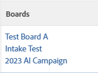

# Lägg till befintliga aktiviteter eller ärenden på en [!DNL Workfront]-anslagstavla

>[!IMPORTANT]
>
>Arbetsflöden är bara tillgängliga för en viss kundgrupp.

Du kan lägga till en uppgift eller ett problem på en anslagstavla eller ett arbetsflöde i [!DNL Adobe Workfront] från en list- eller rapportvy, eller från objektinformationen.

## Åtkomstkrav

+++ Expandera om du vill visa åtkomstkrav för funktionerna i den här artikeln.

<table style="table-layout:auto">
 <col>
 <col>
 <tbody>
  <tr>
   <td role="rowheader">Adobe Workfront package</td>
   <td> 
Alla
 </td>
  </tr>
  <tr>
   <td role="rowheader">Adobe Workfront-licens</td>
   <td>
   
Standard
 
   
Arbeta eller högre

   </td>
  </tr>
  <tr>
   <td role="rowheader">Objektbehörigheter</td>
   <td>Visa eller högre behörigheter för aktiviteten eller utgåvan </td>
  </tr>
 </tbody>
</table>

Mer information om informationen i den här tabellen finns i [Åtkomstkrav i Workfront-dokumentationen](/help/quicksilver/administration-and-setup/add-users/access-levels-and-object-permissions/access-level-requirements-in-documentation.md).

+++

## Lägga till befintliga uppgifter eller problem till en styrelse eller ett arbetsflöde från en lista

{{step1-click-main-menu}}

1. Välj något av följande: **[!UICONTROL Projects]**, **[!UICONTROL Reports]** eller **[!UICONTROL Dashboards]**.
1. Gå till det projekt, den rapport eller den kontrollpanel som innehåller den uppgift eller det problem som du vill lägga till på panelen eller arbetsflödet.
1. Markera en eller flera uppgifter eller problem.

   Om du väljer en underuppgift läggs den också till som ett kort på arbetsytan.

1. Klicka på [!UICONTROL **Mer**] > [!UICONTROL **Lägg till i paneler**] eller [!UICONTROL **Lägg till i arbetsflöden**].
1. I dialogrutan [!UICONTROL Add To] väljer du den arbetsyta eller det arbetsflöde som objekten ska läggas till i.

   För en anslagstavla finns bara fristående anslagstavlor, inte anslagstavlor som ingår i arbetsflöden.

1. Klicka på [!UICONTROL **Lägg till**].

   För en styrelse: Uppgiften eller utgåvan läggs till i styrelsen som ett kort. Om styrelsens kolumnprofiler används för status läggs kortet till i kolumnen för dess status. I annat fall visas den i den första kolumnen till vänster, med undantag för intagskolumnen.

   Mer information om kolumnprinciper finns i [Hantera board-kolumner](/help/quicksilver/agile/get-started-with-boards/manage-board-columns.md).

   För en arbetsström: Uppgiften eller utgåvan läggs till i arbetsflödets kortlista som ett oplanerat kort.

## Lägga till befintliga uppgifter eller utgåvor till en styrelse eller en arbetsström från objektinformationen

{{step1-click-main-menu}}

1. Klicka på [!UICONTROL **Projekt**] och sedan på namnet på ett projekt för att öppna det.
1. Klicka på [!UICONTROL **Åtgärder**] eller [!UICONTROL **Problem**] i den vänstra panelen.
1. Klicka på den uppgift, deluppgift eller utgåva som du vill lägga till på en arbetsyta eller i ett arbetsflöde.
1. Klicka på menyn **[!UICONTROL More]** intill objektnamnet och välj [!UICONTROL **Lägg till i paneler**] eller [!UICONTROL **Lägg till i arbetsflöden**].
1. I dialogrutan [!UICONTROL Add To] väljer du den arbetsyta eller det arbetsflöde som objekten ska läggas till i.

   För en anslagstavla finns bara fristående anslagstavlor, inte anslagstavlor som ingår i arbetsflöden.

1. Klicka på [!UICONTROL **Lägg till**].

   För en styrelse: Uppgiften eller utgåvan läggs till i styrelsen som ett kort. Om styrelsens kolumnprofiler används för status läggs kortet till i kolumnen för dess status. I annat fall visas den i den första kolumnen till vänster, med undantag för intagskolumnen.

   Mer information om kolumnprinciper finns i [Hantera board-kolumner](/help/quicksilver/agile/get-started-with-boards/manage-board-columns.md).

   För en arbetsström: Uppgiften eller utgåvan läggs till i arbetsflödets kortlista som ett oplanerat kort.

## Visa de anslagstavlor som är kopplade till en aktivitet eller ett ärende från en lista

1. Gå till det projekt, den rapport eller den kontrollpanel som innehåller den uppgift eller det problem som du vill se panelinformation för.
1. Välj en vy som innehåller kolumnen Poster eller skapa en ny vy med kolumnen Poster.
Mer information om vyer finns i [Skapa eller redigera vyer i Adobe Workfront](/help/quicksilver/reports-and-dashboards/reports/reporting-elements/create-edit-views.md).
1. Klicka på [!UICONTROL **Visa**] i kolumnen om du vill visa en lista över anslagstavlor som aktiviteten eller utgåvan är aktiverad för.

   

1. Klicka på ett styrelsnamn för att öppna den anslutna uppgiften eller utgåvan i styrelsen.

   
