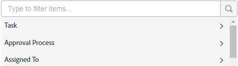

# Anpassa vilka fält som visas på ett kort

Som standard visas alla tillgängliga fält på ett kort, både i den fullständiga vyn när kortet är öppet och i den komprimerade kortvyn på kortet. Du kan anpassa vilka fält som visas av:

* Inaktivera ett fält så att det inte visas i någon av vyerna
* Dölja ett fält i den komprimerade kortvyn

Om ett fält innehåller ett värde och du inaktiverar fältet behålls värdet om du aktiverar fältet igen senare.

Avsnitt (som visas som alternativ för vänster navigering på kortinformationen) kan också visas och döljas.

Du kan även visa anpassade fält som tidigare skapats. Du kan inte designa och skapa nya anpassade fält på en anslagstavla.

>[!NOTE]
>
>Alla fältanpassningar du gör gäller bara för den styrelse du arbetar i.

## Åtkomstkrav

+++ Expandera om du vill visa åtkomstkrav för funktionerna i den här artikeln.

<table style="table-layout:auto"> 
 <col> 
 <col> 
 <tbody> 
  <tr> 
   <td role="rowheader">Adobe Workfront package</td> 
   <td> 
Alla
 </td> 
  </tr> 
  <tr> 
   <td role="rowheader">Adobe Workfront-licens</td> 
   <td> 
   
Medarbetare eller högre
 
   
Begäran eller senare

   </td> 
  </tr> 
 </tbody> 
</table>

Mer information om informationen i den här tabellen finns i [Åtkomstkrav i Workfront-dokumentationen](/help/quicksilver/administration-and-setup/add-users/access-levels-and-object-permissions/access-level-requirements-in-documentation.md).

+++

## Konfigurera kort {#configure-cards}

{{step1-to-boards}}

1. Gå till en styrelse. Mer information finns i [Skapa eller redigera en anslagstavla](../../agile/get-started-with-boards/create-edit-board.md).
1. Klicka på [!UICONTROL **Konfigurera**] till höger på kortet för att öppna konfigurationspanelen.
1. Expandera [!UICONTROL **kort**].

   De flesta fält och avsnitt är aktiverade som standard.

1. Stäng av ett fält eller avsnitt för att inaktivera det i båda kortvyerna.
1. Klicka på ikonen Dölj  bredvid ett fält eller avsnitt om du vill dölja det i den komprimerade vyn.
1. Om du vill visa alla fält och avsnitt i båda vyerna klickar du på [!UICONTROL **Återställ alla fält till standard**].
1. Klicka på [!UICONTROL **Dölj konfigurera**] för att stänga konfigurationspanelen.

## Lägg till anpassade fält till kort

Anpassade fält är tillgängliga på anslutna kort. De visas bara i helskärmsläge, inte i den komprimerade vyn.

Informationen i anpassade fält kan redigeras på kortet, men vissa anpassade element kan bara redigeras i det ursprungliga fältet och inte på kortet.

1. Gå till en anslagstavla och klicka på [!UICONTROL **Konfigurera**] för att öppna konfigurationspanelen.
1. Expandera [!UICONTROL **kort**].
1. Klicka på [!UICONTROL Card Fields]Lägg till anpassat fält [!UICONTROL **under**].
1. Välj [!UICONTROL **Aktivitet**] eller [!UICONTROL **Problem**].

   Kategorierna för tillgängliga fält för uppgifter eller ärenden visas. Expandera en kategori om du vill visa alla fält. Du kan också söka efter ett fält.

   

   >[!NOTE]
   >
   >Följande fälttyper kan inte läggas till i kort: Adobe XD, Image, PDF, Video.

1. Markera fältnamnet.
1. (Valfritt) Klicka i fältet **[!UICONTROL Field value]** om du vill ändra det här anpassade fältet till ett annat.
1. (Valfritt) Ändra **[!UICONTROL Field label]** till det fältnamn som du vill ska visas på kort.
1. När du är klar med ändringarna klickar du på [!UICONTROL **Spara fält**].

   

   Det anpassade fältet läggs till i listan med tillgängliga fält och aktiveras som standard. Du kan inaktivera det anpassade fältet enligt stegen i avsnittet [Konfigurera kort](customize-fields-on-card.md#configure-cards) ovan, redigera fältet eller ta bort det från alla kort.

>[!NOTE]
>
>Om du senare byter namn på det anpassade fältet i Workfront måste du redigera fältetiketten på konfigurationspanelen så att den matchar, annars visas inte fältet på korten.

## Visa eller dölj arkiverade kort

Du måste aktivera en konfigurationsinställning för att kunna visa arkiverade kort på en anslagstavla.

1. Gå till en anslagstavla och klicka på [!UICONTROL **Konfigurera**] för att öppna konfigurationspanelen.
1. Expandera [!UICONTROL **kort**].
1. Aktivera [!UICONTROL **Visa arkiverade kort på anslagstavlan**].

   Nu kan du filtrera ritytan så att alla kort som har arkiverats visas. Mer information finns i [Filtrera och söka på en anslagstavla](/help/quicksilver/agile/get-started-with-boards/filter-search-in-board.md).

1. Klicka på [!UICONTROL **Dölj konfigurera**] för att stänga konfigurationspanelen.

## Konfigurera kortutfall

Information om hur du tar bort kort automatiskt från kortet efter en viss tid finns i [Konfigurera kortutfall](/help/quicksilver/agile/use-boards-agile-planning-tools/configure-card-falloff.md).
