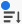

# Filtrera och söka på en anslagstavla

Du kan filtrera en anslagstavla så att den visas:

* Kort som tilldelats vissa personer
* Kort med vissa taggar
* Kort med en viss status
* Kort som förfaller inom en viss tidsram
* Arkiverade kort
* Kort som är kopplade till ett visst projekt

När du sorterar på anslagstavlan sorteras alla kort i kolumnerna. Det går inte att sortera en enstaka kolumn, och eftersläpningen eller inloppskolumnen sorteras inte.

Genom att söka kan du även hitta ett visst kort på kortet.

När filter används visas en indikator på ritbordet . Klicka **[!UICONTROL Clear All]** om du vill ta bort alla filter från ritytan och klicka på komprimeringsikonen för att stänga filterpanelen.

## Åtkomstkrav

Du måste ha följande åtkomst för att kunna utföra stegen i den här artikeln:

<table style="table-layout:auto"> 
 <col> 
 <col> 
 <tbody> 
  <tr> 
   <td role="rowheader"><strong>[!DNL Adobe Workfront] plan*</strong></td> 
   <td> 
Alla
 </td> 
  </tr> 
  <tr> 
   <td role="rowheader"><strong>[!DNL Adobe Workfront] licens*</strong></td> 
   <td> 
[!UICONTROL Request] eller högre
 </td> 
  </tr> 
 </tbody> 
</table>

&#42;Kontakta din [!DNL Workfront] administratör.

## Filtrera en anslagstavla efter tilldelningar

1. Klicka på **[!UICONTROL Main Menu]** icon  i det övre högra hörnet av [!DNL Adobe Workfront]och sedan klicka **[!UICONTROL Boards]**.
1. Gå till en styrelse. Mer information finns i [Skapa eller redigera en anslagstavla](../../agile/get-started-with-boards/create-edit-board.md).
1. Klicka [!UICONTROL **Filter**], expandera [!UICONTROL Members] och markera den eller de personer vars kort du vill se. Du kan även visa kort som inte har tilldelats.

   

## Filtrera en anslagstavla efter taggar

1. Gå till styrelsen.
1. Klicka [!UICONTROL **Filter**], expandera [!UICONTROL Tags] och markera de taggar du vill se.

   

## Filtrera en anslagstavla efter status

1. Gå till styrelsen.
1. Klicka [!UICONTROL **Filter**], expandera [!UICONTROL Statuses] och välj de statustyper som du vill se.

   Du kan även dölja färdiga kort.

   

## Filtrera en anslagstavla efter förfallodatum

1. Gå till styrelsen.
1. Klicka [!UICONTROL **Filter**], expandera [!UICONTROL Due Date] och välj de datumalternativ du vill se.

   Endast kort i de valda datumintervallen visas.

   

## Filtrera en anslagstavla för att visa arkiverade kort

Som standard visas bara aktiva kort på en anslagstavla. Du kan filtrera anslagstavlan så att även arkiverade kort visas.

1. Gå till styrelsen.
1. Klicka [!UICONTROL **Filter**], expandera [!UICONTROL Archived Cards] och markera **[!UICONTROL Archived cards]** för att visa eventuella arkiverade kort.

   Filtret visar antalet arkiverade kort.

   

1. Välj **[!UICONTROL Archived cards]** igen för att ta bort alternativet och endast visa aktiva kort.

## Filtrera en anslagstavla efter anslutning

1. Gå till styrelsen.
1. Klicka [!UICONTROL **Filter**], expandera [!UICONTROL Connection] och väljer [!DNL Workfront] projekt för de anslutna kort som du vill se.

   Du kan även visa kort som inte är anslutna till ett projekt.

   

## Sortera på en bräda

När du väljer ett alternativ att sortera efter sorteras alla kolumner. Det går inte att sortera en enstaka kolumn, och eftersläpningen eller inloppskolumnen sorteras inte.

1. Gå till styrelsen.
1. Klicka [!UICONTROL **Sortera efter**] och markera [!UICONTROL **Namn**], [!UICONTROL **Förfallodatum**], [!UICONTROL **Uppskattning**], [!UICONTROL **Status**], eller [!UICONTROL **Anslutning**].

   Anslutning (projektnamn) gäller endast anslutna kort, och de andra alternativen sorterar både anslutna kort och ad hoc-kort i kolumnerna.

   Alternativet &quot;användarordning&quot; returnerar korten i den ordning de ställdes in manuellt, innan några andra sorteringsalternativ tillämpades. Det här är standardsorteringen för kolumnerna.

1. Välj [!UICONTROL **Omvänd ordning**] om du vill sortera kolumnerna i omvänd ordning för sorteringsalternativet.

   Pilen på sorteringsikonen anger om kolumnerna är sorterade i stigande eller fallande ordning.

   När en annan sortering än standardsorteringen används visas en indikator på sorteringsikonen .

   

## Sök på en anslagstavla

1. Gå till styrelsen.
1. Klicka [!UICONTROL **Sök**] och skriv ett sökord. Tryck sedan på Enter.

   Alla kort som innehåller söktermen visas.

   Klicka på X för att rensa sökningen.

   
