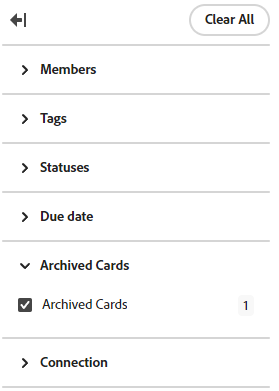

# Filtrera och söka på en anslagstavla

Du kan filtrera en anslagstavla så att den visas:

* Kort som tilldelats vissa personer
* Kort med vissa taggar
* Kort med en viss status
* Kort som förfaller inom en viss tidsram
* Arkiverade kort
* Kort som är kopplade till ett visst projekt

När du sorterar på anslagstavlan sorteras alla kort i kolumnerna. Det går inte att sortera en enstaka kolumn, och eftersläpningen eller inloppskolumnen sorteras inte.

Genom att söka kan du även hitta ett visst kort på kortet.

När filter används visas en indikator på . Klicka på **[!UICONTROL Clear All]** för att ta bort alla filter från ritytan och klicka på komprimeringsikonen för att stänga filterpanelen.

## Åtkomstkrav

+++ Expandera om du vill visa åtkomstkrav för funktionerna i den här artikeln.

Du måste ha följande åtkomst för att kunna utföra stegen i den här artikeln:

<table style="table-layout:auto"> 
 <col> 
 <col> 
 <tbody> 
  <tr> 
   <td role="rowheader">[!DNL Adobe Workfront]</td> 
   <td> 
Alla
 </td> 
  </tr> 
  <tr> 
   <td role="rowheader">[!DNL Adobe Workfront] licens</td> 
   <td> 
   
Nytt: [!UICONTROL Contributor] eller senare
 
   
eller

   
Aktuell: [!UICONTROL Request] eller högre

   </td> 
  </tr> 
 </tbody> 
</table>

Mer information om informationen i den här tabellen finns i [Åtkomstkrav i Workfront-dokumentationen](/help/quicksilver/administration-and-setup/add-users/access-levels-and-object-permissions/access-level-requirements-in-documentation.md).

+++

## Filtrera en anslagstavla efter tilldelningar

{{step1-to-boards}}

1. Gå till en styrelse. Mer information finns i [Skapa eller redigera en anslagstavla](../../agile/get-started-with-boards/create-edit-board.md).
1. Klicka på [!UICONTROL **Filter**], expandera avsnittet [!UICONTROL Members] och markera den eller de personer vars kort du vill se. Du kan även visa kort som inte har tilldelats.

   

## Filtrera en anslagstavla efter taggar

1. Gå till styrelsen.
1. Klicka på [!UICONTROL **Filter**], expandera avsnittet [!UICONTROL Tags] och markera de taggar du vill se.

   

## Filtrera en anslagstavla efter status

1. Gå till styrelsen.
1. Klicka på [!UICONTROL **Filter**], expandera avsnittet [!UICONTROL Statuses] och välj de statustyper som du vill se.

   Du kan även dölja färdiga kort.

   

## Filtrera en anslagstavla efter förfallodatum

1. Gå till styrelsen.
1. Klicka på [!UICONTROL **Filter**], expandera avsnittet [!UICONTROL Due Date] och välj datumalternativen som du vill se.

   Endast kort i de valda datumintervallen visas.

   

## Filtrera en anslagstavla för att visa arkiverade kort

Som standard visas bara aktiva kort på en anslagstavla. Du kan filtrera anslagstavlan så att även arkiverade kort visas.

1. Gå till styrelsen.
1. Klicka på [!UICONTROL **Konfigurera**] till höger på kortet för att öppna konfigurationspanelen.
1. Expandera [!UICONTROL **kort**].
1. Aktivera [!UICONTROL **Visa arkiverade kort på anslagstavlan**].
1. Klicka på [!UICONTROL **Filter**], expandera avsnittet [!UICONTROL Archived Cards] och välj **[!UICONTROL Archived cards]** om du vill visa arkiverade kort.

   Filtret visar antalet arkiverade kort.

   

   >[!NOTE]
   >
   >Avsnittet [!UICONTROL Archived Cards] är inte tillgängligt i filtret om du inte har aktiverat konfigurationsinställningen för att visa arkiverade kort. Mer information finns i [Anpassa vilka fält som ska visas på ett kort](/help/quicksilver/agile/get-started-with-boards/customize-fields-on-card.md).

1. Välj **[!UICONTROL Archived cards]** igen om du vill ta bort alternativet och bara visa aktiva kort.

## Filtrera en anslagstavla efter anslutning

1. Gå till styrelsen.
1. Klicka på [!UICONTROL **Filter**], expandera avsnittet [!UICONTROL Connection] och välj [!DNL Workfront] -projekten för de anslutna kort som du vill se.

   Du kan även visa kort som inte är anslutna till ett projekt.

   

## Sortera på en bräda

När du väljer ett alternativ att sortera efter sorteras alla kolumner. Det går inte att sortera en enstaka kolumn, och eftersläpningen eller inloppskolumnen sorteras inte.

1. Gå till styrelsen.
1. Klicka på [!UICONTROL **Sortera efter**] och välj [!UICONTROL **Namn**], [!UICONTROL **Förfallodatum**], [!UICONTROL **Uppskattning**], [!UICONTROL **Status**] eller [!UICONTROL **Anslutning**].

   Anslutning (projektnamn) gäller endast anslutna kort, och de andra alternativen sorterar både anslutna kort och ad hoc-kort i kolumnerna.

   Alternativet &quot;användarordning&quot; returnerar korten i den ordning de ställdes in manuellt, innan några andra sorteringsalternativ tillämpades. Det här är standardsorteringen för kolumnerna.

1. Välj [!UICONTROL **Omvänd ordning**] om du vill sortera kolumnerna i omvänd ordning för sorteringsalternativet.

   Pilen på sorteringsikonen anger om kolumnerna är sorterade i stigande eller fallande ordning.

   När en annan sortering än standardsorteringen används visas en indikator på sorteringsikonen .

   

## Sök på en anslagstavla

1. Gå till styrelsen.
1. Klicka på [!UICONTROL **Sök**] och skriv en sökterm. Tryck sedan på Enter.

   Alla kort som innehåller söktermen visas.

   Klicka på X för att rensa sökningen.

   
