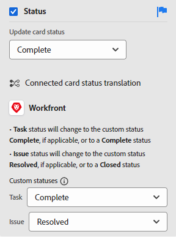

# Hantera kortkolumner

<!-- Audited: 05/2024 -->

En ny anslagstavla innehåller som standard tre kolumner. Du kan lägga till fler kolumner, ändra ordningen på kolumnerna, byta namn på kolumner och ta bort kolumner som du inte behöver.

Kolumninställningarna innehåller principer som gör att du kan definiera alternativ för vad som händer med ett kort när det flyttas till den kolumnen.

Mer information om hur du sorterar korten i kolumner finns i [Filtrera och söka på en anslagstavla](/help/quicksilver/agile/get-started-with-boards/filter-search-in-board.md).

## Åtkomstkrav

Du måste ha följande åtkomst för att kunna utföra stegen i den här artikeln:

<table style="table-layout:auto"> 
 <col> 
 </col> 
 <col> 
 </col> 
 <tbody> 
  <tr> 
   <td role="rowheader">[!DNL Adobe Workfront] plan</td> 
   <td> 
Alla
 </td> 
  </tr> 
  <tr> 
   <td role="rowheader">[!DNL Adobe Workfront] licens</td> 
   <td> 
Nytt: Medarbetare eller högre 

        
eller
 
        
Aktuell: [!UICONTROL Request] eller högre 
</td> 
  </tr> 
 </tbody> 
</table>

Mer information om informationen i den här tabellen finns i [Åtkomstkrav i Workfront-dokumentationen](/help/quicksilver/administration-and-setup/add-users/access-levels-and-object-permissions/access-level-requirements-in-documentation.md).

## Lägga till en kolumn på en anslagstavla

{{step1-to-boards}}

1. Gå till en styrelse. Mer information finns i [Skapa eller redigera en anslagstavla](../../agile/get-started-with-boards/create-edit-board.md).
1. Klicka på **[!UICONTROL Add Column]** till höger om de befintliga kolumnerna.
1. Skriv ett namn i den nya kolumnen och klicka på **[!UICONTROL Add Column]**.

   

>[!TIP]
>
>Mer information om hur du lägger till en inloppskolumn finns i [Lägga till en inloppskolumn på en anslagstavla](/help/quicksilver/agile/use-boards-agile-planning-tools/add-intake-column-to-board.md).

## Ändra ordning på kolumner på en anslagstavla

1. Gå till styrelsen.
1. Dra och släpp kolumnerna i rätt ordning. Se till att du markerar den övre delen av kolumnen innan du drar den till en annan plats.

   

## Byta namn på en boardkolumn

1. Gå till styrelsen.
1. Klicka på kolumnnamnet, skriv det nya namnet och tryck på Retur.

   eller

   Klicka på **[!UICONTROL More]**-menyn  i kolumnen och välj **[!UICONTROL Edit]**. Skriv det nya namnet i fältet **[!UICONTROL Column name]** i området Inställningar och klicka på **[!UICONTROL Close]**.

## Ta bort en boardkolumn

När du tar bort en kolumn från en rityta kan den inte återskapas.

1. Gå till styrelsen.
1. Klicka på **[!UICONTROL More]**-menyn  i kolumnen och välj **[!UICONTROL Delete]**.

   >[!NOTE]
   >
   >Det går inte att ta bort kolumner som innehåller kort, inklusive arkiverade kort. Om du försöker ta bort en kolumn som innehåller kort måste du välja en annan kolumn för dessa kort.

## Visa kortantal

Du kan använda en konfigurationsinställning för att visa antalet kort i varje kolumn.

Om du använder PIA-gränsen för en kolumn läggs ingen separat korträknare till. Mer information om PIA-begränsningar finns i [Hantera gränsen för [!UICONTROL Work in Progress] (PIA) på ett moderkort](/help/quicksilver/agile/use-boards-agile-planning-tools/manage-wip-limit-on-board.md).

1. Gå till styrelsen.
1. Klicka på **[!UICONTROL Configure]** till höger om kortet för att öppna konfigurationspanelen.
1. Expandera **[!UICONTROL Column]**.
1. Aktivera **[!UICONTROL Display a column card count]**.

   

   Korträknaren visas högst upp i varje kolumn.

1. Klicka på **[!UICONTROL Hide configure]** för att stänga panelen [!UICONTROL Configure].

## Definiera kolumninställningar och -profiler

Kolumnprinciper inkluderar automatisk uppdatering av fältvärden och inställning av en gräns för pågående arbete.

Principen för att uppdatera statusen fungerar automatiskt för både kortet och kolumnen:

* När ett kort flyttas till en kolumn med en profil uppdateras kortets status till den status som definierats i profilen. Detta gäller både ad hoc-kort och anslutna kort.
* När ett tillfälligt eller anslutet kort uppdateras på kortet för att matcha kolumnstatusen i profilen, eller när ett anslutet kort uppdateras någon annanstans i Workfront, flyttas kortet automatiskt till den kolumnen. Om en anpassad status på ett kort matchar systemstatusen som är tilldelad kolumnen flyttas kortet till den kolumnen.

Ett kort finns kvar i en kolumn där det är placerat om kortstatusen inte matchar någon status som angetts i någon befintlig kolumnprofil.

>[!NOTE]
>
>Dynamiska kort placerar alltid kort i kolumnen som matchar deras status, oavsett om kolumnprinciper är aktiverade eller inaktiverade. Korten återgår till sina tilldelade kolumner när du uppdaterar ritytan.
> 
>Om du flyttar ett kort från en kolumn till en annan med samma status för alla kort, återgår kortet till den ursprungliga kolumnen när du uppdaterar kortet.

1. Gå till styrelsen.
1. Klicka på **[!UICONTROL More]**-menyn  i kolumnen och välj **[!UICONTROL Edit]**.

   Området [!UICONTROL Settings] visas. **[!UICONTROL Column name]** talar om vilken kolumn du definierar inställningar för.

1. Aktivera principen **[!UICONTROL Update field values automatically]** om du vill ändra vissa fältvärden automatiskt när ett kort flyttas till den här kolumnen.

   

1. (Valfritt) Ange ett värde för kortstatus:

   1. Markera kryssrutan **[!UICONTROL Status]**.

   1. Välj den status som ska gälla för ett kort när det flyttas till den här kolumnen.

      

      Statusöversättningsalternativen för anslutna kort visas också. (Statusöversättning gäller inte för ad hoc-kort.) De här alternativen avgör den anpassade status som används för aktiviteten eller utgåvan i [!DNL Workfront] när ett anslutet kort flyttas till den här kolumnen.

   1. Välj en [!UICONTROL **anpassad**]-status som ska användas på kortet för uppgifter och för ärenden.

      När ett kort flyttas till den här kolumnen försöker [!DNL Workfront] först att använda den anpassade statusen (till exempel Löst). Om den valda anpassade statusen inte är tillgänglig för det kortet uppmanas du att välja en annan status som motsvarar systemstatusen (från steg b ovan). Mer information om status finns i [Statusöversikt](/help/quicksilver/administration-and-setup/customize-workfront/creating-custom-status-and-priority-labels/statuses-overview.md).

      Om statusen för den anslutna aktiviteten eller utgåvan ändras till den anpassade statusen eller systemstatusen som anges i kolumnprincipen, flyttas kortet automatiskt till kolumnen.

1. (Valfritt) Ange ett värde för korttilldelningarna:

   1. Markera kryssrutan **[!UICONTROL Assignees]**.
   1. Välj en åtgärd.

      * **[!UICONTROL Add on assignees]:** Tilldelningarna som du väljer läggs till i den befintliga listan över tilldelningar på ett kort när det flyttas till den här kolumnen.
      * **[!UICONTROL Override assignees]:** De tilldelade som du väljer åsidosätter alla andra tilldelade objekt och blir de enda tilldelade objekten på ett kort när det flyttas till den här kolumnen.

   1. Klicka på [!UICONTROL **Lägg till tilldelning**] och sök efter en användare. Välj tilldelningar från sökresultaten. Alla Workfront-användare och -team finns att välja bland.

      

1. (Valfritt) Ange ett värde för korttaggarna:

   1. Markera kryssrutan **[!UICONTROL Cards]**.
   1. Välj en åtgärd.

      * **[!UICONTROL Add on tags]:** De taggar du väljer läggs till i den befintliga listan med taggar på ett kort när det flyttas till den här kolumnen.
      * **[!UICONTROL Override tags]:** De taggar du markerar åsidosätter alla andra taggar och blir de enda taggarna på ett kort när det flyttas till den här kolumnen.

   1. Markera taggarna i listrutan. Endast taggar som redan har skapats i [!UICONTROL Tag Manager] är tillgängliga att välja bland. Mer information om hur du lägger till nya taggar finns i [Lägg till taggar](/help/quicksilver/agile/get-started-with-boards/add-tags.md).

      

1. Aktivera principen **[!UICONTROL Work in progress limit]** om du vill begränsa antalet kort som kan läggas till i kolumnen. Ange sedan begränsningsnumret i fältet **[!UICONTROL Set limit]**.

   

   Mer information finns i [Hantera PIA-gränsen (Work in Progress) på en anslagstavla](/help/quicksilver/agile/use-boards-agile-planning-tools/manage-wip-limit-on-board.md).

1. Klicka på **[!UICONTROL Close]** för att avsluta inställningsområdet och visa kolumnen och dess kort.
