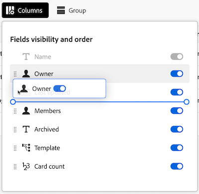
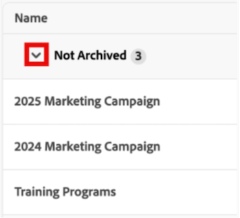

# Hantera administratörsvyn för anslagstavlor

I vyn för styrelsemedlemmar finns en lista över alla anslagstavlor på ditt konto som systemadministratörer kan använda för att få en snabb ögonblicksbild av den övergripande informationen för alla anslagstavlor, inklusive när de senast uppdaterades, hur många kort var och en av dem har, med mera.

I det här området kan du utföra följande:

* Filtrera listan med anslagstavlor
* Konfigurera kolumnerna i listan Boards
* Gruppera boardlistan

## Åtkomstkrav

+++ Expandera om du vill visa åtkomstkraven.

<table style="table-layout:auto"> 
 <col> 
 </col> 
 <col> 
 </col> 
 <tbody> 
  <tr> 
   <td role="rowheader">Adobe Workfront package</td> 
   <td> 
Alla
 </td> 
  </tr> 
  <tr> 
   <td role="rowheader">Adobe Workfront-licens</td> 
   <td> 
Standard

        
 Plan 
</td> 
  </tr> 
    <tr> 
   <td role="rowheader">Konfigurationer på åtkomstnivå</td> 
   <td> 
Systemadministratör 

        </td> 
  </tr> 
 </tbody> 
</table>

Mer information om informationen i den här tabellen finns i [Åtkomstkrav i Workfront-dokumentationen](/help/quicksilver/administration-and-setup/add-users/access-levels-and-object-permissions/access-level-requirements-in-documentation.md).

+++

## Förutsättningar

Du måste skapa en anslagstavla innan du kan visa den i administrationsvyn.

Mer information finns i [Skapa eller redigera en anslagstavla](/help/quicksilver/agile/get-started-with-boards/create-edit-board.md).

## Filtrera listan med anslagstavlor

{{step1-to-boards}}

1. Välj fliken **Administratörsvy** på sidan **Kort**.

1. Välj **Filter**. Panelen **Filter** öppnas.

1. Konfigurera filtret genom att följa stegen nedan:

   1. (Valfritt) Klicka på ikonen **Kalender**  och välj sedan ett datumintervall som du vill filtrera efter listor som senast ändrades inom den tidsramen.

   1. (Valfritt) I avsnittet **Mall** väljer du den typ av styrelsmall som listan ska filtreras efter. Du kan välja flera malltyper.
Mer information om malltyper för anslagstavlor finns i [Skapa eller redigera en anslagstavla](/help/quicksilver/agile/get-started-with-boards/create-edit-board.md).

   1. (Valfritt) I avsnittet **Är arkiverad** väljer du om arkiverade eller ej arkiverade anslagstavlor ska visas. Du kan markera flera alternativ.

      

1. Klicka utanför panelen **Filter** för att stänga den. Filtervalen kommer att fortsätta att gälla för listan över anslagstavlor tills den ändras tillbaka till standardvyn.

   >[!NOTE]
   >
   >Om du vill ta bort ett filter öppnar du panelen **Filter** och klickar på **Tillbaka till standard** i det övre högra hörnet.

## Konfigurera kolumnerna i listan Boards

{{step1-to-boards}}

1. Välj fliken **Administratörsvy** på sidan **Kort**.

1. Välj **Kolumner**. **Fältsynlighet och fältordning** öppnas.

1. Konfigurera vilka kolumner som ska visas i listan Poster genom att markera eller avmarkera alternativet för att växla mellan kolumner:

   * **Ägare**
   * **Senast uppdaterad**
   * **Medlemmar**
   * **Arkiverad**
   * **Mall**
   * **Kortantal**

1. (Valfritt) Om du vill justera den ordning som fälten visas i klickar du på och håller ned ikonen **Dra** till vänster om ett fält och drar det till en ny plats.

   

1. Klicka utanför **fältsynligheten och ordningen** för att stänga den. Dina kolumnkonfigurationer kommer att fortsätta gälla för styrelseristan tills de ändras.

   >[!NOTE]
   >
   > När visningen av kolumnerna i listan Boards ändras visas en blå punkt ovanför ikonen **Kolumner** för att ange att den aktuella vyn har ändrats från standardvyn.

## Gruppera boardlistan efter ett specifikt fält

{{step1-to-boards}}

1. Välj fliken **Administratörsvy** på sidan **Kort**.

1. Välj **Grupp**. Panelen **Gruppera efter** öppnas.

1. Markera fältet som du vill gruppera listan med anslagstavlor efter:

   * **Arkiverad**
   * **Ägare**
   * **Mall**

1. (Valfritt) Om du vill expandera eller komprimera grupperingen från panelen **Gruppera efter** klickar du på **Komprimera alla** eller **Expandera alla**.

   

1. (Valfritt) Om du vill ändra grupperingens visningsordning från A-Z till Z-A markerar du det fält som listan för närvarande är grupperad efter och väljer sedan **Z-A** i listrutan.

   

1. Klicka utanför panelen **Gruppera efter** för att stänga den. Härifrån kan du komprimera eller utöka den använda grupperingen i listan genom att markera pilen bredvid grupperingsrubriken.

   

   >[!NOTE]
   >   
   >När grupperingsvisningen för panellistan ändras visas en blå punkt ovanför ikonen **Grupp** för att ange att den aktuella vyn skiljer sig från standardvyn.  
   >Om du vill ta bort en gruppering öppnar du panelen **Gruppera efter** och väljer **Rensa alla** i det övre högra hörnet.
