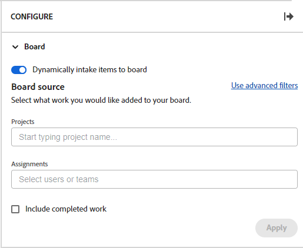
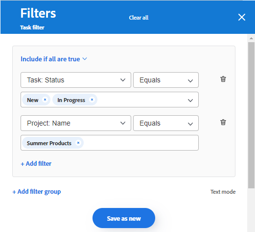
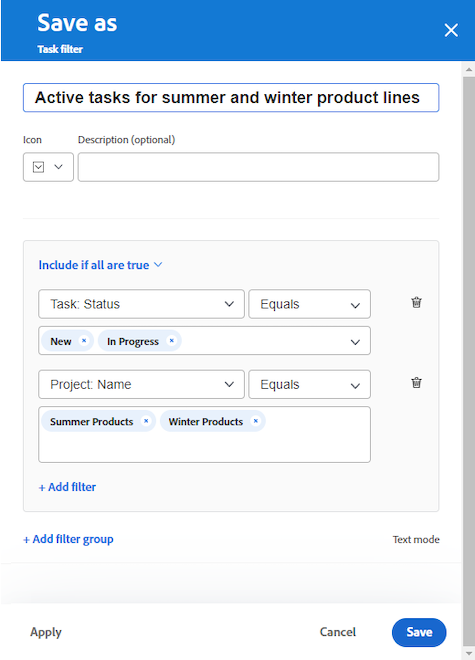

# Lägga till en inloppskolumn på en anslagstavla

Du kan också lägga till en inloppskolumn på din anslagstavla som automatiskt hämtar in uppgifter och utleveranser som anslutna kort när de läggs till i [!DNL Workfront], baserat på filter som du definierar. Inloppskolumnen kan fungera som en eftersläpningskolumn för ett Kanban-team, en plats där ett supportteam kan se problem när de läggs till i en begärandekö eller i andra syften som du behöver.

Endast en inloppskolumn får finnas på en rityta, och den visas alltid som kolumnen längst till vänster.

Inloppskolumnen är inte tillgänglig på ett dynamiskt bord.

Intagskolumnen är begränsad till 300 uppgifter och 300 problem. Standardordningen för objekten i inloppskolumnen är följande:

Uppgifter:

* Primär order: Projektnamn
* Sekundär ordning: Arbetsfördelningsstruktur

Problem:

* Primär order: Projektnamn
* Sekundärordning: Referensnummer

Mer information om kolumner finns i [Hantera kortkolumner](/help/quicksilver/agile/get-started-with-boards/manage-board-columns.md). Mer information om anslutna kort finns i [Använd anslutna kort på ritytor](/help/quicksilver/agile/get-started-with-boards/connected-cards.md).

## Åtkomstkrav

Du måste ha följande åtkomst för att kunna utföra stegen i den här artikeln:

<table style="table-layout:auto"> 
 <col> 
 </col> 
 <col> 
 </col> 
 <tbody> 
  <tr> 
   <td role="rowheader"><strong>[!DNL Adobe Workfront] plan*</strong></td> 
   <td> 
Alla
 </td> 
  </tr> 
  <tr> 
   <td role="rowheader"><strong>[!DNL Adobe Workfront] licens*</strong></td> 
   <td> 
[!DNL Request] eller högre
 </td> 
  </tr> 
 </tbody> 
</table>

&#42;Kontakta din [!DNL Workfront] administratör.

## Skapa en inloppskolumn med enkla filter

1. Klicka på **[!UICONTROL Main Menu]** icon  i Adobe Workfront övre högra hörn och klicka sedan på **[!UICONTROL Boards]**.
1. Gå till en styrelse. Mer information finns i [Skapa eller redigera en anslagstavla](../../agile/get-started-with-boards/create-edit-board.md).
1. Klicka **[!UICONTROL Configure]** till höger om ritytan för att öppna panelen Konfigurera.
1. Expandera **[!UICONTROL Board]**.
1. Aktivera **[!UICONTROL Dynamically intake items to board]**.

   

   Inloppskolumnen läggs till till vänster om ritytan. Den är tom tills du tillämpar filter på den.

1. (Valfritt) Sök efter och välj [!DNL Workfront] [!UICONTROL **Projekt**].
1. (Valfritt) Sök efter och välj användare eller team [!UICONTROL **Uppdrag**].
1. Välj [!UICONTROL **Inkludera slutfört arbete**] om du vill visa uppgifter och problem med statusen Fullständig i kolumnen Intag.

   >[!NOTE]
   >
   >Om det här alternativet inte är markerat kommer kort i andra statusar att&quot;ramla av&quot; och inte längre visas.

1. Klicka [!UICONTROL **Använd**].

   Alla objekt visas som anslutna kort i brädans inloppskolumn.

   

## Skapa en inloppskolumn med avancerade filter

1. Klicka på **[!UICONTROL Main Menu]** icon  i Adobe Workfront övre högra hörn och klicka sedan på **[!UICONTROL Boards]**.
1. Gå till en styrelse. Mer information finns i [Skapa eller redigera en anslagstavla](../../agile/get-started-with-boards/create-edit-board.md).
1. Klicka **[!UICONTROL Configure]** till höger om ritytan för att öppna panelen Konfigurera.
1. Expandera **[!UICONTROL Board]**.
1. Aktivera **[!UICONTROL Dynamically intake items to board]**.

   Inloppskolumnen läggs till till vänster om ritytan. Den är tom tills du tillämpar filter på den.

1. Klicka [!UICONTROL **Använd avancerade filter**].
1. Klicka **[!UICONTROL Add filter sources]** och markera **[!UICONTROL Tasks]** eller **[!UICONTROL Issues]**.

   

   >[!NOTE]
   >
   >Du kan filtrera inloppskolumnen så att den innehåller både uppgifter och problem, men du måste konfigurera filtren separat för varje objekttyp.
   >
   >Du kan också välja sparade filter och systemstandardfilter.

1. Klicka på **[!UICONTROL New filter]** för att komma igång.

   

1. Bygg filtret och klicka **[!UICONTROL Save as new]**.

   

   I det här exemplet visas ett filter för aktiviteter från ett specifikt projekt som har statusen [!UICONTROL New] eller [!UICONTROL In Progress].

   >[!NOTE]
   >
   >Vi rekommenderar att du inte använder jokertecknet&quot;Me&quot; (inloggad användare) i ett kortfilter eftersom det inte alltid är säkert att uppgifter eller problem visas för den inloggade användaren. När styrelsen har konfigurerats med rätt uppgifter och ärenden kan du filtrera ritytan så att den visar objekt för en viss tilldelad person. Mer information finns i [Filtrera och söka på en anslagstavla](/help/quicksilver/agile/get-started-with-boards/filter-search-in-board.md).

   Mer information om hur du skapar ett filter finns i avsnittet Skapa eller redigera ett filter i standardverktyget i artikeln [Skapa eller redigera filter i [!DNL Adobe Workfront]](/help/quicksilver/reports-and-dashboards/reports/reporting-elements/create-filters.md).

1. Namnge filtret och klicka på **[!UICONTROL Save]**.

   

   Om du ger filtret ett unikt namn kan du söka efter det senare.

1. Filtret visas i listan med sparade filter och används automatiskt i inloppskolumnen. Klicka på krysset högst upp på filterpanelen för att stänga det.

   

1. (Valfritt) Om du vill dela filtret med andra håller du pekaren över det sparade filtret och klickar på **[!UICONTROL More]** meny och markera **[!UICONTROL Share]**. Välj de användare eller team du vill dela med i rutan Filterdelning. Mer information finns i [Dela ett filter, en vy eller en grupp](/help/quicksilver/reports-and-dashboards/reports/reporting-elements/share-filter-view-grouping.md).
1. (Valfritt) Om du vill ta med både uppgifter och problem i inloppskolumnen klickar du på **[!UICONTROL Filter sources]** och markera det andra objektet för att skapa ett annat filter.
1. När du är klar med att lägga till filter kontrollerar du att rätt uppgifter och problem visas i intag-kolumnen.

   

   >[!NOTE]
   >
   >Du kan när som helst uppdatera filtren genom att öppna konfigurationspanelen och klicka på **[!UICONTROL Filter sources]** och markera **[!UICONTROL Tasks]** eller **[!UICONTROL Issues]**.

## Använda inloppskolumnen

Kort i inloppskolumnen går inte att redigera förrän du flyttar dem till andra kortkolumner. Du kan klicka på kortet för att öppna det i en skrivskyddad vy eller klicka på  för att öppna uppgiften eller problemet på en ny flik i webbläsaren.

Du kan ändra ordning på objekten i inloppskolumnen manuellt.

Ikonerna längst upp till höger i kolumnen visar hur många kort som finns i kolumnen och hur många filter som används.

1. (Valfritt) Om du vill söka efter ett objekt i kolumnen Intag klickar du på  på kolumnen.
1. (Valfritt) Om du vill flytta ett kort från infusionskolumnen till en annan kolumn drar och släpper du kortet där du vill att det ska visas.

   eller

   Klicka på **[!UICONTROL More]** meny  på kortet och välj **[!UICONTROL Move]**. Sedan på **[!UICONTROL Move Item]** välj en annan kolumn och markera **[!UICONTROL Move]**.

1. (Valfritt) Klicka på **[!UICONTROL More]** meny  och markera **[!UICONTROL Delete]**.
