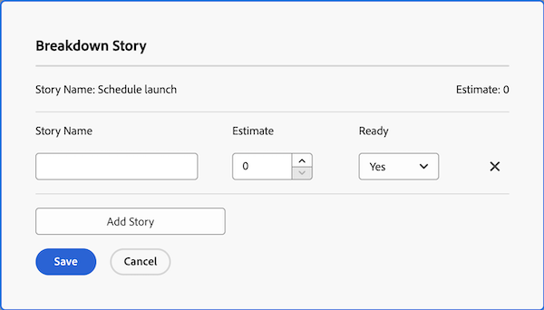

# Hantera Agile-eftersläpningen

Följande arbetsuppgifter kan tilldelas ett Agile-team och läggas till i teamets eftersläpning som artiklar, beroende på vilken Agile-metod teamet använder:

* **[!UICONTROL Scrum Agile teams]:** Uppgifter och utgåvor kan tilldelas Agile-teamet och läggas till i eftersläpningen.
* **[!UICONTROL Kanban Agile teams]:** Uppgifter kan tilldelas Agile-teamet och läggas till i eftersläpningen. Användare kan visa eftersläpningen direkt från Agile-artikelpanelen, enligt beskrivningen i [[!UICONTROL Add the backlog] till Kanban-tavlan &#x200B;](../../agile/use-kanban-in-an-agile-team/view-the-backlog-on-the-kanban-board.md). Teamet använder denna eftersläpning för att prioritera och hantera sin arbetskö.

Uppgifter eller problem kan tilldelas teamet (och sedan läggas till i teamets eftersläpning) var som helst i [!DNL Adobe Workfront]. Ett team kan till exempel tilldelas arbetsuppgifter från flera projekt.

>[!NOTE]
>
>Om du lägger till flera team i ett eftersläpningsobjekt visas uppgiften eller problemet endast i det primära teamets eftersläpning. Det primära teamet är det som först tilldelats.

## Åtkomstkrav

+++ Expandera om du vill visa åtkomstkrav för funktionerna i den här artikeln.

<table style="table-layout:auto"> 
 <col> 
 </col> 
 <col> 
 </col> 
 <tbody> 
  <tr> 
   <td role="rowheader">Adobe Workfront package</td> 
   <td> 
Alla
 </td> 
  </tr> 
  <tr> 
   <td role="rowheader">Adobe Workfront-licens</td> 
   <td> 
Standard
 
   
Arbeta eller högre
 </td> 
  </tr>
  <tr> 
   <td role="rowheader">Objektbehörigheter</td> 
   <td>Hantera åtkomst till det projekt som artikeln är på </td> 
  </tr> 
 </tbody> 
</table>

Mer information om informationen i den här tabellen finns i [Åtkomstkrav i Workfront-dokumentationen](/help/quicksilver/administration-and-setup/add-users/access-levels-and-object-permissions/access-level-requirements-in-documentation.md).

+++

## Skapa och hantera artiklar i efterloggen

* [Ordna om artiklar](#reorder-stories)
* [[!UICONTROL Break down] artiklar](#break-down-stories)
* [Redigera artiklar](#edit-stories)

### Ordna om artiklar {#reorder-stories}

Du kan ändra ordning på artiklarna i eftersläpningslistan genom att dra och släppa.

1. Gå till Agile-eftersläpningen där du vill ändra ordning på artiklarna.
1. I listrutan **[!UICONTROL View]** väljer du **[!UICONTROL Backlog]**-vyn eller en anpassad vy som innehåller kolumnen **[!UICONTROL Order]**.

   >[!NOTE]
   >
   >Om en uppgift eller ett ärende har tilldelats ett Agile-team och projektet inte har en status som motsvarar Aktuell, visas de inte i eftersläpningen. De påverkar dock fortfarande antalet eftersläpningar i kolumnen Ordning.

1. Markera en eller flera artiklar och dra dem sedan till den ordning som du vill att de ska visas i eftersläpningen.
   

### Dela upp artiklar {#break-down-stories}

Eftersom artiklar i en eftersläpning varierar i storlek kan användarna dela upp dem i användbara storlekar för en upprepning. När du delar upp en artikel skapas underuppgifter för den uppgift som artikeln representerar och den ursprungliga uppgiften ersätts i eftersläpningen. Du kan ha en överordnad uppgift eller dess underaktiviteter tilldelade till ett Agile-team, men du kan inte ha båda samtidigt tilldelade till ett team.

>[!NOTE]
>
>Tänk på följande begränsningar när du delar upp artiklar:
>
>* Endast artiklar som representerar uppgifter kan delas upp. Du kan inte dela upp artiklar som representerar problem.
>* Artiklar kan bara delas upp om de är kopplade till ett projekt.

Så här bryter du ned en artikel:

1. Gå till den eftersläpning som innehåller artikeln som du vill bryta ned.
1. Markera artikeln som du vill bryta ned och klicka sedan på **[!UICONTROL Breakdown Story]**.
Dialogrutan [!UICONTROL Breakdown Story] visas.
   

1. Ange ett namn och en uppskattning för artikeln och välj om artikeln är klar.
1. Klicka på **[!UICONTROL Add Story]** om du vill skapa en ny artikel från originalartikeln.
1. Klicka på **[!UICONTROL Save]**.

### Redigera artiklar {#edit-stories}

Du kan redigera artiklar direkt från flikarna [!UICONTROL Stories] eller [!UICONTROL Issues] i eftersläpningen på samma sätt som du redigerar andra uppgifter eller problem i ett projekt samtidigt, vilket beskrivs i [Redigera uppgifter gruppvis](../../manage-work/tasks/manage-tasks/edit-tasks.md#edit-tasks-in-bulk) i [Redigera uppgifter](../../manage-work/tasks/manage-tasks/edit-tasks.md) och [Redigera problem](../../manage-work/issues/manage-issues/edit-issues.md) .

## Skapa nya artiklar i eftersläpningen {#create-new-stories-on-the-backlog}

Du kan skapa nya artiklar i eftersläpningen genom att skapa artikeln direkt från eftersläpningen eller genom att tilldela en befintlig uppgift eller utgåva till ett Agile-team.

* [Skapa en artikel från eftersläpningen](#create-a-story-from-the-backlog)
* [Tilldela en uppgift eller ett ärende till ett Agile-team](#assign-a-task-or-issue-to-an-agile-team)

### Skapa en artikel från eftersläpningen {#create-a-story-from-the-backlog}

När du skapar en artikel från en eftersläpning skapas artikeln som en uppgift eller ett problem i ett projekt.

Så här skapar du en artikel från en eftersläpning:

1. Klicka på ikonen **[!UICONTROL Main Menu]**  i det övre högra hörnet av Adobe Workfront, eller (om den är tillgänglig) klicka på **[!UICONTROL Main Menu]** -ikonen  i det övre vänstra hörnet och klicka sedan på **[!UICONTROL Teams]**.

1. (Valfritt) Klicka på ikonen **[!UICONTROL Switch team]**  och välj sedan ett nytt Scrum-team i listrutan eller sök efter ett team i sökfältet och markera det när det visas.

1. Välj **[!UICONTROL Backlog]** i den vänstra panelen.
1. Gör något av följande, beroende på om du vill skapa en uppgift eller ett problem:

   * **Så här skapar du en uppgift:** Klicka på **[!UICONTROL Stories]**.

   * **Så här skapar du ett problem:** Klicka på **[!UICONTROL Issues]**.

1. Klicka på **[!UICONTROL New Story]** eller **[!UICONTROL New Issue]**.

1. Ange följande information:

   <table style="table-layout:auto">
    <col>
    <col>
    <tbody>
     <tr>
      <td role="rowheader"><strong>[!UICONTROL Story Name]</strong></td>
      <td> Ange ett namn för artikeln.</td>
     </tr>
     <tr>
      <td role="rowheader"><strong>[!UICONTROL Description]</strong></td>
      <td>(Valfritt) Skriv en beskrivning för artikeln.</td>
     </tr>
     <tr>
      <td role="rowheader"><strong>[!UICONTROL Ready]</strong></td>
      <td> Välj om artikeln är klar att läggas till i en iteration. Den här inställningen är endast informativ. Det går att lägga till artiklar i en iteration oavsett den här inställningens status.</td>
     </tr>
     <tr>
      <td role="rowheader"><strong>[!UICONTROL Estimate]</strong></td>
      <td>Ange en punkt eller timuppskattning för artikeln. Uppskattningar påverkar nedladdningsdiagrammet. Nedbrytningsdiagrammet för en iteration är endast korrekt om varje artikel innehåller en korrekt uppskattning. (Om du anger en punktuppskattning måste du i gruppinställningarna ha angett hur många timmar varje punkt ska representera.)</td>
     </tr>
     <tr>
      <td role="rowheader"><strong>[!UICONTROL Parent Project]</strong></td>
      <td>Börja skriva namnet på det projekt där artikeln ska skapas och klicka sedan på namnet när det visas i listrutan. Projektets status måste anges till [!UICONTROL Current]. Om projektets status är något annat än [!UICONTROL Current] visas den inte i listrutan.</td>
     </tr>
     <tr>
      <td role="rowheader"><strong>[!UICONTROL Parent Task]</strong></td>
      <td>(Valfritt) Börja skriva namnet på den överordnade uppgift som den här artikeln är underordnad och klicka sedan på namnet när den visas i listrutan.</td>
     </tr>
     <tr>
      <td role="rowheader"><strong>[!UICONTROL Custom Forms]</strong></td>
      <td> (Valfritt) Markera de anpassade formulär som du vill lägga till i artikeln.</td>
     </tr>
    </tbody>
   </table>

1. Klicka på **[!UICONTROL Save Story]**.

### Tilldela en uppgift eller ett ärende till ett Agile-team {#assign-a-task-or-issue-to-an-agile-team}

Du kan tilldela en uppgift eller ett ärende till ett Agile-team. När uppgiften eller utgåvan har tilldelats visas den som en ny artikel i teamets eftersläpning.

Så här tilldelar du en uppgift eller ett ärende till ett Agile-team:

1. Gå till det projekt som innehåller uppgiften som du vill tilldela.
1. Markera uppgiften eller utgåvan i listan.
1. Klicka på **[!UICONTROL Edit]**.
1. Klicka på **[!UICONTROL Assignments]**.
1. (Valfritt) Ta bort alla befintliga tilldelningar.
1. Klicka på **[!UICONTROL Add Assignee]**.
1. Börja skriva namnet på det Agile-team som du vill ska tilldelas uppgiften eller utgåvan och klicka sedan på teamnamnet när det visas i listrutan.
1. Klicka på **[!UICONTROL Save Changes]**.
Uppgiften eller utgåvan är nu tillgänglig i teamets eftersläpning.

## Flytta artiklar till eller från eftersläpningen

* [Flytta artiklar från eftersläpningen till en iteration eller anslagstavla](#move-stories-from-the-backlog-to-an-iteration-or--board)
* [Flytta befintliga artiklar till eftersläpningen](#move-existing-stories-to-the-backlog)
* [Exportera artiklar från eftersläpningen](#export-stories-from-the-backlog)

### Flytta artiklar från eftersläpningen till en iteration eller anslagstavla

1. Gå till eftersläpningen i Agile-teamet.
1. Markera de artiklar som du vill flytta till en iteration eller en kanban-panel och klicka sedan på **[!UICONTROL More]** > **[!UICONTROL Move to]**.
Om artikeln flyttas till en [!UICONTROL Kanban]-anslagstavla visas [!UICONTROL Move Story to the Kanban]-anslagstavlan.
Om du flyttar artikeln till en upprepning visas dialogrutan [!UICONTROL Move Story to an Iteration].
   

1. Gör något av följande:

   * **För Sprum-team:** I fältet **[!UICONTROL Select Iteration]** väljer du den iteration där du vill flytta artiklarna.

   * **För Kanban-team:** I fältet **[!UICONTROL Select Kanban Board]** väljer du ditt team [!UICONTROL Kanban] board. (Kanban-team kan bara ha en [!UICONTROL Kanban] styrelse.)

1. Klicka på **[!UICONTROL Move Story]**.

### Flytta befintliga artiklar till eftersläpningen {#move-existing-stories-to-the-backlog}

Om du bestämmer dig för att ditt team inte är redo att arbeta med en artikel kan du flytta artikeln till eftersläpningen.

Mer information finns i [Flytta en Agile-artikel](../../agile/work-in-an-agile-environment/move-an-agile-story.md).

### Exportera artiklar från eftersläpningen {#export-stories-from-the-backlog}

Du kan exportera en eller flera artiklar (inklusive uppgifter och ärenden) direkt från eftersläpningen.

Du exporterar artiklar från eftersläpningen på samma sätt som du exporterar andra data i [!DNL Workfront], vilket beskrivs i [Exportera data](../../reports-and-dashboards/reports/creating-and-managing-reports/export-data.md).
