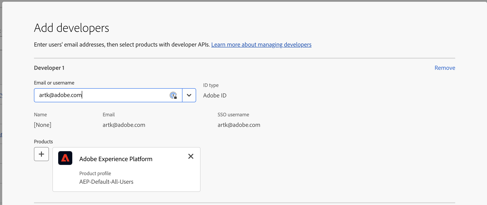
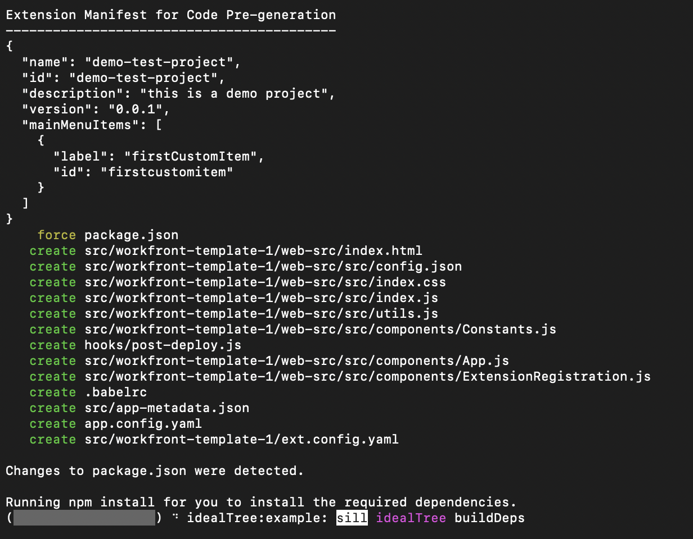
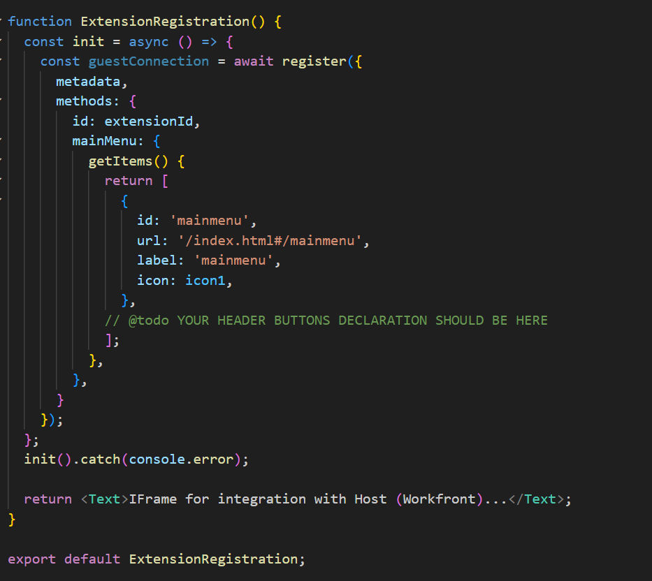
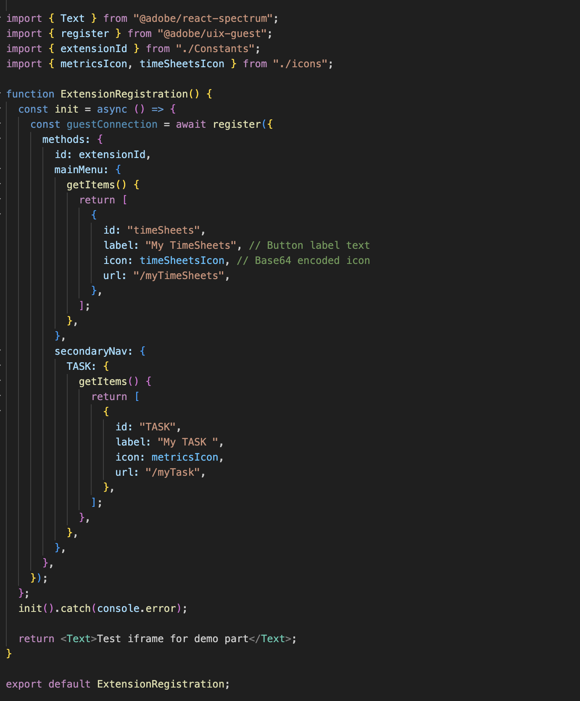
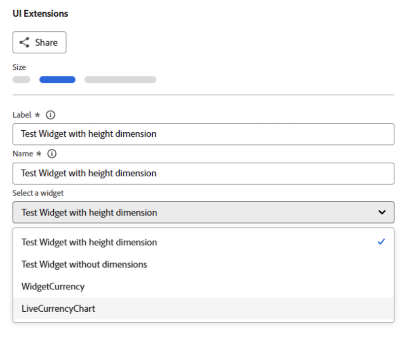

# Skapa anpassade program för Workfront med Adobe App Builder

Med Workfront UI Extensions, som bygger på Adobe App Builder, kan kunder och partners skapa anpassade användarupplevelser. Verktygen förbättrar effektiviteten, levererar smidiga, sammankopplade upplevelser och ger avsevärt nöjdare användare samt hjälper företag att förverkliga sin unika vision.

Utan Workfront UI Extensions kan projektledaren behöva växla mellan Workfront och ett separat tidsspårningssystem för att kunna logga timmar. Med UI Extensions kan man integrera tidsspårning direkt i Workfront, effektivisera arbetsflödet och spara tid. Dessutom kan du lägga till anpassade komponenter för att förbättra användbarheten, automatisera repetitiva uppgifter och förbättra innehållshanteringen med funktioner som taggning av metadata och förhandsgranskning av innehåll. Adobe App Builder erbjuder också skalbarhet och robust identitetshantering (IMS), vilket ger säker och effektiv anpassning i alla skalor.

Workfront UI-tillägg har flera viktiga fördelar:

* Exakt anpassning: Standardgränssnitt uppfyller ofta inte alla affärskrav. Med UI-tillägg kan utvecklare ändra och utöka standardanvändargränssnittet för att tillgodose specifika affärsbehov.
* Systemintegrering: UI-tillägg underlättar integreringen av andra system och säkerställer smidiga arbetsflöden och enhetlighet i data.
* Skalbarhet: I takt med att företag växer kan UI-tillägg utvecklas för att lägga till nya funktioner utan behov av en fullständig systemöversyn.
* Minskad utvecklingstid: Fördefinierade tilläggspunkter och verktyg minskar avsevärt den tid och det arbete som krävs för att implementera anpassade funktioner.
* Bättre användning: En optimerad användarupplevelse kan öka användningen av programvaran avsevärt. Anpassade gränssnittselement som är utformade för att passa användarpreferenser kan öka antalet användare och få nöjdare användare.
* Med Workfront UI Extensions kan man skapa skräddarsydda användarupplevelser som ökar effektiviteten, integreringen och användarnöjdheten.

När ett program har skapats i Adobe App Builder kan en Workfront-administratör lägga till det på Workfront huvudmeny och den vänstra navigeringspanelen med hjälp av layoutmallar. En användare med layoutmallen som klickar på programmet ser programmet som inbäddat i Workfront, i stället för att behöva öppna det separat.

I den här artikeln beskrivs hur du får åtkomst till App Builder och använder en mall för att skapa ett program.

Mer information om hur du lägger till ett anpassat program i layoutmallar finns i [Anpassa huvudmenyn med en layoutmall](/help/quicksilver/administration-and-setup/customize-workfront/use-layout-templates/customize-main-menu.md) och [Anpassa den vänstra panelen med en layoutmall](/help/quicksilver/administration-and-setup/customize-workfront/use-layout-templates/customize-left-panel.md).

## Förutsättningar

Du måste ha följande:

* Ett IMS-aktiverat Workfront-konto
* En dev-maskin med noden v18 och npm
* App Builder License

## Öppna Adobe App Builder

Om du vill skapa gränssnittstillägg måste du ha tillgång till Adobe App Builder i Adobe Developer Console.

Ytterligare instruktioner finns på [Adobe Developer-webbplatsen](https://developer.adobe.com/uix/docs/guides/get-access/).

### Lägg till utvecklare i Adobe Admin Console

>[!IMPORTANT]
>
>Se till att du har valt rätt IMS-organisation för alla följande steg. Om du tillhör flera organisationer kan du välja fel. Se till att du agerar under rätt organisation, som vanligtvis visas i det övre högra hörnet.

1. Navigera till produktion: https://adminconsole.adobe.com/

1. I avsnittet **Användare** klickar du på **Utvecklare** > **Lägg till utvecklare**.

   

   >[!NOTE]
   >
   >Om du inte ser något alternativ för att hantera utvecklare har du ingen produkt som ger utvecklare åtkomst.

1. Lägg till användarens e-postadress. Det bör söka efter befintliga användare som redan har lagts till från Admin Console.

1. Lägg till nödvändiga produkter i utvecklarprofilen och klicka på **Spara**.\
   

### Få tillgång till App Builder

Organisationer måste samarbeta med sina kontoansvariga för att köpa App Builder.

Om AppBuilder är korrekt konfigurerat bör du se Skapa projekt från mall som en del av skapandet av ett nytt projekt.

## Skapa ett nytt projekt i Adobe Developer Console

Du måste använda Adobe Developer Console för att skapa UI-tillägget.

Ytterligare instruktioner finns på [Adobe Developer-webbplatsen](https://developer.adobe.com/uix/docs/guides/creating-project-in-dev-console/).

1. Logga in på Adobe Developer Console med din Adobe ID.

1. Välj ditt konto och din profil eller organisation.

1. Klicka på **Skapa projekt från mall** i snabbstartsområdet eller klicka på **Skapa nytt projekt > Projekt från mall**.

   >[!IMPORTANT]
   >
   >Om du inte ser alternativet att skapa ett projekt från en mall är du felkonfigurerad i Admin Console och har inte tillgång till App Builder-katalogen. Det här alternativet visas bara när du har tillgång till AppBuilder.

   

1. Välj **App Builder**.

1. Ange en **projekttitel** och **programnamn**. Båda har standardvärden, men det är enklare att identifiera det projekt som du vill ha senare om du anpassar värdet.

1. Låt **Inkludera körningsversion** vara markerat.

1. Klicka på **Spara**.

## Använd Adobe Developer (aio) CLI

Adobe tillhandahåller en CLI med öppen källkod som du kan använda för att skapa App Builder-programmet.

Ytterligare instruktioner finns på GitHub och Adobe Developer webbplats:

* https://github.com/adobe/aio-cli
* https://developer.adobe.com/app-builder/docs/getting_started/first_app/

1. Om du vill installera verktyget kör du: `npm install -g @adobe/aio-cli` (kontrollera att du är på nod v18 först).
1. Starta terminalen och logga in i AIO med kommandot: `aio login`. Om du har problem med att logga in i rätt IMS-organisation kan du försöka med `aio login -f` att framtvinga en inloggningsfråga. Använd `aio where` för att se vilken organisation du är inloggad i rätt IMS-organisation. Använd `aio config` om du vill ha mer information.
1. Börja konfigurera din app genom att köra: `aio app init example-app` Se till att ersätta example-app med ditt appnamn. Om du inte är säker på appnamnen kan du se en lista med appnamn med kommandot `aio console project list`.
1. Välj organisation och projekt bland de tillgängliga alternativen.
   
   

1. Bläddra bland alla tillgängliga mallar och välj **@adobe/workfront-ui-ext-tpl** för ditt projekt.
   
1. Markera och ange projektnamnet som du skapade i Adobe Developer Console.
   

1. Svara på uppmaningarna för programmet:

   * Namnge tillägget.
   * Ge en beskrivande sammanfattning av tilläggets funktioner.
   * Välj ett ursprungligt versionsnummer att börja med.
   * I mallen skapas koden för en primär navigeringsknapp om du väljer&quot;Lägg till en anpassad knapp i huvudmenyobjektet&quot; när du uppmanas till&quot;Vad vill du göra härnäst?&quot;.

   

1. Bekräfta slutförandet genom att markera Jag är klar. Kodgenereringen från mallen pågår.
   
1. Vänta tills du ser ett meddelande om att appinitieringen är klar. Sedan kan du öppna projektet i en IDE (Visual Studio Code rekommenderas) och öppna mappen src.

   Mer information om mappar och filer i ditt projekt finns på [Adobe-utvecklarwebbplatsen](https://developer.adobe.com/app-builder/docs/get_started/app_builder_get_started/first-app#anatomy-of-an-app-builder-application).

Mer information om mappar och filer i ditt projekt finns på [Adobe Developer-webbplatsen](https://developer.adobe.com/app-builder/docs/get_started/app_builder_get_started/first-app#anatomy-of-an-app-builder-application).

## Bygg tilläggen i VSCode

App.js-filkonfigurationen krävs för att aktivera navigering via Workfront huvudmeny eller sekundär navigering (vänster panel).

Filkonfigurationen ExtensionRegistration.js krävs för att visa tilläggen i Workfront layoutmallar.

I följande exempel visas hur du lägger till anpassade program på huvudmenyn i Workfront och på det vänstra objektets panel med hjälp av gränssnittstilläggen.

### Konfigurera ExtensionRegistration.js

Så här tillåter du anpassade program på Workfront huvudmeny:

1. Gå till ExtensionRegistration.js.

I funktionen ExtensionRegistration ska du se följande kod. Den här koden skapades för dig av mallen. Den här koden kan läggas till för att skapa ytterligare menyalternativ. Se till att ersätta ID:n och URL:er.

    &quot;
    mainMenu: &lbrace;
    
    getItems() &lbrace;
    
    return &lbrack;
    
    &lbrace;
    
    id: &#39;main-menu-label&#39;,
    
    url: &#39;/index.html#/main-menu-label&#39;,
    
    label: &#39;Main menu label&#39;,
    
    icon: icon1,
    
    &rbrace;,
    
    &rbrack;;
    
    &rbrace;,
    
     12&rbrace;&rbrace;
    &quot;

1. Lägg till följande kodfragment:
   
I det här exemplet visas ett alternativ på huvudmenyn. Du måste uppdatera ID:t, etiketten, ikonen och URL:en till rätt namn för programmet. När du lägger till flera objekt måste du se till att ID:t är unikt.

1. Spara ditt arbete.

### Tillåt anpassade program i navigeringen i den vänstra panelen i Workfront

Så här tillåter du anpassade program i navigeringen i den vänstra panelen i Workfront:

1. Gå till ExtensionRegistration.js.
1. Lägg till följande kodfragment i funktionen ExtensionRegistration:

   ```
   secondaryNav: {  
   
   TASK: {  
   
       getItems() {       return [         {           id: "TASK", 
   
   label: "My TASK",           icon: metricsIcon,           url: "/myTask",  
   
           },  
   
       ];  
   
       },  
   
   },  
   
   },  
   ```

   

   * I det här exemplet visas ett navigeringsobjekt i den vänstra panelen som kallas Min uppgift. Du måste uppdatera ID:t, etiketten, ikonen och URL:en till rätt namn för programmet.

   * I det här exemplet visas ett navigeringsobjekt i den vänstra panelen för objekttypen. Du måste skapa dessa objekt separat för varje objekt där de stöds i Workfront. Följande objekt är tillgängliga: projekt, uppgift, utgåva, portfölj och program.

1. Spara ditt arbete.

### Bädda in en app med ett anpassat Workfront-formulär

Formulärwidgetens tilläggspunkt är en funktion för gränssnittstillägg i Adobe Workfront som gör att du kan skapa anpassade widgetar som kan bäddas in i Workfront anpassade formulär. Till skillnad från andra tilläggspunkter som lägger till navigeringsobjekt eller menyalternativ, är widgetar ett sätt att visa anpassat innehåll i dedikerade paneler i anpassade formulärfält.

Widgetar är modulära gränssnittskomponenter som kan läggas till i anpassade Workfront-formulär som formulärfält. De ger ett sätt att visa anpassade funktioner, datavisualiseringar eller externt innehåll direkt i anpassade formulärgränssnitt, så att användarna kan interagera med anpassad logik samtidigt som de fyller i formulären.

#### Konfigurera ett widgettillägg

Precis som UI-tilläggspunkter för huvudmenyn och den sekundära navigeringen, är tilläggspunkten för widgetar konfigurerad i `ExtensionRegistration`-komponentens metodobjekt, vanligtvis i `ExtensionRegistration.js`-fältet. Det innebär att det bara krävs att du lägger till ett widgetobjekt i `extesionregistration` med ett giltigt flöde i din app.js för att använda formulärwidgeten:

```
javascript 


Apply to ExtensionReg... 

widgets: { 

  getItems() { 

    return [ 

      { 

        id: "test2", 

        url: "/index.html#/widgets1", 

        label: "Test Widget with dimensions", 

        dimensions: { 

          height: 450, 

          width: 300, 

          maxHeight: 600, 

          maxWidth: 400, 

        }, 

      }, 

      { 

        id: "test", 

        url: "/index.html#/widgets1", 

        label: "Test Widget without dimensions", 

      }, 

    ]; 

  }, 

}, 
```

#### Egenskaper för Widget-konfiguration

**Obligatoriska egenskaper**

* id (sträng): Unik identifierare för widgeten. Måste vara unikt för alla widgetar i tillägget.

* url (sträng): URL-sökvägen till widgetens innehåll. Detta bör peka på en väg i tillägget som återger widgetkomponenten.

* label (string): Visningsnamn för widgeten som visas i det anpassade gränssnittet för val av formulärfält.

**Valfria egenskaper**

* dimensioner (objekt): Anger widgetens visningsmått. Alla egenskaper är valfria, och dessa är de enda möjliga dimensionerna:

* höjd (tal): widgetens höjd i pixlar

* bredd (tal): widgetens bredd i pixlar

* maxHeight (number): Maximal höjd för widgeten i pixlar

* maxWidth (number): Maximal bredd för widgeten i pixlar

**Dimension-egenskaper**

Med dimensionsobjektet kan du styra storleken och layoutbegränsningarna för din widget:

* höjd och bredd: Ange widgetens inledande/föredragna storlek

* maxHeight och maxWidth: Ange övre gränser för att förhindra att widgeten blir för stor

* Responsiv funktion: widgetar kan vara responsiva inom dessa begränsningar

* Formulärintegrering: Dimensioner hjälper till att säkerställa att widgeten passar bra in i formulärfältslayouter

#### Exempel på Dimension-konfigurationer

```
// Fixed size widget 

dimensions: { 

  height: 300, 

  width: 250, 

} 

// Flexible height with width constraint 

dimensions: { 

  width: 300, 

  maxHeight: 500, 

} 

// Height constraint only 

dimensions: { 

  height: 400, 

  maxWidth: 350, 

} 

// No dimensions - uses default sizing 

{} 
```

#### Kontextdata

Widgetar har åtkomst till samma delade kontext som andra tilläggspunkter, inklusive:

* auth: Autentiseringsinformation inklusive IMS-token

* objCode: Objekttypskod (AKTIVITET, PROJEKT, UTGÅVA osv.)

* objID: Objektidentifierare

* värdnamn: Workfront instansvärdnamn

* protokoll: Anslutningsprotokoll

* användare: Aktuell användarinformation

* isLoginAs: Anger om användaren är inloggad som en annan användare

* isInBulkEditing: Om formuläret är i gruppredigeringsläge. I så fall innehåller kontexten flera värden för objekt-ID.

#### Lägga till en widget i ett anpassat Workfront-formulär

En app kan bäddas in i ett anpassat Workfront-formulär med fälttypen &quot;UI Extensions&quot;. När du har lagt till fältet väljer du en formulärwidget, baseras listan över widgetar på aktiva appar i din IMS-organisation eller lokalt aktiva program när `extensionoverride=TRUE`.



### Konfigurera App.js

1. Gå till App.js.

1. Mallen kommer att användas som huvudmenyalternativ. Ett flöde definierar mappningen mellan URL-sökvägar och de komponenter som återges för dessa sökvägar. Om du vill lägga till en väg använder du följande kodfragment för att vara säker på att du ersätter den exakta sökvägen och elementet med ditt.

   ```
       <Route 
   
               exact path="custom-application" 
   
               element={<Customapplication />} 
   
           /> 
   ```

   
1. Spara ditt arbete.

Mer information om hur du utvecklar och kör programmet finns på [Adobe utvecklarwebbplats](https://developer.adobe.com/app-builder/docs/get_started/app_builder_get_started/first-app#develop-the-application).


## Delad kontext

Delad kontext används för att dela data från Workfront till ett UI-tillägg. De data som är tillgängliga via delad kontext omfattar användardata och programkontexten.


### Användare

Workfront UI Extensions delar användardata. Användarobjektet som är tillgängligt via delad kontext innehåller ett användar-ID för Workfront och användarens e-postadress.

`user = (conn?.sharedContext?.get("user")); // {ID: '1', email: 'test@aaa.com'} userID = user.ID userEmail = user.email `

### Programkontext

När du lägger till ett anpassat program med hjälp av en sekundär navigeringspunkt är det vanligt att det anpassade programmet använder kontextdata som ett projekt-ID eller dokument-ID. För dessa data innehåller den delade kontexten en objektkod och ett objekt-ID.

Här följer ett exempel på hur du hämtar programkontexten för dokument:

`context = conn?.sharedContext; // Using the connection created above, grab the document details from the host tunnel. // conn?.host?.document?.getDocumentDetails().then(setDocDetails); `

## Testa appen i Workfront

När du utvecklar ditt App Builder-program för Workfront kan du behöva testa ditt program i Workfront utan att publicera det.

I din App Builder-app kan du initiera `aio app run` för lokal utveckling. Detta ger dig en URL, vanligtvis något som `https://localhost:9080`. Du kan också köra `aio app deploy` för att erhålla en statisk Adobe-domän. Observera dessa URL:er för framtida bruk.

Navigera sedan till den sida du vill utveckla mot i webbläsaren. Öppna utvecklarverktygen och gå till Lokal lagring för antingen workfront.com eller workfront.adobe.com. Här måste du lägga till en post. Använd `extensionOverride` som nyckel och den tidigare angivna App Builder-URL:en som värde.

Om konfigurationen slutfördes korrekt visas knapparna från ditt App Builder-program när du läser in layoutmallsidan i Workfront igen. Lägg till appknapparna på huvudmenyn och den vänstra panelen för ett objekt och kontrollera att de visas korrekt i de områdena.

Ytterligare instruktioner finns på Adobe Developer webbplats, med ett exempel från AEM: https://developer.adobe.com/uix/docs/guides/preview-extension-locally/

## Publicera ansökningar och godkänn inlämningen

Följ instruktionerna på [Adobe Developer-webbplatsen](https://developer.adobe.com/uix/docs/guides/publication/) för att publicera och godkänna programmet.