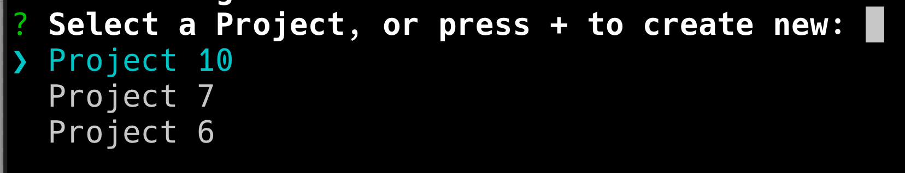

# AppBuilder i Workfront Document Details

Du kan installera AppBuilder i Dokumentinformation.

## Förutsättningar

Du måste ha följande:

* Ett IMS-aktiverat Workfront-konto
* En dev-maskin med noden v18 och npm

## Lägg till utvecklare i Admin Console

>[!IMPORTANT]
>
>Se till att du har valt rätt IMS-organisation för alla följande steg. Om du tillhör flera organisationer kan du välja fel. Se till att du agerar under rätt organisation, som vanligtvis visas i det övre högra hörnet.


1. Navigera till något av följande:

* Scen: [https://stage.adminconsole.adobe.com/](https://stage.adminconsole.adobe.com/)
* Prod: [https://adminconsole.adobe.com/](https://adminconsole.adobe.com/)

1. Klicka på **Utvecklare** > **Lägg till utvecklare** i avsnittet Användare.

   

   >[!NOTE]
   >
   >Om du inte ser något alternativ för att hantera utvecklare har du ingen produkt som tillåter åtkomst till utvecklare. Workfront ger ingen utvecklaråtkomst, men det gör AEM. Om du inte ser det här måste vi ta reda på hur vi kan få Workfront med i listan över appar som ger utvecklare möjlighet.

1. Lägg till användarens e-postadress. Det bör söka efter befintliga användare som redan har lagts till från Admin Console.

1. Lägg till nödvändiga produkter i utvecklarprofilen och klicka på **Spara**.


## Få tillgång till AppBuilder

Organisationer måste samarbeta med sina kontoansvariga för att köpa AppBuilder. Den exakta processen för detta är inte förstådd eftersom vi inte behövde göra detta för POC.

Om du vill testa AppBuilder-integreringen kan du begära en kostnadsfri testversion för din IMS-organisation här:
[https://developer.adobe.com/app-builder/docs/overview/getting_access/#](https://developer.adobe.com/app-builder/docs/overview/getting_access/#)

Även om det är en kostnadsfri 30-dagars testversion kommer de inte att inaktivera testversionen efter den tiden.

Om AppBuilder är korrekt konfigurerat bör du se&quot;Skapa projekt från mall&quot; som en del av skapandet av ett nytt projekt (som beskrivs i nästa avsnitt).

## Skapa ett nytt projekt i Dev Console

1. Klicka på **Skapa projekt från mallen**.

   >[!IMPORTANT]
   >
   >Om du inte ser det här alternativet är du felkonfigurerad i Admin Console och har inte tillgång till App Builder-katalogen. Det här alternativet visas bara när du har tillgång till AppBuilder.

   

1. Välj **App Builder**.

1. Ange en **projekttitel** och **programnamn**. Båda har standardvärden, men det blir enklare att identifiera det projekt som du vill ha senare om du anpassar värdet.

   >[!NOTE]
   >
   >Det finns ett alternativ för att lägga till ytterligare arbetsytor i det här steget. Vi föreslog att vi skulle skapa en arbetsyta för varje utvecklare. På så sätt hålls hemligheter och driftsättningar åtskilda från varandra när designarbete utförs. Du bör namnge arbetsytan med namnet på den utvecklare som använder den. AIO-klippet innehåller alternativ för att byta arbetsyta, som vi senare kommer att gå igenom.


1. Låt **Inkludera körningsversion** vara markerat.

1. Klicka på **Spara**.

## Adobe IO (aio) CLI

Adobe tillhandahåller en CLI med öppen källkod som kan användas för att skapa App Builder-program. Dokumentation finns här: [https://github.com/adobe/aio-cli](https://github.com/adobe/aio-cli) samt Adobe App Builder-instruktioner [https://developer.adobe.com/app-builder/docs/getting_started/first_app/](https://developer.adobe.com/app-builder/docs/getting_started/first_app/).

1. Installation
   1. Om du vill installera verktyget kör du: `npm install -g @adobe/aio-cli ` (kontrollera att du är på nod v18 först).

1. Autentisera i Terminal
   1. Starta terminalen och logga in i AIO med kommandot: `aio login`.

1. Initiera programmet
   1. Börja konfigurera din app genom att köra: `aio app init example-app`.

1. Konfigurationsval
   1. Fortsätt med att välja organisation och projekt bland de tillgängliga alternativen.\
      
      

1. Välja och konfigurera mallar
   1. Bläddra bland alla tillgängliga mallar och välj mallen **@adobe/aem-cf-editor-ui-ext-tpl** för projektet.
      
      

1. Definiera tillägget
   1. Ge tillägget ett namn.
   1. Ge en beskrivande sammanfattning av tilläggets funktioner.
   1. Välj ett ursprungligt versionsnummer att börja med.
   1. Bekräfta slutförande genom att välja **Jag är klar**.
      

1. Navigera till din projektmapp
   1. Åtkomst till src-mappen
   1. Byt namn på mappen `aem-cf-editor-1` till `workfront-doc-details-1`.

1. Ändra konfigurationsfiler
   1. Öppna app.config.yaml
   1. Uppdatera raden från `aem/cf-editor/1` till `workfront/doc-details/1`.
   1. Justera inkluderingssökvägen från `src/aem-cf-editor-1/ext.config.yaml` till `src/workfront-doc-details-1/ext.config.yaml`.

1. Redigera tilläggsregistreringskomponenten
   1. Öppna `src/workfront-doc-details-1/web-src/src/components/ExtensionRegistration.js`.
   1. Lägg till funktionen `secondaryNav` som innehåller den asynkrona funktionen `getButtons` i avsnittet med metoder.
   1. `getButtons` ska ta emot ett objekt med följande struktur:

      ```
          {
          docId: "String",  // Document ID
          docvId: "String", // Document version ID
          sharedContext: {
              hostname: "String",
              protocol: "String",
              auth: {
              imsOrgID: "String",    // Customer's IMS Org ID
              imsToken: "String",    // User's IMS token
              imsClientId: "String"
              }
          }
          }
      ```

1. Den här funktionen returnerar en array med knappobjekt som ska visas i navigeringen:

   ```
       methods: {
       secondaryNav: {
           async getButtons({docId, docvId, sharedContext}) {
           return [
               { label: 'Registration', url: '/index.html' },
               { label: 'Review', url: '/index.html#review' }
           ];
           }
       }
       }
   ```

1. Konfigurera programroutning
   1. Öppna filen App.js och konfigurera vägarna så att de innehåller de nya funktionerna. Du måste ange vägar för standardvyn och eventuella ytterligare vyer som granskningssidan. Så här definierar du dessa vägar:

      ```
          <Route index element={<ExtensionRegistration />} />
          <Route exact path="index.html" element={<ExtensionRegistration />} />
          <Route exact path="review" element={<Review />} />
      ```

1. Åtkomst till dokumentinformation
   1. Implementera den tillhandahållna funktionen `document.getDocumentDetails` i programmet för att hämta viktiga dokumentspecifikationer. Den här funktionen hämtar ett objekt som innehåller `docId` och `docvId`, tillsammans med ett `sharedContext`-objekt med `hostname`, `protocol` och autentiseringsinformation. Se till att programmet hanterar dessa data på rätt sätt.

1. Integrera datainhämtning i era komponenter
   1. Lägg till en ny komponent i programmets komponentmapp. I den här komponenten upprättar du en anslutning till Workfront för att hämta dokumentinformation och autentiseringsdata via anslutningen som upprättats med värdprogrammet. Här är ett exempel på hur du kan strukturera komponenten för att hantera detta:

      ```
          import { useEffect, useState } from 'react';
          import { attach } from "@adobe/uix-guest";
          import { extensionId } from "./Constants";
      
          function Review() {
              const [conn, setConn] = useState();
      
              useEffect(() => {
              const iife = async () => {
                  // "attach" the guest application to the host. This creates a "tunnel" from the host app that allows data to be passed to the iframe running this app.
                  const connection = await attach({
                  id: extensionId,
                  });
                  setConn(connection);
              };
      
              iife();
              }, []);
      
              useEffect(() => {
                  if (conn) {
                      // Using the connection created above, grab the document details from the host tunnel.
                      conn?.host?.document?.getDocumentDetails().then(setDocDetails);
                      // Pull the auth tokens from the sharedContext (see host app for details)
                      setAuth(conn?.sharedContext?.get("auth"));
                      setHostname(conn?.sharedContext?.get("hostname"));
                      setProtocol(conn?.sharedContext?.get("protocol"));
                  }
              }, [conn]);
      
          return (<>Text</>);
          }
      
          export default Review;
      ```

## Konfiguration för befintliga AIO-projekt

1. Uppdatera konfigurationsfiler
   1. Öppna `app.config.yaml`.
   1. Ändra konfigurationen genom att uppdatera referensen från `aem/cf-editor/1` till `workfront/doc-details/1`. Justeringen justerar filsökvägarna efter den aktuella projektstrukturen.

1. Ändra tilläggsregistreringskomponenten
   1. Leta reda på och öppna filen `ExtensionRegistration.js`.
   1. Lägg till funktionen `secondaryNav` som innehåller den asynkrona funktionen `getButtons` i avsnittet med metoder.
   1. `getButtons` ska ta emot ett objekt med följande struktur:

      ```
          {
          docId: "String",  // Document ID
          docvId: "String", // Document version ID
          sharedContext: {
              hostname: "String",
              protocol: "String",
              auth: {
              imsOrgID: "String",    // Customer's IMS Org ID
              imsToken: "String",    // User's IMS token
              imsClientId: "String"
              }
          }
          }
      ```

1. Den här funktionen returnerar en array med knappobjekt som ska visas i navigeringen:

   ```
       methods: {
       secondaryNav: {
           async getButtons({docId, docvId, sharedContext}) {
           return [
               { label: 'Registration', url: '/index.html' },
               { label: 'Review', url: '/index.html#review' }
           ];
           }
       }
       }
   ```

1. Konfigurera programroutning
   1. Öppna filen `App.js` och konfigurera vägarna så att de innehåller de nya funktionerna. Du måste ange vägar för standardvyn och eventuella ytterligare vyer som granskningssidan. Så här definierar du dessa vägar:

      ```
          <Route index element={<ExtensionRegistration />} />
          <Route exact path="index.html" element={<ExtensionRegistration />} />
          <Route exact path="review" element={<Review />} />
      ```

1. Åtkomst till dokumentinformation
   1. Implementera den tillhandahållna funktionen `document.getDocumentDetails` i programmet för att hämta viktiga dokumentspecifikationer. Den här funktionen hämtar ett objekt som innehåller `docId` och `docvId`, tillsammans med ett `sharedContext`-objekt med `hostname`, `protocol` och autentiseringsinformation. Se till att programmet hanterar dessa data på rätt sätt.

1. Integrera datainhämtning i era komponenter
   1. Lägg till en ny komponent i programmets komponentmapp. I den här komponenten upprättar du en anslutning till Workfront för att hämta dokumentinformation och autentiseringsdata via anslutningen som upprättats med värdprogrammet. Här är ett exempel på hur du kan strukturera komponenten för att hantera detta:

      ```
          import { useEffect, useState } from 'react';
          import { attach } from "@adobe/uix-guest";
          import { extensionId } from "./Constants";
      
          function Review() {
              const [conn, setConn] = useState();
      
              useEffect(() => {
              const iife = async () => {
                  // "attach" the guest application to the host. This creates a "tunnel" from the host app that allows data to be passed to the iframe running this app.
                  const connection = await attach({
                  id: extensionId,
                  });
                  setConn(connection);
              };
      
              iife();
              }, []);
      
              useEffect(() => {
                  if (conn) {
                      // Using the connection created above, grab the document details from the host tunnel.
                      conn?.host?.document?.getDocumentDetails().then(setDocDetails);
                      // Pull the auth tokens from the sharedContext (see host app for details)
                      setAuth(conn?.sharedContext?.get("auth"));
                      setHostname(conn?.sharedContext?.get("hostname"));
                      setProtocol(conn?.sharedContext?.get("protocol"));
                  }
              }, [conn]);
      
          return (<>Text</>);
          }
      
          export default Review;
      ```

## Publicera program

>[!IMPORTANT]
>
>Se till att du har markerat rätt IMS-organisation för vart och ett av följande steg.

För att ett gästprogram ska kunna läsas in i Workfront måste programmet skickas till arbetsytan Produktion och skickas för godkännande.

1. Distribuera programmet till arbetsytan Produktion
   1. `aio app use -w Production `
   1. `aio app deploy `

1. Navigera till [https://developer-stage.adobe.com/](https://developer-stage.adobe.com/) eller [https://developer.adobe.com/](https://developer.adobe.com/).
   1. Klicka på **Konsol** i det övre högra hörnet.

1. Hitta det projekt som du använde för att skapa AppBuilder-programmet.

1. Välj Production Workspace.
   

1. Skicka in programmet för privat granskning (du får varningar om att vi inte publicerar på marknadsplatsen för apputbyte, vilket är bra).

1. Fyll i formuläret (titel, beskrivning, ikon och anteckning till granskare).
   

>[!IMPORTANT]
>
>När inlämningen är klar måste en systemadministratör för organisationen godkänna inlämningen.

## Godkänn inlämningen

1. Som systemadministratör går du till [https://stage.exchange.adobe.com/](https://stage.exchange.adobe.com/) eller [https://exchange.adobe.com/](https://exchange.adobe.com/).

1. Klicka på **Hantera** > **Experience Cloud-program**. Du bör se de skickade apparna med alternativ för att godkänna/avvisa.
När de publicerade programtilläggen har godkänts bör de automatiskt läsas in i din Workfront-miljö.

   

## Ytterligare hjälp

Adobe har massor av dokumentation om hur du kommer igång med att skapa appar för AppBuilder och få dem att användas.

Här är några praktiska länkar:

* [https://developer.adobe.com/app-builder/docs/getting_started/first_app/#4-bootstrapping-new-app-using-the-cli](https://developer.adobe.com/app-builder/docs/getting_started/first_app/#4-bootstrapping-new-app-using-the-cli)

* [https://developer.adobe.com/uix/docs/guides/publication/](https://developer.adobe.com/uix/docs/guides/publication/)

* [https://developer.adobe.com/uix/docs/services/aem-cf-console-admin/extension-development/](https://developer.adobe.com/uix/docs/services/aem-cf-console-admin/extension-development/)

## Lokal utveckling

När du utvecklar ditt App Builder-program för Workfront kanske du behöver testa din app i Workfront utan att publicera den. Som tur är har vi en lösning för detta.

I din App Builder-app kan du initiera `aio app run` för lokal utveckling. Detta ger dig en URL, vanligtvis något som `https://localhost:9080`. Du kan också köra `aio app deploy` för att erhålla en statisk Adobe-domän. Observera dessa URL:er för framtida bruk.

Gå sedan till den specifika dokumentinformationssida som du vill utveckla för i webbläsaren. Öppna utvecklarverktygen och gå till Lokal lagring för antingen workfront.com eller workfront.adobe.com. Här måste du lägga till en post. Använd `appBuilderDocDetailsOverride` som nyckel och den tidigare angivna URL:en för appbyggaren som värde.

När du läser in sidan igen visas knapparna från App Builder-programmet. Om du klickar på de här knapparna kan du se hur appen fungerar.
