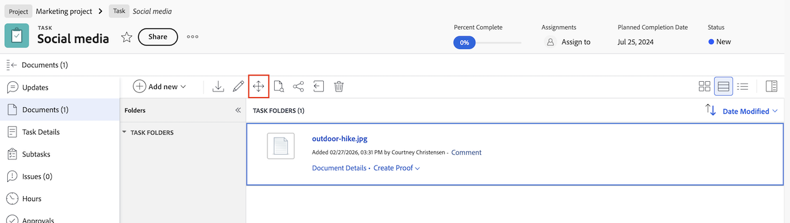

# Flytta dokument

En användare som hanterar behörigheter för ett dokument kan flytta dokumentet till ett annat objekt.

Användaren måste också ha behörighet att lägga till dokument i det nya objektet för att kunna slutföra den här åtgärden. 

När du flyttar ett dokument flyttas även något av följande med dokumentet:

* Dokumentversioner
* Dokumentkorrektur
* Dokumentgodkännanden

## Åtkomstkrav

+++ Expandera om du vill visa åtkomstkrav för funktionerna i den här artikeln.

<table style="table-layout:auto"> 
 <col> 
 <col> 
 <tbody> 
  <tr> 
   <td role="rowheader">Adobe Workfront package</td> 
   <td> 
 Alla
 </td> 
  </tr> 
  <tr> 
   <td role="rowheader">Adobe Workfront-licenser</td> 
   <td> 
   
Medarbetare eller högre

   
Begäran eller senare
 </td> 
  </tr> 
  <tr> 
   <td role="rowheader">Konfigurationer på åtkomstnivå*</td> 
   <td> 
Redigera åtkomst till dokument
 </td> 
  </tr> 
  <tr> 
   <td role="rowheader">Objektbehörigheter</td> 
   <td> 
Hantera åtkomst till dokumentet
 
Behörighet att lägga till dokument i det nya objektet
</td> 
  </tr> 
 </tbody> 
</table>

Mer information om informationen i den här tabellen finns i [Åtkomstkrav i Workfront-dokumentationen](/help/quicksilver/administration-and-setup/add-users/access-levels-and-object-permissions/access-level-requirements-in-documentation.md).

+++

## Flytta ett dokument i det äldre dokumentområdet

Om din organisation använder äldre Workfront-lagring visas det äldre dokumentområdet när du öppnar dokument i Workfront. Mer information om Workfront-lagring finns i [Skillnader mellan Adobe Enterprise-lagring och äldre Workfront-lagring](/help/quicksilver/review-and-approve-work/esm-overview.md#differences-between-adobe-enterprise-storage-and-legacy-workfront-storage).

Flytta ett dokument:

1. Gå till projektet, aktiviteten eller utgåvan som innehåller dokumentet och välj sedan **Dokument**.
1. Hitta det dokument du behöver.

1. Klicka på ikonen **Flytta** .
   

1. I listrutan i rutan som visas klickar du på **Problem**, **Projekt** eller **Aktivitet** för att ange vilken typ av objekt du vill flytta dokumentet till. 

1. Skriv namnet på **Utgåva**, **Projekt** eller **Aktivitet** i textrutan.

   >[!NOTE]
   >
   >Du kan bara gå över till ett annat projekt, en annan uppgift eller ett annat problem med hjälp av äldre Workfront-lagring.

1. Klicka på **Slutför**.

Du kan också flytta ett dokument från sidan Dokumentinformation.

## Flytta ett dokument i området för nya dokument

Om ditt företag använder Enterprise-lagring visas det nya dokumentområdet när du öppnar dokument i Workfront. Mer information om Enterprise-lagring finns i [Översikt över Adobe Enterprise-lagring](/help/quicksilver/review-and-approve-work/esm-overview.md).

Flytta ett dokument:

1. Gå till projektet, aktiviteten eller utgåvan som innehåller dokumentet och välj sedan **Dokument**.
1. Hitta det dokument du behöver.
1. Klicka på **Flytta** längst ned på sidan.

1. I listrutan i rutan som visas klickar du på **Problem**, **Projekt** eller **Aktivitet** för att ange vilken typ av objekt du vill flytta dokumentet till.

1. Skriv namnet på **Utgåva**, **Projekt** eller **Aktivitet** i textrutan.

   >[!NOTE]
   >
   >Du kan bara flytta till ett annat projekt, en annan uppgift eller ett annat ärende med Enterprise-lagring.

1. Klicka på **Flytta**.