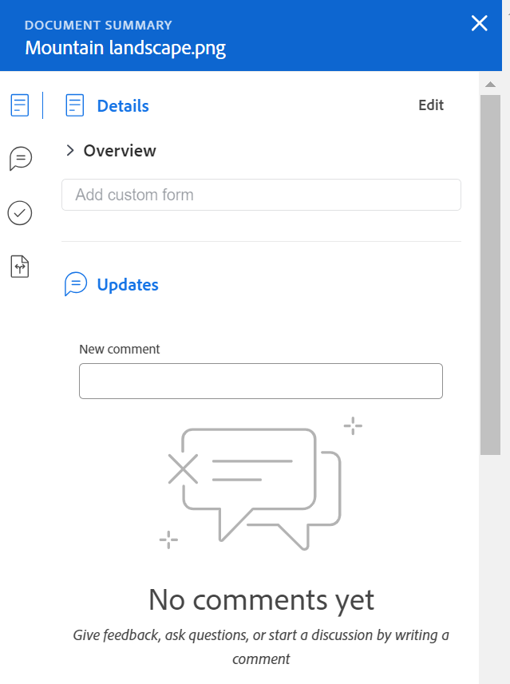

# Sammanfattning av dokumentöversikt

Med Sammanfattning kan du interagera med viktig information direkt från dokumentlistan.

## Åtkomstkrav

Du måste ha följande:

<table style="table-layout:auto"> 
 <col> 
 </col> 
 <col> 
 </col> 
 <tbody> 
  <tr> 
   <td role="rowheader">Adobe Workfront-plan*</td> 
   <td> 
 Alla
 </td> 
  </tr> 
  <tr> 
   <td role="rowheader">Adobe Workfront-licenser*</td> 
   <td> 
Begäran eller senare
 </td> 
  </tr> 
  <tr data-mc-conditions=""> 
   <td role="rowheader">Konfigurationer på åtkomstnivå*</td> 
   <td> 
Redigera åtkomst till dokument
 
Obs! Om du fortfarande inte har åtkomst frågar du Workfront-administratören om de anger ytterligare begränsningar för din åtkomstnivå. Information om hur en Workfront-administratör kan ändra åtkomstnivån finns i <a href="../../administration-and-setup/add-users/configure-and-grant-access/create-modify-access-levels.md" class="MCXref xref">Skapa eller ändra anpassade åtkomstnivåer</a>.
 </td> 
  </tr> 
  <tr data-mc-conditions=""> 
   <td role="rowheader">Objektbehörigheter</td> 
   <td> 
Visa åtkomst till objektet som är associerat med dokumentet
 
Mer information om hur du begär ytterligare åtkomst finns i <a href="../../workfront-basics/grant-and-request-access-to-objects/request-access.md" class="MCXref xref">Begär åtkomst till objekt </a>.
 </td> 
  </tr> 
 </tbody> 
</table>

&#42;Kontakta Workfront-administratören om du vill veta vilken plan, licenstyp eller åtkomst du har.

## Öppna sammanfattningsvyn

1. Gå till **Dokument** och markera ett objekt i listan.
1. Klicka på **Ikonen Öppna sammanfattning** .

   När du har öppnat Sammanfattning förblir den öppen när du klickar på andra dokument och är öppen tills du stänger den manuellt.

   

## Detaljer

Använd detaljavsnittet för att visa översiktsinformation på hög nivå och interagera med anpassade formulär. Klicka **Detaljer** överst i avsnittet för att gå till den fullständiga dokumentinformationssidan.

* [Översikt](#overview)
* [Anpassad Forms](#custom-forms)

### Översikt {#overview}

Expandera avsnittet Översikt om du vill visa eller ladda ned en miniatyrbild, öppna ett korrektur, uppdatera den grundläggande beskrivningen, checka ut dokumentet med mera.

### Anpassad Forms {#custom-forms}

Använd sektionen Anpassad Forms för att lägga till, redigera eller visa anpassade formulär som är kopplade till dokumentet. Börja skriva namnet på det anpassade formuläret för att lägga till det i dokumentet. Mer information finns i [Lägga till eller redigera ett anpassat formulär i ett dokument](../../documents/managing-documents/add-custom-form-documents.md).

## Uppdateringar

Använd uppdateringsavsnittet för att läsa en uppdatering som gjorts i dokumentet eller korrekturet. Sammanfattningen visar de två första kommentarerna som gjorts. Mer information om uppdateringar finns i [Kommentera ett korrektur](../../review-and-approve-work/proofing/reviewing-proofs-within-workfront/comment-on-a-proof/comment-on-proof.md).

## Godkännanden

Använd avsnittet Godkännanden för att be om ett dokumentgodkännande. Du kan även påminna någon om ett godkännande, skicka om godkännandet och avbryta det tidigare beslutet eller ta bort godkännandet. Dokumentgodkännare kan använda Sammanfattning för att fatta ett beslut.

Bevisgodkännanden måste läggas till i korrekturarbetsflödet. Mer information om godkännanden finns i

* [Godkänna arbete](../../review-and-approve-work/manage-approvals/approving-work.md)
* [Begär dokumentgodkännanden](../../review-and-approve-work/manage-approvals/request-document-approvals.md)

## Versioner

Använd avsnittet Versioner om du vill visa antalet versioner som skapats för ett visst dokument. Klicka på **Menyn Mer** till

* Öppna ett korrektur
* Hämta ett korrektur eller dokument
* Förhandsgranska ett dokument som stöds av webbläsaren
* Gå till Dokumentinformation
* Ta bort ett korrektur eller dokument

